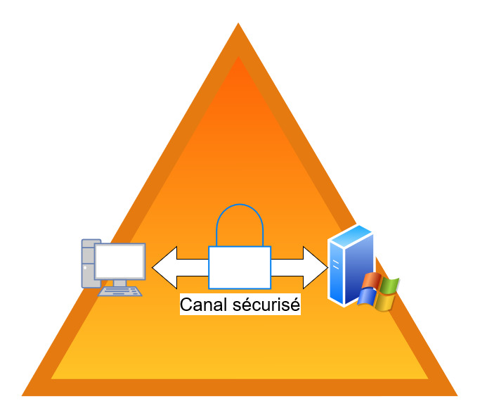
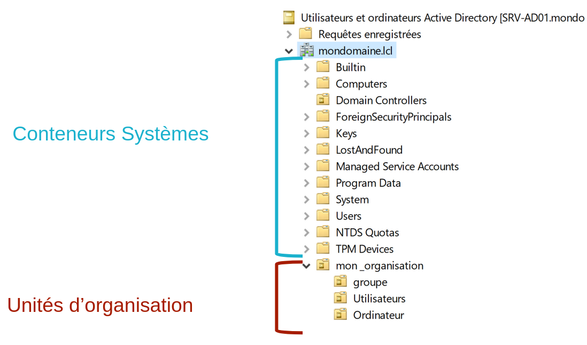

:titre: Gestion d’un Domaine : objets et conteneurs
:module: Système
:duree: 150
:description: Les objets et conteneurs sont des éléments essentiels de l'Active Directory. Ils permettent de structurer et d'organiser les ressources et les utilisateurs d'un domaine.
include::../../../../adoc/libs/header-module.adoc[]

ifeval::["{visible-on-html}" !=  "yes"]
:docinfo: shared
:docinfodir: ../../../adoc/libs
endif::[]

== Objectifs pédagogiques

// tag::objectifs[]
[cols="1,1"]
|===
a| 
* Les objets qui composent un domaine
** Objet utilisateur
** Objet ordinateurs
* Les groupes de domaine
** Groupes Globaux
** Groupes Universels
** Groupes de domaine locaux
a| 
* Gestion des groupes en Powershell
* Objets de type Conteneur
** Conteneurs systèmes
** Unités d’Organisation (OU)
* Bonne pratique organisation AD
|===
// end::objectifs[]

// tag::deroulement[]
== Les objets qui composent un domaine

Les principaux Objets d’un annuaire sont : 

* Les Utilisateurs
* Les Ordinateurs
* Les groupes
* Les unités d’organisation

C’est objets peuvent être créés et manipulés via : 

* La console MMC : utilisateurs et ordinateurs Active Directory
* La console : Centre d’administration Active Directory
* Les commandes PowerShell

== L'objet utilisateur

Un objet utilisateur sert à identifier une personne/individu dans l’entreprise.

include::../../../../adoc/libs/slide-notitle.adoc[]

[cols="1,1"]
|===

a| 
Objet unique

* Authentification des accès via les services réseau
* Ouverture de session

Comporte des attributs

* Unique à chaque utilisateur

Comporte des attributs

* Unique à chaque utilisateur
** fiche utilisateur
** sécurité
** groupes
a| image::./assets/01-a-objet-user.png[]

|===

include::../../../../adoc/libs/slide-notitle.adoc[]

la gestion des comptes utilisateurs peut se faire via Powershell :

rechercher ou afficher la liste des utilisateurs selon des critères 

`Get-ADUser -filter *`

Modifier les propriétés d’un utilisateur 

`Set-ADUser`

Créer un utilisateur via Powershell :

`$password = ConvertTo-secureString - AsplainText -Force`

```powershell
New-ADUser -name “user01” -AccountPassword $password -DisplayName “user01 Oclock” -GivenName “User01” -SurName “Oclock” -UserPrincipalName “user01@domaine.lcl” -Enabled $true
```

=== L'objet ordinateur

L’objet ordinateur permet d’identifier les machines intégrées au domaine

Les systèmes joints au domaine s’authentifient également

ils établissent un « canal sécurisé »

Le mot de passe de l’ordinateur est stocké sur la machine, on parle du secret LSA (_Local Security Authority_) pour partie en base de registre, et également en tant qu’attribut du compte Active Directory de l’ordinateur

include::../../../../adoc/libs/slide-notitle.adoc[]



include::../../../../adoc/libs/slide-notitle.adoc[]

[cols="1,1"]
|===

a| 
Les objets ordinateurs possèdent des caractéristiques

* Nom et description
* Version du système d’exploitation
* Groupes d’appartenance
* …
a| image::./assets/01-b-carac.png[]

|===

[red]#ATTENTION# L’existence de **plusieurs ordinateurs disposant du même identifiant  de sécurité** (SID) n’est pas possible dans un contexte de domaine. En cas de clonage/duplication, utiliser la commande _**SYSPREP**_ au préalable !

== Les groupes de domaine

Les groupes de domaine permettent d’appliquer des règles communes à leurs membres.

include::../../../../adoc/libs/slide-notitle.adoc[]

Les groupes de domaines sont définis par 

* Le type
** Sécurité : Permet d’accorder ou de retirer des privilèges (ex : ACL), être utilisé comme groupe de publipostage pour la messagerie 
** Distribution :  Utilisé comme groupe de publipostage pour la messagerie 

* L’étendue du groupe 
** Global => GG
** Universel => GU
** De domaine Local => GL

=== Les groupes globaux

**Groupes Globaux** : Types de groupes de sécurité dans Active Directory utilisés pour gérer les permissions et les accès aux ressources.

* **Portée** :
** **Domaines** : Les groupes globaux peuvent contenir des comptes d'utilisateur, des groupes et des ordinateurs du même domaine.
** **Utilisation** : Peuvent être membres de groupes locaux dans n'importe quel domaine de la forêt ou d'une relation de confiance.

include::../../../../adoc/libs/slide-notitle.adoc[]

* **Fonctionnalité** :
** **Gestion des Permissions** : Simplifient l'administration des permissions en regroupant les utilisateurs ayant des besoins d'accès similaires.
** **Réutilisation et Administration** : Utilisés pour accorder des droits d'accès aux ressources de différents domaines tout en centralisant la gestion des groupes.

Les groupes globaux facilitent la gestion des permissions au sein de domaines multiples en permettant une administration centralisée et structurée des droits d'accès.

include::../../../../adoc/libs/slide-notitle.adoc[]

**Groupes Universels** : Types de groupes de sécurité dans Active Directory utilisés pour gérer les permissions et les accès aux ressources à travers toute la forêt.

* **Portée** :
** **Forêt** : Les groupes universels peuvent contenir des comptes d'utilisateur, des groupes globaux et d'autres groupes universels de n'importe quel domaine de la forêt.
** **Utilisation** : Utilisés pour accorder des droits d'accès à des ressources situées dans plusieurs domaines.

include::../../../../adoc/libs/slide-notitle.adoc[]

* **Fonctionnalité** :
** **Gestion des Permissions** : Idéaux pour les ressources qui nécessitent un accès traversant plusieurs domaines.
** **Réduction de la Redondance** : Évitent la duplication des groupes dans différents domaines en centralisant l'administration des permissions à un niveau plus large.

Les groupes universels facilitent la gestion des permissions dans des environnements multi-domaines en offrant une solution centralisée pour l'administration des droits d'accès à l'échelle de la forêt.

include::../../../../adoc/libs/slide-notitle.adoc[]

**Groupes de Domaine Local** : Types de groupes de sécurité dans Active Directory utilisés pour accorder des permissions à des ressources spécifiques à un domaine.

* **Portée** :
** **Domaines** : Peuvent contenir des comptes d'utilisateur, des groupes globaux, des groupes universels et d'autres groupes de domaine local provenant de n'importe quel domaine de la forêt.
** **Utilisation** : Ne peuvent être utilisés que pour accorder des permissions à des ressources situées dans le même domaine où ils sont définis.

include::../../../../adoc/libs/slide-notitle.adoc[]

* **Fonctionnalité** :
** **Gestion des Permissions** : Utilisés pour attribuer des droits d'accès aux ressources spécifiques du domaine, telles que des fichiers, des dossiers, et des imprimantes.
** **Administration Locale** : Facilitent la gestion des permissions au sein d'un domaine unique en permettant une administration locale et centralisée des accès.

Les groupes de domaine local sont essentiels pour la gestion des permissions locales, offrant une méthode structurée pour contrôler l'accès aux ressources spécifiques d'un domaine donné.

== Gestion des groupes en PowerShell

La gestion des groupes AD via PowerShell permet une administration efficace et automatisée, réduisant les tâches répétitives et améliorant la précision et la rapidité des opérations de gestion des groupes.

**Création et Suppression** :

`New-ADGroup et Remove-ADGroup`

**Ajout et Suppression de Membres** : 

`Add-ADGroupMember et Remove-ADGroupMember`

**Modification des Propriétés** : 

`Set-ADGroup`

== Objet de type conteneur

**Objets de Type Conteneurs** : Objets dans Active Directory (AD) utilisés pour organiser et regrouper d'autres objets.

**Fonction** : Aident à structurer l'annuaire de manière logique et hiérarchique.

include::../../../../adoc/libs/slide-notitle.adoc[]



=== Conteneurs systèmes

**Rôle des Conteneurs Systèmes**

**Organisation** : Fournissent une structure logique pour stocker et gérer divers objets d'Active Directory.

**Sécurité** : Simplifient la gestion des permissions et des politiques pour différents types d'objets.

**Administration** : Facilitent l'administration des ressources réseau en offrant des emplacements centralisés pour différents types d'objets.

Ces conteneurs systèmes sont essentiels pour la gestion efficace et organisée des objets dans Active Directory, assurant une administration fluide et sécurisée.

=== Principaux conteneurs systèmes

**Users** : Contient les comptes d'utilisateur et de groupe par défaut créés lors de l'installation d'Active Directory.
Computers : Stocke les objets représentant les ordinateurs qui rejoignent le domaine.

**Builtin** : Utilisé pour stocker des groupes tels que Administrateurs, Utilisateurs, et Opérateurs de sauvegarde, qui ont des privilèges spécifiques dans le domaine.

**System** : Stocke des objets système tels que les stratégies de groupe par défaut, les partitions d'application, et les points de liaison de service.

**Domain Controllers** : Stocke les objets représentant les contrôleurs de domaine qui gèrent et répliquent l'annuaire Active Directory.

**ForeignSecurityPrincipals** : Utilisé pour les objets de sécurité provenant de domaines externes ajoutés à des groupes locaux de domaine.

=== Rôle des Unités d'Organisation (OU)

* **Administration Décentralisée** : Permettent de déléguer l'administration des sections spécifiques de l'annuaire à différentes équipes ou individus.
* **Application de Stratégies** : Facilitent l'application de Group Policy Objects (GPO) à des groupes spécifiques d'utilisateurs et d'ordinateurs.
* **Organisation Logique** : Structurent l'annuaire de manière à refléter l'organisation interne de l'entreprise, rendant la gestion plus intuitive et efficace.
* **Sécurité et Permissions** : Simplifient la gestion des permissions et des accès aux ressources en regroupant les objets de manière logique.

=== Bonne pratique pour l’organisation AD

Il est recommandé de créer les objets de type groupes, ordinateurs, utilisateurs **en dehors des conteneurs par défaut**.

**Tiering AD** : Méthode de sécurité qui divise Active Directory en niveaux (tiers) de sécurité pour protéger les actifs critiques.

* **Tier 0** : Actifs les plus sensibles 
* **Tier 1** : Serveurs et applications critiques.
* **Tier 2** : Postes de travail et équipements utilisateurs.

**But** : Limiter les accès entre les niveaux pour réduire les risques de compromission.

include::../../../../adoc/libs/slide-notitle.adoc[]

exemple simplifié :

Admin T0 : ne pourra se connecter qu’au contrôleur de domaine 

Admin T1 : ne pourra se connecter qu’au serveur applicatif 

Admin T3 : ne pourra se connecter que sur les station de travail

**Guide de l’anssi sur la sécurisation d’Active Directory :**

https://cyber.gouv.fr/publications/recommandations-pour-ladministration-securisee-des-si-reposant-sur-ad[Recommandations pour l’administration sécurisée des SI reposant sur AD | ANSSI (cyber.gouv.fr)]

// tag::demo[]
== Démonstration

**Gestion Active Directory**

[NOTE.speaker]
--
* Monter les objets qui composent un domain, et l’affichage avancé (option de protection des objets)
* créer des OU, des utilisateur, des groupes 
* montrer la création d’utilisateur template bonne pratique
--
// end::demo[]
// end::deroulement[]

== Conclusion
// tag::conclusion[]
vous devez être capable 

* de comprendre et d’organiser la structure d’un contrôleur de domaine .
* de créer des utilisateurs 
* de créer des groupes  
// end::conclusion[]