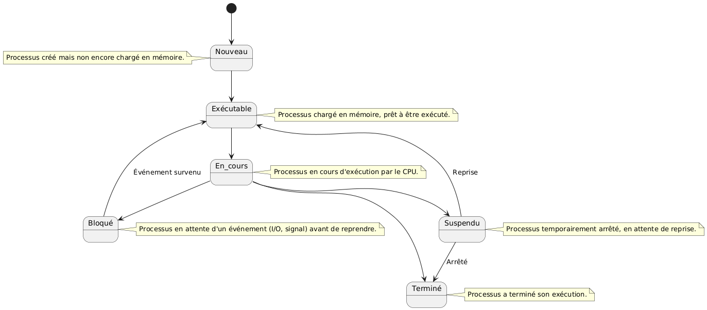
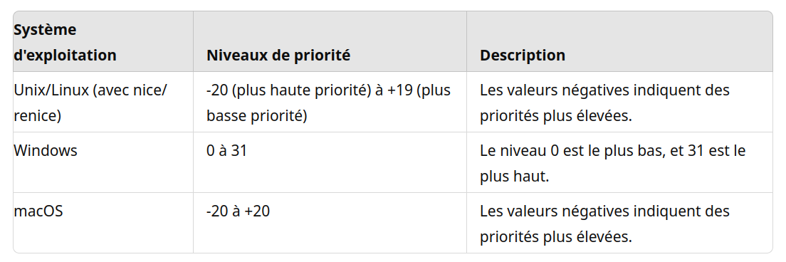

:titre: Gestion des processus
:module: Système
:duree: 105
:description: Savoir gérer les processus en cours d'exécution sur un système Unix/Linux.
include::../../../../adoc/libs/header-module.adoc[]

ifeval::["{visible-on-html}" !=  "yes"]
:docinfo: shared
:docinfodir: ../../../adoc/libs
endif::[]

== Objectifs pédagogiques

// tag::objectifs[]
* Comprendre ce qu'est un processus en informatique
* Savoir lister les processus en cours d'exécution sur un système
* Apprendre à manipuler les processus (lancer, arrêter, suspendre, etc.)
* Utiliser les commandes de base de gestion des processus sous Unix/Linux
* Comprendre l'importance des priorités des processus dans un système d'exploitation.
* Savoir comment les priorités affectent le comportement des processus.
* Apprendre à ajuster les priorités des processus selon les besoins.
// end::objectifs[]

// tag::deroulement[]
== Introduction aux processus

* **Définition** : Un processus est un programme en cours d'exécution, comprenant le code du programme, ses données et l'état de ses registres.
* **Cycle de vie** : Les processus passent par différents états : 
** nouveau, 
** prêt, 
** en cours d'exécution, 
** bloqué, 
** terminé.
* **Gestion par l'OS** : L'OS gère les processus via un ordonnanceur qui décide quel processus exécuter et quand.

include::../../../../adoc/libs/slide-notitle.adoc[]

== Commandes de gestion des processus

* `ps` : Affiche la liste des processus en cours.
* `top` : Affiche les processus en cours en temps réel.
* `kill` : Envoie un signal à un processus, typiquement pour le terminer.
* `bg` et `fg` : Reprend un processus en arrière-plan ou le ramène au premier plan.
* `jobs` : Affiche les processus en arrière-plan lancés par le shell courant.

include::../../../../adoc/libs/slide-notitle.adoc[]

=== `ps` 

**Affiche la liste des processus en cours.**

* **Description** : La commande `ps` permet d'afficher des informations sur les processus actifs sur le système.
* **Utilisation** : `ps -aux` est une utilisation courante pour afficher tous les processus en cours, y compris ceux des autres utilisateurs (`a`), avec des informations détaillées (`u`) et dans un format étendu (`x`).

[source,shell]
----
$> ps -aux
----

=== `top`

**Affiche les processus en cours en temps réel.**

* **Description** : `top` est une commande interactive qui affiche les processus en cours en temps réel, triés par leur utilisation des ressources CPU.
* **Utilisation** : En tapant simplement `top` dans un terminal, on obtient une mise à jour continue des processus actifs avec des détails tels que l'utilisation CPU, la mémoire utilisée, etc.

[source,shell]
----
$> top
----

=== `kill`

**Envoie un signal à un processus, typiquement pour le terminer.**

* **Description** : `kill` envoie un signal à un processus spécifié pour le terminer ou pour lui indiquer de recharger ou de redémarrer.
* **Utilisation** : `kill [PID]` où `[PID]` est l'identifiant numérique du processus que l'on souhaite affecter. Par exemple, `kill 1234` enverra le signal par défaut (SIGTERM) au processus avec l'ID 1234.

[source,shell]
----
$> kill [PID]
----

=== `bg` et `fg`

* **Description** : bg et fg sont des commandes pour gérer des processus en arrière-plan et en premier plan, respectivement.
* **Utilisation** :
** `bg [job_id]` reprend un processus arrêté ou en pause en arrière-plan. Par exemple, `bg %1` reprend le premier processus en arrière-plan.
** `fg [job_id]` ramène un processus en arrière-plan au premier plan. Par exemple, `fg %1` ramène le premier processus en arrière-plan au premier plan.

[source,shell]
----
$> bg [job_id]

$> fg [job_id]
----

=== `jobs`

**Affiche les processus en arrière-plan lancés par le shell courant.**

* **Description** : jobs affiche une liste des travaux en arrière-plan actifs, ou des processus lancés par le shell courant.
* **Utilisation** : Simplement en tapant jobs dans un terminal, on obtient une liste numérotée des travaux en arrière-plan actifs, avec leur état (actif, arrêté, etc.).

[source,shell]
----
$> jobs
----

// tag::demo[]
== Démonstration

**Utilisation des commandes de gestion des processus**

[NOTE.speaker]
--
* Ouvrir un terminal.
* Exécuter la commande `ps -aux` pour afficher tous les processus en cours.
* Lancer une application en arrière-plan (par exemple, `nano &`).
* Utiliser la commande `jobs` pour voir les processus en arrière-plan.
* Reprendre le processus en avant-plan avec `fg [job_id]`.
* Lancer de nouveau une application en arrière-plan (par exemple, `nano &`).
* Utiliser la commande `kill` pour terminer le processus.
--
// end::demo[]

== Théorie des priorités

* Chaque processus se voit attribuer une priorité
* La priorité est un nombre ou une valeur représentant son importance relative par rapport aux autres processus en cours d’exécution
* **Attribution des priorités : **
** différents algorithmes pour attribuer des niveaux de priorité aux processus.
** priorités statiques (définies à l'avance) 
** priorités dynamiques (changées en fonction de la charge du système).

include::../../../../adoc/libs/slide-notitle.adoc[]

* **Impact sur l'ordonnancement** : 
** Priorité plus élevée => exécution plus fréquente donc plus de temps CPU
** Peut influencer la réactivité du système et la performance globale

* **Gestion des priorités** : 
** pour optimiser les performances
** pour garantir le bon fonctionnement des applications critiques

include::../../../../adoc/libs/slide-notitle.adoc[]

== Ajustement des priorités

=== `renice`

Permet de modifier la manière dont les processus sont ordonnancés par le système d’exploitation

* **Description** : `renice` permet de modifier la priorité de l'exécution des processus en cours d'exécution sur les systèmes Unix et Linux. Cela peut être utile pour ajuster les performances du système en donnant plus ou moins de temps CPU à certains processus.
* **Utilisation** : Pour ajuster la priorité d'un processus spécifique, utiliser la commande `renice` suivie de l'option `-n` et du nouveau niveau de priorité, ainsi que de l'identifiant du processus (PID) du processus cible.

[source,shell]
----
$> renice -n [priorité] -p [PID]
----

// tag::demo[]
== Démonstration

**Utilisation des commandes de gestion des processus**

[NOTE.speaker]
--
* Ouvrir un terminal.
* Lancer 2 applications en arrière-plan (par exemple, `sleep 600 &`).
* Trouver le PID avec la commande `ps aux | grep sleep`
* Utiliser renice pour modifier les priorités des processus
* Observer les différences de valeurs impactées dans les processus grâce à `top`
* Montrer qu’on peut trier par `PID` avec `Shift + P` dans `top`
--
// end::demo[]
// end::deroulement[]

== Conclusion
// tag::conclusion[]
* Compréhension des concepts fondamentaux des processus.
* Utilisation des commandes de base pour gérer les processus.
* Capacité à manipuler les processus pour des tâches courantes (lancement, suspension, terminaison).
* Connaissance des outils Unix/Linux pour la gestion des processus.
* Compréhension des implications de l'ajustement des priorités sur le comportement du système.
// end::conclusion[]