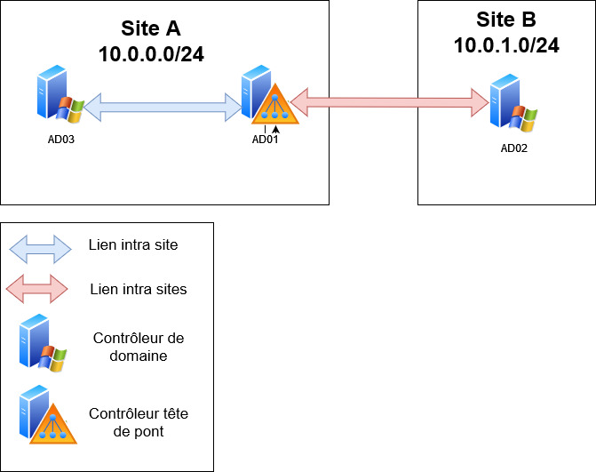

:titre: Gestion des Sites Active Directory
:module: Système
:duree: 60
:description: La gestion des sites Active Directory est une étape importante dans la gestion de l'annuaire Active Directory. Les sites permettent de définir des zones géographiques et de définir des règles de réplication entre les contrôleurs de domaine.
include::../../../../adoc/libs/header-module.adoc[]

ifeval::["{visible-on-html}" !=  "yes"]
:docinfo: shared
:docinfodir: ../../../adoc/libs
endif::[]

== Objectifs pédagogiques

// tag::objectifs[]
* Notion de site AD
* Les objets de connexion et la réplication 
// end::objectifs[]

// tag::deroulement[]
== Notion de site AD

Un site AD est une configuration qui regroupe des sous-réseaux pour optimiser la réplication et la gestion en fonction de la localisation géographique. 

include::../../../../adoc/libs/slide-notitle.adoc[]

La mise en place de la configuration peut être réalisée via 

[cols="1,1"]
|===

a| image::./assets/01-graphique.png[]
a| Console graphique

a| image::./assets/01-console.png[]
a| `Get-Command *ADReplication*`
|===

include::../../../../adoc/libs/slide-notitle.adoc[]

[cols="1,1"]
|===
a|
Les Composants impliqués dans cette gestion sont : 

* Les sites
* Les réseaux
* Les liens de sites
* Les contrôleurs de domaine
a| image::./assets/01-ad.png[]
|===

=== Objet de connexion et la réplication

Le processus de réplication est différent entre

celui mis en œuvre entre des contrôleurs de sites multiples **intersite**

Et celui qui s’applique entre des contrôleurs d’un même site **intrasite**

Dans les deux cas, un service est chargé de gérer (créer, mettre à jour) la topologie de réplication le KCC

Le KCC (Knowledge Consistency Checker) est un service dans Active Directory qui gére et maintient automatiquement la topologie de réplication entre les contrôleurs de domaine.

Pour que la topologie de réplication soit cohérente avec la topologie réseau, la configuration des sites, réseaux et contrôleurs doit être réalisée. 

include::../../../../adoc/libs/slide-notitle.adoc[]

liens entre les éléments prenant part à la gestion des sites 

include::../../../../adoc/libs/slide-notitle.adoc[]

[cols="1,1"]
|===

a| image::./assets/01-connexion.png[]
a| Les objets connexion déterminent quel contrôleur réplique avec quel autre 

|===

La topologie de réplication consiste gérer ces objets connexion

include::../../../../adoc/libs/slide-notitle.adoc[]

Dans un contexte intrasite

* La réplication est continue et quasi instantanée (moins d’une minute entre tous les CD du site)
* Les objets connexions sont créés par paires, la réplication est symétrique
* En cas d’ajout ou de suppression de contrôleur de domaine la topologie est automatiquement mise à jour 

include::../../../../adoc/libs/slide-notitle.adoc[]

La commande `repadmin` permet d’agir sur le processus de réplication
option de cette commande:

* `/showrepl` et `/seplsummary` pour le diagnostic
* `/replicate` pour forcer la réplication entre partenaires
* `/syncall` pour forcer le synchro entre tous les partenaires
* `/kcc` pour forcer la vérification de la topologie

// tag::demo[]
== Démonstration

**site Active Directory**

[NOTE.speaker]
--
* Montrer la console Sites et Services AD
* Création / modification des différents objets
* Actions sur réplication et topologie
* Montrer la commande `repadmin`
  `repadmin /replsum`
  `repadmin /showrepl`
--
// end::demo[]
// end::deroulement[]

== Conclusion
// tag::conclusion[]
* Comprendre la notion de site AD
* Connaître les interface permettant leurs misent en place
* Connaître les commandes permettant de les gérer 
// end::conclusion[]