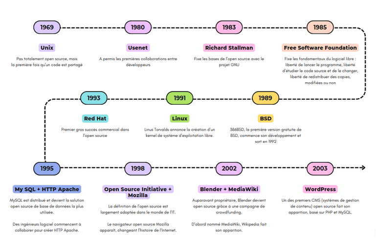
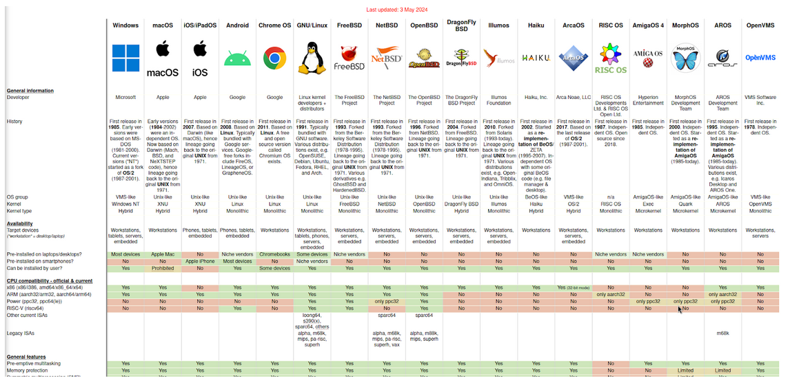
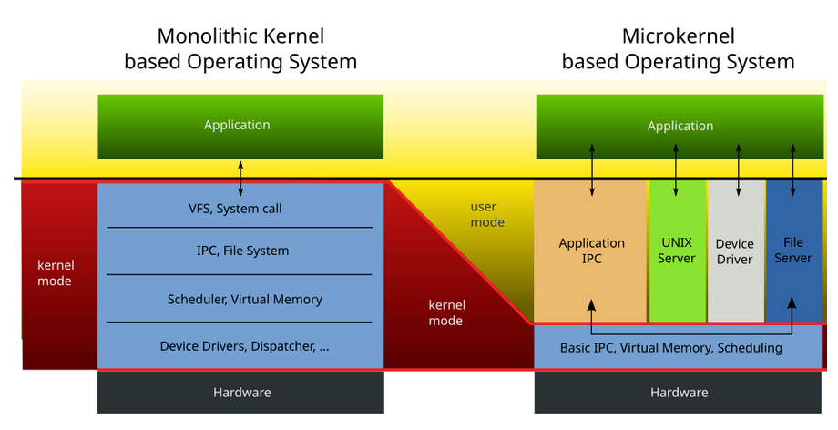
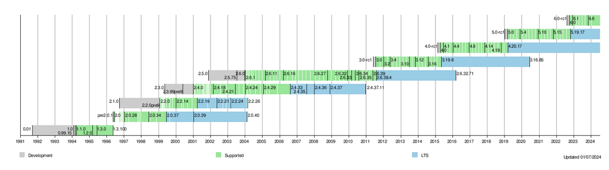

:titre: Introduction à Linux et l’open source
:module: Système
:duree: 60
:description: Introduire les concepts de l’open source et de Linux, et comprendre l’histoire et l’évolution de ce système d’exploitation.
include::../../../../adoc/libs/header-module.adoc[]

ifeval::["{visible-on-html}" !=  "yes"]
:docinfo: shared
:docinfodir: ../../../adoc/libs
endif::[]

== Objectifs pédagogiques

// tag::objectifs[]
* Comprendre le concept de l’open source, et ses avantages
* Connaître l’histoire et l’évolution de Linux
* Distinguer Linux, Unix et autres systèmes d’exploitation
* Identifier le rôle du noyau Linux
* Connaître les principales branches de développement du kernel Linux
// end::objectifs[]

// tag::deroulement[]
== Qu'est-ce que l'open source ?

* Logiciels dont le code source est librement accessible et modifiable
* **Principes fondamentaux** : 
** libre redistribution
** accès au code source
** dérivés autorisés
** intégrité du code source de l'auteur
** absence de discrimination
* **Exemples de licences** : GPL, MIT, Apache
* **Avantages** : transparence, collaboration, flexibilité, sécurité renforcée grâce à la revue par les pairs.

[NOTE.speaker]
--
**Logiciels dont le code source est librement accessible et modifiable**

Les logiciels open source permettent à quiconque de consulter, modifier et distribuer leur code source, favorisant l'innovation et l'amélioration collaborative.

**Principes fondamentaux**

* **Libre redistribution** : Les utilisateurs peuvent partager librement le logiciel.
* **Accès au code source** : Le code source doit être disponible pour être étudié et modifié.
* **Dérivés autorisés** : Les utilisateurs peuvent créer des œuvres dérivées du logiciel.
* **Intégrité du code source de l'auteur** : Les modifications doivent respecter l'œuvre originale et, souvent, être redistribuées sous la même licence.
* **Absence de discrimination** : Aucune restriction ne doit être imposée aux personnes ou aux groupes souhaitant utiliser, modifier ou distribuer le logiciel.

**Exemples de licences : GPL, MIT, Apache**

La licence GPL (General Public License) impose que toute modification soit également open source, tandis que les licences MIT et Apache sont plus permissives, permettant une utilisation plus large, y compris dans des logiciels propriétaires.

**Avantages : transparence, collaboration, flexibilité, sécurité renforcée grâce à la revue par les pairs**

L'open source offre une transparence totale du code, encourage la collaboration et l'innovation, et permet une grande flexibilité d'utilisation. La revue par les pairs renforce la sécurité en identifiant et corrigeant rapidement les vulnérabilités.
--

=== Exemples de projets open source

[cols="1,1,1",frame=none,grid=none]
|===

a| image::./assets/01-linux.png[,,200]
a| image::./assets/01-firefox.png[,,200]
a| image::./assets/01-libreoffice.png[,,200]

|===

[cols="1,1",frame=none,grid=none]
|===

a| image::./assets/01-wordpress.png[,,200]
a| image::./assets/01-apache.png[,,200]

|===

**Vous en connaissez d'autres ?**

[NOTE.speaker]
--
**Linux**

Linux est un système d'exploitation open source qui est utilisé sur des millions de serveurs, appareils mobiles et ordinateurs de bureau à travers le monde.

**Firefox**

Firefox est un navigateur web open source développé par Mozilla, reconnu pour sa sécurité, sa rapidité et sa personnalisation par les extensions.

**LibreOffice**

LibreOffice est une suite bureautique open source qui comprend des applications pour le traitement de texte, les feuilles de calcul, les présentations, et plus encore.

**WordPress**

WordPress est un système de gestion de contenu (CMS) open source qui permet de créer et de gérer facilement des sites web et des blogs.

**Apache**

Apache est un serveur web open source largement utilisé pour héberger des sites web et des applications en ligne, réputé pour sa robustesse et sa flexibilité.

**Vous en connaissez d'autres ?**

D'autres projets open source populaires incluent Git, un système de contrôle de version distribué, et GIMP, un logiciel de manipulation d'images.
--

// tag::demo[]
== Démonstration

**Explorons un projet open source !**

[NOTE.speaker]
--
1. Aller sur GitHub (https://github.com).
2. Rechercher le dépôt souhaité pour la démo, par exemple "torvalds/linux".
3. Explorer la structure du dépôt : fichiers principaux, README, licences.
4. Expliquer comment cloner le dépôt localement.
--
// end::demo[]

== Histoire de Linux et du mouvement open source

🔗 https://www.canva.com/design/DAGJtPmA3dU/n2QuvZ7jIom4Pt-ERfyY8w/edit?utm_content=DAGJtPmA3dU&utm_campaign=designshare&utm_medium=link2&utm_source=sharebutton[Histoire de l'open source]

[NOTE.speaker]
--
**Histoire de l'open source**

**1969 - Unix**

Bien que Unix ne soit pas totalement open source, il marque la première fois qu'un code est largement partagé, posant les bases de la collaboration en développement logiciel.

**1980 - Usenet**

Usenet permet les premières collaborations entre développeurs à travers un système de forums et de partage de fichiers, préfigurant les pratiques modernes de développement collaboratif.

**1983 - Richard Stallman**

Richard Stallman lance le projet GNU, établissant les principes fondamentaux du logiciel libre, notamment la liberté d'exécuter, d'étudier, de modifier et de distribuer les logiciels.

**1985 - Free Software Foundation**

Stallman fonde la Free Software Foundation pour promouvoir les droits des utilisateurs de logiciels et soutenir le développement de logiciels libres.

**1989 - BSD**

Le développement de 386BSD commence, donnant naissance à la première version gratuite de BSD, un système d'exploitation Unix.

**1991 - Linus Torvalds**

Linus Torvalds annonce la création du noyau Linux, un système d'exploitation libre qui deviendra central dans l'écosystème open source.

**1993 - MySQL + HTTP Apache**

MySQL est distribué et devient la solution de base de données open source la plus utilisée, tandis que des ingénieurs collaborent pour créer HTTP Apache, un serveur web open source.

**1995 - Red Hat Linux**

Red Hat Linux devient le premier gros succès commercial dans l'open source, prouvant la viabilité économique des logiciels libres.

**1998 - Open Source Initiative + Mozilla**

La définition de l'open source est largement adoptée, et Mozilla, un navigateur open source, change l'histoire d'Internet en popularisant les logiciels libres pour le grand public.

**2002 - Blender + MediaWiki**

Blender, auparavant propriétaire, devient open source grâce à une campagne de crowdfunding, et MediaWiki, le logiciel derrière Wikipedia, voit le jour.

**2003 - WordPress**

WordPress, l'un des premiers systèmes de gestion de contenu (CMS) open source, est lancé, facilitant la création de sites web basés sur PHP et MySQL.

**2004 - Ubuntu**

Ubuntu, une distribution Linux basée sur Debian, devient la distribution Linux la plus populaire grâce à son focus sur la convivialité.

**2005 - Git**

Créé par Linus Torvalds, Git révolutionne la gestion de versions en facilitant la collaboration et le partage de code.

**2008 - Chromium + Android**

Google investit dans l'open source en lançant Chromium, un navigateur moderne, et Android, un système d'exploitation mobile.

**2009 - Chromium OS**

Chromium OS permet de commercialiser des ordinateurs moins chers avec un système d'exploitation plus léger.

**2010 - LibreOffice**

LibreOffice, une suite bureautique open source, offre des alternatives gratuites à des logiciels comme Microsoft Office.

**2011 - Google Chrome**

Google Chrome remplace rapidement Internet Explorer pour devenir le navigateur web le plus utilisé.

**2012 - Firefox OS**

Firefox OS, un système d'exploitation mobile créé par la Mozilla Foundation, vise à concurrencer les systèmes propriétaires.

**2013 - Git prend de l'ampleur**

Une enquête révèle que Git devient le système de contrôle de version le plus populaire, indispensable aux développeurs.

**2015 - Microsoft se met à l'open source**

Microsoft commence à ouvrir le code source de certains projets tels que .NET Framework, marquant un changement majeur dans sa stratégie.

**2018 - Microsoft rachète GitHub**

Microsoft acquiert GitHub, le plus grand hébergeur de code open source, consolidant sa place dans l'écosystème open source.

**2020 - Linux prend de l'ampleur**

Les parts de marché des systèmes d'exploitation Linux dépassent les 3% pour la première fois, indiquant une adoption croissante.
--

== Différences entre Linux, Unix et autres systèmes d’exploitation

* Unix est un système d'exploitation multi-utilisateur et multitâche créé dans les années 1970.
* Linux est un clone d'Unix, mais il est libre et open source.
* Des caractéristiques différentes : coûts, licences, flexibilité, compatibilité matérielle, communauté de support.
* Autres systèmes d'exploitation : Windows (propriétaire), macOS (basé sur Unix).

[NOTE.speaker]
--
**Différences entre Linux, Unix et autres systèmes d’exploitation**

**Unix est un système d'exploitation multi-utilisateur et multitâche créé dans les années 1970.**

Unix, développé dans les années 1970, est un système d'exploitation robuste et sécurisé conçu pour permettre à plusieurs utilisateurs d'exécuter des tâches simultanément sur un même système.

**Linux est un clone d'Unix, mais il est libre et open source.**

Linux, créé par Linus Torvalds en 1991, est un clone d'Unix qui se distingue par sa nature libre et open source, permettant une distribution et une modification gratuites par quiconque.

**Des caractéristiques différentes : coûts, licences, flexibilité, compatibilité matérielle, communauté de support.**

Les différences notables entre Linux et Unix incluent les coûts (Linux est généralement gratuit), les licences (Linux utilise des licences open source), la flexibilité (Linux est hautement personnalisable), la compatibilité matérielle (Linux supporte une large gamme de matériels) et la communauté de support (Linux bénéficie d'un large soutien communautaire).

**Autres systèmes d'exploitation : Windows (propriétaire), macOS (basé sur Unix).**

Windows est un système d'exploitation propriétaire largement utilisé sur les PC, tandis que macOS, basé sur Unix, est le système d'exploitation propriétaire développé par Apple pour ses ordinateurs.
--

include::../../../../adoc/libs/slide-notitle.adoc[]

🔗 https://eylenburg.github.io/os_comparison.htm[Comparaison des systèmes d'exploitation]

[NOTE.speaker]
--
**Systèmes d'exploitation populaires**

**Windows**

Windows, développé par Microsoft, est un système d'exploitation propriétaire largement utilisé sur les PC. Il est connu pour son interface utilisateur conviviale et sa compatibilité avec une vaste gamme de logiciels commerciaux

**macOS**

macOS, créé par Apple, est un système d'exploitation propriétaire basé sur Unix. Il est réputé pour son design élégant, sa stabilité et son intégration harmonieuse avec l'écosystème matériel d'Apple

**Linux**

Linux est un système d'exploitation open source qui est très flexible et utilisé dans divers environnements, allant des serveurs aux appareils embarqués. Il existe en plusieurs distributions, chacune adaptée à des besoins spécifiques

**Android**

Android, développé par Google, est un système d'exploitation open source principalement utilisé sur les smartphones et les tablettes. Il est basé sur le noyau Linux et se distingue par sa large gamme d'applications disponibles sur le Google Play Store

**iOS**

iOS, conçu par Apple, est le système d'exploitation propriétaire utilisé sur les iPhones et iPads. Il est reconnu pour sa performance fluide, sa sécurité robuste et son écosystème d'applications soigneusement contrôlé

**FreeBSD**

FreeBSD est un système d'exploitation open source de type Unix, connu pour sa robustesse et sa sécurité. Il est souvent utilisé dans des serveurs et des environnements de réseau

**Chrome OS**

Chrome OS, développé par Google, est un système d'exploitation léger basé sur le navigateur Chrome. Il est principalement utilisé sur les Chromebook et est conçu pour les utilisateurs ayant besoin d'un accès rapide et sécurisé à Internet​.
--

== Le kernel Linux

* Le kernel est le cœur du système d'exploitation, responsable de la gestion des ressources matérielles (CPU, mémoire, périphériques).
* Il fournit une interface entre le matériel et les logiciels d'application.
* Types de kernels : monolithique (comme Linux), microkernel, hybride.

[NOTE.speaker]
--
**Le kernel Linux**

**Le kernel est le cœur du système d'exploitation, responsable de la gestion des ressources matérielles (CPU, mémoire, périphériques).**

Le kernel, ou noyau, est la partie centrale du système d'exploitation qui gère toutes les ressources matérielles de l'ordinateur, telles que le processeur, la mémoire vive et les périphériques comme les disques durs et les imprimantes.

**Il fournit une interface entre le matériel et les logiciels d'application.**

Le kernel sert d'interface entre le matériel de l'ordinateur et les applications logicielles, permettant aux programmes d'accéder aux ressources matérielles sans avoir à connaître les détails techniques du matériel sous-jacent.

**Types de kernels : monolithique (comme Linux), microkernel, hybride.**

Les types de kernels incluent le kernel monolithique, comme celui de Linux, qui incorpore tous les services dans un seul espace mémoire; le microkernel, qui minimise les fonctions en déplaçant beaucoup de services dans l'espace utilisateur; et le kernel hybride, qui combine des éléments des deux précédents pour améliorer la flexibilité et l'efficacité.
--

include::../../../../adoc/libs/slide-notitle.adoc[]

🔗 https://en.wikipedia.org/wiki/Monolithic_kernel#/media/File:OS-structure2.svg[Schémas de kernel monolithique, microkernel et kernel hybride]

[NOTE.speaker]
--
**Système d'exploitation basé sur un noyau monolithique :**

* **Description** : Le noyau monolithique regroupe l'ensemble des services du système d'exploitation, y compris les drivers, la gestion de la mémoire, les appels système, etc., dans une seule grande partie fonctionnant en mode noyau.
* **Avantages** : Performances élevées et communication rapide entre les services, car tout est intégré dans le même espace d'adressage.

**Système d'exploitation basé sur un micronoyau :**

* **Description** : Le micronoyau est conçu pour minimaliser les fonctions exécutées en mode noyau, déplaçant les services comme les drivers, les serveurs de fichiers et autres dans l'espace utilisateur.
* **Avantages** : Meilleure modularité et sécurité accrue, car une panne d'un service utilisateur n'affecte pas directement le noyau.

**Système d'exploitation basé sur un "noyau hybride" :**

* **Description** : Le noyau hybride combine des éléments des noyaux monolithiques et des micronoyaux, avec certaines fonctions essentielles exécutées en mode noyau, tandis que d'autres services sont placés en mode utilisateur.
* **Avantages** : Offre un équilibre entre performance et modularité, permettant de tirer parti des points forts des deux approches.
--

// tag::demo[]
== Démonstration

**Examinons la structure du Kernel Linux !**

[NOTE.speaker]
--
1. Ouvrir le dépôt "torvalds/linux" sur GitHub.
2. Identifier les principaux sous-répertoires : arch, drivers, fs, kernel, etc.
3. Expliquer brièvement le rôle de chaque sous-répertoire.
--
// end::demo[]

== Les branches de développement du kernel Linux

* **Branches de développement** : 
** stable : version fiable qui a passé tous les tests
** mainline : branche de développement pour les nouvelles fonctionnalités
** long-term support (LTS) : version qui bénéficie d’un support étendu en matière de correctifs de bugs et de failles de sécurité sur une période prolongée
* Cycle de développement : soumissions de patchs, revue de code, intégration dans la branche mainline, publication de nouvelles versions stables.
* **Les branches LTS sont primordiales pour les environnements de production.**

[NOTE.speaker]
--
**Branches de développement :**

* **Stable** : Une version stable du logiciel est une version éprouvée qui a réussi tous les tests requis, garantissant sa fiabilité pour les utilisateurs finaux.
* **Mainline** : La branche mainline est utilisée pour le développement de nouvelles fonctionnalités et de mises à jour importantes du logiciel, avant qu'elles ne soient jugées stables.
* **Long-term support (LTS)** : Les versions LTS offrent un support prolongé, incluant des correctifs de bugs et des mises à jour de sécurité sur une période étendue, ce qui les rend idéales pour les environnements de production nécessitant une stabilité à long terme.

**Cycle de développement :**

* Les soumissions de patchs représentent les contributions individuelles de développement ou de correction de bugs proposées par les contributeurs.
* La revue de code est une étape critique où les modifications proposées sont examinées et approuvées avant d'être intégrées dans la branche principale (mainline).
* L'intégration dans la branche mainline regroupe les nouvelles fonctionnalités et les corrections validées pour préparer la prochaine version stable.
* La publication de nouvelles versions stables signifie que les versions de logiciel qui ont atteint un niveau de stabilité suffisant sont distribuées aux utilisateurs finaux pour une utilisation générale.

Les branches LTS sont primordiales pour les environnements de production car elles assurent la stabilité et la sécurité à long terme des systèmes informatiques critiques.
--

include::../../../../adoc/libs/slide-notitle.adoc[]

🔗 https://en.wikipedia.org/wiki/Linux_kernel_version_history[Historique des versions du kernel Linux]

[NOTE.speaker]
--
**Développement (gris) :**

* **Description** : Les périodes en gris indiquent les phases de développement des différentes versions du noyau Linux. Pendant ces phases, de nouvelles fonctionnalités sont ajoutées et des bugs sont corrigés.
* **Avantages** : Permet de suivre l'évolution et l'innovation continue du noyau Linux au fil du temps.

**Supporté (vert) :**

* **Description** : Les périodes en vert représentent les versions du noyau Linux qui sont activement supportées. Cela signifie que des mises à jour de sécurité et des corrections de bugs sont régulièrement fournies pour ces versions.
* **Avantages** : Assure que les utilisateurs qui utilisent ces versions bénéficient d'un support technique et de correctifs, garantissant ainsi la sécurité et la stabilité du système.

**LTS (bleu) :**

* **Description** : Les périodes en bleu désignent les versions à long terme (Long-Term Support, LTS) du noyau Linux. Ces versions reçoivent un support étendu pendant plusieurs années, au-delà de la période de support standard.
* **Avantages** : Idéal pour les environnements de production où la stabilité à long terme est cruciale, car ces versions bénéficient d'un support prolongé et sont moins sujettes aux changements fréquents.
--

// tag::exercice[]
== Exercice

**Objectif** : Comprendre la structure d'un autre kernel open source pour appréhender son organisation et ses composants principaux.

1. Se rendre sur le dépôt GitHub de FreeBSD : 🔗 https://github.com/freebsd/freebsd.git
2. Explorer et décrire le rôle des répertoires principaux : sys, lib, bin, sbin…
// end::exercice[]

// end::deroulement[]

== Conclusion
// tag::conclusion[]
* Compréhension des principes fondamentaux de l'open source.
* Connaissance de l'histoire et de l'évolution de Linux.
* Capacité à différencier Linux, Unix et autres systèmes d'exploitation.
* Connaissance du rôle et de la structure du kernel Linux.
* Familiarité avec les branches de développement du kernel et leur importance.
// end::conclusion[]