:titre: Mise en place d’un serveur RDS : Remote Desktop Services
:module: Système
:duree: 120
:description: Pour mettre en place un serveur RDS, il est nécessaire de comprendre les composants et le fonctionnement de RDS. Ce module explique les étapes pour installer et configurer un serveur RDS sur Windows Server.
include::../../../../adoc/libs/header-module.adoc[]

ifeval::["{visible-on-html}" !=  "yes"]
:docinfo: shared
:docinfodir: ../../../adoc/libs
endif::[]

== Objectifs pédagogiques

// tag::objectifs[]
* Savoir installer un serveur RDS
* Savoir configurer le serveur RDS
* Savoir activer et paramétrer le serveur
// end::objectifs[]

// tag::deroulement[]
== Mise en place de RDS

=== Étape 1 : Installation des Rôles et Fonctionnalités

Choisissez installation des services Bureau à distance

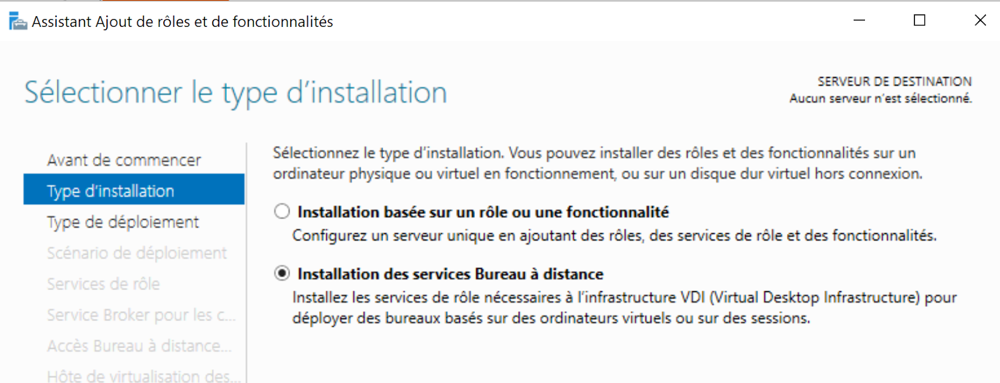

include::../../../../adoc/libs/slide-notitle.adoc[]

Le démarrage rapide permet d’installer et de **préconfigurer les rôles** suivants :

* Le broker RDS
* Accès RDS via le navigateur web
* Le rôle RDS 

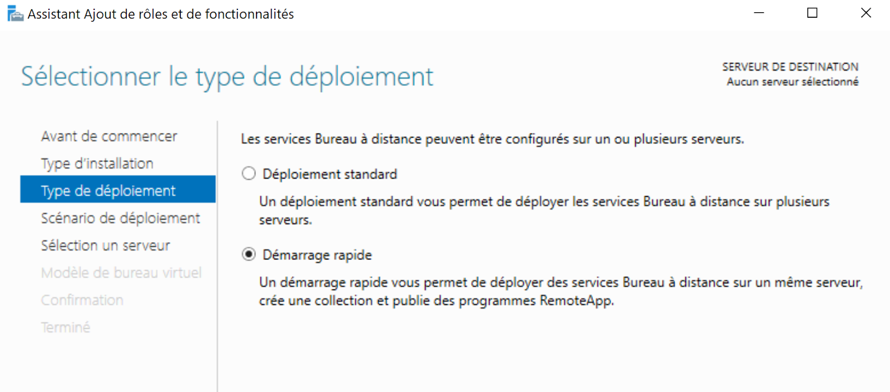

include::../../../../adoc/libs/slide-notitle.adoc[]

Deux scénarios de déploiements sont disponibles : 

* Déploiement de bureaux basés sur un ordinateur virtuel, il faut posséder un modèle sur un disque virtuel présent sur la machine 
* Déploiement de bureaux basés sur une session (exemple suivi ici)

include::../../../../adoc/libs/slide-notitle.adoc[]

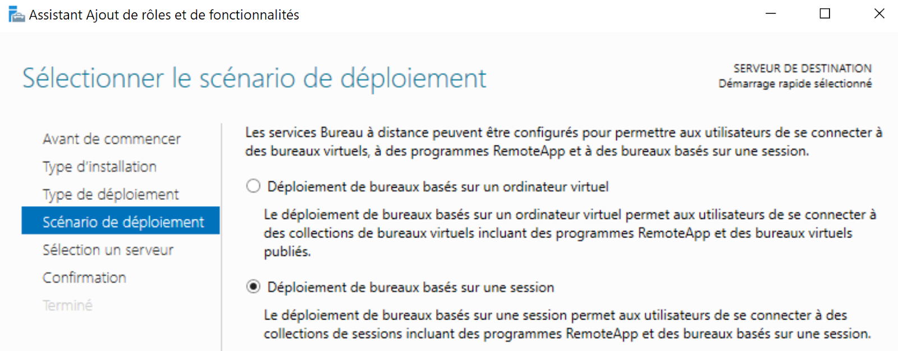

Sélectionner ensuite votre serveur pour la configuration automatique du broker et valider l’installation du rôle

=== Étape 2 : Installation du gestionnaire de licences

Depuis le Gestionnaire de serveur, à gauche dans le menu **Service de bureau à distance**.

Cliquer sur le bouton **Gestionnaire de Licence**.

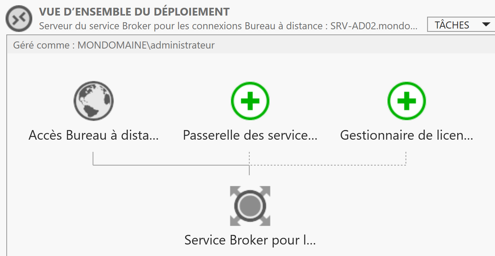

include::../../../../adoc/libs/slide-notitle.adoc[]

Sélectionner ensuite votre serveur puis faites Ajouter

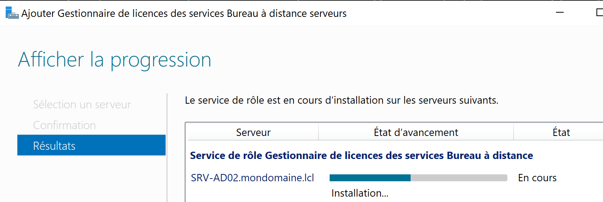

=== Étape 3 : Configuration du mode de licence RDS

Par défaut on a 120 jours d’essai si aucune configuration n’est faite

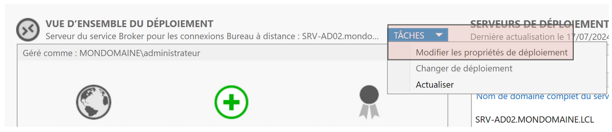

include::../../../../adoc/libs/slide-notitle.adoc[]

[cols="1,1"]
|===
a|
Il faut définir le type de licence :

* Par utilisateur
* Par ordinateur

Dans la plupart des cas on utilisera le type “**Par utilisateur**“.
a| image::./assets/03-licence-2.png[]
|===

include::../../../../adoc/libs/slide-notitle.adoc[]

Il faut ensuite activer notre serveur de licences via la console :

**Gestionnaire de licences des services Bureau à distance**

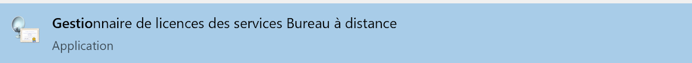

include::../../../../adoc/libs/slide-notitle.adoc[]

Sur le menu contextuel du serveur sélectionnez **Activer le serveur**

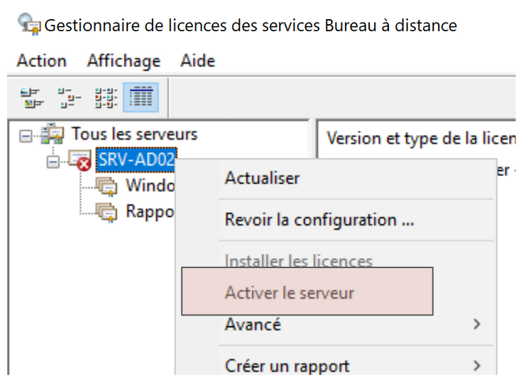

include::../../../../adoc/libs/slide-notitle.adoc[]

Dans l’assistant d’activation sélectionnez la méthode de connexion à Microsoft Clearinghouse

Microsoft Clearinghouse est une **banque centrale de licences** de Microsoft pour activer les serveurs de licences des services Bureau à distance, émettre des licences d’accès client, récupérer des licences d’accès client et désactiver ou réactiver des serveurs de licences. 

include::../../../../adoc/libs/slide-notitle.adoc[]

3 options sont disponibles : 

* **Connexion auto** si le serveur a accès une connexion WEB
* Navigateur Web si le serveur n’a pas accès au web mais que l’on a une autre machine pouvant s’y connecter.
* Téléphone si aucune connexion WEB

[cols="1,1"]
|===
a| image::./assets/03-licence-5.png[]
a| image::./assets/03-licence-6.png[]
|===

include::../../../../adoc/libs/slide-notitle.adoc[]

Renseigner les informations de société, tous les champs sont obligatoires, bien faire attention au choix de pays

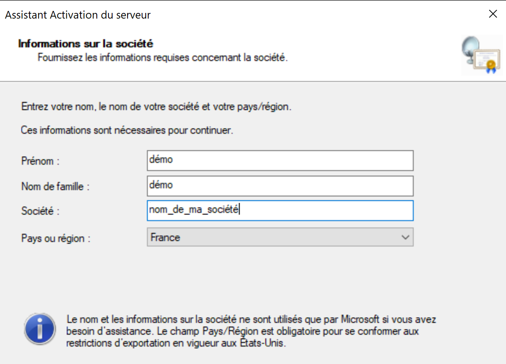

include::../../../../adoc/libs/slide-notitle.adoc[]

[cols="1,1"]
|===
a| 
Confirmation de l’activation du serveur 

Possibilité de lancer l’assistant d’installation des licences (il faut posséder des licences valides)
a| image::./assets/03-licence-8.png[]
|===

include::../../../../adoc/libs/slide-notitle.adoc[]

[cols="1,1"]
|===
a| Une fois l’activation du serveur effectuée on a un Warning présent sur le serveur à corriger : 
a| image::./assets/03-licence-9.png[]

a| image::./assets/03-licence-10.png[]
a| 
* Ajouter le serveur de licences au groupe Serveur de licences Terminal Server 
* Redémarrer le service “Gestionnaire de licences des services Bureau à distance“
|===

=== Étape 4 : Création d’une collection

Dans le Gestionnaire de serveur\Services Bureau à distance
allez sur l’onglet Collection.

Une collection permet de déterminer quels serveurs hôtes utilisés, quelles applications dans le cas d’un Remote APP. Dans le cas d’une ferme RDS vous pouvez ajouter des serveurs à une collection.

include::../../../../adoc/libs/slide-notitle.adoc[]

Par défaut une collection nommée “quick collection” est créée, on va la supprimer pour créer notre propre Collection

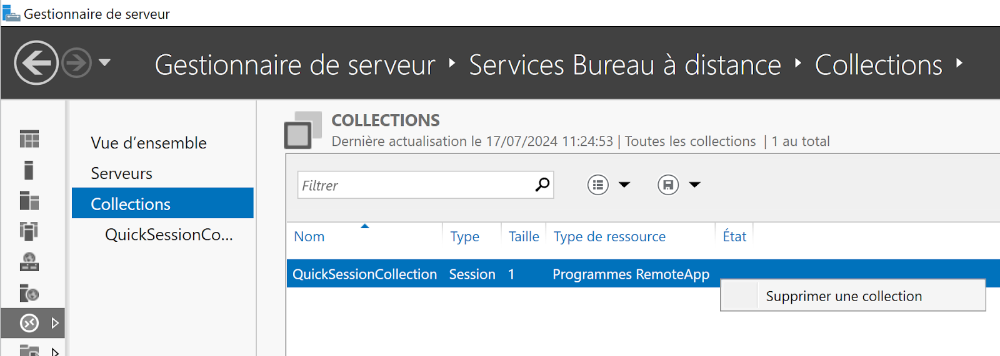

include::../../../../adoc/libs/slide-notitle.adoc[]

Via le menu Tâche faire Créer une collection de session

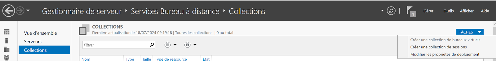

include::../../../../adoc/libs/slide-notitle.adoc[]

* Nommer la collection.
* Sélectionner le ou les serveurs de bureau à distance.
* Définir un groupe d’utilisateurs qui peut se connecter à distance sur le serveur. Vous pouvez créer un groupe de type GG_RDS
* Paramétrage des disques de profil utilisateur. Permet de stocker les profils utilisateurs dans un emplacement partagé. **En décochant la case Activer les disques de profil utilisateur**. Les profils seront alors stockés sur le serveur dans le dossier C:\Utilisateurs\

=== Étape 5 : Configuration de la collection

* Cliquer sur votre collection
* Onglet tâches dans les propriétés
* Modifier les propriétés. 

Pensez à cliquer sur le bouton Appliquer à chaque changement.

include::../../../../adoc/libs/slide-notitle.adoc[]

[cols="1,1"]
|===
a| 
Dans l’onglet session modifier ces deux paramètres

* Mettre fin à une session déconnectée
* Limite de session inactive 

a| image::./assets/05-config-collection.png[]
|===

=== Étape 6 : Connexion avec le client MSTSC

Vérifier la bonne configuration en établissant une connexion au serveur RDS.

L’utilisateur choisi pour le test doit être membre du groupe global gérant les personnes autorisées à se connecter 

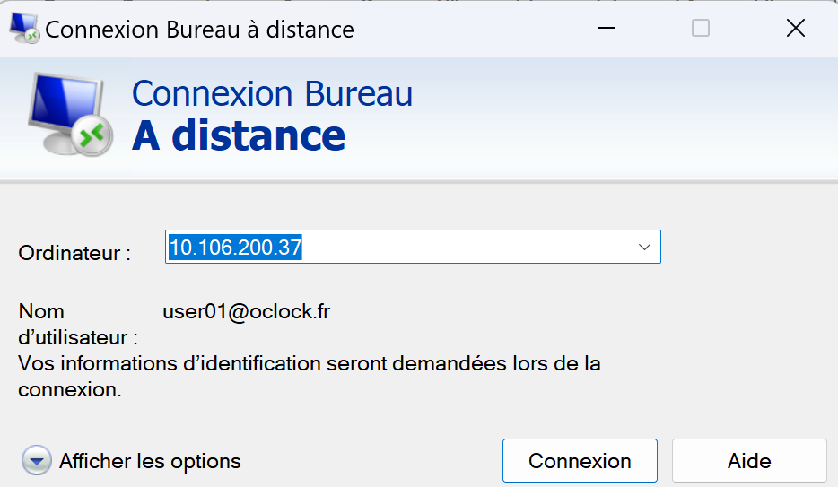

// tag::demo[]
== Démonstration

Mise en place de RDS

[NOTE.speaker]
--
Reprendre toutes les étapes du cours et faire la démonstration de la mise en place d’un serveur RDS 
--
// end::demo[]
// end::deroulement[]

== Conclusion
// tag::conclusion[]
* Vous êtes maintenant en capacité d’installer un serveur RDS, de l’activer et de le configurer 
* Vous savez également comment monter une batterie de serveurs RDS 
* Et vous êtes en capacité de comprendre et de dépanner ce type d’infrastructure 
// end::conclusion[]