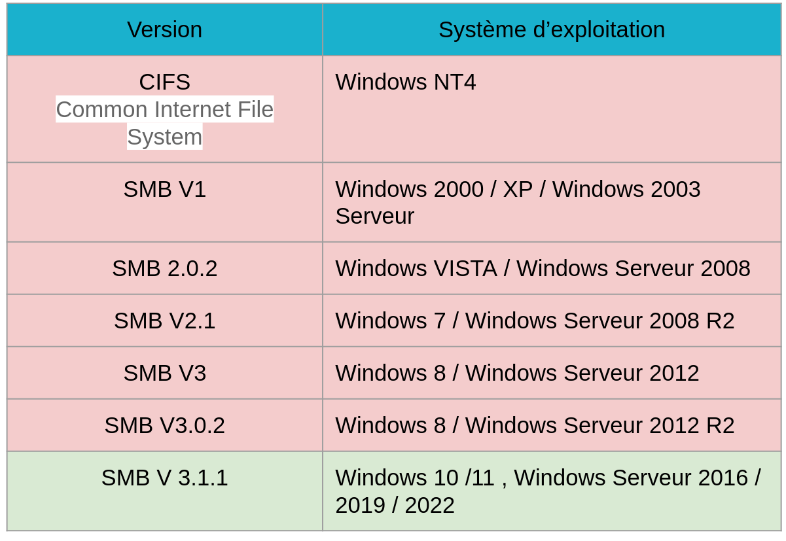
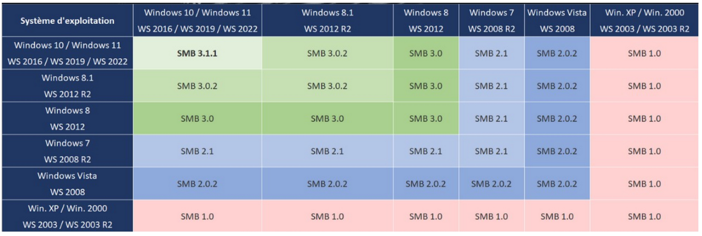

:titre: Partage de fichier SMB
:module: Système
:duree: 60
:description: SMB est un protocole de partage de fichiers
include::../../../../adoc/libs/header-module.adoc[]

ifeval::["{visible-on-html}" !=  "yes"]
:docinfo: shared
:docinfodir: ../../../adoc/libs
endif::[]

== Objectifs pédagogiques

// tag::objectifs[]
[cols="1,1"]
|===
a|
* Qu’est-ce que SMB ?
* Fonctionnement de SMB
* Versions de SMB
* Compatibilité SMB Windows
* Avantages SMB
a|
* Configuration du partage SMB
* SMB et PowerShell
* Accès aux ressources partagées
* Sécurité et permissions
* Résolution des problèmes courants
|===
// end::objectifs[]

// tag::deroulement[]
== Qu'est-ce que SMB ?

* **Définition** :
** SMB (Server Message Block) est un protocole de réseau utilisé pour partager des fichiers, imprimantes et autres ressources réseau entre ordinateurs.
** Initialement développé par IBM et Microsoft, il est désormais intégré dans de nombreux systèmes d'exploitation.
* **Utilisation** :
** Principalement utilisé dans les environnements Windows, mais aussi compatible avec d'autres systèmes via Samba (pour Linux et Unix).

== Fonctionnement de SMB

* **Modèle Client-Serveur** :
** **Serveur** : Machine qui héberge et offre des ressources partagées (fichiers, imprimantes).
** **Client** : Machine qui accède et utilise les ressources partagées par le serveur.
* **Communication** :
** Utilise des ports spécifiques (généralement 445 pour SMB direct sur TCP/IP, et 139 pour NetBIOS sur TCP/IP).
** Supporte les transactions simultanées et les verrouillages de fichiers pour la gestion de la concurrence.

== Versions de SMB

== Compatibilité SMB Windows

**La version la plus faible sera retenue pour la communication SMB**

== Avantages SMB

**Partage Facile et Intégré :**

* Intégration native dans les systèmes Windows, facilitant le déploiement et l'utilisation.

**Gestion Centralisée des Ressources :**

* Permet une gestion centralisée des fichiers et imprimantes, réduisant les besoins en duplication de données.

include::../../../../adoc/libs/slide-notitle.adoc[]

**Sécurité et Contrôle d'Accès :**

* Supporte les ACL (Access Control Lists) pour une gestion fine des permissions.
* Chiffrement des données en transit avec SMB 3.0, protégeant contre les interceptions.

== Configuration du partage SMB

[cols="1,1"]
|===
a| Activer le partage de fichiers et d’imprimantes
a|
* "Panneau de configuration" > "Centre Réseau et partage".
* "Modifier les paramètres de partage avancés", activer "Activer le partage de fichiers et d’imprimantes".

a| Partager un dossier
a|
* Clic droit sur le dossier > "Propriétés".
* Onglet "Partage" > "Partage avancé".
* Cocher "Partager ce dossier"
|===

include::../../../../adoc/libs/slide-notitle.adoc[]

[cols="1,1"]
|===
a| Définir les permissions
a|
* "Partage avancé", cliquez sur "Permissions".
* Ajouter des utilisateurs ou groupes via les ACL.
* Définir les permissions selon les besoins

a| Configurer les permissions NTFS
a|
* Onglet "Sécurité" propriétés du dossier.
* Méthode AGDLP
* Définir des permissions NTFS spécifiques

|===

== SMB et PowerShell

Pour voir toutes les commandes SmbShare

`Get-Command *smbshare*`

https://learn.microsoft.com/en-us/powershell/module/smbshare/?view=windowsserver2022-ps[SmbShare Module | Microsoft Learn]

[cols="1,1"]
|===
a| Afficher la liste des partages
a| `Get-SmbShare`

a| Ajouter un partage
a| `New-SmbShare`

a| Modifier les propriétés d’un partage
a| `Set-SmbShare`

a| Supprimer un partage
a| `Remove-SmbShare`
|===

== Accès aux ressources partagées

=== Via l'Explorateur de fichiers :

* Ouvrir l'Explorateur de fichiers.
* Taper `\\Nom_du_serveur\Nom_du_dossier_partagé` dans la barre d'adresse.
* Accéder directement aux fichiers et dossiers partagés.

=== Mappage de lecteur réseau :

* Clic droit sur "Ce PC" > "Connecter un lecteur réseau".
* Sélectionner une lettre de lecteur et entrer le chemin réseau (`\\Nom_du_serveur\Nom_du_dossier_partagé`).
* Option pour se reconnecter au démarrage.

== Sécurité et permissions

=== Gestion des ACL (Access Control Lists) :

* Permet de définir des permissions granulaires pour chaque utilisateur ou groupe.
* Sécurise l'accès aux fichiers et répertoires partagés.

=== Chiffrement des Données :

* Utiliser SMB 3.0 pour le chiffrement de bout en bout des données en transit.
* Protéger contre les attaques de type man-in-the-middle.

=== Configuration des Pare-feu :

* Vérifier que les ports 445 (SMB direct) et 139 (NetBIOS) sont ouverts.
* Configurer des règles de pare-feu pour autoriser le trafic SMB uniquement aux adresses IP de confiance.

== Résolution des problèmes courants

=== Vérification de la Connectivité Réseau :

* Utiliser des commandes comme ping et tracert pour diagnostiquer les problèmes de réseau.
* S'assurer que les deux appareils sont sur le même sous-réseau ou qu'un routage adéquat est en place.

=== Validation des Paramètres de Partage :

* Confirmer que le partage de fichiers et d'imprimantes est activé sur les deux machines.
* Vérifier les paramètres de partage avancés et les permissions NTFS.

=== Diagnostic des Permissions :

* Utiliser les outils de gestion des permissions comme icacls pour vérifier et configurer les ACL.
* Tester l'accès avec différents comptes utilisateurs pour isoler les problèmes de permission.

// tag::demo[]
== Démonstration

**Les partages SMB**

[NOTE.speaker]
--
Affichage des permissions NTFS de base et avancée

-> Créer un dossier, visualiser les permissions et évoquer le mécanisme d’héritage (permissions grisées non modifiables)

Création d’un partage, configuration des autorisations de partage

Lancement de la console d’assistant de délégation de contrôle
--
// end::demo[]
// end::deroulement[]

== Conclusion
// tag::conclusion[]
* Vous êtes en mesure d’expliquer ce qu’est un partage SMB
* de comprendre la compatibilité de version 
* de le mettre en place aussi bien graphiquement que via les commandes PowerShell 
// end::conclusion[]