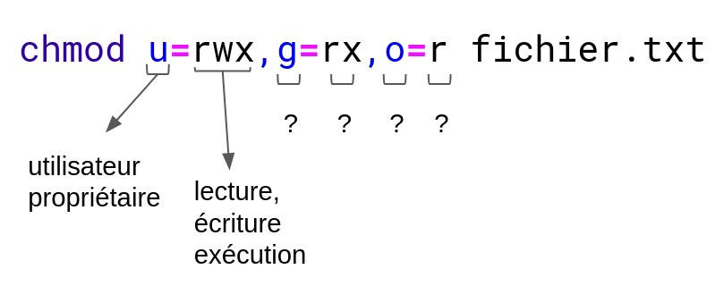
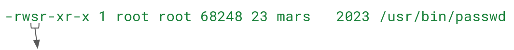
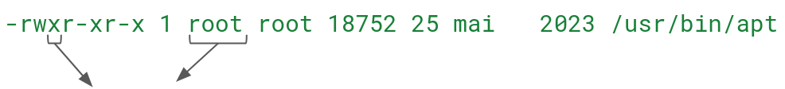

:titre: Permissions et propriétés des fichiers
:module: Système
:duree: 90
:description: Concepts de base des permissions et propriétés des fichiers sous Linux.
include::../../../../adoc/libs/header-module.adoc[]

ifeval::["{visible-on-html}" !=  "yes"]
:docinfo: shared
:docinfodir: ../../../adoc/libs
endif::[]

== Objectifs pédagogiques

// tag::objectifs[]
* Comprendre les concepts de base des permissions de fichiers sous Linux.
* Savoir interpréter les permissions de fichiers et répertoires.
* Utiliser les commandes pour gérer les permissions de fichiers.
* Connaître les propriétés de base des fichiers sous Linux.
* Maîtriser les commandes chmod, chown et chgrp pour changer les permissions, le propriétaire et le groupe des fichiers.
* Comprendre le fonctionnement des SUID, SGID et Sticky bit.
* Savoir utiliser les ACL pour gérer finement les permissions.
// end::objectifs[]

// tag::deroulement[]
== Gestion des permissions avec `chmod`

* La commande `chmod` (change mode) est utilisée pour **changer les permissions d'un fichier ou d'un répertoire**.
* Les permissions sont définies pour :
** **l'utilisateur propriétaire** (u)
** **le groupe propriétaire** (g)
** **les autres** (o)
* Les permissions de base sont : 
** **lecture** (r)
** **écriture** (w)
** **exécution** (x)

include::../../../../adoc/libs/slide-notitle.adoc[]

**Exemple de syntaxe pour définir les permissions :**

include::../../../../adoc/libs/slide-notitle.adoc[]

**Ajouter la permission d’exécution pour le propriétaire :**

[source,shell]
----
chmod u+x script.sh
----

**Enlever la permission d’écriture pour les autres :**

[source,shell]
----
chmod o-w document.txt
----

**Définir des permissions avec la notation numérique (rwx = 7, rw- = 6, r-- = 4)**

[source,shell]
----
chmod 755 programme
----

== Changement de propriétaire avec `chown`

* La commande `chown` (change owner) est utilisée pour changer le propriétaire d'un fichier ou d'un répertoire.
* On peut également changer le groupe propriétaire en utilisant la syntaxe `chown utilisateur:groupe`

include::../../../../adoc/libs/slide-notitle.adoc[]

**Changer le propriétaire :**

[source,shell]
----
chown nouvel_utilisateur fichier.txt
----

**Changer le propriétaire et le groupe propriétaire :**

[source,shell]
----
chown nouvel_utilisateur:nouveau_groupe fichier.txt
----

**Changer le propriétaire de tous les fichiers dans un répertoire de façon récursive :**

[source,shell]
----
chown -R nouvel_utilisateur /chemin/du/repertoire
----

== Changement de groupe avec `chgrp`

La commande `chgrp` (change group) est utilisée pour changer le groupe propriétaire d'un fichier ou d'un répertoire.

include::../../../../adoc/libs/slide-notitle.adoc[]

**Changer le groupe :**

[source,shell]
----
chgrp nouveau_groupe fichier.txt
----

**Changer le groupe propriétaire de tous les fichiers dans un répertoire de façon récursive :**

[source,shell]
----
chgrp -R nouveau_groupe /chemin/du/repertoire
----

// tag::demo[]
== Démonstration

**Manipulation de chmod, chown et chgrp**

[NOTE.speaker]
--
* Créer un fichier `document.txt`
* Contrôler les permission du fichier avec `ls -l` 
* Modifier les permissions du fichier avec `chmod 655 document.txt`
* Contrôler les permissions du fichier et commenter les différences
* Créer un utilisateur avec `adduser nicole`
* Rendre nicole propriétaire du fichier avec `chown nicole document.txt`
* Contrôler les permissions du fichier et commenter les différences
* Changer le groupe propriétaire d’un fichier avec `chgrp staff document.txt`
* Contrôler les permissions du fichier et commenter les différences
--
// end::demo[]

// tag::exercice[]
== Exercice

* Créer un fichier `testfile.txt`
* Modifier les permissions pour que le propriétaire ait toutes les permissions, le groupe ait des permissions de lecture et d'exécution, et les autres n'aient que des permissions de lecture
* Changer le propriétaire du fichier en `nicole`
* Changer le groupe propriétaire en `devs`
// end::exercice[]

== Set User ID (SUID)

* **SUID (Set User ID)** : permet à un fichier d'être exécuté avec les permissions de son propriétaire plutôt que celles de l'utilisateur qui l'exécute.
* Utile pour les programmes nécessitant des **permissions élevées** pour effectuer certaines opérations

include::../../../../adoc/libs/slide-notitle.adoc[]

**Exemple avec le fichier `passwd` :**

il y a un `s` à la place du `x`, on a donc les droits car le script a les autorisations `SUID`

il y a un `x`, et le fichier appartient à `root`, nous n’avons donc pas les droits

include::../../../../adoc/libs/slide-notitle.adoc[]

**Ajouter SUID :**

[source,shell]
----
chmod u+s fichier.txt
----

**Retirer SUID**

[source,shell]
----
chmod u-s fichier.txt
----

// tag::demo[]
== Démonstration

**Utilisation de SUID**

[NOTE.speaker]
--
* Montrer les permissions d’un exécutable restreint, exemple `ls -l /usr/bin/apt`
* Tenter de lancer la commande sans sudo (`apt update`) : `permission denied`
* Modifier les permissions avec SUID : `sudo chmod u+s /usr/bin/apt`
* Montrer le changement de permissions avec `ls -l`
* Tenter de lancer la commande sans sudo : `apt update`
* Remettre les permissions comme auparavant : `sudo chmod u-s /usr/bin/apt`
--
// end::demo[]

== Set Group ID (SGID)

* SGID (Set Group ID) permet à un fichier d'être exécuté avec les permissions du groupe propriétaire plutôt que celles du groupe de l'utilisateur qui l'exécute.
* Si utilisé sur un répertoire, permet aux fichiers créés à l’intérieur, d’hériter du groupe du répertoire

include::../../../../adoc/libs/slide-notitle.adoc[]

**Ajouter SGID :**

[source,shell]
----
chmod g+s fichier.txt
----

**Retirer SGID**

[source,shell]
----
chmod g-s fichier.txt
----

// tag::demo[]
== Démonstration

**Utilisation de SGID**

[NOTE.speaker]
--
* Créer un dossier `webapp`
* Changer le groupe du dossier `webapp` pour, par exemple le groupe `devteam`
* Montrer les droits du dossier, par défaut le groupe est celui de l’utilisateur qui a créé le fichier
* A l’intérieur, créer un fichier par exemple `index.html`
* Montrer les droits du fichier nouvellement créé. Il a appartient toujours au même groupe
* Changer les droits de `webapp` via la commande `chmod g`+s webapp`
* Créer un fichier dans `webapp`, par exemple `about.html
* Contrôler les permissions, le fichier nouvellement créé a hérité du même groupe que le répertoire
--
// end::demo[]

== Sticky bit

Empêche les utilisateurs de **supprimer ou renommer des fichiers appartenant à d’autres utilisateurs**

Souvent utilisé sur des répertoires comme `/tmp`

include::../../../../adoc/libs/slide-notitle.adoc[]

**Ajouter Sticky bit :**

[source,shell]
----
chmod +t fichier.txt
----

**Retirer Sticky bit :**

[source,shell]
----
chmod -t fichier.txt
----

// tag::demo[]
== Démonstration

**Utilisation de Sticky bit**

[NOTE.speaker]
--
* Créer un dossier `/test` à côté de `/tmp`
* Donner l’accès total 777 à ce nouveau répertoire
* Montrer les permissions du répertoire
* Créer un fichier à l’intérieur de ce dossier
* Se connecter en tant qu’un autre utilisateur et créer un autre fichier
* Montrer les droits des deux fichiers dans `/test` pour confirmer que chaque fichier appartient à un utilisateur différent
* Appliquer un Sticky bit sur le dossier `/test` : `chmod +t test`
* Tenter de supprimer un fichier qui a été créé par un autre utilisateur : `permission denied`
--
// end::demo[]

== Access Control Lists (ACL)

* Les ACL permettent des permissions plus fines et spécifiques
* Définit des permissions pour des utilisateurs et des groupes particuliers
* Nécessite une installation : `apt install acl`

include::../../../../adoc/libs/slide-notitle.adoc[]

**Visualiser les permissions ACL :**

[source,shell]
----
getfacl nom_dossier
----

**Appliquer des permissions ACL :**

[source,shell]
----
setfacl -m u:utilisateur:rwx fichier
----

// tag::demo[]
== Démonstration

**Utilisation des ACL**

[NOTE.speaker]
--
* Créer un dossier dans le dossier home de l’utilisateur courant
* Contrôler les permissions de ce nouveau dossier via la commande `getfacl`
* Assigner des permissions pour un autre groupe via la commande `setfacl -m g:nomgroupe:rx nomdossier`
* Contrôler à nouveau les permissions pour voir les évolutions
* Assigner des permissions pour un autre utilisateur via la commande `setfacl -m u:nomuser:rwx nomdossier`
--
// end::demo[]
// end::deroulement[]

== Conclusion
// tag::conclusion[]
* Compréhension des bases des permissions de fichiers sous Linux et connaissance de leur représentation
* Capacité à lire et interpréter les permissions des fichiers et répertoires.
* Maîtrise de l'utilisation de la commande `chmod` pour modifier les permissions de fichiers et répertoires.
* Connaissance des propriétés de base des fichiers sous Linux et capacité à les gérer efficacement.
* Connaissance des commandes `chown` et `chgrp` pour changer le propriétaire et le groupe des fichiers et répertoires.
* Connaissance des concepts de SUID, SGID, Sticky bit.
* Capacité à gérer les permissions avancées avec les ACL.
// end::conclusion[]