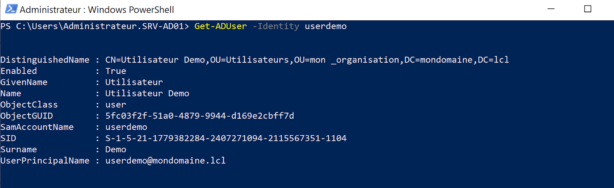
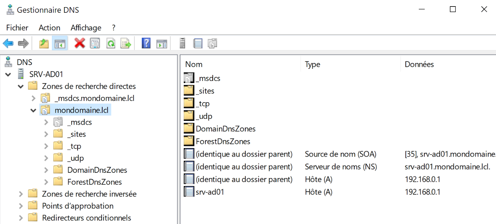
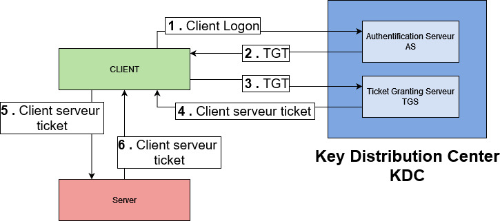

:titre: Protocole LDAP, DNS et Kerberos
:module: Système
:duree: 60
:description: Les protocoles LDAP, DNS et Kerberos sont des protocoles essentiels pour la gestion des annuaires et de l'authentification dans un environnement Active Directory.
include::../../../../adoc/libs/header-module.adoc[]

ifeval::["{visible-on-html}" !=  "yes"]
:docinfo: shared
:docinfodir: ../../../adoc/libs
endif::[]

== Objectifs pédagogiques

// tag::objectifs[]
* Protocole LDAP
* Protocole DNS
* Kerberos
// end::objectifs[]

// tag::deroulement[]
== LDAP

**Lightweight Directory Access Protocol** est un protocole qui permet de gérer des annuaires

include::../../../../adoc/libs/slide-notitle.adoc[]

**Active Directory est un annuaire LDAP**

**Les communications LDAP s’effectuent sur le port 389**, en TCP, du contrôleur de domaine cible.

LDAP fournit à l'utilisateur des méthodes lui permettant de :

* se connecter
* se déconnecter
* rechercher des informations
* comparer des informations
* insérer des entrées
* modifier des entrées
* supprimer des entrées 

include::../../../../adoc/libs/slide-notitle.adoc[]

Chaque objet possède des attributs, LDAP va utiliser ces attributs 

[cols="1,1"]
|===

a| image::./assets/01-ldap-1.jpg[]
a| image::./assets/01-ldap-2.png[]

|===

include::../../../../adoc/libs/slide-notitle.adoc[]

== DNS

L’Active Directory s'appuie sur le DNS : sans DNS l’Active Directory ne fonctionne pas. 

include::../../../../adoc/libs/slide-notitle.adoc[]

Le serveur DNS crée une zone correspondante à votre domaine et enregistre de nombreux enregistrements.

Il y a bien un enregistrement (de type A) pour chaque contrôleur de domaine

Mais il existe une multitude d’enregistrements annexes, indispensables au bon fonctionnement de l’Active Directory :

include::../../../../adoc/libs/slide-notitle.adoc[]

* **Enregistrement pour localiser le « Primary Domain Controller »** : correspondant au contrôleur de domaine qui dispose du rôle FSMO « Émulateur PDC ».
* **Enregistrement pour localiser un contrôleur de domaine qui est catalogue global.**
* **Enregistrement pour localiser les KDC du domaine** (concept abordé au point suivant de ce cours).
* **Enregistrer simplement la correspondance nom/adresse IP des différents contrôleurs de domaine.** Il est également possible de créer un second enregistrement avec les adresses IPv6.
* **Enregistrer les contrôleurs de domaine via le GUID pour assurer la localisation dans toute la forêt.**

== Kerberos

Kerberos est un système de sécurité réseau qui utilise des tickets pour authentifier les utilisateurs :

Chaque DC dispose d’un service de distribution de clés de sécurité

include::../../../../adoc/libs/slide-notitle.adoc[]

**« Centre de distribution de clés (KDC) »** qui réalise deux services :

* **AS (Authentication Service)** : L'utilisateur prouve son identité au service d'authentification et reçoit un ticket-granting ticket (TGT).
* **TGS (Ticket Granting Service)** : Avec le TGT, l'utilisateur peut demander des tickets pour accéder à d'autres services réseau sans devoir se ré-authentifier.

Ce processus permet une connexion sécurisée et simplifiée aux différents services réseau.

include::../../../../adoc/libs/slide-notitle.adoc[]

[NOTE.speaker]
--
Un centre de distribution de clés se compose d'un serveur d'authentification (AS) et d'un serveur d'octroi de billets (TGS). TGT est un billet d'attribution de billets.

1. L'utilisateur saisit l'identifiant et le mot de passe. L'ID de l'utilisateur en clair va au serveur d'authentification (AS) avec une demande de services pour le compte de l'utilisateur.
2. AS vérifie si la connexion de l'utilisateur est dans la base de données. S'il y a des informations sur cet utilisateur, AS peut générer une clé secrète cliente en fonction de l'identifiant et du mot de passe de l'utilisateur. AS envoie à l'utilisateur:
** La clé de session client/TSG (encryptée avec la clé secrète client);
** TGT incluant l'ID de l'utilisateur, l'adresse réseau et la période de validité du ticket - clé de session client/TGS (encryptée avec la clé secrète TGS).
3. L'utilisateur décode le premier message mais ne peut pas décoder le second, car l'utilisateur n'a pas la clé secrète TSG. Le client envoie un message aux TGS:
** Le TGT reçu de la clé secrète TGS/Client (encrypté avec la clé secrète TGS);
** L'authentificateur comprenant l'ID du client et l'horodatage (chiffré avec la clé de session Client/TSG).
4. Le TGS déchiffre le premier message, reçoit la clé de session TGT TGS/Client, avec laquelle il déchiffre le deuxième message. Le TGS vérifie si l'identifiant de l'utilisateur à partir du premier message correspond à l'ID du deuxième message et si l'horodatage ne dépasse pas la période de validité du ticket. Dans le cas où tout va bien, le TSG envoie à l'utilisateur:
** L'identifiant, l'adresse réseau, la période de validation du ticket et la clé de session Client/serveur (chiffrée avec la clé secrète du serveur);
** La clé de session client/serveur (chiffrée avec la clé secrète Client/TGS).
5. Le client envoie ce qui suit au serveur auquel il s'efforce d'accéder:
** L'ID, l'adresse réseau, la période de validation du ticket et la clé de session client/serveur (chiffrée avec une clé secrète cryptée avec la clé secrète du serveur);
** L'authentificateur comprenant l'ID et l'horodatage (chiffré avec la clé de session client/serveur).
6. Le serveur ciblé déchiffre les messages de l'utilisateur, vérifie si l'ID de l'utilisateur à partir des deux messages ont la même valeur et si la période de validité n'est pas dépassée, puis envoie au client le paramètre suivant pour confirmer son identité:
** Timestamp no 1 (encrypté avec la clé de session client/serveur).

Le client vérifie si la valeur de l'horodatage est l'horodatage '1, ce qui montre la véritable identité du serveur. Si c'est le cas, le client peut faire confiance au serveur et commencer à travailler avec lui.
--
// end::deroulement[]

== Conclusion
// tag::conclusion[]
* Compréhension des principaux protocoles qui interviennent au niveau de l’Active Directory
// end::conclusion[]