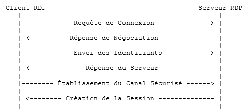
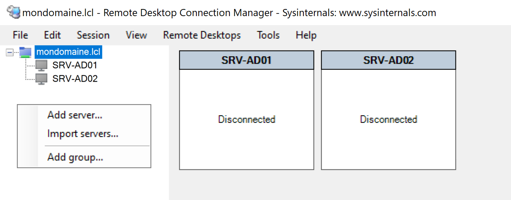

:titre: Protocole RDP
:module: Système
:duree: 60
:description: Le protocole RDP (Remote Desktop Protocol) est un protocole de communication développé par Microsoft. Il permet à un utilisateur de se connecter à un serveur exécutant un service Bureau à distance (Remote Desktop Services) et d'y accéder comme s'il était sur place.
include::../../../../adoc/libs/header-module.adoc[]

ifeval::["{visible-on-html}" !=  "yes"]
:docinfo: shared
:docinfodir: ../../../adoc/libs
endif::[]

== Objectifs pédagogiques

// tag::objectifs[]
* Qu'est-ce que le protocole RDP.
* Établissement de la connexion
* Transmission de Données Compression et Chiffrement
* Fonctionnalités avancées et la sécurité.
* Activation et mise en place
// end::objectifs[]

// tag::deroulement[]
== Qu'est-ce que le protocole RDP

**RDP : Remote Desktop Protocol**

Protocole propriétaire Microsoft, permet de se connecter à distance à une autre machine, RDP utilise une architecture client-serveur

include::../../../../adoc/libs/slide-notitle.adoc[]

* **Client RDP** : Application qui permet à l'utilisateur de se connecter à un serveur RDP. 
* **Serveur RDP** : Le service ou l'application qui reçoit et gère les connexions RDP. Sous Windows, c'est généralement le service "Remote Desktop Services" (RDS). (abordé au chapitre suivant)

**[red]#Important ne pas confondre le "Bureau à distance" et les "Services bureau à distance"#**

== Établissement de la connexion

=== Initiation de la Connexion :

* Le client RDP envoie une requête de connexion au serveur via le port TCP 3389.
* Le serveur écoute sur ce port pour les connexions entrantes.

=== Négociation de la Session :

* Le serveur et le client négocient les paramètres de connexion, incluant la version du protocole RDP à utiliser.
* Cela comprend également les paramètres de sécurité comme le type de chiffrement.

=== Authentification :

* Le client envoie les informations d'authentification (nom d'utilisateur, mot de passe, domaine).
* Le serveur vérifie les informations d'identification. Si la validation est réussie, il procède à la création de la session.

=== Création de la Session :

* Le serveur initialise une session utilisateur.
* Préparation de l'environnement de bureau, chargement des préférences de l'utilisateur, des applications nécessaires, etc.

=== Établissement du Canal de Communication :

* Une fois authentifié, le client et le serveur établissent un canal sécurisé pour la transmission des données.
* Le chiffrement SSL/TLS est utilisé pour sécuriser les données échangées

== Transmission de Données Compression et Chiffrement

**Compression :**

* Optimisation de la bande passante, les données envoyées via RDP sont compressées. Les commandes graphiques et les entrées utilisateur sont compressées avant d'être transmises.

**Chiffrement :**

* RDP utilise plusieurs niveaux de chiffrement pour sécuriser les données. Le chiffrement SSL/TLS protège contre l'interception des données sensibles.

include::../../../../adoc/libs/slide-notitle.adoc[]

**Données Graphiques :**

* Plutôt que de transmettre des images complètes de l'écran, RDP envoie des commandes graphiques (GDI - Graphics Device Interface). Le client utilise ces commandes pour rendre l'interface utilisateur localement.

**Entrées Utilisateur :**

* Les entrées clavier et souris de l'utilisateur sont capturées par le client RDP et transmises au serveur. Le serveur traite ces entrées et renvoie les mises à jour graphiques correspondantes.

== Fonctionnalités avancées RDP

**Utilisation du Protocole TCP et UDP :**

* TCP est utilisé pour les transmissions nécessitant une fiabilité élevée, comme les commandes et les données critiques.
* UDP est utilisé pour des transmissions nécessitant une latence plus faible, comme les flux multimédias.

**Redirection de Périphériques :**

* Les périphériques locaux (comme les imprimantes, les lecteurs de disque, etc.) peuvent être redirigés pour être utilisés dans la session distante.

include::../../../../adoc/libs/slide-notitle.adoc[]

**Accélération Graphique :**

* **RemoteFX** : Fournit une meilleure performance pour les applications 3D et les vidéos en utilisant des ressources GPU côté serveur.
* **AVC/H.264** : Utilisé pour compresser et transmettre des flux vidéo en HD

**Optimisation de la Bande Passante**

* **Adaptive Display** : Ajuste dynamiquement la qualité d'affichage en fonction de la bande passante disponible.
* **Compression Différentielle** : Envoie uniquement les parties de l'écran qui ont changé, réduisant ainsi la quantité de données transmises.
* **Cache Persistant** : Les objets graphiques sont mis en cache localement 

include::../../../../adoc/libs/slide-notitle.adoc[]

**Virtualisation**

* **Hyper-V Intégration** : Permet de gérer et d'accéder aux VMs hébergées sur des serveurs Hyper-V via RDP.
* **VDI (Virtual Desktop Infrastructure)** : Accéder à des bureaux virtuels hébergés dans un centre de données. 
* **Redirection GPU** : Les VMs peuvent accéder aux capacités GPU physiques pour des applications nécessitant des ressources graphiques intensives.

**Fonctionnalités de Collaboration**

* **Partage de Session** : Un utilisateur peut partager sa session RDP avec un autre utilisateur pour une collaboration en temps réel.
* **Assistance à Distance** : Les administrateurs peuvent se connecter aux sessions utilisateur pour résoudre des problèmes en temps réel.

include::../../../../adoc/libs/slide-notitle.adoc[]

**Sécurité Avancée**

* **Authentification au Niveau du Réseau (NLA)** : Oblige les utilisateurs à s'authentifier avant d'établir une connexion complète, réduisant ainsi le risque d'attaques par force brute.
* **Chiffrement SSL/TLS** : Les données transmises via RDP peuvent être chiffrées avec des protocoles de sécurité standards comme SSL et TLS.
* **Smart Cards** : Prend en charge l'authentification par carte à puce, permettant une sécurité renforcée pour les connexions RDP.
* **Politiques de Groupe (GPO)** : Les administrateurs peuvent configurer des politiques de sécurité via les objets de politique de groupe (GPO) pour contrôler les paramètres RDP.

include::../../../../adoc/libs/slide-notitle.adoc[]

**Optimisation de la Bande Passante**

* **Adaptive Display** : Ajuste dynamiquement la qualité d'affichage en fonction de la bande passante disponible.
* **Compression Différentielle** : Envoie uniquement les parties de l'écran qui ont changé, réduisant ainsi la quantité de données transmises.
* **Cache Persistant** : Les objets graphiques sont mis en cache localement pour éviter les transmissions répétées.

== Activation et mise en place

Pour disposer d'un accès en Bureau à distance sur une machine, il y a deux options 

* Être Administrateur (du domaine ou de la machine)
* Être membre du groupe "Utilisateurs du Bureau à distance"

=== Activation sur un serveur

[cols="1,1"]
|===
a| image::./assets/01-activation-1.png[]
a| image::./assets/01-activation-2.png[]
|===

== Connexion et outils

Pour ouvrir une session RDP, deux possibilités

=== Commande `MSTSC.exe`

image::./assets/06-connexion.png[,,300px]

Afficher les options permet de paramétrer la connexion

* Saisir l’adresse IP ou le nom DNS de la machine cible
* Saisir l’identifiant mot de passe du compte de connexion

=== Utiliser un outil de gestion

Cela évite de mémoriser toutes les machines

https://learn.microsoft.com/en-us/sysinternals/downloads/rdcman?WT.mc_id=AZ-MVP-5004580[Remote Desktop Connection Manager (Microsoft)]

// tag::demo[]
== Démonstration

**RDP**

[NOTE.speaker]
--
* Montrer l’activation de RDP sur un serveur
* Autoriser un simple utilisateur à se connecter au serveur
* Montrer côté client la même activation 
* Établir une connexion depuis le client vers le serveur avec mstsc 
* Montrer toutes les options avancées de mstsc
* Montrer le gestionnaire de connexion RDCM
--
// end::demo[]
// end::deroulement[]

== Conclusion
// tag::conclusion[]
* Vous êtes en mesure de comprendre le rôle du protocole RDP, et de son mode de fonctionnement
* Vous savez comment l’activer sur un serveur ou un poste client et gérer les autorisations d'accès afin d’établir qui a le droit de se connecter au Bureau à distance
// end::conclusion[]
