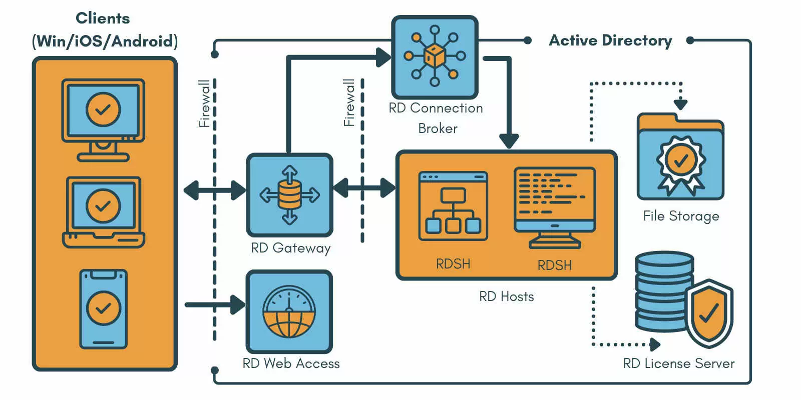

:titre: Principe du RDS : Remote Desktop Services
:module: Système
:duree: 60
:description: Le protocole RDS est un protocole de communication développé par Microsoft. Il permet à un utilisateur de se connecter à un serveur exécutant un service Bureau à distance (Remote Desktop Services) et d'y accéder comme s'il était sur place.
include::../../../../adoc/libs/header-module.adoc[]

ifeval::["{visible-on-html}" !=  "yes"]
:docinfo: shared
:docinfodir: ../../../adoc/libs
endif::[]

== Objectifs pédagogiques

// tag::objectifs[]
* RDS c’est quoi ?
* Les composants RDS
* Fonctionnement de RDS
// end::objectifs[]

// tag::deroulement[]
== RDS c'est quoi ?

**RDS (Remote Desktop Services)**

Anciennement TSE Terminal Services, fonctionnalité Windows Server qui utilise le protocole RDP et permet aux utilisateurs de se connecter et d'utiliser des applications ou des bureaux hébergés sur un serveur distant.

=== Pré-requis

* **Serveur Windows** : RDS peut être installé sur Windows Server. Les versions courantes incluent Windows Server 2016, 2019, et 2022.
* **Active Directory** : Un domaine Active Directory doit être configuré pour gérer les utilisateurs et les groupes.
* **Certificats SSL** : Pour sécuriser les communications RDS, des certificats SSL sont nécessaires.

== Composants RDS

include::../../../../adoc/libs/slide-notitle.adoc[]

**Remote Desktop Session Host (RDSH) :**

* Héberge des sessions de bureau partagées ou des applications. Chaque utilisateur se connecte à une session distincte

**Remote Desktop Virtualization Host (RDVH) :**

* Héberge des machines virtuelles dans un environnement de bureau virtuel. Chaque utilisateur se connecte à sa propre VM.

**Remote Desktop Connection Broker (RDCB) :**

* Gère la répartition de charge et la redirection des connexions vers le bon serveur RDSH ou RDVH. 

include::../../../../adoc/libs/slide-notitle.adoc[]

**Remote Desktop Web Access (RDWA) :**

* Permet d'accéder à des applications distantes et à des bureaux via un portail web.

**Remote Desktop Gateway (RDG) :**

* Permet de se connecter à des ressources RDS via Internet en utilisant le protocole RDP sur HTTPS

**Remote Desktop Licensing (RDL) :**

* Gère les licences des utilisateurs ou des périphériques se connectant aux services RDS.

== Fonctionnement de RDS

include::../../../../adoc/libs/slide-notitle.adoc[]

**Connexion Initiale :**

* Un utilisateur utilise un client RDP pour se connecter à un serveur RDG 
* Le RDG authentifie l'utilisateur et dirige la connexion vers le RDCB.

**Redirection et Répartition de Charge :**

* Le RDCB détermine quel serveur RDSH ou RDVH est le plus approprié pour la connexion.
* L'utilisateur est ensuite redirigé vers ce serveur pour démarrer une session.

include::../../../../adoc/libs/slide-notitle.adoc[]

**Accès aux Applications et Bureaux :**

* Via RDWA, les utilisateurs peuvent accéder à un portail web où ils peuvent lancer des applications distantes ou des sessions de bureau.
* Les applications et bureaux sont exécutés sur le serveur RDSH ou dans une VM sur RDVH.

**Gestion des Licences :**

* RDL s'assure que chaque utilisateur ou périphérique est correctement licencié pour accéder aux services RDS.

include::../../../../adoc/libs/slide-notitle.adoc[]

[NOTE.speaker]
--
**Connexion Initiale :**

* Un utilisateur utilise un client RDP pour se connecter à un serveur RDG 
* Le RDG authentifie l'utilisateur et dirige la connexion vers le RDCB.

**Redirection et Répartition de Charge :**

* Le RDCB détermine quel serveur RDSH ou RDVH est le plus approprié pour la connexion.
* L'utilisateur est ensuite redirigé vers ce serveur pour démarrer une session.

**Accès aux Applications et Bureaux :**

* Via RDWA, les utilisateurs peuvent accéder à un portail web où ils peuvent lancer des applications distantes ou des sessions de bureau.
* Les applications et bureaux sont exécutés sur le serveur RDSH ou dans une VM sur RDVH.

**Gestion des Licences :**

* RDL s'assure que chaque utilisateur ou périphérique est correctement licencié pour accéder aux services RDS.
--
// end::deroulement[]

== Conclusion
// tag::conclusion[]
* Vous êtes en mesure de comprendre la différence entre RDP et RDS 
* De connaître les briques principales qui composent un serveur RDS ainsi que l'interaction entre ces différentes briques 
// end::conclusion[]