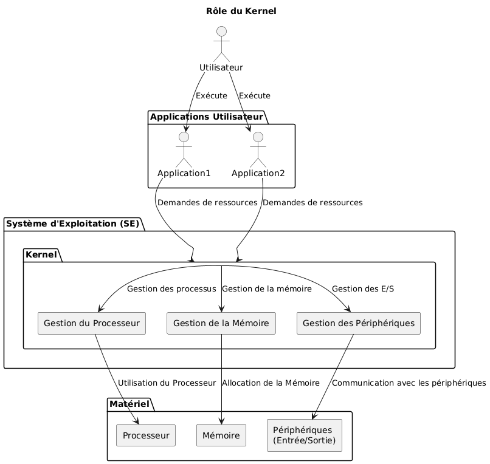
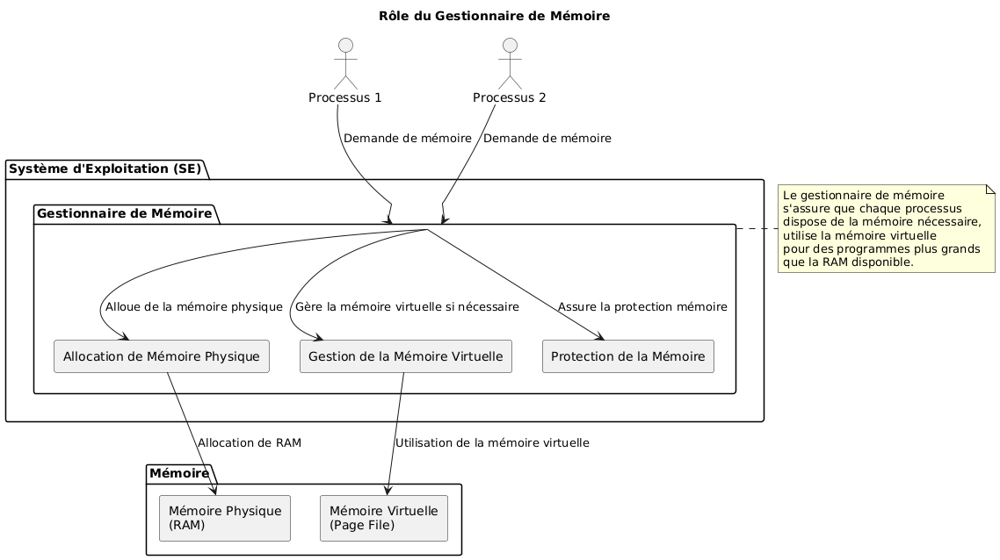
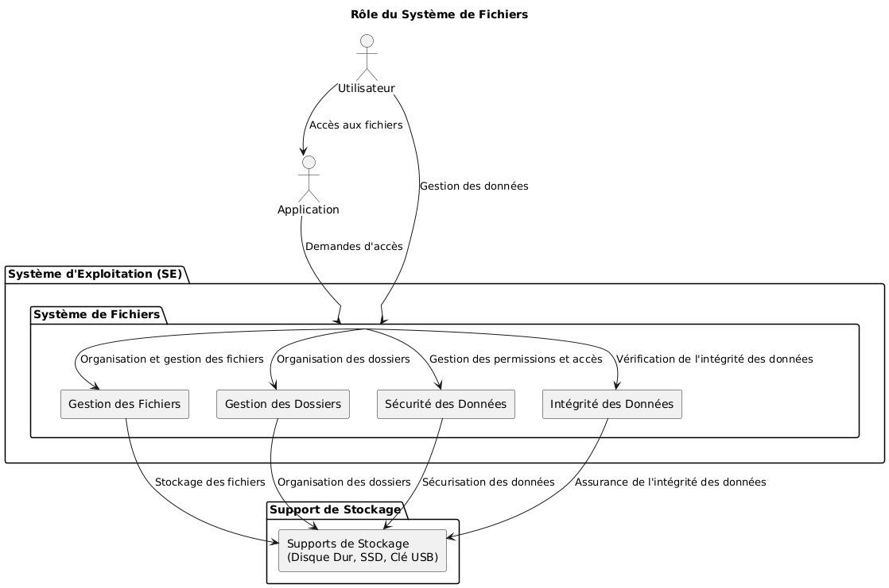
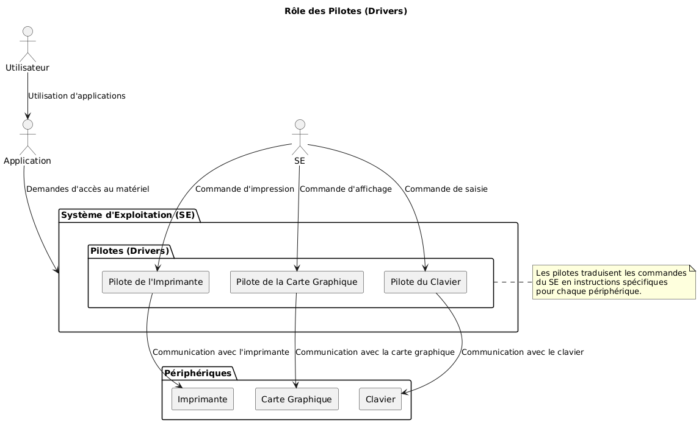
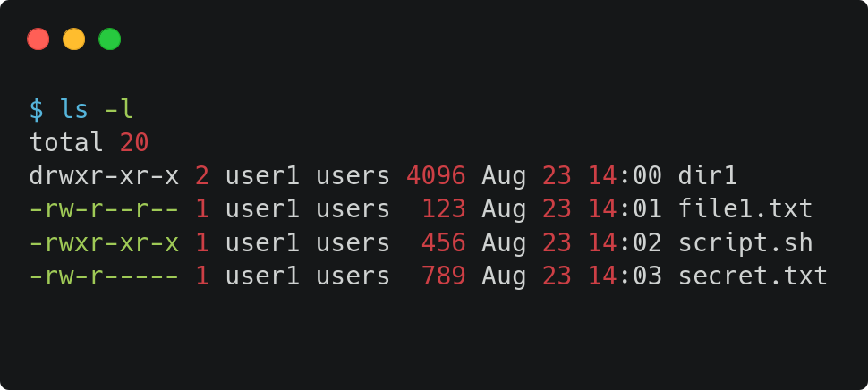
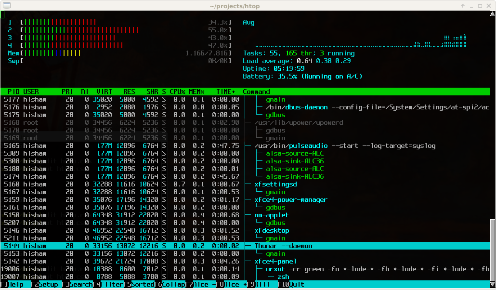

:titre: Remise à niveau informatique
:module: Système
:duree: 165
:description: Architecture des OS, administration de base, virtualisation, démo de VM
include::../../../../adoc/libs/header-module.adoc[]

ifeval::["{visible-on-html}" !=  "yes"]
:docinfo: shared
:docinfodir: ../../../adoc/libs
endif::[]

== Objectifs pédagogiques

// tag::objectifs[]
* Comprendre l'architecture des systèmes d'exploitation et leurs composantes principales.
* Maîtriser les bases de l'administration système pour un environnement sécurisé.
* Explorer les concepts de virtualisation et leur rôle dans les infrastructures modernes.
// end::objectifs[]

// tag::deroulement[]
== Architecture des systèmes d'exploitation

=== Le noyau (Kernel)

* Cœur du système d’exploitation
* Responsable de la gestion des ressources matérielles telles que le processeur, la mémoire et les périphériques d’entrée/sortie
* Pont entre le matériel et les logiciels applicatifs
* Facilite l’exécution des tâches en mode utilisateur tout en gérant les interruptions et le multitâche

include::../../../../adoc/libs/slide-notitle.adoc[]

=== Le gestionnaire de mémoire (Memory manager)

* Contrôle l’allocation et la gestion de la mémoire vive (RAM)
* S’assure que chaque processus a un espace mémoire sécurisé
* Gère la mémoire virtuelle pour permettre l’exécution de programmes plus grands que la mémoire physique disponible

include::../../../../adoc/libs/slide-notitle.adoc[]

=== Système de fichiers (File System)

* Organise et stocke les données sur des supports de stockage comme les disques durs
* Fournit une structure hiérarchique pour accéder et gérer les fichiers et les dossiers
* Assure la sécurité et l’intégrité des données

include::../../../../adoc/libs/slide-notitle.adoc[]

=== Pilotes ou drivers

* Programmes qui permettent au système d’exploitation de communiquer avec le matériel
* Traduisent les commandes du système d’exploitation en instructions spécifiques pour les périphériques, comme les imprimantes, cartes graphiques, claviers…

include::../../../../adoc/libs/slide-notitle.adoc[]

=== Interfaces utilisateur (UI)

* Peuvent être en mode texte (CLI - command line interface) ou graphiques (GUI - graphical user interface)
* Permettent aux utilisateurs d’interagir avec le système et d’exécuter des commandes ou des applications

=== Types de systèmes d’exploitation

* Monolithique : 
  ** Tous les services sont intégrés dans un noyau unique
  ** Communication rapide entre les composants
  ** Problèmes potentiels de fiabilité et de sécurité en raison du manque de modularité

include::../../../../adoc/libs/slide-notitle.adoc[]

* Micro-noyau (microkernel) :
  ** Minimaliste, ne comprend que les fonctionnalités essentielles
  ** Les autres services sont exécutés en espace utilisateur
  ** Améliore la sécurité et la stabilité mais peut impacter les performances

include::../../../../adoc/libs/slide-notitle.adoc[]

* Hybride :
  ** Combine les deux types précédents
  ** Peut inclure des modules gérés séparément
  ** Bon compromis entre performance et modularité

== Administration de base

=== Gestion des utilisateurs et des groupes

* **Utilisateurs** :
  ** Chaque utilisateur est identifié par un nom d’utilisateur et un identifiant unique
  ** Les administrateurs doivent pouvoir créer, modifier et supprimer des comptes utilisateur en fonction des besoins

include::../../../../adoc/libs/slide-notitle.adoc[]

* **Groupes** :
  ** Permettent de regrouper plusieurs utilisateurs pour gérer les permissions de manière collective
  ** Les administrateurs doivent pouvoir créer, modifier et supprimer des groupes

* Exemple :
  ** Commandes `adduser`, `addgroup`, `usermod`, `groupmod`, `deluser`, `delgroup` dans un environnement Debian

=== Gestion des permissions

* Les permissions déterminent quels utilisateurs ou groupes peuvent accéder ou modifier des fichiers et répertoires
* Elles sont définies pour le propriétaire, le groupe, et les autres utilisateurs
* Incluent des droits de lecture, écriture et exécution

=== Supervision des ressources

* Permet de gérer les ressources système
* Permet de détecter les problèmes potentiels liés à la consommation excessive de ressources ou aux processus non réactifs

== Virtualisation

=== Types de virtualisation

* **Virtualisation complète** :
  ** Permet d’émuler un matériel complet pour simuler le fonctionnement du système dans des conditions réelles
  ** L’hyperviseur gère l’accès aux ressources matérielles
  ** Les machines virtuelles peuvent fonctionner avec un système d’exploitation totalement indépendant du système hôte

* **Paravirtualisation** :
  ** L’OS invité est modifié pour interagir directement avec l’hyperviseur
  ** Améliore les performances mais nécessite des modifications sur l’OS hôte

include::../../../../adoc/libs/slide-notitle.adoc[]

* **Conteneurisation** :
  ** Isole les applications en utilisant des conteneurs légers
  ** Les conteneurs partagent le noyau du système hôte mais sont isolés les uns des autres
  ** Permet d’avoir une grande densité d’applications avec un overhead minimal

=== Hyperviseurs

* **Hyperviseur de Type 1 (Bare-Metal)** :
  ** Fonctionne directement sur le matériel physique
  ** Gère les ressources matérielles et exécute les machines virtuelles
  ** Plus performant et sécurisé car il n’a pas besoin d’un hôte
  ** Exemples : VMWare ESXi, Hyper-V, Xen

* **Hyperviseur de Type 2 (Hébergé)** :
  ** Fonctionne sur un système hôte et en gère ses machines virtuelles
  ** Plus facile à installer et utiliser, mais peut être moins performant
  ** Exemples : VMWare WorkStation, Oracle Virtualbox, Parallels Desktop

// tag::demo[]
== 📋 Démonstration : Installation et configuration d’une VM

Le but de cette démonstration est de montrer l’utilisation d’un hyperviseur, l’installation d’un OS sur une VM et l’explication de certains concepts.

[NOTE.speaker]
--
* Choisir l’hyperviseur de votre choix
* Créer une nouvelle VM et installer Debian
* Montrer la version du kernel avec `uname -r`
* Montrer l’utilisation de la mémoire avec `free -h`
* Montrer l’utilisation de l’espace disque avec `df -h`
* Montrer et expliquer quelques pilotes à l’aide de `lsmod`
* Montrer quelques commandes de base (`ls`, `cd`, `mkdir`)
* Ajouter un utilisateur, un groupe et ajouter l’utilisateur au groupe
* Modifier quelques permissions dans des fichiers d’exemple
* Montrer le rendu de la commande `htop`
--
// end::demo[]
// end::deroulement[]

== 📝 Conclusion
// tag::conclusion[]
* Compréhension de l'architecture des systèmes d'exploitation et leurs composantes principales
* Maîtrise des bases de l'administration système pour un environnement sécurisé
* Connaissances des concepts de virtualisation et leur rôle dans les infrastructures modernes
// end::conclusion[]