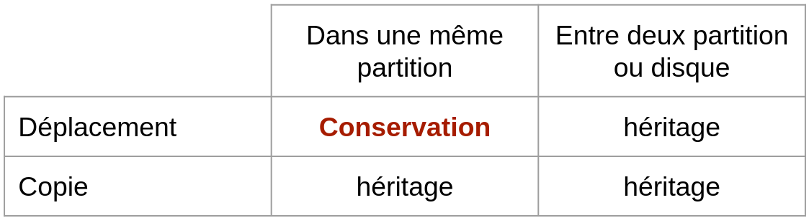
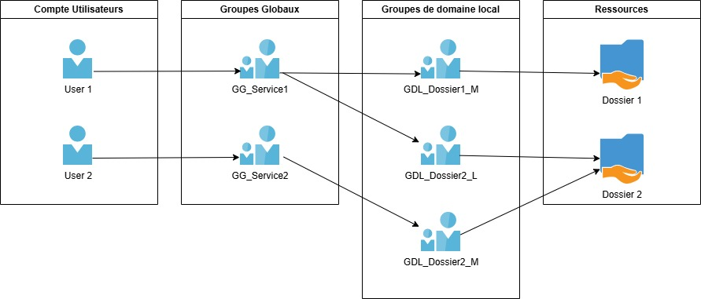

:titre: Ressources et autorisations NTFS
:module: Système
:duree: 45
:description: Comprendre le fonctionnement de NTFS et les autorisations associées
include::../../../../adoc/libs/header-module.adoc[]

ifeval::["{visible-on-html}" !=  "yes"]
:docinfo: shared
:docinfodir: ../../../adoc/libs
endif::[]

== Objectifs pédagogiques

// tag::objectifs[]
* Ressources et autorisations NTFS
* Partage de fichiers
* Méthode AGDLP Account Global Domain Local Permissions
// end::objectifs[]

// tag::deroulement[]
== Ressources et autorisations

=== Les ressources

Le **partage** de ressources fichiers, dossiers ou imprimantes est un service nécessaire aux utilisateurs.

Sa mise en œuvre doit respecter des exigences de **disponibilité** et de **sécurité**.

=== Les autorisations

* Les autorisations NTFS permettent de définir quels sont les **privilèges d’accès**
* **Tous les dossiers et fichiers** d’un volume formaté en NTFS/ReFS y sont soumis
* Elles sont visualisables et/ou modifiables depuis l’onglet **Sécurité** des éléments

=== Les caractéristiques des autorisations NTFS

Deux niveaux de gestion sont disponibles :

* Les autorisations **de base**
* Les autorisations **avancées**

La gestion des permissions est basée sur des règles **explicites**.

* Plusieurs règles d’accès peuvent s’appliquer à un même utilisateur.
* Chaque règle peut accorder des privilèges ou les ôter.
* Le mécanisme d’**héritage** s’applique aux autorisations positionnées sur des dossiers et s’appliquent aux objets enfants

Une règle de **refus** peut être explicite ou implicite.

include::../../../../adoc/libs/slide-notitle.adoc[]

Les autorisations de base permettent de donner les privilèges suivants : 

* liste de contenu
* lecture + exécution
* écriture
* modification
* contrôle total

include::../../../../adoc/libs/slide-notitle.adoc[]

Les autorisations avancées permettent de donner les privilèges suivants : 

* Appropriation
** Lecture des attributs étendus
* Création de fichiers
** modifier les autorisations
* Création de dossiers
** suppression
* Écriture des attributs étendus
** suppression de sous-dossier et de fichier

include::../../../../adoc/libs/slide-notitle.adoc[]

La notion d’héritage s’applique par défaut aux autorisations NTFS positionnées sur des dossiers.

Il est conseillé d’affecter ces autorisations en partant de la racine de l'arborescence afin de bénéficier de l’héritage.

L’héritage peut être rompu sur un point d’arborescence ou re-propagé à partir d’un élément.

**Attention aux droits lors de la copie ou du déplacement d’un élément**

include::../../../../adoc/libs/slide-notitle.adoc[]

== Partage de fichiers

include::../../../../adoc/libs/slide-notitle.adoc[]

La notion de partage vient en complément des autorisations NTFS

* une machine disposant de partages a le rôle de serveur de fichiers
* Les autorisations de partage permettent de définir qui aura accès à la ressource 

Trois types de privilèges de partage sont disponibles avec pour chacune les permissions Autorisé ou Refusé :

* Lecture
* modification
* Contrôle total

Les règles de contrôle d’accès sont cumulatives et les **refus prioritaires**

include::../../../../adoc/libs/slide-notitle.adoc[]

Dans la pratique on ne gère pas les droits d'accès à une ressource au travers des autorisations de partage, ceci est le rôle des permissions NTFS

**L’accès au partage sera de la forme oui / non en Contrôle total pour les utilisateurs authentifiés** 

* Une fois un partage créé, il est possible de le **publier** dans l’AD.

L’objet **Partage** est soit lié à :

* **L’objet ordinateur** auquel il est associé.
* **Indépendant** et peut être déplacé dans une UO dédiée.

La publication de partage facilite la recherche pour les utilisateurs depuis leur poste client avec la fonction **Rechercher dans Active Directory**

== Méthode AGDLP

Microsoft préconise l’imbrication de groupes pour gérer l’accès aux ressources 

Méthode AGDLP : _Account Global Domain Local Permissions_

include::../../../../adoc/libs/slide-notitle.adoc[]

* Affecter les utilisateurs dans des Groupes globaux 
* Ajouter les Groupes globaux aux Groupes de Domaine Locaux
** on génère un groupe par type de privilège pour chaque ressource
* Enfin, ces groupes sont utilisés pour attribuer des permissions NTFS sur les partages, dossiers ou fichiers.

include::../../../../adoc/libs/slide-notitle.adoc[]

// tag::demo[]
== Démonstration

**NTFS et partage de fichiers**

[NOTE.speaker]
--
* montrer les droits NTFS d’un fichier
* expliquer en prenant un exemple les bonnes et mauvaises pratiques concernant la mise en place AGDLP
--
// end::demo[]
// end::deroulement[]

== Conclusion
// tag::conclusion[]
* Compréhension de ce que sont les permissions NTFS
* Capacité à expliquer le modèle AGDLP
// end::conclusion[]