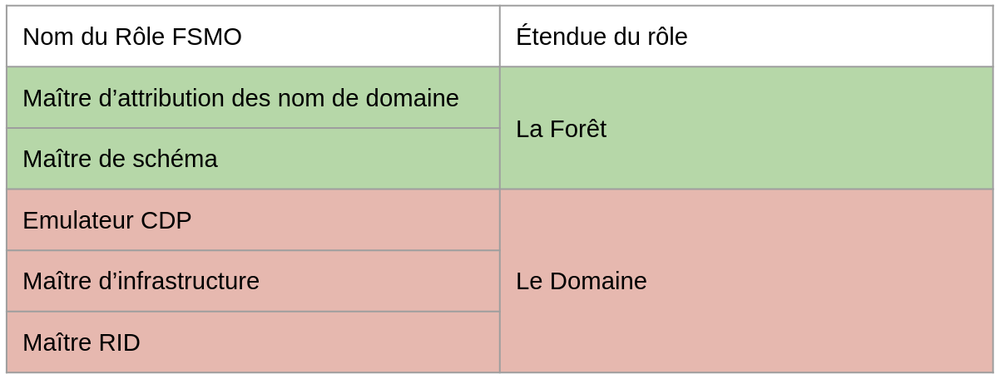
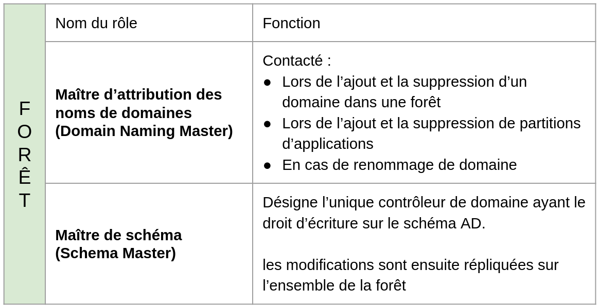
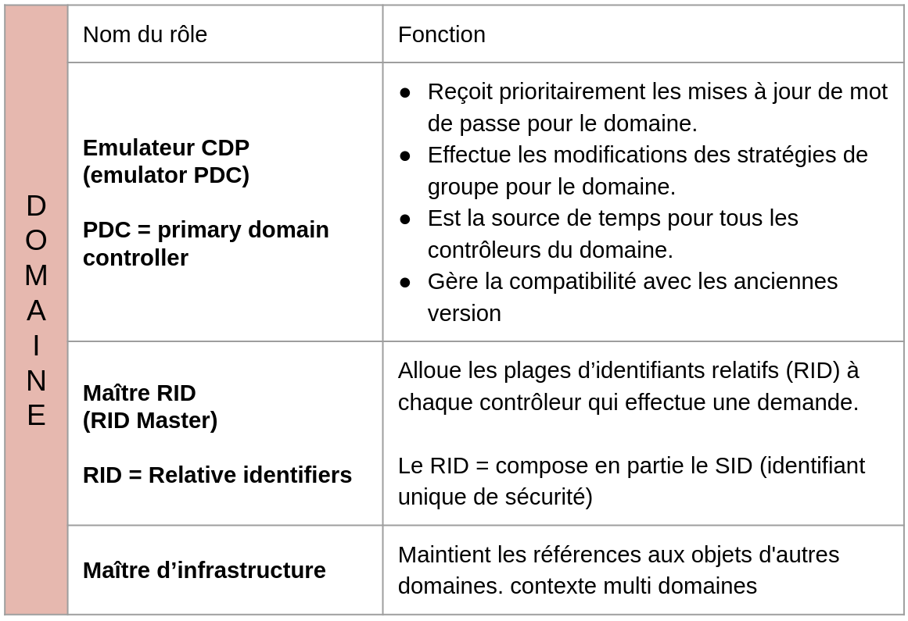
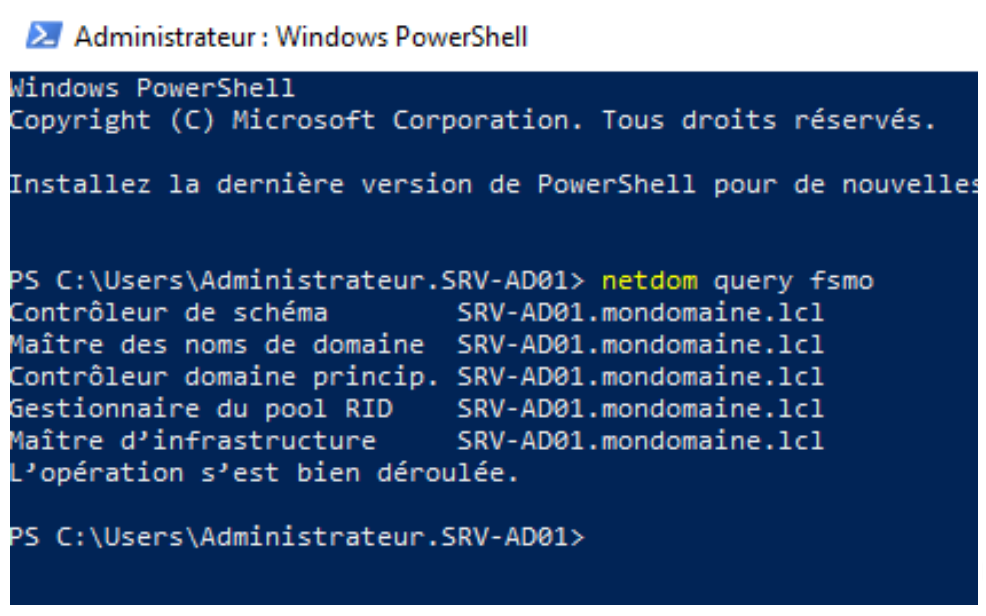
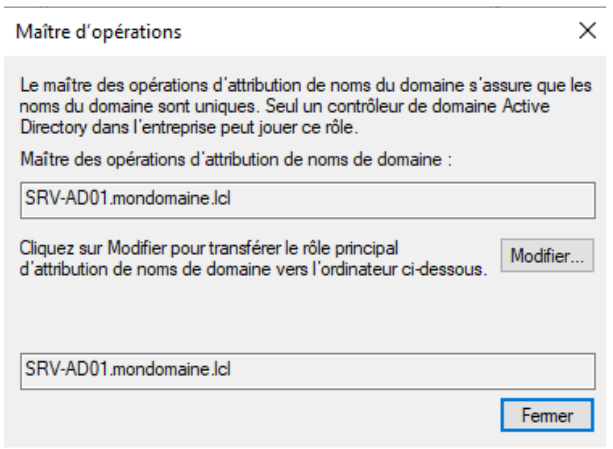
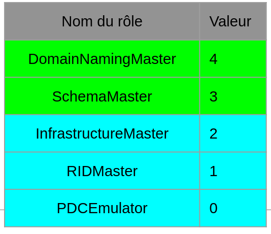
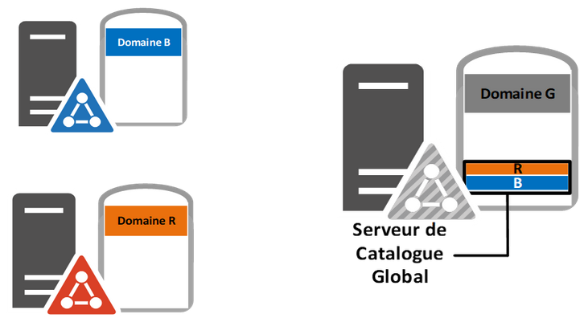

:titre: Les Rôles FSMO
:module: Système
:duree: 90
:description: Les rôles FSMO sont des rôles de maîtrise de l'opération de domaine et de forêt qui sont nécessaires pour effectuer des opérations spécifiques dans un domaine ou une forêt Active Directory.
include::../../../../adoc/libs/header-module.adoc[]

ifeval::["{visible-on-html}" !=  "yes"]
:docinfo: shared
:docinfodir: ../../../adoc/libs
endif::[]

== Objectifs pédagogiques

// tag::objectifs[]
* Définir ce que sont les rôles FSMO
* Voir les rôles liés à la Forêt AD
* Voir les Rôles liés au domaine AD
* Comprendre comment on  identifie, on transfert et récupère les rôles FSMO entre contrôleur de domaine
* Qu’est que le Catalogue Global d’un Contrôleur de domaine
// end::objectifs[]

// tag::deroulement[]
== Que sont les Rôles FSMO ?

=== Définition des Rôles FSMO (Flexible Single Master Operations)

* **Rôles FSMO** : Rôles critiques dans Active Directory (AD) centralisant des opérations clés.
* **Objectif** : Garantir la cohérence et l'intégrité des données dans l'environnement AD.
* **Répartition** : Distribués entre différents contrôleurs de domaine pour éviter les conflits et assurer une gestion efficace.
* **Nombre de Rôles** : Cinq rôles FSMO distincts.

=== Importance des Rôles FSMO

* Gestion Cruciale : Essentiels pour la bonne gestion et la stabilité de l'infrastructure AD.
* Centralisation : Permettent de centraliser des opérations critiques.
* Prévention des Conflits : Aident à éviter les conflits et assurent la cohérence des données sur tout le réseau.

include::../../../../adoc/libs/slide-notitle.adoc[]

* 5 rôles de maître d’opération ou FSMO sont hébergés sur un contrôleur unique à l’échelle du domaine ou de la forêt



Ces rôles peuvent être dispatchés entre différents contrôleurs
Initialement ces rôles sont hébergés par: 

Le 1er CD du domaine racine de la forêt => 5 rôles

Le 1er CD d’un nouveau domaine => 3 rôles de domaine

== Les rôles liés à la Forêt AD

=== Les Rôles uniques au niveau de la Forêt 



== Les Rôles liés au domaine AD

=== Les Rôles uniques au niveau du domaine



== Identifier, Transférer  et récupérer les rôles

include::../../../../adoc/libs/slide-notitle.adoc[]

la command `Netdom query FSMO` permet de Lister quel contrôleur héberge les rôles FSMO



include::../../../../adoc/libs/slide-notitle.adoc[]

* Le transfert de rôle est possible uniquement si le contrôleur d’origine est toujours joignable
* La récupération si le contrôleur propriétaire du rôle n’est plus accessible est possible [red]#mais ce serveur ne devra plus jamais être remis en ligne.#
 
La Console Schéma Active Directory pour le rôle : **Maître de schéma**

**[red]#Attention La console est schéma Active Directory n’est pas visible par défaut#**

include::../../../../adoc/libs/slide-notitle.adoc[]

1. Activer une DLL “démarrer / exécuter” : `regsvr32 schmmgmt.dll`
2. Depuis la console MMC ajouter le composant logiciel enfichable : Schéma Active Directory

[cols="1,1"]
|===

a| image::./assets/04-schema-1.png[]
a| image::./assets/04-schema-2.png[]

|===

include::../../../../adoc/libs/slide-notitle.adoc[]

Domaine et approbations pour le rôle : Maître d’attribution des noms de domaine

[cols="1,1"]
|===

a| image::./assets/04-domaine-1.png[]
a| image::./assets/04-domaine-2.png[]

|===

include::../../../../adoc/libs/slide-notitle.adoc[]



include::../../../../adoc/libs/slide-notitle.adoc[]

Utilisateurs et ordinateurs AD pour les rôles :

* Emulateur CDP
* Maître RID
* Maître d’infrastructure

[cols="1,1"]
|===

a| image::./assets/04-ad-1.png[]
a| image::./assets/04-ad-2.png[]

|===

include::../../../../adoc/libs/slide-notitle.adoc[]

Depuis PowerShell :

Rôles au niveau de la forêt

`Get-ADForest | fl *master`

Rôles au niveau du domaine

`Get-ADDomain | fl pdc*,*master`

Afficher les rôles au niveau de la forêt

`Get-ADForest | select *master`

Afficher les rôles au niveau du domaine

`Get-ADDomain | select pdc*,*master`

include::../../../../adoc/libs/slide-notitle.adoc[]

pour déplacer un ou plusieurs rôles

```powershell
Move-ADDirectoryServerOperationMasterRole -Identity ‘SRV-AD01’-OperationMasterRole 0,1
```



== Catalogue global

Un **contrôleur de domaine** qui stock des informations de tous les autres domaines de sa forêt est appelé **serveur de catalogue global**.

* Les informations sont stockées au moyen de partitions logiques supplémentaires et accessibles en lecture seule
* Le catalogue global contient l’intégralité des objets de la forêt mais un nombre limité d’attributs est utilisé pour ces objets
* Il est recommandé de rendre **tous** les contrôleurs de domaine serveurs de catalogue global

include::../../../../adoc/libs/slide-notitle.adoc[]

Lors de la promotion du contrôleur de domaine

**graphique** : option **Catalogue global** pendant la phase de configuration, cochée par défaut sur le 1er contrôleur

**PowerShell** : le catalogue global est activé **par défaut** et paramétrable avec l’option `-NoGlobalCatalog`

Configuration dans la console **Sites et services Active Directory**

* Afficher la page de propriétés NTDS Settings du contrôleur de domaine
* Case à cocher Catalogue global

include::../../../../adoc/libs/slide-notitle.adoc[]



// tag::demo[]
== Démonstration

**Rôle FSMO**

[NOTE.speaker]
--
* montrer les roles FSMO présents : `netdom query fsmo`
* migrer chacun des rôles vers le srv-ad02 
* faire un netdom query fsmo apres chaque migration pour montrer le resultat
--
// end::demo[]
// end::deroulement[]

== Conclusion
// tag::conclusion[]
Vous devez être en mesure d’appréhender les différents rôles FSMO, de savoir a quoi sert chacun et de les manipuler au besoin en les déplaçant d’un contrôleur de domaine à un autre
// end::conclusion[]