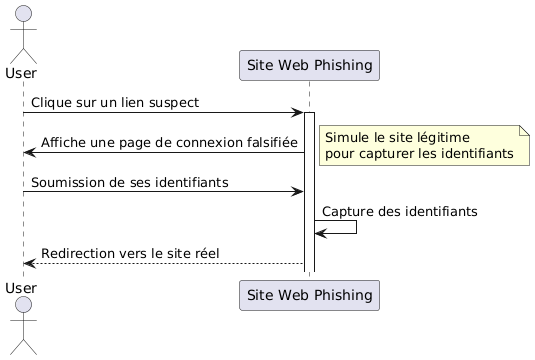
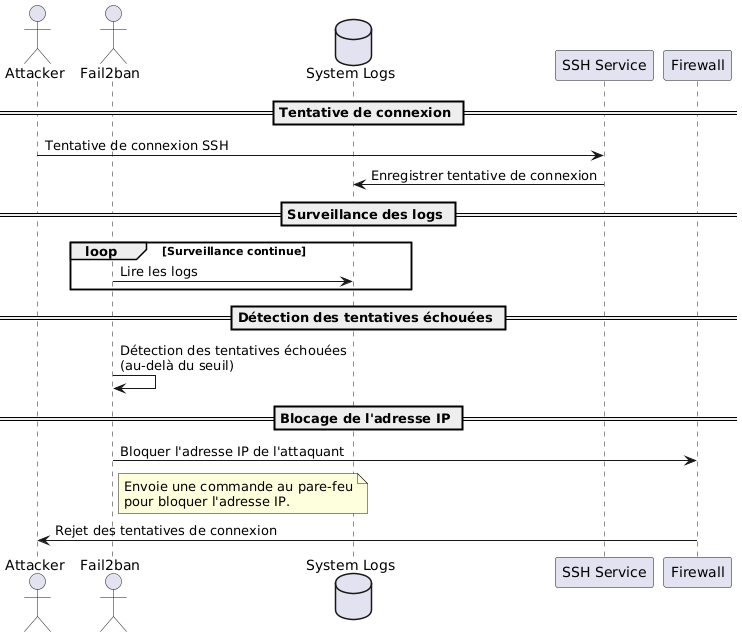

:titre: Sécurité réseau
:module: Système
:duree: 235
:description: Connaître les principes de base de la sécurité réseau et les outils pour sécuriser un réseau.
include::../../../../adoc/libs/header-module.adoc[]

ifeval::["{visible-on-html}" !=  "yes"]
:docinfo: shared
:docinfodir: ../../../adoc/libs
endif::[]

== Objectifs pédagogiques
// tag::objectifs[]
* Comprendre l’importance de la sécurité réseau
* Connaître les principales menaces et attaques envers un réseau
* Comprendre les outils de réseau sous Linux
* Savoir diagnostiquer le réseau pour résoudre des problématiques
* Savoir mettre en place des mesures de défense réseau efficaces sous Linux
* Être capable de configurer un pare-feu et gérer les règles de filtrage
// end::objectifs[]

// tag::deroulement[]
== Comprendre la sécurité réseau

=== Importance de la sécurité réseau

* **protection des données sensibles** : les données peuvent être interceptées, modifiées ou supprimées par des individus non autorisés
* **confidentialité** : pour protéger la vie privée des utilisateurs et préserver la réputation des organismes
* **maintien de la disponibilité des services** : un service mis hors d’usage peut être préjudiciable pour une organisation
* **intégrité des données** : pour éviter que les données ne soient altérées dans leur transport

=== Menaces et attaques courantes

* **déni de service (DDoS)** : vise à submerger un serveur, un service ou une infrastructure réseau pour le rendre indisponible
* **phishing** : e-mails ou sites malveillants destinés à récolter des informations personnelles ou sensibles (mots de passe, carte bancaire, etc.)
* **force brute** : tente de deviner les identifiants d’accès en essayant toutes les combinaisons possibles
* **déni de service distribué (DDoS)** : les attaques distribuées utilisent plusieurs machines pour coordonner une attaque DDoS, augmentant sa puissance et étant plus difficile à neutraliser

=== Représentation d’une attaque DDoS

image::./assets/01-ddos.png[]

[NOTE.speaker]
--
* **Demande de service** : L'utilisateur envoie une demande de service au service cible.
* **Réponse normale** : En situation normale, le service cible répond à la demande de l'utilisateur et la boucle continue tant que le service est demandé et disponible.

La boucle indique la durée normale pendant laquelle le service fonctionne sans interruption.

* **Commande d'attaque DDoS** : À un certain moment, une commande d'attaque DDoS est envoyée au botnet.
* **Flux massif de requêtes** : Le botnet commence à envoyer un flux massif de requêtes au service cible dans le but de le surcharger.
* **Service indisponible** : Le service cible devient indisponible en raison de la surcharge causée par le botnet.
* **Commande d'arrêt de l'attaque** : Une commande est envoyée au botnet pour arrêter l'attaque DDoS.
* **Nouvelle demande de service** : Après l'arrêt de l'attaque, l'utilisateur envoie une nouvelle demande de service au service cible.
* **Service rétabli après l'attaque** : Le service cible est à nouveau disponible et répond à la demande de l'utilisateur.
--

=== Représentation d’une attaque phishing



[NOTE.speaker]
--
* **Clic sur un lien suspect** : L'utilisateur clique sur un lien qui semble suspect.
* **Affiche une page de connexion falsifiée** : Le site web de phishing affiche une page de connexion qui imite le site légitime.
* **Soumission de ses identifiants** : L'utilisateur, croyant que la page est légitime, soumet ses identifiants (nom d'utilisateur, mot de passe, etc.).
* **Capture des identifiants** : Le site web de phishing capture les identifiants soumis par l'utilisateur.
* **Redirection vers le site réel** : Après avoir capturé les identifiants, le site web de phishing redirige l'utilisateur vers le site réel, pour éviter de susciter des soupçons.
--

// tag::demo[]
== Démonstration

**Attaque par force brute**

[NOTE.speaker]
--
Utiliser hydra pour montrer l’attaque brute force sur le SSH d’un serveur ou une VM Linux

`hydra -l user -P /path/to/password/list.txt ssh://<IP_VM>`
--
// end::demo[]

== Outils de réseau Linux

=== Principaux outils de diagnostic réseau Linux

* ping
* traceroute
* ip
* netstat

[NOTE.speaker]
--
* **Ping** : Utilisé pour vérifier la connectivité réseau entre deux machines en envoyant des paquets ICMP et en mesurant le temps de réponse, essentiel pour diagnostiquer les problèmes de connectivité.
* **Traceroute** : Permet de tracer le chemin pris par les paquets à travers le réseau en identifiant chaque saut intermédiaire (routeur) jusqu'à atteindre la destination, utile pour localiser les goulots d'étranglement et les interruptions.
* **Ip** : Commande polyvalente pour configurer les interfaces réseau, consulter les tables de routage IP et les informations d'adresse IP, essentielle pour gérer la configuration réseau sur Linux.
* **Netstat** : Fournit des informations détaillées sur les connexions réseau actives, les tables de routage, les statistiques d'interface et les ports en écoute, facilitant le diagnostic des problèmes de performance et de sécurité réseau.
--

=== `ping`

[cols="2,8"]
|===

a| **Définition**
a|
Commande utilisée pour tester la connectivité réseau entre deux hôtes en envoyant des paquets ICMP Echo Request et en attendant les réponses ICMP Echo Reply.

a| **Utilisation**
a|
Sert à vérifier si un hôte distant est accessible via le réseau et pour mesurer le temps nécessaire pour envoyer et recevoir des paquets.

a| **Syntaxe**
a|
```shell
ping [options] destination
```

|===

// tag::demo[]
=== Démonstration

**Utilisation de la commande ping**

[NOTE.speaker]
--
* Faire un ping de google.com
* Expliquer les valeurs retournées par le ping
--
// end::demo[]

=== `traceroute`

[cols="2,8"]
|===

a| **Définition**
a|
Permet de suivre le chemin qu'un paquet IP prend pour atteindre une destination en listant tous les sauts (routeurs) intermédiaires traversés.

a| **Utilisation**
a|
Diagnostiquer les problèmes de routage réseau en identifiant les étapes entre l'ordinateur local et une destination spécifique.

a| **Syntaxe**
a|
```shell
traceroute [options] destination
```

|===

// tag::demo[]
=== Démonstration

**Utilisation de la commande traceroute**

[NOTE.speaker]
--
* Faire un traceroute de google.com
* Expliquer les valeurs retournées par le traceroute
--
// end::demo[]

=== `ip`

[cols="2,8"]
|===

a| **Définition**
a|
Permet de configurer et d'afficher les paramètres des interfaces réseau, comme les adresses IP, les masques de sous-réseau et les adresses MAC.

a| **Utilisation**
a|
Examiner et configurer les interfaces réseau d'un système Linux.

a| **Syntaxe**
a|
```shell
ip [options] object
```

|===

// tag::demo[]
=== Démonstration

**Utilisation de la commande ip**

[NOTE.speaker]
--
* Faire la commande ip address 
* Expliquer les valeurs retournées par la commande
--
// end::demo[]

=== `netstat`

[cols="2,8"]
|===

a| **Définition**
a|
Permet de visualiser les connexions réseau en cours, les tables de routage, les interfaces réseau et les statistiques sur les protocoles en cours d'utilisation.

a| **Utilisation**
a|
Diagnostiquer les problèmes réseau, surveiller l'activité réseau et vérifier les connexions actives.

a| **Syntaxe**
a|
```shell
netstat [options]
```

|===

// tag::demo[]
=== Démonstration

**Utilisation de la commande netstat**

[NOTE.speaker]
--
* Faire la commande netstat -an 
* Expliquer les valeurs retournées par la commande
--
// end::demo[]

== Configuration avancée du pare-feu

=== Responsabilités du pare-feu

* **Contrôle d’accès :** 
** définition de règles strictes pour autoriser ou bloquer le trafic réseau, 
** critères tels que l’adresse IP, le port, le protocole, etc.
* **Protège contre les attaques de type :** 
** tentatives d’intrusion (force brute, scans de ports), 
** attaques par déni de service (DDoS),
** tentatives d’exploitation de vulnérabilités.
* **Sépare les zones de confiance :**
** segmentation en zones de sécurité différentes
** exemple : séparation entre le réseau interne et le réseau externe via des zones DMZ

=== `iptables`` : outil de pare-feu le plus couramment utilisé sous Linux

**Syntaxe :**

```shell
iptables [option] [chaîne] [conditions] -j [cible]
```

* **option** : Détermine l'action à effectuer (`-A` pour ajouter, `-D` pour supprimer, `-L` pour lister, etc.).
* **chaîne** : La chaîne où la règle est ajoutée (`INPUT`, `OUTPUT`, `FORWARD`, `PREROUTING`, `POSTROUTING`).
* **conditions** : Critères basés sur lesquels la règle sera appliquée (adresse IP, protocole, port, etc.).
* **cible** : L'action à prendre si les conditions sont remplies (`ACCEPT`, `DROP`, `REJECT`, `LOG`, etc.).

=== Exemples de commandes `iptables`

**Autoriser le trafic entrant sur le port 80 (HTTP) :**

```shell
iptables -A INPUT -p tcp --dport 80 -j ACCEPT
```

* `-A INPUT` : Ajouter la règle à la chaîne INPUT.
* `-p tcp` : Appliquer cette règle aux paquets TCP.
* `--dport 80` : Le port de destination doit être 80.
* `-j ACCEPT` : Accepter les paquets qui correspondent à cette règle.

include::../../../../adoc/libs/slide-notitle.adoc[]

**Bloquer le trafic entrant sur le port 22 (SSH) :**

```shell
iptables -A INPUT -p tcp --dport 22 -j DROP
```

* `-j DROP` : Bloquer les paquets qui correspondent à cette règle.

include::../../../../adoc/libs/slide-notitle.adoc[]

**Permettre l'accès SSH uniquement à partir d'une adresse IP spécifique :**

```shell
iptables -A INPUT -p tcp --dport 22 -s 192.168.1.100 -j ACCEPT 
```

```shell
iptables -A INPUT -p tcp --dport 22 -j DROP
```

* `-s 192.168.1.100` : L'adresse source doit être `192.168.1.100`.

include::../../../../adoc/libs/slide-notitle.adoc[]

**Lister les règles actuellement définies :**

```shell
iptables -L -n -v
```

* `-L` : Lister les règles.
* `-n` : Ne pas résoudre les noms d'hôte.
* `-v` : Afficher des informations détaillées.

include::../../../../adoc/libs/slide-notitle.adoc[]

**Suppression d'une règle spécifique :**

```shell
iptables -D INPUT -p tcp --dport 22 -s 192.168.1.100 -j ACCEPT
```

* `-D INPUT` : Supprimer une règle de la chaîne INPUT.

include::../../../../adoc/libs/slide-notitle.adoc[]

**Sauvegarder les règles d’iptables pour une persistence après redémarrage**

```shell
sudo apt-get install iptables-persistent

sudo netfilter-persistent save
```

// tag::demo[]
=== Démonstration

**Utilisation du pare-feu iptables**

[NOTE.speaker]
--
* Pour cette manip, se connecter en SSH à la VM
* Bloquer le trafic sur le port 22 via la commande `iptables -A INPUT -p tcp --dport 22 -j DROP`
* Montrer qu’on a perdu instantanément l’accès SSH à la machine
* Se connecter via l’écran de la VM
* Lister les règles via la commande `iptables -L -n -v` et expliquer le contenu de l’affichage
* Supprimer la règle sur le port 22 via la commande `iptables -D INPUT -p tcp --dport 22 -j DROP`
* On retrouve bien l’accès SSH comme prévu
--
// end::demo[]

== Gestion des utilisateurs

=== Généralités :

* **On ne travaille jamais dans le compte `root`** : la moindre erreur peut endommager les données ou le système d’exploitation
* Sur un système nouvellement installé, on commence par **créer un utilisateur normal** à partir duquel on effectuera les opérations quotidiennes
* `root` doit être réservé aux **tâches d’administration**, il faut toujours **vérifier deux fois** avant de lancer une commande
* Lorsque la machine peut être accédée **à distance**, la bonne pratique est de **restreindre la connexion au compte `root`** depuis l’extérieur afin de se prémunir de tout risque
* Dès que possible, il faut **bannir l’utilisation de login / mot de passe** au profit des clés SSH, notamment pour des utilisateurs avec des permissions élevées

=== Comptes utilisateurs :

* Chaque utilisateur doit avoir son propre accès via la commande `useradd`
* Paramétrer finement les permissions avec par exemple `chmod`, `chown`, `usermod`. Utiliser les groupes pour une gestion de droits commune à plusieurs utilisateurs.

=== Gestion des mots de passe :

* Exiger des mots de passe complexes (longueur minimale, utilisation de caractères spéciaux, etc.) avec un outil comme `pam_pwquality`
* Configurer une expiration régulière des mots de passe pour forcer leur renouvellement périodique avec le fichier de configuration
** Modifier `/etc/login.defs` pour définir une politique de changement de mot de passe :

```shell
PASS_MAX_DAYS 90 
PASS_MIN_DAYS 10 
PASS_WARN_AGE 7
```

// tag::demo[]
=== Démonstration

**Mettre en place une politique de mots de passe**

[NOTE.speaker]
--
* Installer la librairie `libpam-pwquality`
* Modifier le fichier `common-password` dans `/etc/pam.d/common-password`
* Ajouter la ligne suivante :

```shell
password requisite pam_pwquality.so difok=3 retry=3 minlen=12 minclass=2 dictcheck=1 enforce_for_root
```

** `difok=3` : 3 caractères différents entre l’ancien et le nouveau mot de passe
** `retry=3` : 3 tentatives
** `minlen=12` : Exige que les mots de passe aient au moins 12 caractères.
** `minclass=2` : Exige 2 types de caractères différents
** `dictcheck=1` : Vérification avec un dictionnaire de mots de passe courants
** `enforce_for_root` : doit s’appliquer aussi à root

* Tester le bon fonctionnement avec la commande `passwd user`
* Configurer l’expiration des mots de passe en allant dans le fichier `/etc/login.defs`
* Trouver les lignes suivantes et leur indiquer les valeurs ci-dessous :

```shell
PASS_MAX_DAYS 90
PASS_MIN_DAYS 
PASS_WARN_AGE 
```
--
// end::demo[]

=== Restriction de `sudo`

* Restreindre les commandes que les utilisateurs peuvent exécuter avec `sudo`.
** Modifier le fichier `/etc/sudoers` pour définir des permissions spécifiques :

```shell
nouvel_utilisateur ALL=(ALL:ALL) /usr/bin/apt-get
```

* Activer la journalisation pour suivre les actions exécutées avec `sudo`.
** Utiliser `visudo` pour ajouter les directives de journalisation

```shell
Defaults logfile=/var/log/sudo.log
```

// tag::demo[]
=== Démonstration

**Restreindre et surveiller la commande sudo**

[NOTE.speaker]
--
* Créer un nouvel utilisateur avec `adduser`
* Se connecter avec cet utilisateur et montrer la commande `sudo apt update` -> pas de permissions suffisantes
* Passer sur utilisateur du groupe sudo et ouvrir `visudo`
* Permettre à un nouvel utilisateur d’exécuter `/usr/bin/apt` avec `sudo` en ajoutant la ligne suivante :

```shell
nouvel_utilisateur ALL=(ALL:ALL) /usr/bin/apt-get
```

* Se connecter à l’utilisateur dont on vient de modifier les droits, et tester la commande `sudo apt update` -> ça fonctionne
* Montrer que d’autres commandes `sudo` ne sont pas accessibles, exemple `sudo visudo`
* Activer la journalisation en ajoutant la ligne suivante à `visudo`

```shell
Defaults logfile=/var/log/sudo.log
```

* Se rendre sur l’utilisateur n’ayant que les droits apt et relancer la commande sudo apt update puis lancer une commande non autorisée, par exemple sudo iptables
* Vérifier le contenu du fichier de log avec la commande sudo cat /var/log/sudo.log et montrer que toutes les actions sont répertoriées
--
// end::demo[]

=== Surveillance et audit :

* **Logs de Sécurité** : Surveiller les logs de sécurité pour détecter les activités suspectes.
** **Commande** `journalctl -u ssh`
* **Outils de Surveillance** : Utiliser des outils comme `auditd` pour une surveillance avancée des événements de sécurité.
** Définir des règles d’audit avec `auditctl` pour surveiller des fichiers critiques
** Examiner les logs d’audit avec `ausearch`
** Générer des rapports d’audit avec `aureport`

// tag::demo[]
=== Démonstration

**Surveiller et auditer le système**

[NOTE.speaker]
--
* Montrer le résultat de la commande `journalctl -f -u ssh`
* Installer `auditd`, activer et démarrer le service
* Ajouter deux règles d’audit pour surveiller des fichiers critiques :

```shell
sudo auditctl -w /etc/passwd -p wa -k passwd_changes
sudo auditctl -w /etc/shadow -p wa -k shadow_changes
```

* Vérifier les règles d’audit en place : `sudo auditctl -l`
* Apporter des modifications aux fichiers `/etc/passwd` et `/etc/shadow` (un simple commentaire suffit)
* Examiner les logs d’audit avec la commande `sudo ausearch -k passwd_changes` puis avec la commande `sudo ausearch -k shadow_changes`
* Générer un rapport de tous les événements d’audit avec `sudo aureport -au`
* Générer un rapport sur les modifications des fichiers surveillés : `sudo aureport -f`
--
// end::demo[]

=== Sécurisation des répertoires utilisateurs :

* **Permissions des répertoires** : S’assurer que les répertoires personnels des utilisateurs ont les permissions appropriées.
** **Exemple** : Utiliser `chmod` pour définir des permissions :

```shell
chmod 700 /home/nouvel_utilisateur
```

* **Isolation des Comptes** : Éviter que les utilisateurs aient accès aux répertoires des autres utilisateurs.


➡️  **Ce comportement est réalisé par défaut lorsqu’on ajoute un utilisateur avec la commande `adduser`**

_Néanmoins, il faut toujours vérifier que les permissions sont bien établies lors de l’ajout d’un utilisateur_

=== Désactivation des Comptes Inactifs

* **Identification des Comptes Inactifs** : Utiliser des outils comme `lastlog` pour identifier les comptes qui n'ont pas été utilisés récemment.
** **Commande** : `sudo lastlog`
* **Désactivation Temporaire** : Verrouiller les comptes inactifs avec `usermod`.
** **Exemple** : `sudo usermod --lock --expiredate 1970-01-02 user`
** **Déverrouiller avec** : `sudo usermod --unlock --expiredate ‘’ user`

// tag::demo[]
=== Démonstration

**Gérer les comptes inactifs**

[NOTE.speaker]
--
* Vérifier les dernières connexion avec la commande `sudo lastlog`
* Se connecter en SSH à un utilisateur pour montrer que la connexion fonctionne
* Verrouiller ce compte utilisateur avec la commande `sudo usermod --lock --expiredate 1970-01-02 user`
* Tenter de se connecter à ce compte utilisateur de nouveau : compte expiré
* Déverrouiller ce compte utilisateur avec la commande `sudo usermod --unlock --expiredate ‘’ user`
* On peut se connecter à nouveau avec l’utilisateur
--
// end::demo[]

=== Restriction des Accès SSH

* **Accès par Clé Publique** : Utiliser des clés SSH pour l'authentification au lieu de mots de passe.
** Ajouter les clés publiques des utilisateurs dans `~/.ssh/authorized_keys`.
* **Désactivation de Root SSH** : Désactiver l'accès SSH direct pour l'utilisateur root.
** Modifier `/etc/ssh/sshd_config` pour inclure :

```shell
PermitRootLogin no
```

include::../../../../adoc/libs/slide-notitle.adoc[]

* **Limitation des Utilisateurs SSH** : Limiter les utilisateurs autorisés à se connecter via SSH.
** Ajouter au fichier `/etc/ssh/sshd_config` :

```shell
AllowUsers nouvel_utilisateur
```

// tag::demo[]
=== Démonstration

**Accès SSH sécurisé**

[NOTE.speaker]
--
* Montrer comment générer une clé SSH sur la machine cliente

```shell
ssh-keygen -t rsa -b 4096 -C "votre_email@example.com"
```

* Copier la clé publique sur le serveur.

```shell
ssh-copy-id nouvel_utilisateur@serveur_ip
```

* Vérifier que la clé publique a été ajoutée au fichier `~/.ssh/authorized_keys` sur le serveur.

```shell
ssh nouvel_utilisateur@serveur_ip
```

* Désactiver l'accès SSH direct pour l'utilisateur root. Ouvrir le fichier de configuration SSH `/etc/ssh/sshd_config` avec un éditeur de texte.
* Rechercher la ligne `PermitRootLogin` et la modifier pour désactiver l'accès root.

```shell
PermitRootLogin no
```

* Redémarrer le service SSH pour appliquer les modifications.
* Contrôler que la connexion root à distance est bien désactivée
* Limiter les utilisateurs autorisés à se connecter via SSH. Reprendre le fichier `/etc/ssh/sshd_config` 
* Ajouter la ligne `AllowUsers` avec les utilisateurs autorisés.

```shell
AllowUsers nouvel_utilisateur
```

* Enregistrer et redémarrer le service SSH.
* Contrôler que l’utilisateur a bien accès en SSH
--
// end::demo[]

// tag::exercice[]
== Exercice

* Grâce à une règle pare-feu, autoriser uniquement l’adresse IP de votre machine hôte à se connecter en SSH.
* Créer un nouvel utilisateur : il doit avoir les droits `sudo` uniquement sur la commande `systemctl status`
* Désactiver l’accès SSH pour l’utilisateur root

// end::exercice[]

== fail2ban pour prévenir les intrusions en force brute

* **Surveillance des logs** en permanence pour rechercher des motifs spécifiques
* **Détection des tentatives infructueuses** : selon la configuration donnée, fail2ban va agir automatiquement en cas d’attaque par force brute
* **Blocage des adresses IP** : ajout de règles de pare-feu pour bloquer toute nouvelle tentative pendant une période définie

include::../../../../adoc/libs/slide-notitle.adoc[]



=== Composants de fail2ban

**Jails :**

* combinaison de filtre et d'action. Définit les conditions sous lesquelles une adresse IP doit être bannie et la manière de la bannir.
* Les jails sont configurées dans le fichier `/etc/fail2ban/jail.conf` ou dans le fichier plus spécifique `/etc/fail2ban/jail`.local pour les configurations personnalisées.

include::../../../../adoc/libs/slide-notitle.adoc[]

**Filtres :**

* Fichiers de configuration contenant des expressions régulières qui définissent les motifs à rechercher dans les journaux. Ces fichiers se trouvent généralement dans `/etc/fail2ban/filter.d/`.
* Chaque filtre est associé à un service spécifique (par exemple, sshd, apache, postfix) et à un journal particulier.

include::../../../../adoc/libs/slide-notitle.adoc[]

**Actions :**

* Mesures à prendre lorsqu'une adresse IP est identifiée comme suspecte. Cela implique l'exécution d'une commande pour modifier les règles du pare-feu afin de bloquer l'adresse IP.
* Les actions peuvent également inclure des notifications, comme l'envoi d'un email à l'administrateur système.

=== Utiliser fail2ban

```shell
sudo apt install fail2ban
```

**Configurer une jail pour SSH dans `jail.local`**

```shell
[sshd]
enabled = true
backend = systemd
port = ssh
filter = sshd
logpath = /var/log/auth.log
maxretry = 5
bantime = 600
```

include::../../../../adoc/libs/slide-notitle.adoc[]

**Exemple de filtre pour SSH dans `sshd.conf` :**

```shell
[INCLUDES]
before = common.conf
[Definition]
_daemon = sshd
failregex = ^%(__prefix_line)sFailed password for .* from <HOST>.*$
        	^%(__prefix_line)sReceived disconnect from <HOST>: 11: .*$
        	^%(__prefix_line)sDid not receive identification string from <HOST>.*$
        	^%(__prefix_line)sConnection closed by <HOST>.*$
ignoreregex =

[Init]
journalmatch = _SYSTEMD_UNIT=sshd.service + _COMM=sshd
```

// tag::demo[]
=== Démonstration

**fail2ban**

[NOTE.speaker]
--
**Utiliser 2 VM Debian pour effectuer cette manipulation :**

* Sur la première VM :
** Installer `fail2ban` et configurer un jail sur le protocole ssh (⚠️ sur Debian, il faut ajouter `backend = system` dans la config du jail sinon fail2ban ne démarrera pas)
** Démarrer ou redémarrer le service et vérifier qu’il fonctionne bien

* Sur la deuxième VM :
** Se connecter de manière infructueuse en SSH à l’autre machine, au bout du nombre de tentatives max. mentionné dans la config du jail, on obtient `Connection refused`
** L’IP de la VM a été banni

* Sur la première VM :
** Observer les logs via la commande `tail -20 /var/log/fail2ban.log` on peut y voir ce qu’a fait fail2ban notamment lorsqu’il a banni l’adresse IP
** Utiliser la commande `fail2ban-client get sshd banip` pour confirmer l’adresse IP qui est bannie
** Retirer le bannissement avec la commande `fail2ban-client set ssh unbanip ip_ici`

* Sur la deuxième VM :
** Confirmer qu’on a bien récupéré l’accès au port SSH.
--
// end::demo[]
// end::deroulement[]

== Conclusion
// tag::conclusion[]
* Compréhension de l’importance de la sécurité réseau
* Connaissance des principales menaces et attaques envers un réseau
* Compréhension des outils de réseau sous Linux
* Connaissance des méthodes de diagnostic réseau sous Linux
* Compréhension et configuration des pare-feux avancés avec iptables 
* Gestion efficace des utilisateurs et leurs permissions, en mettant en place des politiques de sécurité robustes pour les comptes utilisateurs et les mots de passe.
// end::conclusion[]