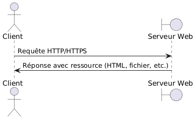
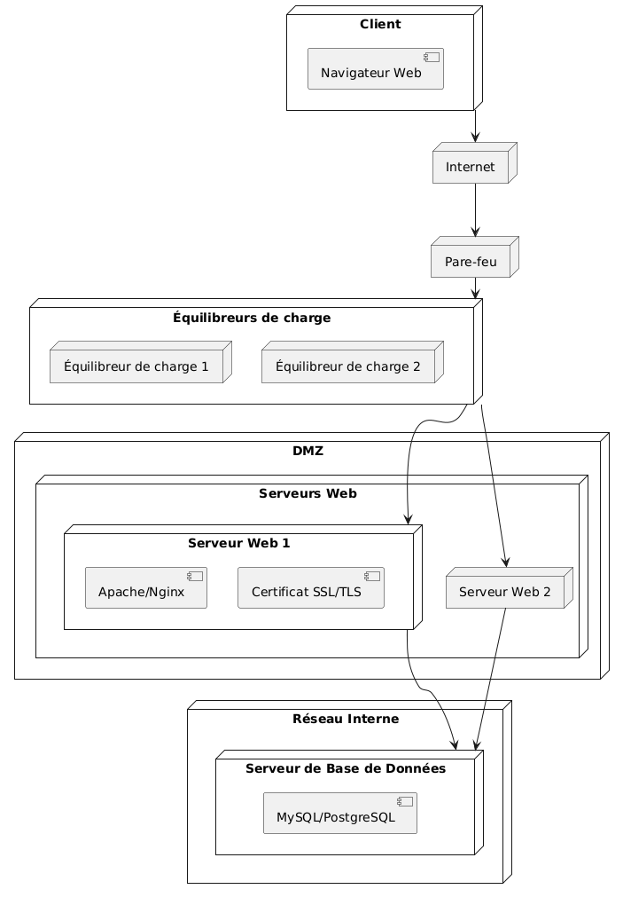

:titre: Services web
:module: Système
:duree: 60
:description: Comprendre le fonctionnement des services web et savoir les configurer.
include::../../../../adoc/libs/header-module.adoc[]

ifeval::["{visible-on-html}" !=  "yes"]
:docinfo: shared
:docinfodir: ../../../adoc/libs
endif::[]

== Objectifs pédagogiques
// tag::objectifs[]
* Comprendre les concepts fondamentaux des services web 
* Savoir configurer un serveur web
* Apprendre à sécuriser un service web
* Savoir optimiser les performances d’un service web
// end::objectifs[]

// tag::deroulement[]
== Introduction aux services web

* **Définition** : Un service web permet de rendre des ressources accessibles via le réseau en utilisant des protocoles standardisés (HTTP/HTTPS).
* **Fonctionnement** : Les clients envoient des requêtes au serveur web, qui répond en fournissant des ressources (pages HTML, fichiers, etc.).
* **Principaux serveurs web** : Apache, Nginx, Microsoft IIS.
* **Sécurité** : Importance de l'utilisation de HTTPS pour chiffrer les échanges, configuration des certificats SSL/TLS.

include::../../../../adoc/libs/slide-notitle.adoc[]



=== Exemple d’infrastructure web sécurisée



[NOTE.speaker]
--
**Client :**

* **Navigateur Web** : Le point de départ où l'utilisateur initie la demande via un navigateur web.

**Internet** : La connexion réseau mondiale par laquelle la demande du client passe pour atteindre les serveurs de l'application.

**Pare-feu** : Un dispositif de sécurité réseau qui surveille et contrôle le trafic entrant et sortant en fonction de règles de sécurité prédéfinies. Il protège les serveurs internes contre les menaces extérieures.

**Équilibreurs de charge :**

* **Équilibreur de charge 1 et 2** : Dispositifs ou logiciels qui distribuent les demandes entrantes de manière équilibrée entre les différents serveurs web pour assurer une performance optimale et éviter la surcharge d'un seul serveur.

**DMZ (Zone démilitarisée)** : Une sous-réseau qui contient les serveurs accessibles depuis Internet mais qui n'ont pas directement accès au réseau interne de l'entreprise. Cela ajoute une couche supplémentaire de sécurité.

**Serveurs Web :**

* **Serveur Web 1** : Contient un serveur Apache ou Nginx pour traiter les demandes web, ainsi que les certificats SSL/TLS pour sécuriser les communications.
* **Serveur Web 2** : Un autre serveur web pour redondance et répartition de la charge.

**Réseau Interne :** La partie du réseau qui n'est pas accessible directement depuis l'extérieur. Elle héberge des services internes critiques.

**Serveur de Base de Données :**

* **MySQL/PostgreSQL** : Serveur où sont stockées les données de l'application web, accessible uniquement par les serveurs web situés dans la DMZ pour des raisons de sécurité.

**Fonctionnement global :**

* Le client envoie une requête via son navigateur web.
* La requête traverse Internet et atteint le pare-feu qui vérifie et permet le passage selon les règles de sécurité.
* La requête est ensuite dirigée vers les équilibreurs de charge qui répartissent la charge entre les serveurs web disponibles dans la DMZ.
* Les serveurs web (Apache/Nginx) reçoivent la requête. Si nécessaire, ils peuvent utiliser les certificats SSL/TLS pour sécuriser la communication.
* Les serveurs web traitent la requête et peuvent demander des données au serveur de base de données via le réseau interne.
* Le serveur de base de données (MySQL/PostgreSQL) renvoie les données requises aux serveurs web.
* Les serveurs web compilent une réponse et la renvoient au client via l'itinéraire inverse (équilibreurs de charge, pare-feu, Internet).
--

== Configuration d’un serveur Nginx


=== Pourquoi Nginx ? 

* **Performances élevées via son architecture événementielle** : 
** gestion de nombreuses connexions simultanées
** utilisation minimale des ressources système
* **Flexibilité et extensibilité** : 
** serveur web, reverse proxy, load balancer, cache HTTP, contenus statiques…
* **Support natif de HTTPS**
* **Gestion des pics de charge**
* **Large adoption et communauté active**

include::../../../../adoc/libs/slide-notitle.adoc[]

* **Installation du serveur web Nginx :**

```shell
sudo apt update && sudo apt upgrade
sudo apt install nginx
```

* **Activation et démarrage du service Nginx :**

```shell
sudo systemctl enable --now nginx
```

include::../../../../adoc/libs/slide-notitle.adoc[]

* **Nginx est accessible sur http://localhost:80** (mettre en place une redirection de port si besoin)

* **Configuration de Nginx :**
** un fichier de configuration principal : `/etc/nginx/nginx.conf`
** Un fichier de configuration par site web : `/etc/nginx/sites-available/monsite`

* **Activer le site et recharger Nginx :**

```shell
sudo ln -s /etc/nginx/sites-available/monsite /etc/nginx/sites-enabled/ 
sudo systemctl reload nginx
```

=== Configuration d’un virtual host avec Nginx

```shell
server {
	listen 80;  # Ecoute les connexions entrantes sur le port 80 (HTTP)

	server_name monsite.com;  # Nom de domaine pour lequel ce bloc de configuration s'applique

	root /var/www/html/monsite;  # Répertoire racine où sont stockés les fichiers du site web

	index index.html index.htm;  # Fichiers index par défaut à servir si aucun fichier n'est spécifié dans l'URL

	location / {
    		try_files $uri $uri/ =404;
    	# Définit les règles de traitement des requêtes pour cette location (racine du site)
    	# try_files teste l'existence des fichiers dans l'ordre spécifié :
    	#   - $uri : tente de servir le fichier correspondant à l'URI de la requête
    	#   - $uri/ : tente de servir un répertoire correspondant à l'URI de la requête
    	#   - =404 : renvoie une erreur 404 si aucun des fichiers ou répertoires n'est trouvé
    	# Cela permet de servir les fichiers demandés ou de retourner une erreur 404 si introuvables.
	}
}
```

=== Exemple d’un vhost pour une app NodeJS avec un reverse proxy :

```shell
server {
	listen 80;  # Ecoute les connexions HTTP sur le port 80

	server_name monapp.com;  # Remplacer par le nom de domaine ou sous-domaine

	location / {
    		proxy_pass http://localhost:3000;  # Proxy vers l'application Node.js qui tourne localement sur le port 3000

    		# Configurations supplémentaires pour le proxy
    		proxy_http_version 1.1;
    		proxy_set_header Upgrade $http_upgrade;
    		proxy_set_header Connection 'upgrade';
    		proxy_set_header Host $host;
    		proxy_cache_bypass $http_upgrade;
	}
}
```

// tag::demo[]
=== Démonstration

**Mise en place d’un vhost Nginx**

[NOTE.speaker]
--
* Créer un répertoire pour un nouveau site `/var/www/mon_site`
* Dans ce répertoire, créer un fichier `index.html` avec un contenu basique
* Définir les permissions correctement pour le répertoire `sudo chown -R www-data:www-data /var/www/mon_site`
* Créer un fichier de configuration du vhost : `sudo nano /etc/nginx/sites-available/mon_site`
* Ajouter la configuration suivante au fichier :

```shell
server {
	listen 80;
	server_name mon_site.com;

	root /var/www/mon_site;
	index index.html;

	location / {
    	try_files $uri $uri/ =404;
	}
}
```

* Activer le vhost en créant un lien symbolique : `sudo ln -s /etc/nginx/sites-available/mon_site /etc/nginx/sites-enabled/`
* Vérifier qu’il n’y a pas d’erreur de syntaxe avec `sudo nginx -t`
* Redémarrer Nginx
* Modifier le fichier hosts du serveur `sudo nano /etc/hosts` 
* y inclure la ligne `127.0.0.1 mon_site.com`
* Utiliser un outil type curl pour confirmer qu’on reçoit bien le bon fichier HTML en contactant mon_site.com

`curl mon_site.com`
--
// end::demo[]

// tag::exercice[]
== Exercice

* Créer un répertoire pour un nouveau site web. Placer à l’intérieur un fichier HTML basique comme point d’entrée
* Créer un Virtual Host Nginx afin de servir le site web, dont le nom de domaine peut être par exemple `exercice-site.com`
* Tester le bon fonctionnement du site avec la commande curl `exercice-site.com`
* **BONUS Sécurité** : mettre en place une limitation de requêtes sur ce virtual host.
* **BONUS Optimisation** : mettre en place une compression gzip et une mise en cache des fichiers statiques sur ce virtual host.

Pour les bonus, ne pas hésiter à faire une recherche 😊
// end::exercice[]

== Sécuriser un serveur Nginx

=== Forcer le HTTPS sur Nginx

```shell
server {
	listen 80;
	server_name votre_domaine.com;

	# Redirige toutes les requêtes HTTP vers HTTPS avec un code de statut 301 (redirection permanente)
	return 301 https://$server_name$request_uri;
}

server {
	listen 443 ssl;  # Écoute les connexions HTTPS sur le port 443 et active SSL
	server_name votre_domaine.com;

	# Chemin vers le certificat SSL (Let’s Encrypt)
	ssl_certificate /etc/letsencrypt/live/votre_domaine.com/fullchain.pem;
	# Chemin vers la clé privée du certificat SSL
	ssl_certificate_key /etc/letsencrypt/live/votre_domaine.com/privkey.pem;
	# Inclut des configurations SSL supplémentaires recommandées par Let’s Encrypt
	include /etc/letsencrypt/options-ssl-nginx.conf;
	# Chemin vers le paramètre Diffie-Hellman pour la négociation SSL sécurisée
	ssl_dhparam /etc/letsencrypt/ssl-dhparams.pem;
}
```

=== Protection contre les attaques XSS et clickjacking :

```shell
server {
	# Empêche le site d'être intégré dans un iframe par d'autres sites, sauf s'ils appartiennent au même domaine
	add_header X-Frame-Options "SAMEORIGIN" always;

	# Active la protection contre les attaques de type Cross-Site Scripting (XSS)
	add_header X-XSS-Protection "1; mode=block" always;

	# Empêche le navigateur de deviner le type de contenu, forçant l'utilisation du type MIME spécifié
	add_header X-Content-Type-Options "nosniff" always;

	# Contrôle l'information de référent envoyée dans les requêtes HTTP
	# "no-referrer-when-downgrade" : n'envoie pas de référent lorsque la requête est passée de HTTPS à HTTP
	add_header Referrer-Policy "no-referrer-when-downgrade" always;

	# Définit la politique de sécurité du contenu (Content Security Policy)
	# "default-src 'self';" : Autorise le contenu uniquement du même domaine
	# "script-src 'self';" : Autorise l'exécution de scripts uniquement depuis le même domaine
	# "style-src 'self';" : Autorise l'application de styles uniquement depuis le même domaine
	add_header Content-Security-Policy "default-src 'self'; script-src 'self'; style-src 'self';" always;
}
```

=== Limitation du nombre de requêtes

```shell
http {
	...
	# Définit une zone de limitation de requêtes appelée 'one' qui utilise 10 Mo de mémoire partagée.
	# La limite est basée sur l'adresse IP binaire du client ($binary_remote_addr).
	# La limite de requêtes est fixée à 1 requête par seconde (rate=1r/s).
	limit_req_zone $binary_remote_addr zone=one:10m rate=1r/s;

	server {
    	...
    	location / {
        	# Applique la limitation de requêtes définie dans la zone 'one'.
        	# Le paramètre 'burst=5' permet d'accepter jusqu'à 5 requêtes au-delà de la limite de taux définie,
        	# ce qui permet de gérer les pics de trafic sans rejet immédiat.
        	limit_req zone=one burst=5;
        	...
    	}
	}
}
```

== Optimiser un serveur Nginx

=== Compression Gzip

```shell
http {
	# Active la compression gzip pour les réponses HTTP
	gzip on;

	# Spécifie les types MIME pour lesquels la compression gzip est activée
	gzip_types
    	text/plain          	# Type MIME pour le texte brut
    	text/css            	# Type MIME pour les feuilles de style CSS
    	application/json    	# Type MIME pour les données JSON
    	application/javascript  	# Type MIME pour le code JavaScript
    	text/xml            	# Type MIME pour les fichiers XML
    	application/xml     	# Type MIME pour les applications XML
    	application/xml+rss 	# Type MIME pour les flux RSS au format XML
    	text/javascript;    	# Type MIME pour les anciens fichiers JavaScript (déprécié, inclus pour compatibilité)
}
```

=== Mise en cache des fichiers statiques

```shell
# Déclare une location pour les requêtes dont l'URI correspond aux extensions de fichiers spécifiées.
# Le tilde (~*) indique une correspondance insensible à la casse pour les extensions de fichiers.
# Le bloc s'applique aux fichiers avec les extensions .jpg, .jpeg, .png, .gif, .ico, .css et .js.
location ~* \.(jpg|jpeg|png|gif|ico|css|js)$ {
	# Définit la durée pendant laquelle les fichiers doivent être considérés comme valides (cachés) par le navigateur.
	# '365d' indique que les fichiers peuvent être mis en cache pendant 365 jours.
	expires 365d;

	# Ajoute un en-tête Cache-Control aux réponses HTTP pour indiquer comment les navigateurs doivent gérer le cache.
	# "public" indique que la réponse peut être mise en cache par les navigateurs et les serveurs intermédiaires (comme les CDN).
	# "no-transform" indique que les proxies intermédiaires ne doivent pas modifier la réponse (comme la compression ou la conversion du format).
	add_header Cache-Control "public, no-transform";
}
```

== Et si on n’utilise pas Nginx ?

* D’autres outils existent comme Apache, LiteSpeed, Caddy…
* On peut appliquer les mêmes concepts sur ces outils :
** virtual hosts
** reverse proxy
** sécurité : HTTPS, XSS, clickjacking, limitation de requêtes…
** optimisation : gzip, mise en cache…
* Le choix de l’outil dépend des habitudes de travail de l’organisation, des besoins du projet et des compétences internes

// end::deroulement[]

== Conclusion
// tag::conclusion[]
* Compréhension des concepts fondamentaux des services web 
* Capacité à configurer un serveur web avec l’exemple de Nginx
* Connaissance de techniques pour sécuriser un service web
* Connaissance de techniques pour optimiser un service web
// end::conclusion[]