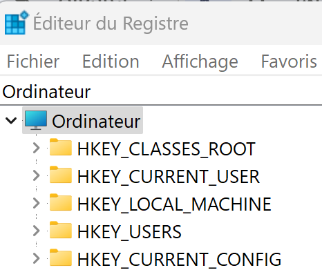
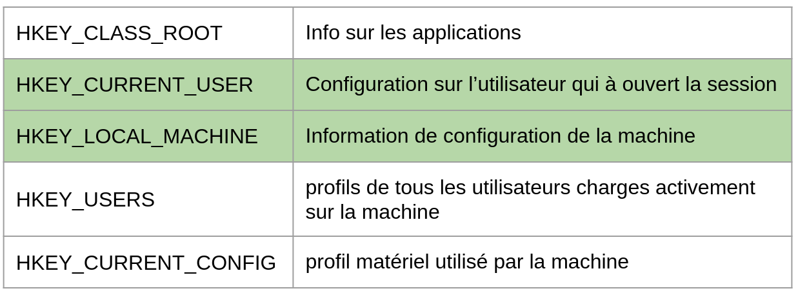
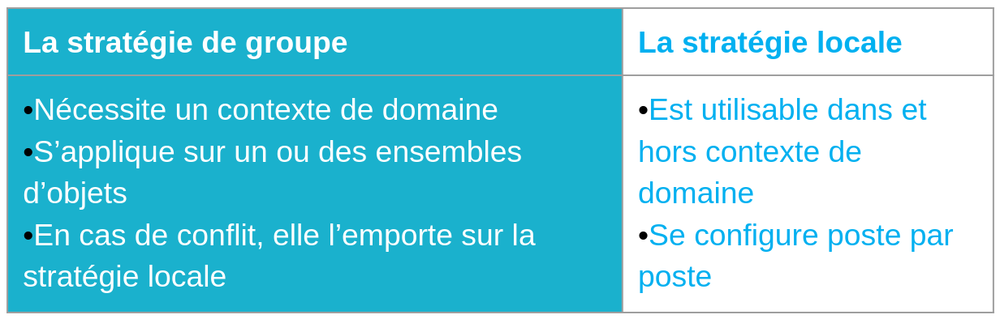
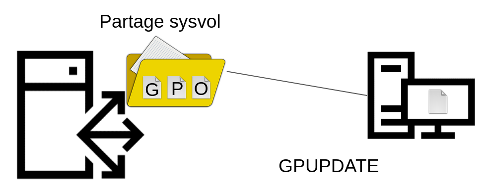
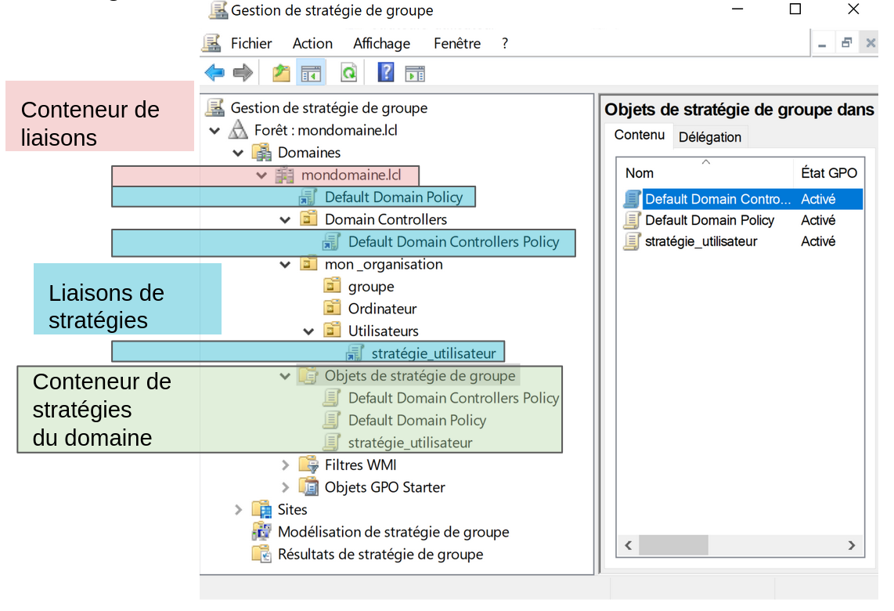
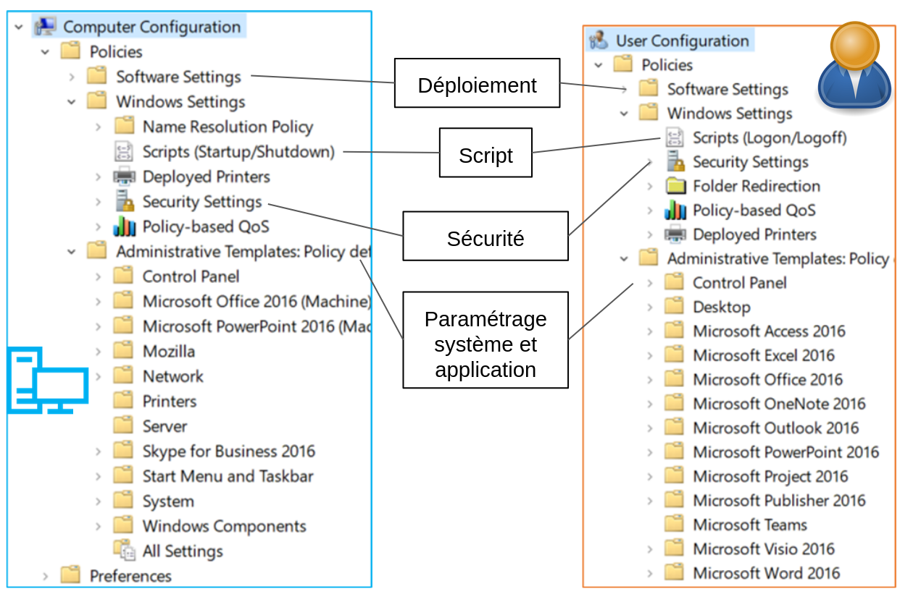

:titre: Stratégie de groupe GPO
:module: Système
:duree: 120
:description: Les stratégies de groupe (GPO) sont des objets de configuration qui permettent de définir des paramètres de configuration pour les utilisateurs et les ordinateurs dans un domaine Active Directory.
include::../../../../adoc/libs/header-module.adoc[]

ifeval::["{visible-on-html}" !=  "yes"]
:docinfo: shared
:docinfodir: ../../../adoc/libs
endif::[]

== Objectifs pédagogiques

// tag::objectifs[]
* Caractéristiques d’une GPO
* Registre et GPO
* Stratégie de groupe versus stratégie locale
* Application des stratégies
* Ciblage des stratégies
* Console de gestion de stratégie de groupe
* Cumul et priorisation
* Héritage et restriction
* Diagnostic / dysfonctionnement
* Console éditeur de gestion des stratégies de groupe
// end::objectifs[]

// tag::deroulement[]
== Caractéristiques d’une GPO

Les caractéristiques d'une GPO (Group Policy Object) :

* **Centralisation** : gestion centralisée des configurations et des politiques pour les utilisateurs et les ordinateurs.
* **Sécurité** : Définit des politiques de sécurité
* **Déploiement de logiciels** : Facilite la gestion des logiciels des ordinateurs du réseau.
* **Paramètres système** : Configure les paramètres du système d'exploitation,

include::../../../../adoc/libs/slide-notitle.adoc[]

* **Filtrage par groupe** : Applique des GPO spécifiques à des groupes d'utilisateurs ou d'ordinateurs définis dans Active Directory.
* **Héritage et priorités** : Les GPO peuvent être héritées et peuvent avoir des priorités différentes selon leur niveau d'application (site, domaine, ou unité organisationnelle).
* **Gestion des scripts** : Permet l'exécution de scripts au démarrage, à l'arrêt, à la connexion et à la déconnexion des utilisateurs.
* **Préférences de groupe** : Offre des options supplémentaires pour configurer les paramètres, tels que les lecteurs mappés, les imprimantes, et les tâches planifiées.

Ces caractéristiques permettent une gestion flexible et puissante des environnements informatiques dans les organisations.

== Registre et GPO

La **stratégie de groupe** permet depuis un environnement graphique d’apporter des modifications à un ensemble de postes

include::../../../../adoc/libs/slide-notitle.adoc[]

[cols="1,1"]
|===

a| 
Sous Windows, les principaux points de configuration sont stockés dans le registre

pour éditer le registre on utilise la commande : `REGEDIT` 

Des outils et consoles permettent d’agir

* Graphiquement via l’éditeur de registre 
* Via la ligne de commande sur le registre
a| 

|===

include::../../../../adoc/libs/slide-notitle.adoc[]

La **base de registre** est une base de données hiérarchique centrale

Les informations sont organisées en **ruches** regroupant des **clés** et des sous-clés sur lesquelles des **valeurs** sont affectées

Ces éléments sont organisés hiérarchiquement

include::../../../../adoc/libs/slide-notitle.adoc[]

À la racine se trouvent les ruches suivantes :

== Stratégie de groupe versus stratégie locale

Stratégie de groupe ou stratégie locale, les deux viennent modifier les éléments en base de registre 

include::../../../../adoc/libs/slide-notitle.adoc[]

Par défaut, les stratégies sont appliquées en arrière-plan de façon transparente toutes les 30 min 

pour les contrôleurs de domaine cela se fait toutes les 5 min

avec la commande `GPUPDATE /Force` il est possible de forcer la mise à jour des stratégies de groupe

== Application des stratégies

Les stratégies de groupe sont stockées sur les contrôleurs du domaine dans le partage SYSVOL et récupérées localement par les clients

Les **extensions côté client** (CSE) sont les composants du système client

* Qui récupèrent les stratégies mises à disposition par les contrôleurs de domaine
* Intègrent et appliquent les paramétrages qui s’y trouvent

include::../../../../adoc/libs/slide-notitle.adoc[]

== Ciblage des stratégies

Le ciblage d’une stratégie permet de définir les objets impactés par celle-ci, il peut se faire sur les objets suivants

include::../../../../adoc/libs/slide-notitle.adoc[]

Les **objets ordinateurs** présents dans le conteneur ciblé ou un conteneur enfant pour les **paramètres ordinateur**

Les **objets utilisateurs** présents dans le conteneur ciblé ou un conteneur enfant pour les **paramètres utilisateur**

⚠️ [red]#Attention :#

[red]#Les stratégies de groupe ne s’appliquent pas aux objets **groupes** et leurs membres#

== Console de gestion de stratégie de groupe

La console Gestion de stratégie de groupe permet de gérer les stratégies

include::../../../../adoc/libs/slide-notitle.adoc[]

== Cumul et priorisation

Les stratégies peuvent se cumuler sur un objet

si un même paramètre a plusieurs valeurs assignées alors il y a conflit

include::../../../../adoc/libs/slide-notitle.adoc[]

L’ordre d’application des stratégies permet de définir la valeur prise en compte

* C’est la dernière stratégie appliquée qui l’emporte : « la plus proche de l’objet »
* Les stratégies héritées sont appliquées avant celles du conteneur courant
* Au sein d’un même conteneur, sont d’abord appliquées les stratégies dont le numéro d’ordre est le plus élevé

[red]#Stratégie locale => Stratégies héritées => Stratégies OU#

== Héritage et restriction

Il est possible de restreindre l’application d’une stratégie

include::../../../../adoc/libs/slide-notitle.adoc[]

**Blocage d’héritage** : ce paramétrage s’active sur une *OU*

Ce paramètre impacte alors toutes les stratégies héritées de cette OU.

**Les filtres** 

* de Sécurité : Autoriser ou refuser l’application de stratégie via des ACE
* WMI : limiter l’application de stratégie sur certains critères via des requêtes WMI

En plus des mécanismes de restriction, il est possible de

* Modifier l’état de stratégies
**Activé**, **désactivé**, désactiver les paramètres 
* Activer le paramètre **Appliqué** / **renforcé**
Afin d’outrepasser le blocage d’héritage et de rendre la GPO prioritaire

== Diagnostic / dysfonctionnement

include::../../../../adoc/libs/slide-notitle.adoc[]

Quand une stratégie ne se déploie pas correctement il faut : 

déterminer si la stratégie a été appliquée ou non

* si la GPO est appliquée
** paramètre non pris en charge par l’OS
** conflit de stratégie 
* si la GPO n’est pas appliquée
** problème de liaison 
** filtrage de sécurité
** vérifier que le partage est accessible

depuis le poste cible la commande `GPRESULT` permet de voir les stratégies appliquées 

== Console éditeur de gestion des stratégies de groupe

pour éditer notre stratégie on ouvre la console **“Éditeur de gestion des stratégies de groupe”**

[cols="1,1"]
|===
a| image::./assets/10-editeur-gestion-strategie.png[]
a| image::./assets/10-editeur-gestion-strategie-2.png[]
|===

=== Éléments pouvant être gérés par stratégie

include::../../../../adoc/libs/slide-notitle.adoc[]

Les modèles d’administration peuvent être gérés localement

(Depuis le poste où sont éditées les stratégies)

* Ils sont stockés dans le dossier `C:\Windows\PolicyDefinitions`

include::../../../../adoc/libs/slide-notitle.adoc[]

Ils peuvent également être gérés à l’échelle du domaine

* Ils sont alors stockés dans le partage SYSVOL

`SYSVOL \ [domaine] \ Policies \ PolicyDefinitions`

Les modèles d’administration sont constitués de 2 fichiers :

* Un fichier au format **ADMX** contenant les paramètres
* Un ou plusieurs fichiers de langue au format **ADML** qui doivent être stockés dans les répertoires de la langue associée

// tag::demo[]
== Démonstration

**LES GPO**

[NOTE.speaker]
--
* Liaisons montrer
** Création + Liaison
** Liaisons stratégie existante
** Liaisons multiples même stratégie
** Conteneur des objets GPO
* Console, montrer
** Onglet Héritage sur stratégie
** Blocage d’héritage
** Paramètre Appliqué
** Filtrage de sécurité
** Filtrage WMI
* Autres fonctions
** Sauvegarde (depuis conteneur GPO)
** GPO Starter = modèles => permet import/export au format .cab
** Console RSOP

--
// end::demo[]
// end::deroulement[]

== Conclusion
// tag::conclusion[]
* Compréhension de ce que sont les GPO 
* Connaissance de comment les mettre en place 
* Capacité à vérifier leur application et diagnostiquer en cas de dysfonctionnement
// end::conclusion[]