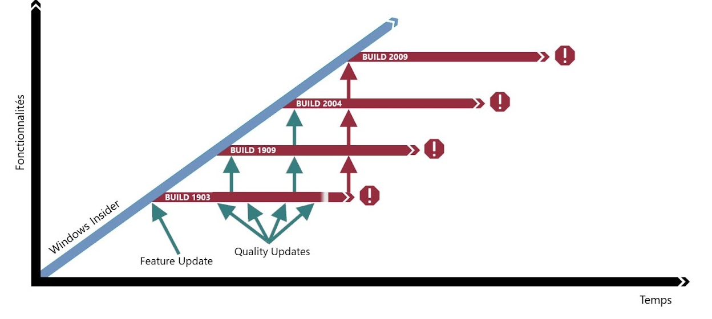

:titre: Système d’exploitation Microsoft	
:module: Système
:duree: 120
:description: Découverte des systèmes Microsoft pour administrer un serveur
include::../../../../adoc/libs/header-module.adoc[]

ifeval::["{visible-on-html}" !=  "yes"]
:docinfo: shared
:docinfodir: ../../../adoc/libs
endif::[]

== Objectifs pédagogiques

// tag::objectifs[]
* Connaître Microsoft Serveur  et son environnement
* Comprendre les différentes éditions
* comprendre le cycle de vie des produits Microsoft 
* Gestion des mises à jour
* licences et microsoft
// end::objectifs[]

// tag::deroulement[]
== Connaître Microsoft Serveur et son environnement

=== Microsoft windows serveur c'est quoi ?

* **Système d'exploitation pour serveurs** : Conçu pour la gestion des réseaux et services informatiques.
* **Fonctionnalités avancées** : Virtualisation, gestion de fichiers, sécurité, hébergement d'applications.
* **Infrastructure IT** : Permet de créer et gérer des infrastructures robustes et fiables.
* **Usage en entreprise** : Idéal pour les environnements professionnels nécessitant performance et stabilité.

=== Historique des versions Microsoft windows serveur.

[cols="1,1"]
|===

a| 
* Windows NT 3.1 Advanced Server (1993)
* Windows NT 3.5 Server (1994)
* Windows NT 3.51 Server (1995)
* Windows NT 4.0 Server (1996)
* Windows 2000 Server (2000)
* Windows Server 2003 (2003)
* Windows Server 2003 R2 (2005)
* Windows Server 2008 (2008)

a| 
* Windows Server 2008 R2 (2009)
* Windows Server 2012 (2012)
* Windows Server 2012 R2 (2013)
* Windows Server 2016 (2016)
* Windows Server 2019 (2018)
* Windows Server 2022 (2021)
* Windows Server 2025 (fin 2024) 

|===

== Comprendre les différentes éditions

=== Différentes éditions de Microsoft windows serveur.

[cols="1,1"]
|===

| **Édition** | **Avantage**

| Standard | Coût abordable, support de virtualisation limité mais suffisant pour PME, sécurité avancée, outils de gestion performants

| Datacenter | Virtualisation illimitée, fonctionnalités réseau avancées, stockage répliqué, haute disponibilité, idéal pour grandes entreprises

|===

include::../../../../adoc/libs/slide-notitle.adoc[]

[cols="1,1"]
|===

| **Édition** | **Avantage**

| Essential | Simplicité de déploiement et d'administration, coût réduit, gestion simplifiée, intégration facile avec les services cloud, idéal pour PME

|===

=== Windows Server 2022 Standard

* **Coût** : Moins coûteuse que l'édition Datacenter, adaptée aux petites et moyennes entreprises.
* **Virtualisation** : Prend en charge deux instances virtuelles Hyper-V, idéale pour les environnements avec un nombre limité de machines virtuelles.
* **Sécurité** : Inclut des fonctionnalités de sécurité avancées telles que le Secure Core Server et le chiffrement SMB.
* **Gestion et administration** : Fournit des outils de gestion performants comme Windows Admin Center et PowerShell pour une administration simplifiée.

include::../../../../adoc/libs/slide-notitle.adoc[]

[cols="1,1,1"]
|===

| **Pré-requis matériel minimum** | **Virtualisation** | **Mode de licence**

| Processeur : 1,4 GHz 64 bits, RAM : 512 Mo, Stockage : 32 Go | 2 instances virtuelles Hyper-V | Licence par cœur + CAL

|===

=== Windows Server 2022 Datacenter

* **Virtualisation** : Prend en charge un nombre illimité d'instances virtuelles Hyper-V, idéale pour les grandes entreprises avec des besoins intensifs en virtualisation.
* **Réseau** : Inclut des fonctionnalités avancées de mise en réseau telles que les réseaux définis par logiciel (SDN) et Storage Spaces Direct.
* **Stockage** : Offre des fonctionnalités avancées de stockage comme le stockage répliqué et les services de stockage de fichiers.
* **Haute disponibilité** : Supporte les clusters de basculement avec un nombre illimité de nœuds pour une haute disponibilité et une tolérance aux pannes.

include::../../../../adoc/libs/slide-notitle.adoc[]

[cols="1,1,1"]
|===

| **Pré-requis matériel minimum** | **Virtualisation** | **Mode de licence**

| Processeur : 1,4 GHz 64 bits, RAM : 512 Mo, Stockage : 32 Go | Instance Virtuelles illimitées | Licence par cœur + CAL

|===

=== Windows Server 2022 Essentials

* **Simplicité** : Conçu pour les petites entreprises avec des besoins informatiques simples, facile à déployer et à administrer.
* **Coût** : Moins coûteuse que les éditions Standard et Datacenter, avec un modèle de licence par serveur.
* **Gestion simplifiée** : Offre une gestion simplifiée avec des fonctionnalités intégrées pour les utilisateurs et les groupes, les partages de fichiers et les sauvegardes.
* **Intégration cloud** : Fournit une intégration facile avec les services cloud de Microsoft, tels que Microsoft 365 et Azure, pour des fonctionnalités étendues sans infrastructure complexe.

include::../../../../adoc/libs/slide-notitle.adoc[]

[cols="1,1,1"]
|===

| **Pré-requis matériel minimum** | **Virtualisation** | **Mode de licence**

| Processeur : 1,4 GHz 64 bits, RAM : 512 Mo, Stockage : 32 Go | Pas de virtualisation Hyper-V incluse | Licence par serveur

|===

== Cycle de vie

=== Cycle de vie des systèmes windows

**Chaque OS Windows possède**

* Une date de sortie qui correspond à la date de début de support
* Une date de fin de support standard
* Une date de fin de support étendu 

include::../../../../adoc/libs/slide-notitle.adoc[]

**Support Standard :**

* **Durée** : En général, 5 ans à partir de la date de lancement.
* **Mises à jour Fonctionnelles** : Introduction de nouvelles fonctionnalités et améliorations.
* **Mises à jour de Sécurité** : Correctifs réguliers pour les vulnérabilités.
* **Assistance Technique** : Support complet pour les problèmes rencontrés par les utilisateurs.

include::../../../../adoc/libs/slide-notitle.adoc[]

**Transition vers le Support Étendu :**

* **Notification** : Annonce de la transition vers le support étendu.
* **Préparation** : Encouragement des utilisateurs à préparer la migration vers une version plus récente.

include::../../../../adoc/libs/slide-notitle.adoc[]

**Support Étendu :**

* **Durée** : En général, 5 ans après la fin du support standard.
* **Mises à jour de Sécurité** : Correctifs limités aux vulnérabilités critiques.
* **Mises à jour Fonctionnelles** : Aucune nouvelle fonctionnalité, seulement des correctifs de stabilité.
* **Assistance Technique Limitée** : Support technique limité, souvent payant pour des services spécifiques.

include::../../../../adoc/libs/slide-notitle.adoc[]

**Fin de Vie (EOL) :**

* **Fin du Support Étendu** : Arrêt complet des mises à jour et du support.
* **Migration Recommandée** : Fort encouragement à passer à une version plus récente de l'OS.

== Mise à jour

=== KB (Knowledge Base)

* **Définition** : Articles ou bulletins publiés par Microsoft pour décrire les mises à jour et correctifs.
* **Utilité** : Fournit des informations détaillées sur des problèmes spécifiques et leurs solutions.
* **Exemple** : KB5005575 décrit une mise à jour de sécurité pour Windows Server 2019.

=== SP (Service Pack)

* **Définition** : Ensemble de mises à jour, correctifs, et améliorations regroupés en un seul paquet.
* **Utilité** : Facilite l'installation et la gestion des mises à jour.
* **Exemple** : Windows Server 2008 R2 Service Pack 1 (SP1) regroupe plusieurs mises à jour en une seule installation.

=== Release

* **Définition** : Version officielle d'un logiciel ou système d'exploitation 
* **Utilité** : Introduit de nouvelles fonctionnalités, améliorations et corrections de bugs.
* **Exemple** : Windows Server 2022 est une release avec de nouvelles fonctionnalités et améliorations.

=== Windows Insider : ouvert à tout le monde

* **Définition** : Programme de test de Microsoft permettant aux utilisateurs d'accéder en avant-première aux nouvelles versions de Windows.
* **Utilité** : Permet aux utilisateurs de tester et fournir des retours sur les nouvelles fonctionnalités avant leur lancement officiel.
* **Exemple** : Les participants du programme Windows Insider peuvent tester les nouvelles fonctionnalités de Windows Server avant leur déploiement général.

=== Build

* **Définition** : Version spécifique d'un logiciel ou système d'exploitation en cours de développement.
* **Utilité** : Permet de tester les nouvelles fonctionnalités et corrections de bugs à chaque étape du développement.
* **Exemple** : Windows Server build 17744 fait partie des versions de test disponibles pour les Insiders avant la sortie officielle de Windows Server 2019.

=== Feature Updates

* **Définition** : Mises à jour majeures qui introduisent de nouvelles fonctionnalités et améliorations.
* **Utilité** : Apporte des innovations et des améliorations significatives au système d'exploitation.
* **Exemple** : La mise à jour de fonctionnalités de Windows Server 2016 a introduit le Nano Server et des améliorations de sécurité.

=== Quality Update 

* **Définition** : Mises à jour régulières axées sur la sécurité et la stabilité du système.
* **Utilité** : Fournit des correctifs de sécurité et de fiabilité pour maintenir le système d'exploitation sécurisé et performant.
* **Exemple** : La mise à jour de qualité KB5008218 pour Windows Server 2019 inclut des correctifs de sécurité importants.

=== Mise à jour Canal semi-annuel 

La commande Winver permet de connaître la build de notre OS

[NOTE.speaker]
--
Canal semi-annuel

Durant 6 mois, Microsoft récupère très régulièrement les rapports d'utilisation, de télémétrie et d'incidents de la part des Insiders. 
Microsoft exploite ces données pour déployer des correctifs, des mises à jour de sécurité et des nouvelles fonctionnalités. 

Après les  6 mois, une build est considérée comme opérationnel.
Microsoft déploie cette build grâce à une feature update, 

Dans le temps, une build aura des Quality Updates pour renforcer et fiabiliser celle ci  mais n’aura pas de nouvelles fonctionnalités.

En parallèle les insiders et microsoft travaillent  sur la prochaine build.

6 mois après, grâce à une feature update, une nouvelle build est disponible avec son lot de nouvelles fonctionnalités

L'utilisateur peut soit mettre à jour son système d'exploitation, ou continuer avec la build qu'il possède.

6 mois encore, une nouvelle build est mise en production, l'utilisateur a toujours la possibilité de migrer vers la 1909  ou vers la 2004 

6 mois de plus, la build 2009 est la et la build 1903 arrive en fin de support, elle a vécu 18 mois. L'utilisateur doit donc impérativement migrer si il était encore en 1903
--

== Licences

=== Type de licences Windows

[cols="1,1"]
|===

| **Type de licence** | **Contexte**

| Licence OEM | Préinstallée sur un matériel neuf, liée à la machine, non transférable.

| Retail | Licence autonome, transférable d'un PC à un autre, peut être installée sur un nouveau matériel.

| MAK (Multiple Activation Key) | Licence en volume pour les entreprises, activation en ligne ou par téléphone.

|===

include::../../../../adoc/libs/slide-notitle.adoc[]

[cols="1,1"]
|===

| **Type de licence** | **Contexte**

| VLK (Volume License Key) | Licence en volume pour les entreprises, activation en volume, gestion centralisée.

| CAL (Client Access License) | Licence d'accès client pour accéder aux services serveur, requise pour chaque utilisateur ou appareil.

|===

=== Exemple

Un poste client possède un OS Client soumis à licence.

Un serveur possède un OS Server soumis aussi à licence.

Des services natifs (AD, DNS, DHCP…) fonctionnent grâce à l'OS server pour qu'un client puisse profiter de ces services, l'entreprise doit se prémunir de CAL Client Access Licence.

Il est possible d'installer des applications tierces sur les serveurs (des services qui ne sont pas natifs, exemple Exchange qui a une licence.

Pour utiliser l’application Exchange il faut installer une application cliente Outlook soumis à licence Microsoft Office.

L'accès au service Exchange est ensuite soumis à une licence CAL applicative.

**La gestion des licences chez Microsoft est une question à part entière qui nécessite un réel savoir**

// end::deroulement[]

== Conclusion
// tag::conclusion[]
* Connaissance des différentes version dans le temps
* Compréhension des différentes éditions de windows serveur pour une même version  
// end::conclusion[]