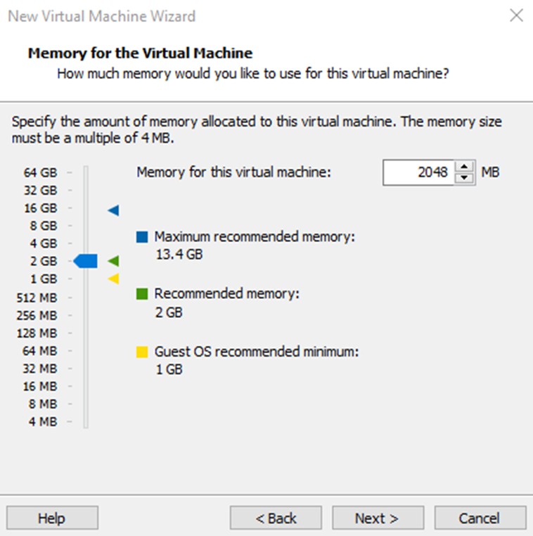
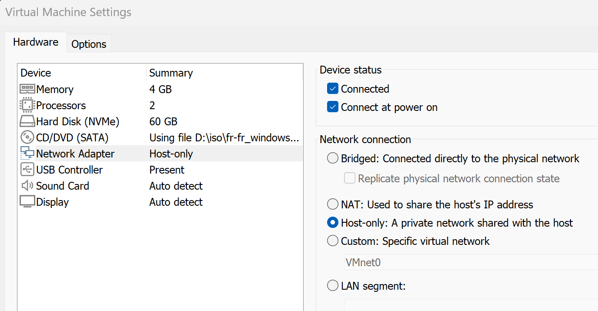
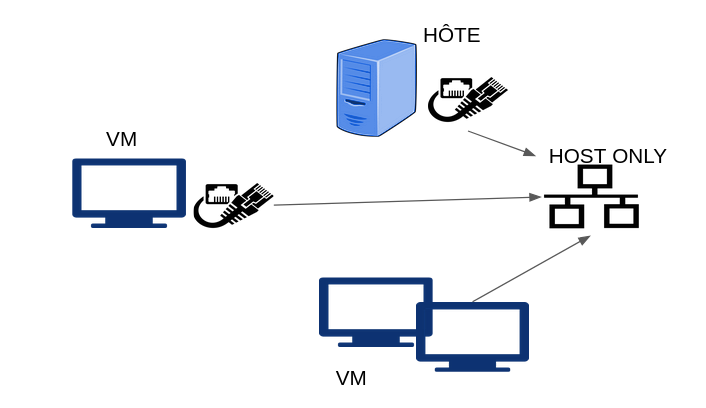
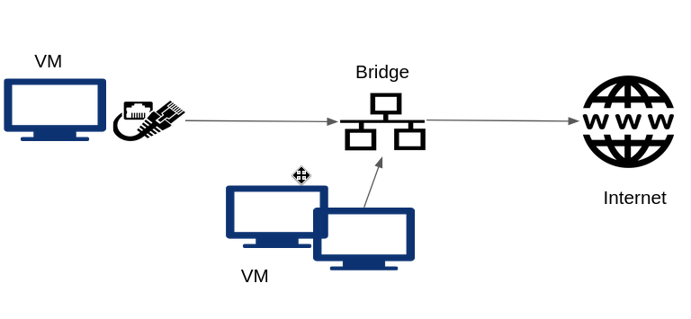
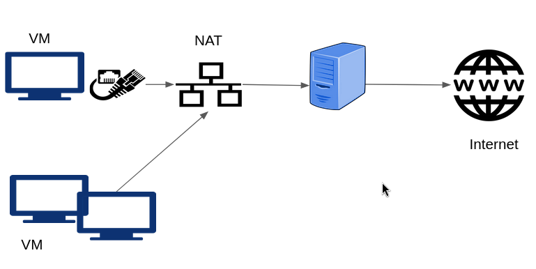
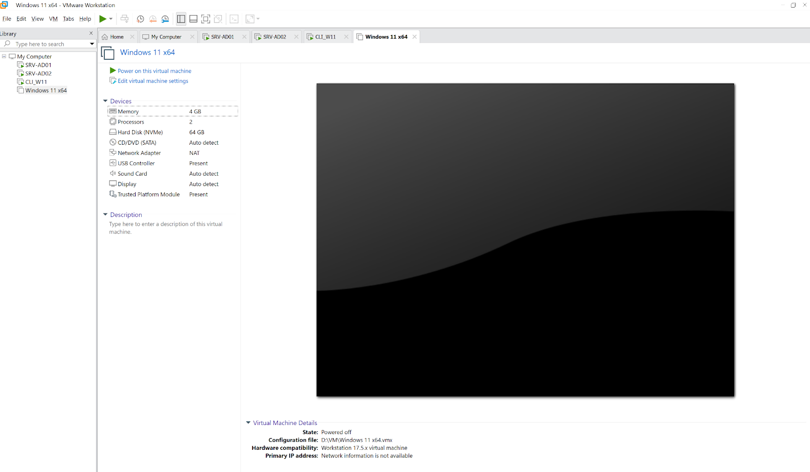
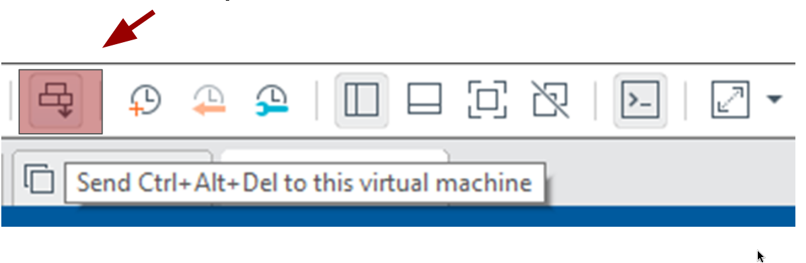

:titre: VmWare Workstation
:module: Système
:duree: 170
:description: Prise en main de l’outil Workstation avec l'installation d’une Vm Windows
include::../../../../adoc/libs/header-module.adoc[]

ifeval::["{visible-on-html}" !=  "yes"]
:docinfo: shared
:docinfodir: ../../../adoc/libs
endif::[]

== Objectifs pédagogiques

// tag::objectifs[]
* Découvrir la virtualisation des systèmes
* Gestion des ressources sur Workstation
* Gestion du réseau sur Workstation
* Création d’une VM 
* Astuce Workstation
// end::objectifs[]

// tag::deroulement[]
== Découvrir la virtualisation

=== Objectif de la virtualisation

Faire cohabiter plusieurs systèmes d’exploitation totalement indépendants les uns des autres nommés **VM (Machine Virtuelle)** ou **Machines Invités**, grâce aux ressources Physique d’une machine nommée **Machine Hôte**.

**L’hyperviseur**

* Élément clé de la virtualisation
* Fait le lien entre l'hôte et les VM
* Gère, partage et priorise les accès aux ressources de l'hôte à destination des VM

include::../../../../adoc/libs/slide-notitle.adoc[]

**Les avantages**

* IHM épurée, simple d'utilisation
* Pause, Snapshots, clonage
* Partages de dossier entre l'hôte et la machine virtuelle
* Glisser/Déposer et autres avantages grâce aux VMware Tools

include::../../../../adoc/libs/slide-notitle.adoc[]

**Les inconvénients**

* Prévu pour des maquettes simples
* Logiciel propriétaire VMware

include::../../../../adoc/libs/slide-notitle.adoc[]

**Les ressources indispensable d’une VM sont : **

* Le processeur
* La mémoire vive
* Le disque dur
* La carte réseau

== Gestion des ressources sur Workstation

=== Ressources Processeur

* Pour une VM on parle de VCPU
* Cette ressource est configurable via les propriétés de la VM
* Modifiable uniquement si la VM est éteinte 

include::../../../../adoc/libs/slide-notitle.adoc[]

[cols="1,1]
|===
a| image::./assets/02-cpu-1.png[] a| image::./assets/02-cpu-2.png[]
|===

=== La mémoire vive

* Pour une VM on parle de VRAM
* Configurable via les propriété de la VM et modifiable à chaud 
* Lorsque l’on applique de la RAM à une machine celle ci est directement allouée à la VM, attention à la capacité de l’hôte
* Cette allocation est libérée à l'arrêt de la VM

include::../../../../adoc/libs/slide-notitle.adoc[]

=== La carte réseau

La VM peut communiquer avec :

* des VM de son réseau ou de réseaux différents
* l'hôte
* d'autres machines physiques
* le monde entier

Pour cela, elle doit être connectée à un switch Virtuel

=== Les switchs virtuels

* Host-Only
* VMnet 
* Lan Segment
* Bridge
* NAT

include::../../../../adoc/libs/slide-notitle.adoc[]

== Gestion du réseau sur Workstation

=== switch virtuel Host-Only

Permet à votre VM de communiquer avec d'autres VM hébergées sur l'hôte si elles sont connectées au même réseau. 
permet également à la VM de communiquer avec l'hôte. 

La VM ne peut pas sortir sur internet

include::../../../../adoc/libs/slide-notitle.adoc[]

=== switch virtuel Bridge 

* Permet de connecter votre VM au réseau physique, c’est-à-dire au switch physique auquel est connecté votre hôte. 
* Vous pouvez dans ce cas bénéficier des services du réseau comme le DNS, le DHCP et aussi accéder à Internet

include::../../../../adoc/libs/slide-notitle.adoc[]

=== switch virtuel NAT

* Tout comme le Bridge elle permet de connecter votre VM à l'extérieur 
* Mais utilisera et empruntera l’adresse IP de la Machine Hôte 

include::../../../../adoc/libs/slide-notitle.adoc[]

== Création d'une VM

=== Vmware propose un assistant à la création de VM

[cols="1,1"]
|===

a| Dans l’assistant on choisira le mode **Typical**
a| image::./assets/04-setup.png[]

|===

=== choix de la méthode d’installation du système d’exploitation 

[cols="1,1"]
|===

a| sélectionner : **I will install the operating system later**
a| image::./assets/04-methode.png[]

|===

[NOTE.speaker]
--
si on sélectionne dès maintenant une image ISO Workstation ne nous laissera pas le choix de la personnalisation des ressources et se basera automatiquement sur les prérequis de l’OS choisi à l’étape suivante
--

=== Choix du système d’exploitation 

[cols="1,1"]
|===

a| sélectionner : **le système d’exploitation souhaité parmi ceux proposés**
a| image::./assets/04-os.png[]

|===

=== Choix du nom et de l'emplacement de la VM

Le nom choisi ici ne sera pas le nom de votre OS mais simplement son nom sur Workstation

[cols="1,1"]
|===
a| Attention : Par défaut Workstation propose d’installer la VM dans le dossier Document de l’utilisateur Connecté !!! 

Changer cela sinon vous risquez de saturer le disque C:\ de votre machine Hôte 
a| image::./assets/04-location.png[]

|===

=== Création de la ressource disque

En virtualisation le disque est un fichier de taille dynamique donc l’espace alloué à la création du disque est la taille Maximal que le disque pourra atteindre au départ il ne fera que quelques Mo

include::../../../../adoc/libs/slide-notitle.adoc[]

[cols="1,1"]
|===
a| L’assistant nous demande choisir

* La taille du disque 
* Le conditionnement du disque

**Store Virtual Disk as a single File**

permet de générer un seul fichier donc plus facile à manipuler

**Split Virtual disk into multiple files**

Éclate le disque sur plusieurs fichiers cela n’est utilisé que pour des besoins forts de lecture/écriture
a| image::./assets/04-disk.png[]

|===

=== Notre VM est créée mais aucun système d’exploitation n’est installé

=== Personnalisation

* Carte réseau en Host-only pour l’installation
* Ajout de l’ISO d’installation de l’os dans le lecteur de cd rom
* On peut ensuite démarrer l’installation de l’OS
** **lors de l’installation d’un OS windows toujours sélectionner l'option “je n'ai pas accès à internet” pour éviter la création des compte microsoft online**

include::../../../../adoc/libs/slide-notitle.adoc[]

[cols="1,1"]
|===
a| Une fois votre OS installé et que la première ouverture de session est faite il faut installer les Vmware Tools

suivre l’assistant en ne changeant aucun paramètre
a| image::./assets/04-customize.png[]
|===

== Astuce Workstation

=== Quelques trucs à connaître

Pour faire Ctrl + Alt + Suppr dans la VM, taper Ctrl + Alt + Inser
ou cliquer sur 

// tag::demo[]
== Démonstration

VmWare Workstation

[NOTE.speaker]
--
* Montrer l’outil Workstation les différents menu 
* creer une vm en expliquant chaque étape en détail 
* aller au bout d’une installation client Windows 11 et montrer l’installation des VMware tools 
* montrer la création d’un clone avec sysprep 
--
// end::demo[]
// end::deroulement[]

== Conclusion
// tag::conclusion[]
* vous êtes capable d’utiliser l’outil de virtualisation VmWare Workstation 
* d’installer des VM 
* de configurer les VM 
* de gérer le réseau 
// end::conclusion[]