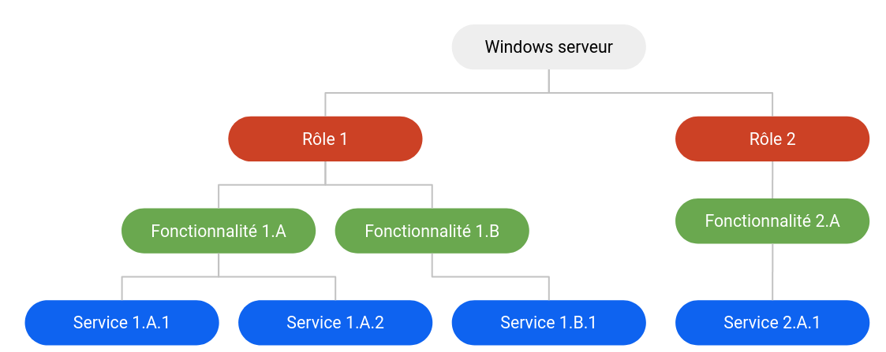
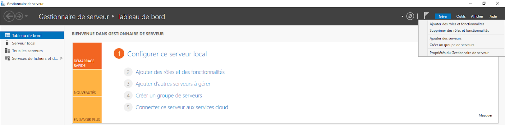

:titre: Rôles, Fonctionnalités et services
:module: Système
:duree: 90
:description: Comprendre les rôles, fonctionnalités et services de Windows Server
include::../../../../adoc/libs/header-module.adoc[]

ifeval::["{visible-on-html}" !=  "yes"]
:docinfo: shared
:docinfodir: ../../../adoc/libs
endif::[]

== Objectifs pédagogiques

// tag::objectifs[]
* Comprendre la différence entre rôle, fonctionnalités et services
* Rôles principaux pour un serveur windows
* Fonctionnalités de Windows serveur
* Les services Windows serveur
* Gestion des rôles et Fonctionnalités Graphiquement 
* Gestion des rôles et Fonctionnalités en Powershell
// end::objectifs[]

// tag::deroulement[]
== Différences entre rôles, fonctionnalités et services

* **Rôles** : permettent au serveur de remplir des fonctions spécifiques
* **Fonctionnalités** : outils ou services supplémentaires qui soutiennent les rôles ou ajoutent des capacités additionnelles 
* **Services** : programmes en arrière-plan qui fournissent les fonctionnalités nécessaires au bon fonctionnement des rôles et des fonctionnalités.

include::../../../../adoc/libs/slide-notitle.adoc[]

== Rôles de Windows Serveur

Les rôles sont des ensembles de fonctionnalités qui permettent à un serveur de remplir une fonction spécifique dans un réseau.

=== Les rôles principaux

* Active Directory Domain Services (AD DS) :Gestion des identités et de l'administration des utilisateurs et des ressources.
* DNS Serveur : Traduction des noms de domaine en adresses IP.
* DHCP Serveur : Attribution automatique d'adresses IP aux appareils sur un réseau.

include::../../../../adoc/libs/slide-notitle.adoc[]

* File and Storage Services :Partage de fichiers et gestion de l'espace de stockage.
* Hyper-V :Virtualisation des systèmes d'exploitation.
* Web Server (IIS) :Hébergement de sites web et d'applications web.
* Remote Desktop Services (RDS) :Accès à distance aux applications et bureaux virtuels.

== Fonctionnalités de Windows Serveur

Les fonctionnalités sont des outils et des services supplémentaires qui prennent en charge les rôles serveur ou fournissent des capacités supplémentaires.

=== Quelques fonctionnalités courantes

* **Failover Clustering** : Amélioration de la disponibilité des services via le clustering.
* **Windows Server Update Services (WSUS)** : Gestion des mises à jour pour les systèmes Windows dans un réseau.
* **Windows Deployment Services (WDS)** : Déploiement de systèmes d'exploitation via le réseau.
* **BitLocker Drive Encryption** : Sécurisation des données par le chiffrement des disques.
* **Network Load Balancing (NLB)** : Répartition de la charge réseau entre plusieurs serveurs.

== Services Windows Serveur

Les services sont des programmes qui fonctionnent en arrière-plan pour fournir des fonctionnalités spécifiques

=== Windows Time

* Synchronisation de l'heure sur tous les appareils d'un réseau.
* Essentiel pour la cohérence des opérations et des transactions réseau.

=== Windows Firewall with Advanced Security

* Protection contre les accès non autorisés.
* Configuration avancée des règles de pare-feu pour le contrôle des connexions réseau.

=== Print and Document Services

* Gestion des imprimantes et des documents.
* Fourniture de services d'impression réseau pour les utilisateurs.

=== Console de service

* sur le clavier touche `Win + R`
* dans la fenêtre exécuter services.msc

== Gestion des rôles et fonctionnalités graphiquement

include::../../../../adoc/libs/slide-notitle.adoc[]

Pour ajouter des rôles et des fonctionnalités sur un serveur Windows, ouvrez le **Gestionnaire de serveur** et cliquez sur **Ajouter des rôles et des fonctionnalités**. 

Suivez l'assistant pour sélectionner et installer les rôles et fonctionnalités souhaités. Redémarrez le serveur si nécessaire pour appliquer les modifications.

include::../../../../adoc/libs/slide-notitle.adoc[]

== Gestion des rôles et fonctionnalités en PowerShell

include::../../../../adoc/libs/slide-notitle.adoc[]

Pour ajouter des rôles et des fonctionnalités sur un serveur Windows via powershell 
* ouvrir une console PowerShell en tant qu’administrateur 

**Lister les rôles et fonctionnalités**

`Get-WindowsFeature`

**Installer un rôle ou une fonctionnalité**

`Install-WindowsFeature -Name nomdurole -IncludeManagementTools`

include::../../../../adoc/libs/slide-notitle.adoc[]

**Désinstaller un rôle ou une fonctionnalité**

`Uninstall-WindowsFeature -Name DHCP`

**voir les rôles et fonctionnalités installés**

`Get-WindowsFeature | Where-Object {$_.InstallState -eq "Installed"}`

// tag::demo[]
== Démonstration

Mise en place de rôles

[NOTE.speaker]
--
Sur le serveur SRV-AD01
- installer le rôle ADDS graphiquement 
- supprimer le rôle 

puis refaire l’installation via powershell
--
// end::demo[]
// end::deroulement[]

== Conclusion
// tag::conclusion[]
* Avoir compris ce qu’est un rôle, une fonctionnalité et un service
* Savoir comment implémenter ces rôles sur un serveur que ce soit via l’interface graphique ou en ligne de commande 
// end::conclusion[]