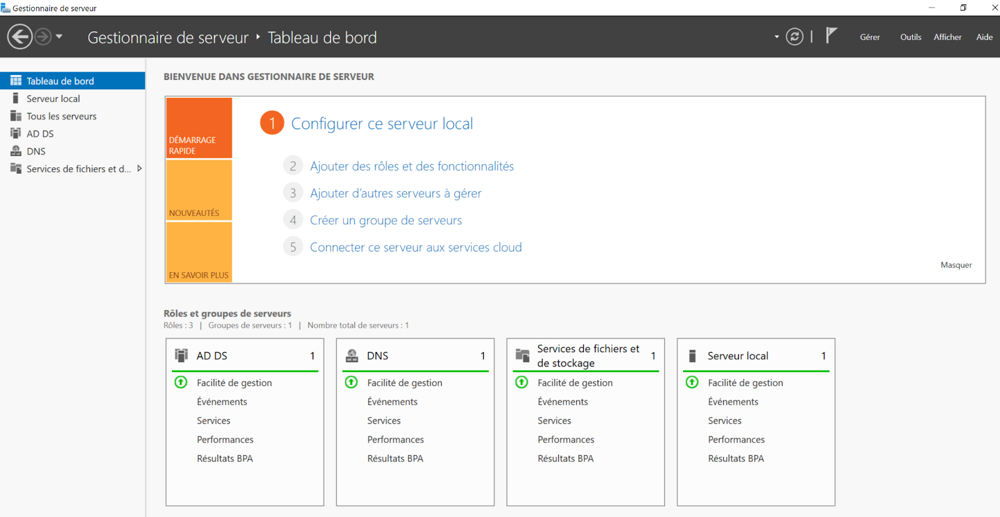

:titre: Windows serveur mode d’installation
:module: Système
:duree: 120
:description: Installation de Windows serveur en mode Core et en mode graphique
include::../../../../adoc/libs/header-module.adoc[]

ifeval::["{visible-on-html}" !=  "yes"]
:docinfo: shared
:docinfodir: ../../../adoc/libs
endif::[]

== Objectifs pédagogiques

// tag::objectifs[]
* Comprendre les méthodes d’installation de windows serveur
* intérêt du mode Core
* intérêt du mode graphique expérience de bureau
* les outils de gestion
// end::objectifs[]

// tag::deroulement[]
== Comprendre les méthodes d’installation de windows serveur

La méthode d'installation de Windows Server 2022 dépend des besoins spécifiques de l'organisation, du niveau de sécurité requis et des compétences techniques des administrateurs.

include::../../../../adoc/libs/slide-notitle.adoc[]

* **Server Core** : Pour les environnements nécessitant une performance optimale et une surface d'attaque réduite.

* **Expérience de Bureau** : Pour les administrateurs qui préfèrent une interface graphique et ont besoin d'une compatibilité maximale avec divers logiciels.

Chacune de ces méthodes présente des avantages et des inconvénients qu'il est crucial de considérer lors de la planification de l'infrastructure serveur.

== Intérêt du mode Core

=== Installation Server Core

**Avantages :**

* **Réduction de la surface d'attaque** : Moins de services et d'interfaces graphiques signifie moins de vulnérabilités potentielles.
* **Meilleure performance** : Moins de ressources sont utilisées par l'interface graphique, ce qui libère des ressources pour les applications et services.
* **Maintenance simplifiée** : Moins de composants signifie moins de correctifs et mises à jour nécessaires.

include::../../../../adoc/libs/slide-notitle.adoc[]

**Inconvénients :**

* **Complexité de gestion** : Administration principalement en ligne de commande, ce qui peut être difficile pour les administrateurs moins expérimentés.
* **Compatibilité logicielle** : Certains logiciels et outils d'administration nécessitent une interface graphique pour fonctionner correctement.

== Intérêt du mode graphique expérience de bureau

=== Installation avec Expérience de Bureau (Server with Desktop Experience)

**Avantages :**

* **Facilité d'utilisation** : Interface graphique complète, similaire à celle de Windows 10, facilitant l'administration pour les utilisateurs moins familiers avec les lignes de commande.
* **Compatibilité logicielle** : Tous les logiciels compatibles avec Windows Server peuvent être installés et utilisés sans restriction liée à l'interface.

include::../../../../adoc/libs/slide-notitle.adoc[]

**Inconvénients :**

* **Consommation de ressources** : L'interface graphique consomme plus de mémoire et de CPU.
* **Surface d'attaque accrue** : Plus de services et d'interfaces augmentent les possibilités d'attaques.

== Les outils de gestion

=== Le gestionnaire de serveur

=== Les consoles de ligne de commande

[cols="1,1"]
|===
a| 
* cmd : shell d’origine de windows
* PowerShell : langage objet
a| image::./assets/03-console.png[]
|===

include::../../../../adoc/libs/slide-notitle.adoc[]

Il est obligatoire de suivre l’état de fonctionnement et les performances des serveurs pour : 

* Garantir la disponibilité des services
* Identifier l’origine des dysfonctionnements dans un processus de dépannage
* Pour optimiser l’utilisation des ressources 

include::../../../../adoc/libs/slide-notitle.adoc[]

Les outils disponibles nativement

* Le Gestionnaire de tâches, pour un suivi immédiat et rapide
* Le Moniteur de ressources
* L’Analyseur de performances
* L’Observateur d’événements
* Windows Admin Center

===  Windows Admin Center

[cols="1,1"]
|===

a| 
* Cette console peut remplacer la console Gestionnaire de serveur
* Package MSI à déployer 
* Console de gestion web HTTPS prenant en charge différentes versions de Windows Serveur
* Utilise les composants MMC
* Intégration d’outils Azure
* Ne peut pas être installé sur un serveur avec le rôle ADDS
a| image::./assets/03-admin-center.png[]

|===

=== Gestionnaire de tâches

[cols="1,1"]
|===

a| 
* Inventorie les applications et processus en cours d’exécution
* Performances des composants : CPU / Mémoire / Disque / Réseau
* Liste des utilisateurs connectés et des services
* Raccourci `Ctrl-Shift-Echap`
a| image::./assets/03-task-manager.png[]

|===

=== Moniteur de ressources

[cols="1,1"]
|===

a| 
* Affichage des performances plus détaillé que le Gestionnaire de tâches
* Détails par processus possible sur chacun des composants
a| image::./assets/03-resource-monitor.png[]

|===

=== Analyseur de performances

[cols="1,1"]
|===

a| 
* Collecte des données
* Analyse de données collectées
* Création de rapports

l’analyseur de performances permet de mettre en place des collecteurs de données personnalisés, très utiles en cas de diagnostic car programmable 
a| image::./assets/03-perf.png[]

|===

=== L'observateur d'événements

[cols="1,1"]
|===

a| 
* Centralise les messages provenant du système, de services ou d’applications
* Les événements sont classés dans des journaux :
a| image::./assets/03-logs.png[]

|===

include::../../../../adoc/libs/slide-notitle.adoc[]

[cols="1,1"]
|===

a| 
pour analyser les journaux il faut récupérer : 

* La source de l'événement
* ID de l'événement  
a| image::./assets/03-event.png[]

|===

=== Les RSAT

**Définition :**

* Remote Server Administration Tools est un ensemble d'outils fournis par Microsoft permettant aux administrateurs IT de gérer à distance les rôles et fonctionnalités de Windows Server à partir d'un ordinateur exécutant Windows.

include::../../../../adoc/libs/slide-notitle.adoc[]

[cols="1,1"]
|===

a| 
**Utilité :**

* **Gestion à Distance** : Permet de gérer les serveurs sans avoir besoin d'un accès physique.
* **Centralisation** : Facilite l'administration de multiples serveurs depuis une seule console.
* **Productivité** : Améliore l'efficacité des administrateurs système en centralisant les outils de gestion.
a| image::./assets/03-rsat.png[]

|===

=== Composants

* **Active Directory Users and Computers (ADUC)** : Gestion des utilisateurs et ordinateurs dans Active Directory.
* **DNS Manager** : Gestion des serveurs DNS.
* **DHCP Manager** : Gestion des serveurs DHCP.
* **Server Manager** : Gestion des rôles et fonctionnalités des serveurs.
* **Hyper-V Manager** : Gestion des environnements de virtualisation Hyper-V.
* ...

=== Installation

* RSAT peut être téléchargé et installé sur les versions professionnelles ou entreprises de Windows. Depuis Windows 10 version 1809, RSAT est inclus en tant que "Fonctionnalité à la demande" et peut être activé via les paramètres de Windows.

// tag::demo[]
== Démonstration

Installation de machines virtuelles Windows Server 2022 et Windows 11

[NOTE.speaker]
--
* Montrer l’installation d’un serveur Win 2K22 sur workstation
* Montrer l'installation d’un client W11 sur Workstation avec l’ajout de la puce TPM
* Montrer les outils de gestion
* Créer un collecteur de données et montrer la manipulation de plannification car présente dans le tp

1. Programmer l’exécution de la collecte afin qu’elle ait lieu dans 10 minutes à compter de l’heure actuelle et qu’elle s’arrête au bout de 10 minutes.
 Cette tâche sera répétée tous les jours de la semaine sauf le dimanche
                          	
2. Une fois la tâche planifiée, suivre les actions de résolution suivantes pour que cela puisse fonctionner :

* Exécuter le planificateur de tâches et se rendre dans le conteneur Microsoft\Windows\PLA
* Sélectionner l’objet portant le nom de votre ensemble de collecteur de données et cliquer sur Propriétés
* Dans l’onglet Général, sélectionner Configurer pour : Windows Server 2022
* Dans l’onglet Actions, sélectionner Gestionnaire personnalisé puis supprimer*le
* Cliquer sur le bouton Nouveau…, puis indiquer :
** Programme :
 C:\windows\system32\rundll32.exe
** Ajouter des arguments :
C:\windows\system32\pla.dll,PlaHost "NomDeVotreCollecteur" "$(Arg0)"
* Valider et fermer les boites de dialogue, puis le planificateur de tâches
--
// end::demo[]
// end::deroulement[]

== Conclusion
// tag::conclusion[]
* Compréhension des deux principaux mode d’installation de windows Serveur
* Installation d’une machine virtuelle  Windows serveur 2022 
* Installation d’une machine virtuelle  Windows serveur 2022 
* Connaissance des différents outils permettant la gestion au quotidien
// end::conclusion[]