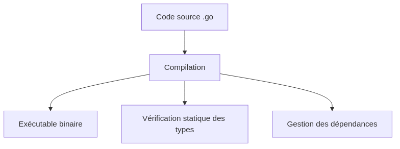
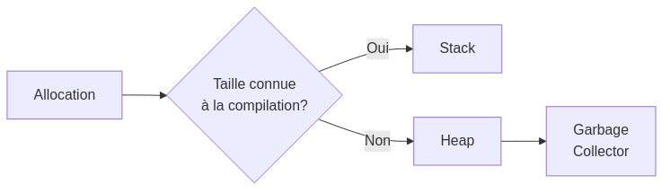

:titre: Introduction au langage Go
:module: Golang
:duree: 60
:description: Découverte du langage Go, son écosystème et ses spécificités.
include::../../../../adoc/libs/header-module.adoc[]

ifeval::["{visible-on-html}" !=  "yes"]
:docinfo: shared
:docinfodir: ../../../adoc/libs
endif::[]

// tag::objectifs[]
// Sous forme de liste à puce, en utilisant la taxonomie de Bloom
* *Comprendre* l'écosystème Go et ses spécificités
* *Appliquer* l'installation de l'environnement de développement Go
* *Analyser* la structure d'un projet Go
// end::objectifs[]

// tag::deroulement[]
== Introduction à Go

Go (ou Golang) est un langage de programmation open source développé par Google. Il a été créé en 2007 par Robert Griesemer, Rob Pike et Ken Thompson.

.Principales caractéristiques
* Langage compilé
* Typage statique fort
* Gestion automatique de la mémoire (garbage collection)
* Support natif de la concurrence
* Compilation rapide
* Outillage riche

=== Introduction à Go



== Installation de l'environnement

=== Installation de Go

1. Télécharger Go depuis le site officiel : https://golang.org/dl/
2. Suivre les instructions d'installation selon votre système d'exploitation
3. Vérifier l'installation :

```bash
go version
```

=== Configuration de l'environnement

Les variables d'environnement importantes :

* `GOPATH` : Répertoire de travail Go
* `GOROOT` : Installation de Go
* `PATH` : Doit inclure `$GOROOT/bin` et `$GOPATH/bin`

[NOTE.speaker]
--
Il est important d'expliquer que depuis Go 1.11, les modules Go ont changé la façon dont on gère les dépendances et le GOPATH n'est plus aussi crucial qu'avant.
--

=== Éditeurs recommandés

* Visual Studio Code avec l'extension Go
* GoLand (JetBrains)
* Vim/Neovim avec les plugins Go
* Sublime Text avec le package Go

== Structure d'un projet Go

=== Organisation des fichiers

```
monprojet/
├── go.mod
├── go.sum
├── main.go
├── internal/
│   └── pkg1/
│       └── pkg1.go
└── pkg/
    └── pkg2/
        └── pkg2.go
```

=== Modules Go

Le fichier `go.mod` définit :
* Le nom du module
* La version de Go requise
* Les dépendances

.Exemple de go.mod
```go
module monprojet

go 1.21

require (
    github.com/gin-gonic/gin v1.9.1
)
```

=== Conventions de nommage

* Packages : noms courts, en minuscules
* Fichiers : snake_case.go
* Fonctions et variables exportées : PascalCase
* Fonctions et variables privées : camelCase

== Spécificités de Go

=== Typage statique

Go est fortement typé :

```go
var age int = 25
name := "John" // Inférence de type
```

=== Gestion de la mémoire

* Garbage collection automatique
* Pas de gestion manuelle de la mémoire
* Allocation sur la pile quand possible



=== Caractéristiques distinctives

* Pas d'héritage (composition sur l'héritage)
* Pas d'exceptions (gestion d'erreurs explicite)
* Goroutines pour la concurrence
* Interfaces implicites
// end::deroulement[]

// tag::demo[]
== Démonstration 1 : Premier programme Go

[NOTE.speaker]
--
Nous allons créer un premier programme Go et explorer la structure du projet.

1. Créer un nouveau répertoire : `mkdir hello-world`
2. Initialiser un module : `go mod init hello-world`
3. Créer main.go :
+
```go
package main

import "fmt"

func main() {
    fmt.Println("Hello, World!")
}
```
4. Exécuter : `go run main.go`
5. Compiler : `go build`
--

== Démonstration 2 : Types et fonctions

[NOTE.speaker]
--
Démonstration des types de base et création de fonctions.

```go
package main

import "fmt"

type Person struct {
    Name string
    Age  int
}

func (p Person) SayHello() {
    fmt.Printf("Hello, my name is %s and I'm %d years old\n", p.Name, p.Age)
}

func main() {
    person := Person{Name: "Alice", Age: 30}
    person.SayHello()
}
```
--
// end::demo[]

// tag::exercice[]
== Exercice 1 : Installation et configuration

1. Installez Go sur votre machine
2. Configurez votre éditeur préféré avec le support Go
3. Vérifiez que tout fonctionne en créant et exécutant un programme "Hello, World!"

== Exercice 2 : Structure de projet

Créez un projet Go avec la structure suivante :

1. Un package principal avec une fonction main
2. Un package interne avec une structure et des méthodes
3. Un test unitaire pour le package interne

// end::exercice[]

== Conclusion

// tag::conclusion[]
* Go est un langage moderne avec un focus sur la simplicité et l'efficacité
* L'environnement de développement est riche et bien pensé
* La structure des projets est conventionnée et claire
* Les spécificités du langage en font un excellent choix pour les applications modernes
// end::conclusion[]