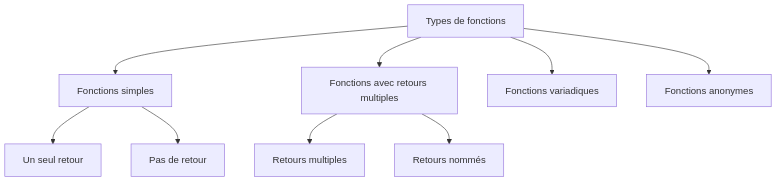

:titre: Fonctions et modularité en Go
:module: Golang
:duree: 120
:description: Maîtrise des fonctions et de l'organisation modulaire du code en Go.
include::../../../../adoc/libs/header-module.adoc[]

ifeval::["{visible-on-html}" !=  "yes"]
:docinfo: shared
:docinfodir: ../../../adoc/libs
endif::[]

// tag::objectifs[]
// Sous forme de liste à puce, en utilisant la taxonomie de Bloom
* *Comprendre* les différents types de fonctions en Go
* *Appliquer* les principes de modularité dans le code
* *Créer* des fonctions réutilisables et bien organisées
* *Analyser* la pertinence des différents types de fonctions selon le contexte
// end::objectifs[]

// tag::deroulement[]
== Les fonctions en Go

=== Syntaxe de base

[source,go]
----
// Fonction simple avec un retour
func add(a, b int) int {
    return a + b
}

// Fonction sans retour (procédure)
func printGreeting(name string) {
    fmt.Printf("Hello, %s!\n", name)
}

// Fonction avec multiples paramètres du même type
func sum(values ...int) int {
    total := 0
    for _, v := range values {
        total += v
    }
    return total
}
----

=== Retours multiples

[source,go]
----
// Fonction avec plusieurs valeurs de retour
func divide(a, b float64) (float64, error) {
    if b == 0 {
        return 0, errors.New("division by zero")
    }
    return a / b, nil
}

// Fonction avec retours nommés
func rectangle(width, height float64) (area, perimeter float64) {
    area = width * height
    perimeter = 2 * (width + height)
    return // retourne automatiquement area et perimeter
}
----

=== Retours multiples



=== Fonctions avancées

[source,go]
----
// Fonction comme type
type Operation func(int, int) int

// Fonction qui prend une fonction en paramètre
func calculate(a, b int, op Operation) int {
    return op(a, b)
}

// Fonction anonyme (closure)
func counter() func() int {
    count := 0
    return func() int {
        count++
        return count
    }
}
----

== Modularité du code

=== Organisation en packages

```
project/
├── main.go
├── math/
│   ├── operations.go
│   └── operations_test.go
└── utils/
    ├── helpers.go
    └── helpers_test.go
```

=== Visibilité des fonctions

[source,go]
----
// math/operations.go
package math

// Fonction exportée (publique)
func Add(a, b int) int {
    return a + b
}

// fonction non exportée (privée)
func validate(n int) bool {
    return n >= 0
}
----

=== Bonnes pratiques

* Une fonction doit avoir une seule responsabilité
* Noms descriptifs pour les fonctions
* Documentation des fonctions exportées
* Tests unitaires pour chaque fonction

[source,go]
----
// Bonne pratique : documentation
// Calculate returns the result of the mathematical operation
// specified by the operator on two numbers.
func Calculate(a, b float64, operator string) (float64, error) {
    switch operator {
    case "+":
        return a + b, nil
    case "-":
        return a - b, nil
    default:
        return 0, errors.New("unsupported operator")
    }
}
----

== Test unitaire et documentation en Go

=== Introduction aux tests unitaires

Go a un support intégré pour les tests unitaires via le package `testing`.

.Exemple de test unitaire (math_test.go)
[source,go]
----
package main

import "testing"

func TestAdd(t *testing.T) {
    result := Add(2, 3)
    if result != 5 {
        t.Errorf("Add(2, 3) = %d; want 5", result)
    }
}
----

Pour exécuter les tests : `go test`

=== Documentation de code

Go encourage la documentation du code directement dans les fichiers source.

[source,go]
----
// Add returns the sum of two integers.
// It demonstrates a simple addition operation.
func Add(a, b int) int {
    return a + b
}
----

Utilisez `go doc` pour générer la documentation à partir de ces commentaires.

// end::deroulement[]

// tag::demo[]
== Démonstration 1 : Création d'une bibliothèque de calcul

[NOTE.speaker]
--
Nous allons créer une bibliothèque de fonctions mathématiques réutilisables.

```go
package calculator

// Operation représente une fonction mathématique
type Operation func(float64, float64) float64

// Calculator contient des opérations mathématiques
type Calculator struct {
    operations map[string]Operation
}

// NewCalculator crée une nouvelle instance de Calculator
func NewCalculator() *Calculator {
    calc := &Calculator{
        operations: make(map[string]Operation),
    }
    
    // Enregistrement des opérations de base
    calc.RegisterOperation("+", func(a, b float64) float64 {
        return a + b
    })
    calc.RegisterOperation("-", func(a, b float64) float64 {
        return a - b
    })
    
    return calc
}

// RegisterOperation ajoute une nouvelle opération
func (c *Calculator) RegisterOperation(symbol string, op Operation) {
    c.operations[symbol] = op
}

// Calculate effectue l'opération demandée
func (c *Calculator) Calculate(a, b float64, symbol string) (float64, error) {
    if op, exists := c.operations[symbol]; exists {
        return op(a, b), nil
    }
    return 0, errors.New("unknown operation")
}
```
--

== Démonstration 2 : Utilisation des closures

[NOTE.speaker]
--
Nous allons démontrer l'utilisation des closures pour créer des compteurs.

```go
package main

import "fmt"

// Création d'un générateur de compteur
func createCounter(start int) func() int {
    count := start
    return func() int {
        count++
        return count
    }
}

func main() {
    // Création de deux compteurs indépendants
    counter1 := createCounter(0)
    counter2 := createCounter(10)
    
    fmt.Println(counter1()) // 1
    fmt.Println(counter1()) // 2
    fmt.Println(counter2()) // 11
    fmt.Println(counter2()) // 12
}
```
--
// end::demo[]

// tag::exercice[]
== Exercice 1 : Bibliothèque de validation

Créez une bibliothèque de fonctions de validation avec :

1. Validation d'email
2. Validation de numéro de téléphone
3. Validation de mot de passe
4. Tests unitaires pour chaque fonction

== Conclusion

// tag::conclusion[]
* Les fonctions en Go sont des citoyens de première classe
* La modularité permet une meilleure organisation du code
* Les closures offrent une grande flexibilité
* Une bonne organisation améliore la maintenabilité
// end::conclusion[]