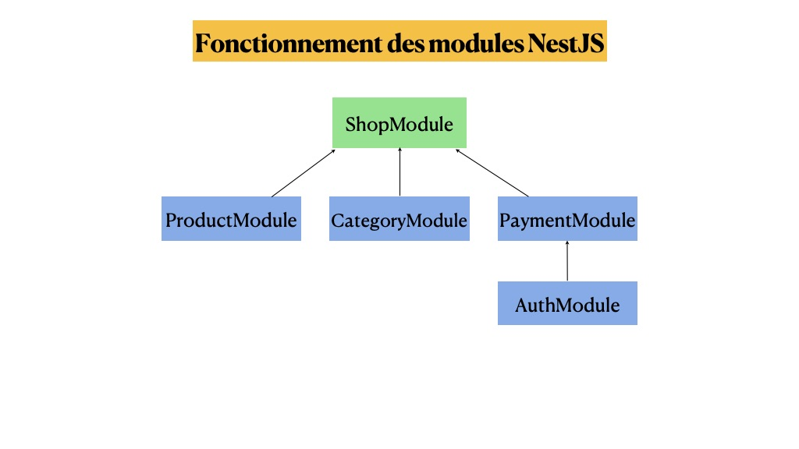
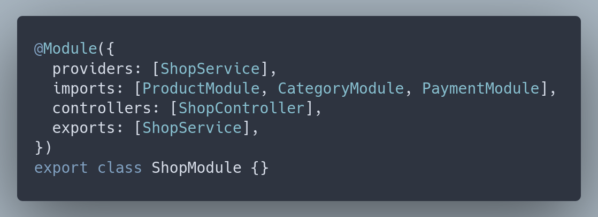

:titre: Mise en place de l'environnement
:module: nestJs
:duree: 30
:description: Savoir installer NestJS
include::../../../../adoc/libs/header-module.adoc[]

ifeval::["{visible-on-html}" !=  "yes"]
:docinfo: shared
:docinfodir: ../../../adoc/libs
endif::[]

== Objectifs pédagogiques
// tag::objectifs[]
* **Comprendre** le rôle et l'utilité de la CLI NestJS
* **Appliquer** l'installation et la configuration de base de NestJS
* **Comprendre** l'organisation modulaire d'une application NestJS
* **Appliquer** l'intégration d'un moteur de template (EJS)
// end::objectifs[]

// tag::deroulement[]
== Installation de NestJS CLI

`CLI` veut dire `Command Line Interface`

[NOTE.speaker]
--
NestJS dispose d'une CLI, qui sert à créer un projet NestJS, mais aussi à plein d'autres actions que nous découvrirons au fur et à mesure.

https://en.wikipedia.org/wiki/Command-line_interface[Définition de CLI sur wikipedia]

Direction la documentation et on la suit à la lettre :

https://docs.nestjs.com/#installation[Installation de la CLI NestJS]
--

== Bon à savoir

:tip-caption: 💡
[TIP]

====
La documentation de NestJs est très accessible et bien conçue, reflétant le travail des développeurs pour la rendre agréable, ce qui contribue au succès du framework.

____
Savoir écrire une documentation, un petit ou un grand README est un talent qui se travaille et qu'il ne faut pas négliger.
____

====

// tag::demo[]
== Démonstration 01

Installation de la CLI et première application

[NOTE.speaker]
--
*Installation de la CLI*

Exécutez la commande suivante (Il faudra peut-être utiliser `sudo`, ça dépend comment on installe `nodejs`) :

`npm i -g @nestjs/cli`

Cette commande vient installer la CLI sur notre machine, on s'en sert ensuite pour travailler avec NestJS : création d'applications et de fichiers avec du code https://en.wikipedia.org/wiki/Boilerplate_code[boilerplate].

Nous sommes fin prêt pour nous servir de NestJS 😃

Faire la commande `nest -h` et découvrir ensemble quelques commandes.

Bon à savoir : Si on utilise un outil comme `nvm` pour installer node, on n'aura pas besoin de `sudo`.

*Création d'une première application MVC*

Pour cette introduction, nous allons générer une application MVC traditionnelle, on va donc créer l'application avec la CLI, et installer le moteur de template `ejs` avec `npm`.

https://docs.nestjs.com/first-steps[Création d'une app avec la CLI]

Faire la commande suivante pour créer une application NestJS : `nest new notes`

La CLI a produit une application NestJS et on peut déjà commencer à travailler.
--
// end::demo[]

== Première analyse rapide

Commençons par analyser ce que nous fournit NestJS, particulièrement ce qu'on trouve dans le répertoire `src` :

[source,bash]
----
src
├── app.controller.spec.ts
├── app.controller.ts
├── app.module.ts
├── app.service.ts
├── main.ts
----

Ce sont les fichiers _racine_ ou _le noyau_ de NestJS.

[NOTE.speaker]
--
À partir de là, on lit les fichiers et on essaye de comprendre ce qu'ils contiennent, bien sûr, on s'accompagne de la doc. Ces fichiers représentent le point d'entrée de l'application, mais aussi l'endroit où l'on va _brancher_ nos modules. C'est pour cela qu'on parle de _noyau_.
--

== Analyse : notre point de départ

`app.module.ts`	Le module cœur de l'application.

`main.ts`	Le point d'entrée de l'application.

:tip-caption: 💡
[TIP]

====
* À ce stade, on peut effacer les fichiers `.spec.ts`, ce sont des fichiers qui servent à faire des tests automatisés, on n'en aura pas besoin tout de suite.
====

// tag::demo[]
== Démonstration 02

Configuration 

[NOTE.speaker]
--
*Les vues dynamiques : intégration d'EJS*

On installe EJS, un moteur de template javascript, puis on le branche dans `Nest`.

[source ,bash]
----
npm i ejs --save
----

Comme avec Express, il faut dire au framework ou trouver les vues, les fichiers statiques, et les fichiers dynamiques. `.ejs`.

Pour ça on bénéficie de méthodes dites `helpers` pour nous aider :

[source ,typescript]
----
// main.ts
// Les fichiers statiques
app.useStaticAssets(join(__dirname, '..', 'public'));
// Les vues ejs
app.setBaseViewsDir(join(__dirname, '..', 'views'));
// Le moteur de template
app.setViewEngine('ejs');
----

Ajouter les trois lignes précédentes à la méthode `bootstrap` suffisent à configurer notre application avec `ejs`.
--
// end::demo[]

== Attention

:tip-caption: 💡
[TIP]
====
*__
Ne pas oublier la ligne suivante en haut du fichier :
__*

[source ,typescript]
----
import { join } from 'path';
----
====

== Analyse

Chaque app a au moins un module qui représente le point de départ de l'application.

Les modules sont une façon de s'organiser par composants, souvent un module représente une feature.

On a l'habitude d'avoir un répertoire par module, un module peut être importé dans d'autres modules.

On déclare un module avec le décorateur `@Module`.

== Analyse : Les modules

Un module est fait de plusieurs propriétés :

* Des providers
* Des contrôleurs
* Les exports : des providers que l'on exporte vers d'autres modules : les modèles par exemple.
* Les imports : c'est une liste de module requis par un module et qui sont les exports d'autres modules.

=== Analyse : Les modules

Au vu de cette définition, on voit qu'il est nécessaire de comprendre l'injection de dépendances.

Ça donne le tournis et c'est normal, c'est l'injection de dépendances qui fait qu'on a l'impression d'avoir affaire à une boucle.

== Schémas

Le schéma suivant tente d'illustrer le fonctionnement des modules, un exemple de code le suit.

== Schéma de fonctionnement des modules

[NOTE.speaker]
--
Le schéma montre que le module `ShopModule` a besoin d'autres modules pour fonctionner correctement, il a besoin des produits donc on lui injecte `ProductModule` etc etc.
--

== Exemple de code correspondant au schéma précédent

// tag::exercice[]
== Exercice

1. En autonomie et avec la doc sous les yeux, installer la `CLI`.
2. Créer une application donc le nom est `shop`.
3. Mettre en place `ejs`.
4. Mettre en place le type <NestExpressApplication> (exploratoire)

[NOTE.speaker]
--
*Solution* 

1. En autonomie et avec la doc sous les yeux, installer la `CLI`.
** `npm i -g @nestjs/cli` (Éventuellement avec sudo)

2. Créer une application donc le nom est `shop`.
** `nest new shop`

3. Mettre en place `ejs`.
** `npm i ejs`

+
[source,typescript]
----
// main.ts
// Les fichiers statiques
app.useStaticAssets(join(__dirname, '..', 'public'));
// Les vues ejs
app.setBaseViewsDir(join(__dirname, '..', 'views'));
// Le moteur de template
app.setViewEngine('ejs');
----

4. Mettre en place le type <NestExpressApplication>.
+
[source,typescript]
----
import { NestExpressApplication } from '@nestjs/platform-express';
// ...
const app = await NestFactory.create<NestExpressApplication>(AppModule);
----
--
// end::exercice[]

// end::deroulement[]

== Conclusion
// tag::conclusion[]
* Maîtrise de l'installation de la CLI NestJS et création d'un nouveau projet
* Compréhension de la structure de base d'une application NestJS
* Capacité à configurer un projet NestJS avec un moteur de template
* Familiarisation avec l'organisation modulaire de NestJS
// end::conclusion[]