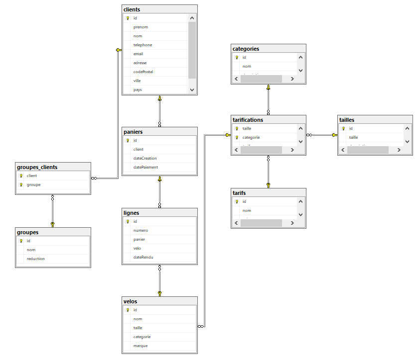
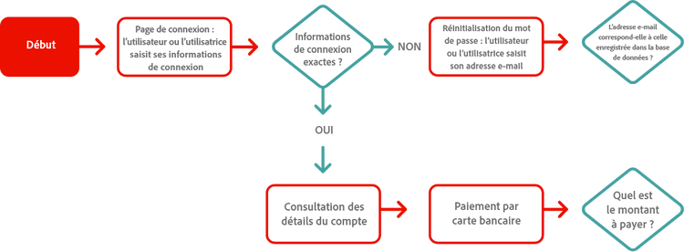
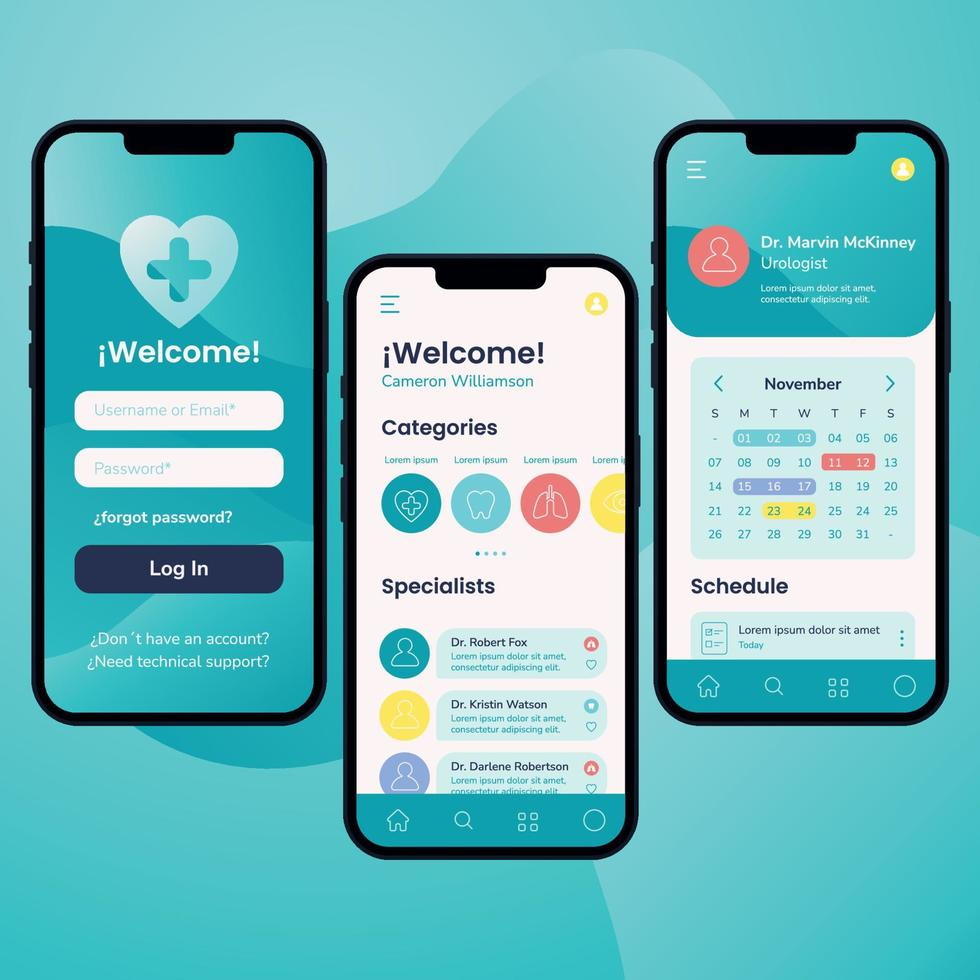

:titre: Introduction au Cours : Analyse et Conception
:module: Analyse et Conception de Projet
:duree: 80
:description: Introduction à l'importance de l'analyse dans le cadre de la conception de projet, afin de comprendre le besoin client, élaborer des solutions cohérentes, et structurer un projet de manière efficace.

include::../../../../adoc/libs/header-module.adoc[]

ifeval::["{visible-on-html}" != "yes"]
:docinfo: shared
:docinfodir: /app/adoc/libs
endif::[]

== Objectifs pédagogiques

// tag::objectifs[]
* Comprendre pourquoi l'analyse est indispensable avant de commencer un projet.
* Savoir établir un cahier des charges et identifier ses incohérences.
* Apprendre à analyser un brief client en repérant les contradictions ou manques.
* Créer des schémas de flux pour visualiser et structurer les interactions d'un projet.
// end::objectifs[]

[NOTE.speaker]
====
Dans cette introduction, nous allons explorer l’importance de l’analyse de projet, qui aide à éviter des erreurs coûteuses. Nous verrons comment interpréter les besoins du client et structurer les étapes pour parvenir à une conception efficace et cohérente. Chaque chapitre abordera un aspect clé de l’analyse, du contexte à la collecte d’informations, jusqu’à l’analyse critique du projet.
====

// tag::deroulement[]

== Pourquoi l'Analyse est-elle Cruciale ?

L'analyse permet de réfléchir aux besoins avant de démarrer le développement et aide à éviter les erreurs coûteuses.

Exemples :

* Le client souhaite une application GPS, mais on développe une application pour Windows.
* Un client veut vendre en ligne, mais on construit un magasin physique.
* Un produit innovant est développé sans étude de marché.

[NOTE.speaker]
====
L’analyse est une étape incontournable pour garantir la réussite d’un projet, quelle que soit sa taille. Cette étape permet d’éviter des erreurs fondamentales dues à une mauvaise compréhension des attentes ou à un manque de planification, comme développer une application pour une mauvaise plateforme. Nous utiliserons ces exemples pour illustrer les pièges que l’analyse permet d’éviter.
====

== Le Contexte de Projet

Chaque projet s'inscrit dans un contexte particulier qui influence sa réalisation, avec des contraintes spécifiques.

* Réglementations
* Contraintes techniques
* Urgence et budget
* Concurrence
…

[NOTE.speaker]
====
Le contexte d’un projet est crucial : il inclut les règles et contraintes qui encadrent sa réalisation. Par exemple, un projet peut être affecté par des réglementations spécifiques ou par des limitations budgétaires qui influencent les choix de conception. Nous aborderons des exemples concrets pour montrer comment bien analyser ce contexte pour limiter les obstacles.
====

== Collecte des Informations

La collecte d'informations est essentielle pour bien comprendre le projet et définir les objectifs.

[NOTE.speaker]
====
La collecte d’informations est une étape clé qui constitue la fondation d’un projet bien structuré et réussi. Elle commence souvent par un brief client, qui peut être ambigu ou incomplet. Il est alors crucial d’approfondir ce document par des questions pertinentes afin de clarifier les besoins réels. Nous verrons ensemble comment poser les bonnes questions et naviguer dans ces échanges.

Ensuite, le cahier des charges joue un rôle central : il formalise les attentes, les contraintes et les objectifs du projet, engageant toutes les parties. Nous mettrons en lumière l’importance de ce document et son rôle pour éviter les malentendus.

Enfin, les maquettes et schémas, tels que les diagrammes UML, aident à visualiser les interactions et les flux du projet. Ces outils permettent de structurer la réflexion et de mieux communiquer avec les parties prenantes.
====

=== Brief client

Le brief est un document souvent flou, nécessitant des échanges avec le client pour obtenir une vision plus claire.

*Question réflexive :* Que recherchez-vous si le brief reste incomplet ? Quelles questions poseriez-vous au client ?

[NOTE.speaker]
====
Le brief client est souvent le premier document que vous recevez lorsque vous démarrez un projet. Cependant, il est rare qu’il soit complet ou précis. Il reflète les idées initiales du client, mais ces idées peuvent manquer de clarté ou contenir des contradictions.

Votre rôle est d’aller au-delà de ce document pour comprendre les véritables besoins du client. Cela nécessite un dialogue actif, où vous posez des questions ciblées pour combler les zones d’ombre. Par exemple :

* Quels sont les objectifs à long terme du projet ?
* Quelles sont les fonctionnalités essentielles et celles qui sont secondaires ?
* Y a-t-il des contraintes techniques, réglementaires ou budgétaires non mentionnées ?
====

=== Cahier des charges

Document précis, rédigé par le chef de projet et le client, qui décrit les objectifs, attentes, et contraintes du projet. Ce document engage toutes les parties.

[NOTE.speaker]
====
Le cahier des charges est un document fondamental qui formalise les attentes, les objectifs et les contraintes du projet. Contrairement au brief client, il est bien plus détaillé et structuré, car il est le fruit d’un travail collaboratif entre le client et le chef de projet.

Ce document sert de référence tout au long du projet et engage toutes les parties prenantes. Il doit répondre à des questions clés :

* Quels sont les livrables attendus ?
* Quelles contraintes doivent être respectées (budgétaires, techniques, réglementaires) ?
* Quels sont les indicateurs de succès du projet ?

Un bon cahier des charges limite les risques de dérive et assure une compréhension commune des objectifs. Cependant, sa rédaction nécessite une collaboration étroite, car un cahier des charges imprécis ou incomplet peut conduire à des désaccords ou des erreurs dans la réalisation du projet.
====

=== Maquettes et Schémas

Les maquettes et schémas, tels que des schémas de flux et des diagrammes d'entités, aident à visualiser les interactions du projet.

Illustrations présentées dans les trois slides suivantes:

* Diagramme d'entités pour une base de données
* Schéma de flux pour une application
* Maquette montrant les interactions utilisateur d'un produit fini.

[NOTE.speaker]
====
La collecte d’informations est un fondement indispensable pour garantir la précision du projet. Elle inclut le brief client et le cahier des charges, chacun servant à clarifier les attentes du client. Les maquettes et schémas permettent aussi de visualiser le produit final et ses interactions. Nous verrons comment exploiter ces outils pour une compréhension approfondie des besoins.
====

=== Diagramme d'entités pour une base de données

[NOTE.speaker]
====
Un diagramme d'entités pour une base de données est un schéma visuel qui représente les différentes entités (comme des tables) et leurs relations (liens) dans une base de données. Chaque entité correspond à un type d'information (par exemple, "Utilisateurs" ou "Produits") et inclut des attributs (comme le nom, l'email, ou le prix). Ce diagramme aide à organiser et comprendre comment les données sont connectées.
====

=== Schéma de flux pour une application

[NOTE.speaker]
====
Un schéma de flux pour une application est un diagramme qui montre comment les informations ou les actions circulent entre les différentes parties d'une application. Il représente les étapes, les décisions et les interactions (comme entre un utilisateur et l'application) de manière visuelle. Cela permet de comprendre et de structurer le fonctionnement global de l'application avant de commencer son développement.
====

=== Maquette montrant les interactions utilisateur d'un produit fini

[NOTE.speaker]
====
Une maquette montrant les interactions utilisateur d'un produit fini est une représentation visuelle qui illustre à quoi ressemblera une interface utilisateur et comment les utilisateurs interagiront avec elle. Elle montre les éléments comme les boutons, menus ou formulaires, et décrit les actions possibles, comme cliquer, remplir un champ ou naviguer entre les pages. C'est un outil clé pour concevoir et valider l'expérience utilisateur avant le développement.
====

== Analyse et Critiques

Cette étape permet de déceler les incohérences et contradictions du projet.

[NOTE.speaker]
====
L’analyse critique est une étape essentielle pour garantir la qualité et la cohérence d’un projet. Elle permet de repérer les incohérences, les contradictions et les manques dans les documents de référence, comme le brief client ou le cahier des charges. Nous verrons comment identifier ces problèmes et proposer des solutions pour les résoudre.
====

=== Identifier les incohérences, contradictions et manques

* Exemple : Pour une application de vente en ligne :
  * Le modèle conceptuel des données n’a pas d’entité pour les clients.
  * Les maquettes n'ont pas de vue pour le panier.
  * Le cahier des charges omet la fonctionnalité de paiement.

*Question réflexive :* Quels autres éléments pourraient manquer dans une application de vente en ligne ?

[NOTE.speaker]
====
Quels autres éléments pourraient manquer dans une application de vente en ligne ? Pensez à toutes les fonctionnalités essentielles pour une expérience utilisateur complète.
====

=== Éclaircir, Guider et Proposer des Solutions

Le prestataire guide le client en lui apportant des solutions aux problèmes détectés. 

* Exemple : Pour une application de vente en ligne :
  * Le client n’est pas informé des options de paiement en ligne.
  * Le client n’a pas pensé à automatiser la livraison.

[NOTE.speaker]
====
Il est crucial de guider le client en lui proposant des solutions pratiques et adaptées à ses besoins spécifiques.
====

=== Apporter son Expertise

En tant qu'expert, il est nécessaire de partager son savoir pour éclairer les choix du client et proposer des solutions viables.

* Exemple : Le client veut un site Desktop, alors que la majorité des utilisateurs sont sur mobile.

[NOTE.speaker]
====
En tant qu'expert, il est important de conseiller le client sur les meilleures pratiques et les tendances actuelles pour garantir le succès de son projet.
====

== Exercice
// tag::exercice[]
*Exercice : Analyse et critique d’un brief client.*

link:https://github.com/O-clock-Teach/AnalyseEtConception/blob/main/01Introduction/AnalyseEtCritiqueDUnBriefClient.adoc[Exercice,window=_blank]

link:https://github.com/O-clock-Teach/AnalyseEtConception/blob/main/01Introduction/Correction.adoc[Correction,window=_blank]
// end::exercice[]

[NOTE.speaker]
====
Dans cet exercice pratique (Disponible après la conclusion), nous mettrons en application les compétences acquises pour analyser un brief client. L’objectif est de repérer les incohérences et de formuler des questions qui permettront de clarifier les besoins réels. Cet exercice renforce l’importance de l’analyse dans la phase de préparation d’un projet.
====

// end::deroulement[]

== Conclusion

// tag::conclusion[]
* L'analyse est une étape indispensable à la réussite d'un projet.
* Il est essentiel de poser des questions et de clarifier les demandes pour éviter toute confusion.
* Partager son expertise dès l'analyse améliore la qualité et la cohérence du projet final.

[NOTE.speaker]
====
En conclusion, l’analyse est un pilier essentiel du succès d’un projet. Elle permet non seulement de clarifier les attentes du client, mais aussi de renforcer la cohérence et la viabilité de la solution développée. Une bonne analyse garantit un projet mieux structuré, en phase avec les besoins, et respectueux des contraintes identifiées.
====
// end::conclusion[]
