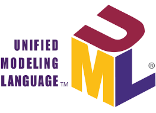

:titre: Introduction à UML
:module: UML
:duree: 10
:description: Découvrir et comprendre le langage de modélisation UML et ses applications.
include::../../../../adoc/libs/header-module.adoc[]

ifeval::["{visible-on-html}" !=  "yes"]
:docinfo: shared
:docinfodir: ../../../adoc/libs
endif::[]

== Objectifs pédagogiques

// tag::objectifs[]
* Définir ce qu'est UML et son utilité dans le développement logiciel.
* Découvrir les différents types de diagrammes UML.
* Comprendre les avantages et inconvénients d'UML dans la modélisation d'applications.
// end::objectifs[]

// tag::deroulement[]
== Qu'est-ce qu'UML ?

UML (Unified Modeling Language) est un langage standardisé de modélisation qui permet de représenter visuellement la structure et le comportement des systèmes logiciels.

[NOTE.speaker]
====
UML est un langage de modélisation standardisé largement utilisé pour concevoir et documenter les architectures de logiciels. Développé dans les années 1990, il offre une syntaxe visuelle et universelle qui facilite la compréhension entre développeurs, analystes, et autres parties prenantes d’un projet.
====

== Pourquoi utiliser UML ?

UML aide les équipes de développement à structurer et comprendre les systèmes complexes en utilisant des diagrammes explicites pour représenter les relations entre les composants.

[NOTE.speaker]
====
L'utilisation d'UML offre un support visuel et commun qui favorise la communication, la documentation et l'analyse des systèmes. Sa structure permet de clarifier les spécifications d'une application, notamment pour des projets de grande envergure.
====

== Les différents types de diagrammes UML

Les diagrammes UML sont divisés en deux catégories principales : les diagrammes structurels et les diagrammes comportementaux.

[NOTE.speaker]
====
Ces diagrammes sont complémentaires : les diagrammes structurels clarifient ce que le système contient, tandis que les diagrammes comportementaux montrent comment il fonctionne. Nous verrons ensemble des exemples concrets pour mieux comprendre leur utilité et leur complémentarité.
====

=== Diagrammes structurels

1. Diagramme de classes
2. Diagramme d'objets
3. Diagramme de composants
4. Diagramme de déploiement

[NOTE.speaker]
====
1. Diagramme de classes
Description : Un diagramme structurel qui représente les classes d'un système, leurs attributs, méthodes, et les relations entre elles (héritage, association, composition, etc.).
Utilité : Modéliser la structure statique du système et définir ses concepts principaux avant le développement.
Exemple d'usage : Représenter les entités principales d'une application de gestion (clients, produits, commandes) et leurs interactions.

2. Diagramme d’objets
Description : Un diagramme structurel qui montre une instance spécifique des classes à un moment donné, avec leurs valeurs d'attributs.
Utilité : Illustrer des exemples concrets d'utilisation du système, comme une capture d'état à un moment précis.
Exemple d'usage : Montrer comment un client particulier (ex. : "Client : Dupont") est lié à des commandes spécifiques.

3. Diagramme de composants
Description : Un diagramme structurel qui décrit les composants logiciels du système (modules, bibliothèques) et leurs relations.
Utilité : Modéliser l'architecture logique d'une application et ses dépendances.
Exemple d'usage : Définir comment différents microservices ou modules interagissent dans une application web.

4. Diagramme de déploiement
Description : Un diagramme structurel qui représente la répartition des composants logiciels sur le matériel (serveurs, machines virtuelles, containers).
Utilité : Visualiser l'architecture physique du système et planifier le déploiement.
Exemple d'usage : Montrer quels serveurs hébergent les bases de données, les APIs, et le front-end dans une application cloud.
====

=== Diagrammes comportementaux

1. Diagramme de cas d'utilisation
2. Diagramme de séquence
3. Diagramme d'activité
4. Diagramme d'état

[NOTE.speaker]
====
1. Diagramme de cas d’utilisation
Description : Un diagramme comportemental qui représente les interactions entre les acteurs (utilisateurs ou systèmes externes) et les fonctionnalités principales du système (cas d’utilisation).
Utilité :
Modéliser les besoins fonctionnels et les scénarios d'utilisation.
Exemple d'usage :
Montrer comment un utilisateur peut "passer une commande" ou "consulter son compte" dans une application e-commerce.

2. Diagramme de séquence
Description :
Un diagramme comportemental qui illustre l'ordre chronologique des échanges entre objets ou composants pour réaliser une fonctionnalité spécifique.
Utilité :
Visualiser la dynamique d'une interaction (échanges de messages et méthodes appelées).
Exemple d'usage :
Décrire comment un utilisateur s’authentifie : le formulaire envoie les données au serveur, le serveur interroge la base de données, etc.

3. Diagramme d’activité
Description :
Un diagramme comportemental qui modélise les flux de travail ou les processus dans le système, sous forme de séquences d’actions ou d’activités.
Utilité :
Illustrer les étapes nécessaires pour accomplir une tâche ou décrire un processus métier.
Exemple d'usage :
Décrire les étapes pour traiter une commande : "validation du panier" → "paiement" → "préparation" → "expédition".

4. Diagramme d’état
Description :
Un diagramme comportemental qui représente les états possibles d’un objet et les transitions entre ces états déclenchées par des événements.
Utilité :
Modéliser le cycle de vie d’un objet ou la gestion de ses états.
Exemple d'usage :
Décrire les états d’une commande : "en attente" → "confirmée" → "expédiée" → "livrée".

Les diagrammes structurels permettent de visualiser l'architecture statique d'un système, tandis que les diagrammes comportementaux illustrent les interactions et processus dynamiques. Par exemple, un diagramme de classes montre les relations entre les objets, tandis qu'un diagramme de séquence décrit les échanges entre eux au fil du temps.
====

== Avantages et inconvénients de UML

=== Avantages

- Norme largement acceptée et utilisée
- Facilite la communication et la collaboration
- Favorise la documentation visuelle
- Adapté aux systèmes complexes

[NOTE.speaker]
====
UML présente plusieurs avantages clés qui en font un outil très apprécié dans le développement logiciel :

* Tout d’abord, c’est une norme largement acceptée. Cela signifie qu’elle est utilisée par des équipes et organisations du monde entier, ce qui facilite la collaboration entre des développeurs venant de contextes différents.

* Ensuite, UML favorise la communication. Grâce à ses diagrammes clairs, il devient plus facile d’expliquer des concepts complexes à d’autres membres de l’équipe ou aux parties prenantes non techniques.

* C’est aussi un outil qui aide à la documentation visuelle. Les diagrammes UML peuvent être utilisés pour documenter chaque étape d’un projet, rendant les systèmes plus faciles à maintenir et à faire évoluer.

* Enfin, UML est particulièrement adapté aux systèmes complexes. Lorsqu’un projet devient difficile à visualiser mentalement, UML apporte une structure et une vue d’ensemble précieuse.
====

=== Inconvénients

* Peut être perçu comme complexe et rigide
* Nécessite une formation préalable pour une bonne utilisation
* Potentiellement redondant pour des projets de petite taille

[NOTE.speaker]
====
UML est extrêmement utile dans des environnements où la communication est cruciale et où la documentation visuelle doit être partagée entre plusieurs équipes. Cependant, il peut paraître rigide, surtout pour les petites équipes de développement où des schémas plus simples suffiraient.
====
// end::deroulement[]

== Conclusion

// tag::conclusion[]
* UML est un outil standard pour modéliser des systèmes logiciels de manière visuelle et claire.
* Il permet de structurer et de comprendre les aspects statiques et dynamiques des systèmes.
* Bien qu'il présente des avantages significatifs pour la documentation, il peut être complexe à maîtriser dans un premier temps.
// end::conclusion[]
