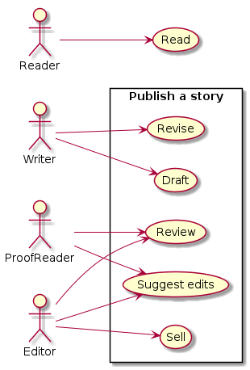
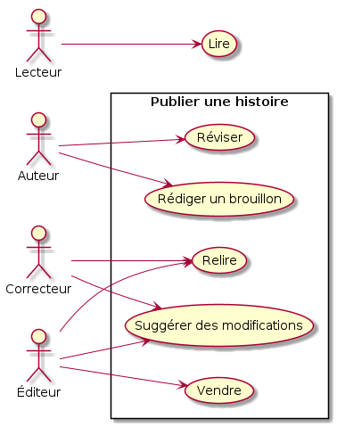

:titre: Use Cases
:module: Diagrammes de Cas d'Utilisation (UML)
:duree: 120
:description: Introduction aux diagrammes de cas d'utilisation pour modéliser les interactions utilisateur-système.
include::../../../../adoc/libs/header-module.adoc[]

== Objectifs pédagogiques

// tag::objectifs[]
* Comprendre le concept de diagramme de cas d’utilisation.
* Définir les fonctionnalités et le périmètre du système.
* Identifier et représenter les acteurs et leurs interactions avec le système.
* Apprendre à utiliser les relations spécifiques entre les cas d’utilisation.
// end::objectifs[]

// tag::deroulement[]

== Définition

Les diagrammes de cas d’utilisation (Use Case Diagrams) sont des diagrammes centrés sur l’utilisateur. Ils permettent de modéliser les attentes des utilisateurs en se focalisant sur le *quoi* de l’application (ses fonctionnalités) sans entrer dans le *comment*.

L’application étudiée est représentée comme un *système*, qui définit ses limites fonctionnelles.

[NOTE.speaker]
====
Les diagrammes de cas d’utilisation, ou Use Case Diagrams, sont un outil clé dans la modélisation UML. Ils permettent de se concentrer sur le quoi d’un système : les fonctionnalités qu’il doit offrir aux utilisateurs, sans s’attarder sur le comment ces fonctionnalités seront mises en œuvre.

L’idée principale est de visualiser les attentes des utilisateurs et de définir clairement les frontières fonctionnelles du système. On représente le système comme une boîte avec ses interactions externes. Cela aide à clarifier les besoins dès les premières phases du projet.

Ces diagrammes sont souvent utilisés dans les discussions avec les parties prenantes, car ils sont simples à comprendre, même pour les non-techniciens. Ils constituent une base solide pour explorer les fonctionnalités détaillées plus tard, avec des diagrammes de séquence ou d’activité, par exemple.

Dans ce module, nous allons explorer leurs éléments principaux et leur utilité dans un projet.
====

== Définition

Pour plus de détails sur la syntaxe : https://plantuml.com/fr/use-case-diagram

[NOTE.speaker]
====
Les diagrammes de cas d’utilisation se concentrent sur les besoins de l’utilisateur en termes de services rendus par l’application. Il s’agit d’un premier niveau de modélisation, utile pour identifier les grandes fonctionnalités du système.
====

== Composants du diagramme de cas d’utilisation

Un diagramme de cas d’utilisation UML se compose des éléments suivants :

* Acteurs
* Cas d’utilisation
* Relations

[NOTE.speaker]
====
Un diagramme de cas d’utilisation se construit à partir de trois éléments principaux : les acteurs, les cas d’utilisation, et les relations.

Les acteurs représentent toutes les entités externes qui interagissent avec le système. Cela peut inclure des utilisateurs humains, mais aussi d’autres systèmes ou applications. Ils permettent de définir les rôles et attentes vis-à-vis du système. Par exemple, un utilisateur final, un administrateur, ou un système tiers comme une API de paiement.

Les cas d’utilisation sont les fonctionnalités ou services que le système offre à ses acteurs. Ils répondent à la question : quels sont les besoins fonctionnels du système ? Chaque cas d’utilisation est représenté par un ovale et décrit une action ou un service, comme "Se connecter", "Passer une commande", ou "Télécharger un document".

Les relations permettent de structurer les interactions entre les cas d’utilisation ou entre les acteurs et les cas d’utilisation. Ces relations peuvent inclure des liens directs, mais aussi des notions comme l’inclusion, l’extension ou la généralisation, qui ajoutent une dimension de modularité et de réutilisation aux diagrammes.

Ces trois composants sont essentiels pour comprendre et modéliser les attentes fonctionnelles d’un système. Ensemble, ils offrent une vue globale et structurée des interactions entre les utilisateurs et le système.
====

=== Acteurs

Les acteurs représentent les entités externes (humains, systèmes, ou autres applications) qui interagissent avec le système. Ils peuvent avoir des rôles variés, tels qu’administrateur, client, fournisseur, etc.

Les acteurs sont représentés par des icônes en forme de bonhomme.

* **Exemples d’acteurs** : dans un système de publication, on peut retrouver des acteurs comme *Rédacteur*, *Lecteur*, *Correcteur*, et *Éditeur*.
* **Identification des acteurs** : la meilleure approche pour identifier les acteurs consiste à dialoguer avec les clients et utilisateurs finaux pour comprendre leurs rôles et leurs besoins.

[NOTE.speaker]
====
Les acteurs sont les utilisateurs principaux du système ou des entités externes avec lesquelles il interagit. Il est important de les identifier pour comprendre comment le système doit répondre à leurs besoins. On distingue souvent des rôles différents, même si les utilisateurs appartiennent au même groupe.
====

=== Cas d’utilisation

Les cas d’utilisation décrivent les fonctionnalités du système sous forme d’actions ou de services rendus aux acteurs, sans entrer dans le détail de leur implémentation. Les cas d’utilisation sont représentés par des ovales.

=== Identification des cas d’utilisation :

* Quels sont les services rendus par l'application ? Un cas d'utilisation correspond à une fonctionnalité métier.
* Quelles sont les interactions principales entre les acteurs et le système ?
* Quels événements déclenchent une action dans le système ?

* **Exemples de cas d’utilisation** : dans un système de publication, des cas d’utilisation peuvent inclure *Rédiger un brouillon*, *Réviser*, *Suggérer des modifications*, *Vendre* et *Lire une histoire*.

[NOTE.speaker]
====
Les cas d’utilisation représentent ce que le système doit faire pour répondre aux besoins des acteurs. C’est un moyen de formaliser les attentes fonctionnelles sous forme de services rendus, ce qui aide l’équipe de développement à mieux saisir le périmètre du projet.
====

=== Relations entre cas d'utilisation : Inclusion

Les cas d'utilisation peuvent être liés entre eux selon des relations :

* **Inclusion** : Un cas d’utilisation *inclut* un autre lorsqu’il intègre des actions partagées avec d’autres cas d’utilisation. Par exemple, *Se connecter* inclut *S'authentifier*.
* **Usage** : permet de factoriser des fonctionnalités communes.

=== Relations entre cas d'utilisation : Extension

* **Extension** : Un cas d’utilisation peut être *étendu* par un autre lorsqu’une action supplémentaire est nécessaire dans certains cas. Par exemple, *Se connecter* peut être étendu par *Mot de passe oublié*.
* **Usage** : à utiliser pour des cas facultatifs ou contextuels.

=== Relations entre cas d'utilisation : Généralisation

* **Généralisation** : Un cas d’utilisation peut être généralisé par un autre cas d’utilisation spécifique. Par exemple, *Se connecter* peut être généralisé par *Se connecter avec un compte Google*.
* **Usage** : à éviter pour ne pas complexifier le diagramme.

[NOTE.speaker]
====
Les relations permettent de structurer les cas d’utilisation en introduisant des concepts de hiérarchie et de modularité. L’inclusion et l’extension permettent de réutiliser ou d’adapter des cas d’utilisation selon les besoins, tandis que la généralisation aide à spécialiser des cas existants.
====

=== Exemples et illustration

Voici un exemple de diagramme de cas d’utilisation pour un système de publication :

[NOTE.speaker]
====
Cet exemple montre les principaux acteurs et cas d’utilisation d’un système de publication, où chaque acteur a un rôle distinct et interagit avec le système de manière spécifique. Notez les relations entre certains cas d’utilisation, comme *Réviser* et *Suggérer des modifications*, qui peuvent être liés pour clarifier leur enchaînement.
====

== Avantages des diagrammes de cas d’utilisation

* **Simplicité** : Les diagrammes de cas d’utilisation sont faciles à lire et à comprendre, même pour les non-techniciens.
* **Clarté** : Ils permettent de définir clairement les frontières fonctionnelles du système et les interactions principales avec les utilisateurs.
* **Communication** : Outil efficace pour dialoguer avec les parties prenantes sur les fonctionnalités du système.
* **Point de départ** : Ils servent souvent d’introduction aux diagrammes de séquence ou d’activité pour une description plus détaillée.

[NOTE.speaker]
====
Les diagrammes de cas d’utilisation sont idéaux pour établir une base de communication avec les parties prenantes. Ils offrent un aperçu général des fonctionnalités sans entrer dans des détails techniques. Cela facilite les échanges entre développeurs, analystes et utilisateurs finaux.
====

== Limites des diagrammes de cas d’utilisation

* **Abstraction** : Ils décrivent uniquement les fonctionnalités sans montrer comment elles sont réalisées techniquement.
* **Risque de sur-simplification** : Pour les systèmes très complexes, il peut être nécessaire d’ajouter des diagrammes détaillés pour éviter une perte d’information.

[NOTE.speaker]
====
Bien que pratiques, les diagrammes de cas d’utilisation sont parfois limités par leur niveau d’abstraction. Pour les systèmes complexes, il est souvent nécessaire de compléter avec des diagrammes plus détaillés afin de capturer les spécificités techniques.
====

== Références et ressources supplémentaires

* link:https://plantuml.com/fr/use-case-diagram[PlantUML,window=_blank]

== Démonstration
// tag::demo[]
Création d'un diagramme de cas d’utilisation.

[NOTE.speaker]
====
Refaites exactement ce même diagramme de cas d'utilisation en live.

link:./assets/umlPublicationFr.puml.png[Cas d'utilisation]
====
// end::demo[]

== Exercice

// tag::exercice[]
link:https://github.com/O-clock-Teach/AnalyseEtConception/blob/main/03DiagrammeDeCas/ConceptionDunDiagrammeDeCas.adoc[Exercice,window=_blank]

link:https://github.com/O-clock-Teach/AnalyseEtConception/blob/main/03DiagrammeDeCas/Correction.adoc[Correction,window=_blank]
// end::exercice[]

== Conclusion
Les diagrammes de cas d'utilisation sont des représentations simples et efficaces du *quoi* du système, sans détail sur le *comment*. Ils constituent une première étape importante avant de modéliser des processus plus détaillés avec des diagrammes de séquence ou d’activité.

[NOTE.speaker]
====
En résumé, les diagrammes de cas d’utilisation permettent d’établir un premier niveau de modélisation fonctionnelle, idéal pour engager la réflexion sur les besoins utilisateurs. C’est un excellent point de départ pour structurer les futurs développements.
====
// end::deroulement[]