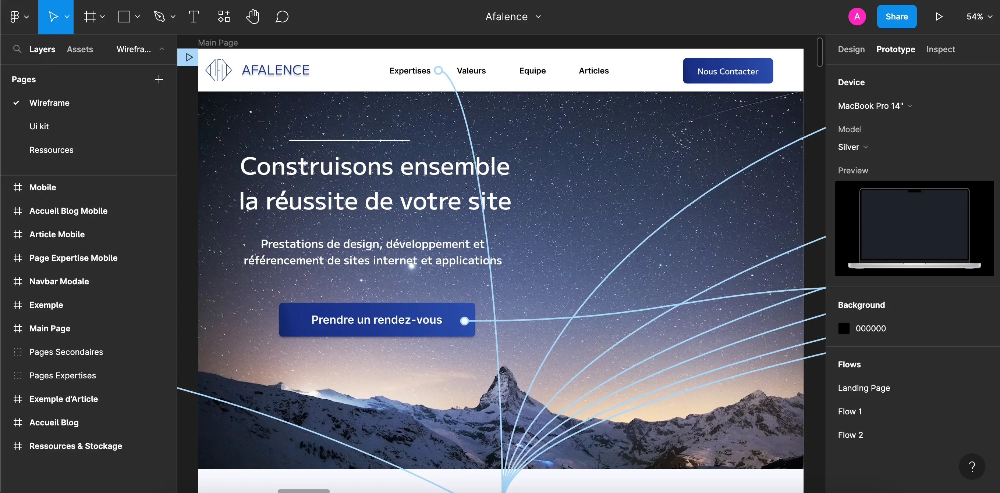
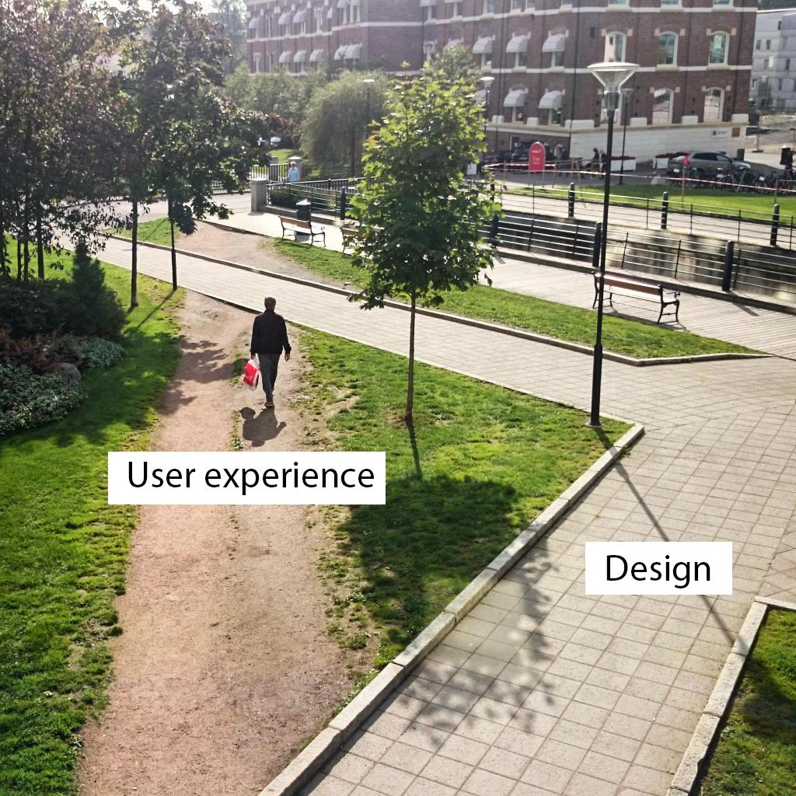
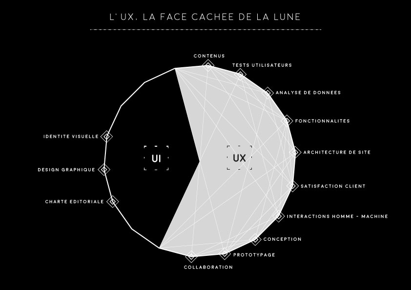

:titre: Maquette et Wireframe
:module: conceptionUIUX
:duree: 90
:description: Comprendre les concepts de maquette et de wireframe, ainsi que les bases de l'UI et de l'UX
include::../../../../adoc/libs/header-module.adoc[]

ifeval::["{visible-on-html}" != "yes"]
:docinfo: shared
:docinfodir: /app/adoc/libs
endif::[]

== Objectifs pédagogiques

// tag::objectifs[]
* Savoir ce qu'est une maquette
* Savoir ce qu'est un wireframe
* Comprendre les notions d'UI (User Interface) et d'UX (User Experience)
// end::objectifs[]

// tag::deroulement[]

== Une Maquette, c'est quoi ?

Une maquette est une représentation visuelle complète du design final d'un site ou d'une application. Elle inclut les couleurs, les typographies, les images et les éléments graphiques.

[NOTE.speaker]
====
La maquette est un outil essentiel en conception pour simuler fidèlement le rendu visuel. Elle permet de tester et valider les choix esthétiques avant de passer à l'intégration.
====

=== Wireframe ?

Un wireframe est une version simplifiée de la maquette. C'est une ébauche visuelle qui présente la structure et la disposition des éléments sans détails de style.

[NOTE.speaker]
====
Le wireframe se concentre sur l’organisation des éléments et l’ergonomie sans se soucier du design visuel. En réduisant le visuel au minimum, on peut mieux se focaliser sur la structure et la hiérarchie de l’information.
====

== Comparaison : Maquette et Wireframe

Bien que différents dans leur niveau de détail, ces deux outils ont des objectifs communs :

* Communication : Faciliter la discussion autour du projet avec les équipes et les clients.
* Structure : Fournir une représentation visuelle de la disposition et du flux de navigation.
* Économie : Anticiper les besoins permet de réduire les modifications coûteuses en cours de développement.

[NOTE.speaker]
====
Utiliser à la fois des maquettes et des wireframes aide à structurer le projet en deux étapes : d’abord une phase fonctionnelle (wireframe), puis une phase esthétique (maquette). Cela permet d'impliquer différents intervenants (designers, développeurs, clients) aux moments adéquats.
====

=== Le Wireframe, c'est plus rapide !

* Rapidité : Un wireframe se réalise rapidement, permettant d'explorer différentes idées sans perdre de temps sur le design.
* Flexibilité : Il est plus facile à modifier et ajuster.
* Concentrez-vous sur l'UX : Le wireframe aide à se focaliser sur l'expérience utilisateur (UX) en laissant de côté l'aspect visuel (UI).
* Économie : Il permet d'économiser du temps en début de projet, ce qui est bénéfique pour le budget.

image::./assets/wireframe.png[Wireframe,480]

[NOTE.speaker]
====
Un wireframe peut être considéré comme un brouillon fonctionnel, rapide à créer, facile à corriger. Cette méthode permet de faire de nombreux ajustements sans perte de temps avant d’investir dans des détails esthétiques.
====

=== La Maquette, c'est plus précis !

* Détail visuel : La maquette montre précisément à quoi ressemblera le produit final, incluant le design, les couleurs et la typographie.
* Retours : Les clients peuvent évaluer et ajuster l'apparence avant le développement.
* Guide de développement : Elle sert de référence détaillée pour les développeurs et limite les ambiguïtés.

[NOTE.speaker]
====
En tant que document visuel de référence, la maquette constitue une "carte routière" pour les développeurs. Cela réduit les questions et clarifie les attentes en matière d'apparence, ce qui est essentiel pour assurer la cohérence du projet.
====

// end::deroulement[]

== Outils pour Wireframes et Maquettes

* Outils pour créer des Wireframes
* Outils pour créer des Maquettes

=== Outils pour créer des Wireframes :

* https://app.diagrams.net/[Draw.io]
    ** Exemple : https://ucarecdn.com/9d52705a-3568-4571-a424-dd808c3dcc41/[Draw.io Wireframe]
* https://balsamiq.com/[Balsamiq Mockup]
    ** Exemple : https://balsamiq.com/assets/wireframes/new-thing-balsamiq-large.jpg[Balsamiq Wireframe]
* https://wireframe.cc/[Wireframe.cc]
    ** Exemple : https://www.onextrapixel.com/wp-content/uploads/2014/04/4-wireframe-cc.jpg[Wireframe.cc Wireframe]

[NOTE.speaker]
====
Les outils de wireframing sont nombreux et vont du très basique au très sophistiqué. La sélection d’un outil dépend de l’équipe, de ses préférences et des fonctionnalités requises.
====

=== Démonstration

// tag::demo[]
Création d'un wireframe simple avec l'outil https://app.diagrams.net/[Draw.io].

[NOTE.speaker]
====
Les outils de wireframing permettent de créer rapidement des prototypes fonctionnels pour valider les idées et les concepts. Ils sont essentiels pour la phase de conception et de planification d'un projet.

Refaites exactement le même wireframe que dans cette vidéo :

https://www.youtube.com/watch?v=GDPDIPj5XWY&ab_channel=MrDimmick%27sComputingChannel
====
// end::demo[]

=== Outils pour créer des Maquettes :

* https://www.figma.com/[Figma]
    ** Exemple : https://assets-global.website-files.com/64760069e93084646c9ee428/64760069e93084646c9eee9a_6240b4979b3af95b2960fd1d_maquette-figma.png[Figma Maquette]
* https://helpx.adobe.com/fr/support.html[Adobe XD]
    ** Exemple : https://graphiste.com/blog/wp-content/uploads/sites/4/2021/03/Guacamole_UI_kit.jpg[Adobe XD Maquette]
* https://www.sketch.com/[Sketch]
    ** Exemple : https://f.hellowork.com/bdmtools/2021/05/Sketch-outil-1.jpg[Sketch Maquette]

[NOTE.speaker]
====
Les logiciels de maquette intègrent souvent des options avancées pour le prototypage interactif, les animations, et la gestion des feedbacks. Le choix de l’outil peut influencer la qualité et la précision du projet final.
====

=== Démonstration

// tag::demo[]
Création d'une maquette simple avec l'outil https://www.figma.com/[Figma].

[NOTE.speaker]
====
Refaites exactement la même maquette que dans cette vidéo :

https://www.youtube.com/watch?v=vaMICSS-x7w&ab_channel=FlorentKiecken-SDLV
====
// end::demo[]

== Concepts d'UI et d'UX

* UI (User Interface) : Ce que voit l’utilisateur — l’apparence visuelle de l’application ou du site.
* UX (User Experience) : Ce que ressent l’utilisateur — l'efficacité, la facilité de navigation et la satisfaction globale de l’expérience.

[NOTE.speaker]
====
UI et UX sont deux concepts complémentaires : l’un se concentre sur l'esthétique (UI), et l’autre sur la fonctionnalité (UX). Un bon design doit intégrer ces deux aspects pour que l’application soit non seulement agréable à voir mais aussi facile à utiliser.
====

=== UX contre UI : Comment va réagir l'utilisateur ?

[NOTE.speaker]
====
Il est fréquent de confondre UX et UI, mais ils répondent à des objectifs différents. L'UX vise l'efficacité, tandis que l'UI vise la satisfaction esthétique. Un design équilibré doit idéalement répondre aux deux.
====

=== UX : La face cachée de l’interface

=== UI et UX : Un équilibre

Un bon produit équilibre UX et UI :

* Si l’application est efficace mais peu attrayante, l’utilisateur pourrait être moins engagé.
* Si elle est visuellement agréable mais peu fonctionnelle, cela pourrait entraîner de la frustration.

[NOTE.speaker]
====
Un design fonctionnel sans esthétique risque de manquer d'attrait, tandis qu'une interface soignée sans ergonomie entrave l'expérience utilisateur. La combinaison des deux crée une interface à la fois pratique et attractive.
====

== Conclusion

Les notions de wireframe, maquette, UX et UI sont essentielles pour créer des produits répondant aux attentes des utilisateurs.

Le wireframe se concentre sur l’UX, tandis que la maquette intègre à la fois l’UX et l’UI.

Ces outils assurent que le produit final sera en phase avec les attentes des utilisateurs et les objectifs du projet.

[NOTE.speaker]
====
En conclusion, maîtriser l'usage des wireframes et des maquettes, tout en comprenant les concepts d'UX et d'UI, garantit la création d’un produit visuellement cohérent, ergonomique et adapté aux besoins des utilisateurs.
====
