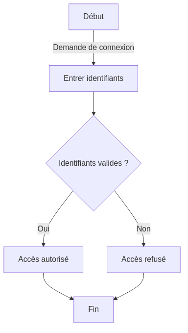
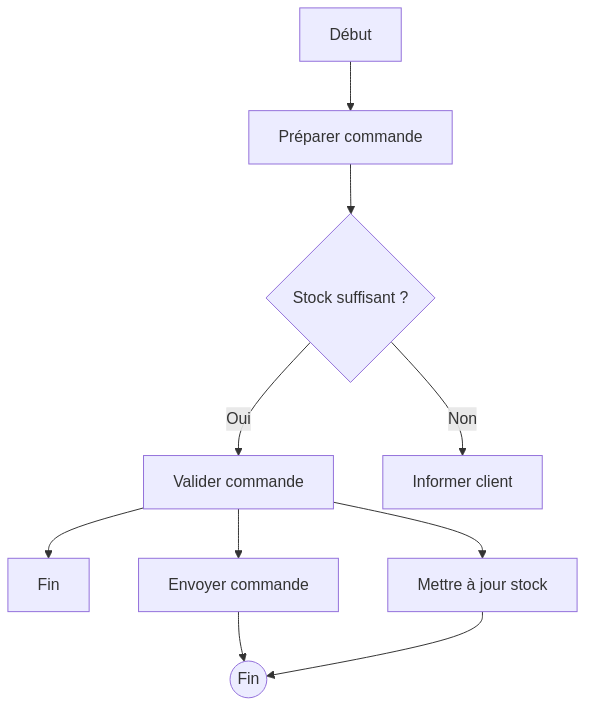
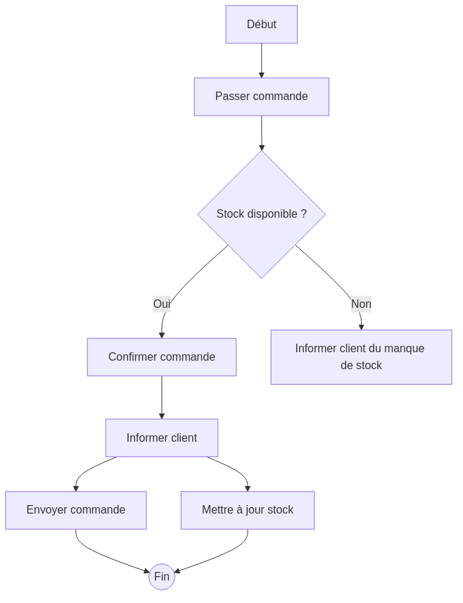

:titre: Introduction aux Diagrammes d'Activités en UML
:module: UML - Diagrammes d'Activités
:duree: 80
:description: Comprendre le concept des diagrammes d'activités en UML et apprendre à modéliser des flux d'activités de manière structurée.
include::../../../../adoc/libs/header-module.adoc[]

ifeval::["{visible-on-html}" != "yes"]
:docinfo: shared
:docinfodir: /app/adoc/libs
endif::[]

== Objectifs pédagogiques

// tag::objectifs[]
* Comprendre la structure et les usages d'un diagramme d'activités en UML.
* Apprendre à modéliser des processus métier et des flux de travail.
* Savoir représenter des choix, des boucles, et des transitions conditionnelles.
// end::objectifs[]

[NOTE.speaker]
====
Les diagrammes d'activités sont des outils puissants en UML pour visualiser des processus et des flux de travail. Ils permettent de modéliser les différentes étapes d'un processus de manière séquentielle et de montrer les choix ou boucles possibles au sein de ce processus. Cela rend ces diagrammes particulièrement utiles pour la planification et la compréhension des flux de travail dans un système.
====

// tag::deroulement[]

== Qu'est-ce qu'un Diagramme d'Activités ?

Un diagramme d'activités en UML est un type de diagramme de comportement qui modélise le flux de contrôle entre différentes activités dans un système. Il illustre les étapes d’un processus, les décisions et les transitions entre activités, ainsi que les branches conditionnelles ou itératives.

Les diagrammes d'activités sont souvent utilisés pour représenter :
- Des processus métier (comme le parcours d'achat d'un client)
- Des étapes de flux de travail (comme le traitement d'une commande)
- Des logiques d'algorithmes, notamment pour la modélisation de comportements complexes.

[NOTE.speaker]
====
Un diagramme d'activités se lit de haut en bas et permet de visualiser le flux d'un processus. Il est pratique pour montrer comment un processus progresse d'une étape à une autre. Les différentes étapes sont représentées sous forme de blocs d'activités, et les flèches montrent l'ordre et la direction du flux. Les diagrammes d'activités sont aussi très utiles pour les équipes non techniques, car ils expliquent clairement le fonctionnement d'un système.
====

== Structure d'un Diagramme d'Activités

Dans un diagramme d'activités, les éléments principaux sont :
- **Activités** : Les étapes du processus (représentées par des rectangles aux coins arrondis).
- **Transitions** : Les flèches reliant les activités, indiquant la progression.
- **Nœuds de décision** : Points de bifurcation où le processus peut prendre plusieurs chemins en fonction de conditions.
- **Nœud de début** et **Nœud de fin** : Délimite le début et la fin du processus.
- **Swimlanes** (couloirs) : Permettent de regrouper les activités par acteur ou département.

== Structure d'un Diagramme d'Activités

[NOTE.speaker]
====
Exemple simple de diagramme d'activités en UML pour le processus de connexion d'un utilisateur :

Dans cet exemple, un utilisateur entre ses identifiants, puis un nœud de décision détermine si ces informations sont valides. S'ils sont valides, l'accès est autorisé ; sinon, l'accès est refusé. Ce diagramme montre comment structurer un flux d'activité simple et comment utiliser des nœuds de décision pour créer des choix conditionnels.
====

== Les Éléments Clés d'un Diagramme d'Activités

Voici un aperçu plus détaillé des éléments souvent utilisés dans les diagrammes d'activités :

- **Activité** : Représente une tâche ou une action (ex. : "Vérifier identifiants").
- **Transition** : Une flèche qui connecte deux activités ou un nœud de décision à une activité.
- **Nœud de décision** : Un losange qui représente un choix entre plusieurs chemins possibles.
- **Fork et Join** : Permettent de gérer les tâches parallèles. Fork divise le flux en branches parallèles, tandis que Join les rejoint.
- **Swimlanes** : Utilisées pour assigner des activités à différents acteurs ou départements.

== Les Éléments Clés d'un Diagramme d'Activités

[NOTE.speaker]
====
Exemple avec des tâches parallèles :

Dans cet exemple, nous voyons une utilisation de la parallélisation après la validation de commande, où deux actions (envoi de la commande et mise à jour du stock) sont exécutées simultanément. Les diagrammes d'activités permettent de visualiser ce type de flux parallèle, ce qui est très utile pour planifier des processus complexes ou des tâches interdépendantes.
====

== Démonstration
// tag::demo[]
Création d'un diagramme d'activités

[NOTE.speaker]
====
Refaites exactement ce même diagramme d'activités en live.

link:./assets/flowchartTD02.mmd.png[Diagramme d'activités]
====
// end::demo[]

== Exercice Pratique : Création d'un Diagramme d'Activités
// tag::exercice[]
*Objectif de l'exercice* : Modéliser le flux de traitement d'une commande en utilisant les éléments principaux d'un diagramme d'activités.

=== Enoncé

Vous allez créer un diagramme d'activités pour illustrer le processus suivant dans une application de commerce en ligne :

1. **Début** : Un client passe une commande.
2. **Vérification du stock** : Le système vérifie si les produits sont disponibles.
3. **Commande validée** : Si les produits sont en stock, la commande est validée et confirmée au client.
4. **Notification** : Le client est informé du statut de sa commande.
5. **Envoi** : Si la commande est validée, elle est envoyée.
6. **Mise à jour des stocks** : Les stocks sont automatiquement mis à jour.
7. **Fin** : Le processus se termine.

=== Travail attendu

* Créer un diagramme d'activités en utilisant les éléments clés (activités, transitions, nœuds de décision).
* Inclure des parallélismes pour l'envoi de la commande et la mise à jour des stocks.

=== Exemple de correction possible

[NOTE.speaker]
====
Dans cette correction, le flux d'activités est représenté de manière séquentielle, avec une parallélisation entre l'envoi de la commande et la mise à jour des stocks. Les apprenants doivent veiller à respecter les étapes du processus en utilisant des nœuds de décision pour modéliser les choix conditionnels et des forks/join pour les activités parallèles.
====
// end::exercice[]

// end::deroulement[]

== Conclusion

// tag::conclusion[]
* Les diagrammes d'activités permettent de représenter visuellement le flux de travail d'un processus ou d'un système.
* Ils sont particulièrement utiles pour modéliser des processus avec des décisions, des branches conditionnelles, et des parallélismes.
* En maîtrisant la création de diagrammes d'activités, les apprenants peuvent mieux comprendre et documenter des flux de travail complexes.
// end::conclusion[]

[NOTE.speaker]
====
Les diagrammes d'activités facilitent la compréhension des processus complexes en représentant de manière visuelle chaque étape et chaque décision. En utilisant ces diagrammes, les équipes techniques et non techniques peuvent mieux collaborer, car ils offrent une vue d'ensemble claire et structurée du flux de travail. Pour aller plus loin, les apprenants peuvent essayer de modéliser des processus métiers plus complexes ou des algorithmes, en intégrant plus de détails et de conditions.
====
