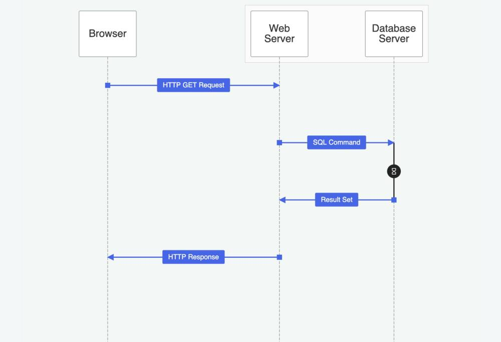
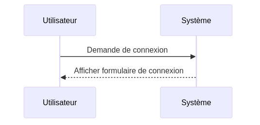
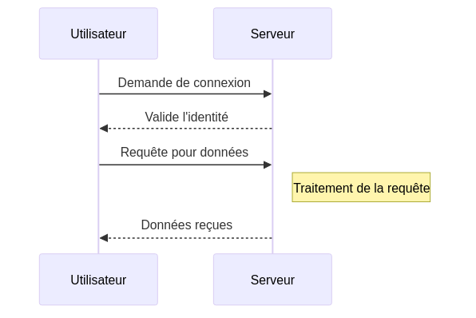
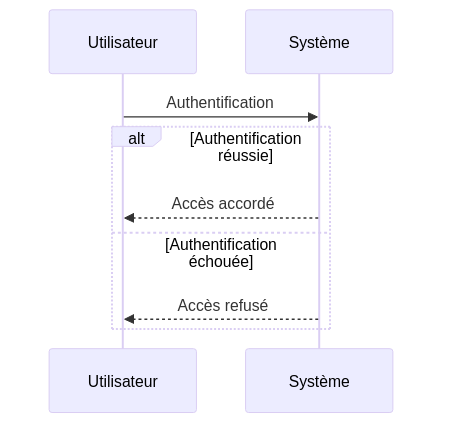
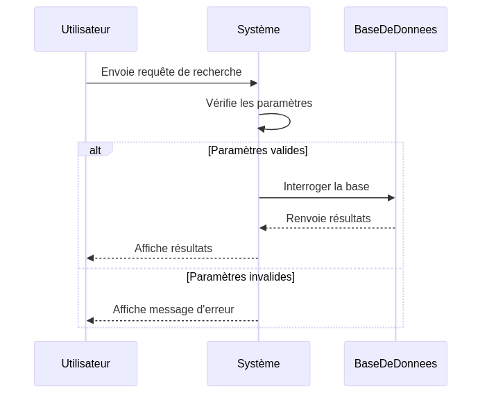

:titre: Introduction aux Diagrammes de Séquence en UML
:module: UML - Diagrammes de Séquence
:duree: 90
:description: Comprendre les diagrammes de séquence en UML et apprendre à les représenter avec Mermaid pour visualiser les interactions dans un système.
include::../../../../adoc/libs/header-module.adoc[]

ifeval::["{visible-on-html}" != "yes"]
:docinfo: shared
:docinfodir: /app/adoc/libs
endif::[]

== Objectifs pédagogiques

// tag::objectifs[]
* Comprendre la structure et l’utilité des diagrammes de séquence en UML.
* Apprendre à représenter des interactions entre objets dans un système.
* Savoir créer et interpréter des diagrammes de séquence en utilisant la syntaxe Mermaid.
// end::objectifs[]

[NOTE.speaker]
====
Ce module se concentre sur les diagrammes de séquence, un outil de modélisation qui montre comment différents éléments communiquent entre eux. En utilisant Mermaid, nous pouvons illustrer ces interactions de manière simple et visuelle, facilitant ainsi l’apprentissage.
====

// tag::deroulement[]

== Qu’est-ce qu’un Diagramme de Séquence ?

Un diagramme de séquence est un type de diagramme UML utilisé pour modéliser l’interaction entre différents objets ou composants dans un système au cours du temps. Il permet de visualiser l’ordre d’exécution des opérations et les messages échangés entre ces entités.

[NOTE.speaker]
====
Les diagrammes de séquence sont utilisés pour représenter le flux de communication entre différents acteurs (objets ou utilisateurs). Ils indiquent également l'ordre des messages, qui est essentiel pour comprendre comment un système fonctionne étape par étape.
====

== Structure d'un Diagramme de Séquence UML

Dans un diagramme de séquence, nous retrouvons :
- Les *objets* ou *acteurs*, placés en haut du diagramme.
- Le *temps*, qui s'écoule de haut en bas.
- Les *messages* échangés, représentés par des flèches entre les objets.

Les objets sont alignés en haut du diagramme avec une ligne de vie qui descend vers le bas pour indiquer leur temps d'existence durant l'interaction.

Exemple de syntaxe Mermaid pour un diagramme de séquence simple :

[NOTE.speaker]
====
Dans cet exemple, l’utilisateur envoie une demande de connexion au système, qui répond en affichant un formulaire de connexion. Les flèches pleines représentent les messages synchrones, tandis que les flèches en pointillés peuvent être utilisées pour les retours de réponse. Ce type de représentation est basique, mais nous ajoutons de la complexité dans les sections suivantes.
====

== Les Types de Messages

Les messages entre objets ou acteurs sont représentés par des flèches et peuvent être de plusieurs types :
- **Messages synchrones** : appel direct, représenté par une flèche pleine.
- **Messages asynchrones** : appel asynchrone ou message sans réponse immédiate, avec une flèche en pointillés.
- **Retour** : une réponse envoyée après une opération, flèche en pointillés vers l’expéditeur.

Exemple Mermaid avec différents types de messages :

[NOTE.speaker]
====
Ici, nous introduisons différents types de messages : les flèches pleines sont des messages synchrones, tandis que les flèches en pointillés représentent des retours. Les notes ajoutées peuvent préciser ce qui se passe en interne ou les délais d’une opération. Ce type de détail est utile pour des flux d’interaction plus longs.
====

== Les Blocs de Contrôle

Il est possible de structurer les interactions dans un diagramme de séquence en ajoutant des blocs conditionnels, de boucle, etc., pour représenter les différentes branches d'un processus.

Exemple de bloc conditionnel avec Mermaid :

[NOTE.speaker]
====
Les blocs conditionnels ajoutent de la logique aux diagrammes de séquence. Dans cet exemple, on utilise un bloc "alt" pour représenter une condition (authentification réussie ou échouée). Ces blocs permettent de montrer différents chemins possibles dans un scénario donné.
====

== Démonstration
// tag::demo[]
Création d'un diagramme de séquence.

[NOTE.speaker]
====
Refaites exactement ce même diagramme de séquence en live.

link:./assets/sequenceDiagram03.mmd.png[Diagramme d'activités]
====
// end::demo[]

== Exercice Pratique : Créer un Diagramme de Séquence avec Mermaid
// tag::exercice[]

*Objectif de l'exercice* : Créer un diagramme de séquence pour représenter un scénario où un utilisateur envoie une requête de recherche dans une application, et le système renvoie les résultats ou un message d’erreur s’il y a un problème.

=== Enoncé

Vous allez créer un diagramme de séquence en Mermaid pour illustrer le cas suivant :

1. Un utilisateur envoie une requête de recherche via l'interface.
2. Le système reçoit la requête et vérifie les paramètres de recherche.
3. Si les paramètres sont valides, le système interroge la base de données.
4. La base de données renvoie les résultats au système.
5. Le système affiche les résultats à l’utilisateur.
6. En cas d'erreur, un message d'erreur est renvoyé à l’utilisateur.

[NOTE.speaker]
====
Cet exercice pratique permet d'appliquer les concepts abordés, notamment les types de messages et les blocs conditionnels. Il s’agit de modéliser un cas d’utilisation courant en utilisant Mermaid, et de mettre en place les bonnes pratiques de modélisation.
====

=== Travail attendu

* Utilisez la syntaxe Mermaid pour créer le diagramme.
* Utilisez des flèches pleines pour les requêtes directes et des flèches en pointillés pour les retours de réponse.
* Intégrez un bloc conditionnel pour le cas où les paramètres de recherche sont invalides.

=== Exemple de correction possible en Mermaid

[NOTE.speaker]
====
Dans cet exemple de correction, on voit les étapes clés : vérification des paramètres, interrogation de la base de données, et retour des résultats ou d’un message d’erreur. La distinction entre messages synchrones et de retour, ainsi que l’utilisation des blocs conditionnels, est essentielle pour clarifier le flux d'interaction.
====
// end::exercice[]
// end::deroulement[]

== Conclusion

// tag::conclusion[]
* Les diagrammes de séquence permettent de représenter efficacement les interactions et flux de données entre les composants d’un système.
* L'utilisation de Mermaid facilite la création rapide de diagrammes de séquence en format texte, idéal pour la documentation technique.
* En maîtrisant la création de ces diagrammes, les apprenants sauront visualiser des scénarios d'interaction clés dans la conception de systèmes.
// end::conclusion[]

[NOTE.speaker]
====
Les diagrammes de séquence sont des outils précieux pour modéliser le comportement d’un système et comprendre l’enchaînement des messages entre les objets. Avec Mermaid, la création de ces diagrammes est rapide et intégrable facilement dans des documentations, ce qui est particulièrement utile pour des projets techniques.
====
