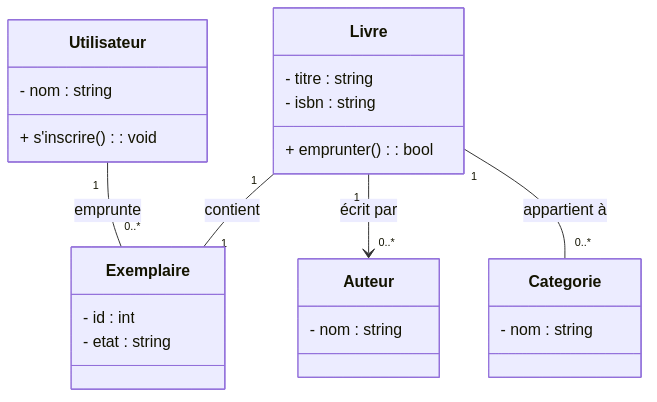
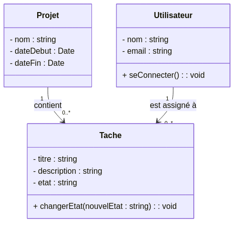
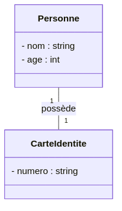
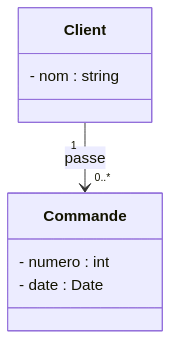
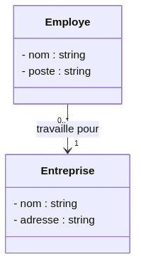
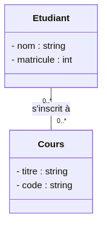
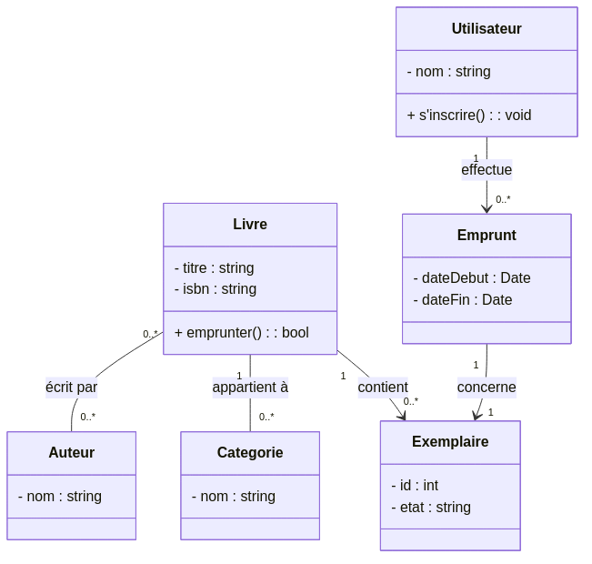

:titre: Introduction aux Diagrammes de Classes en UML
:module: UML - Diagrammes de Classes
:duree: 90
:description: Comprendre le concept des diagrammes de classes en UML et apprendre à modéliser les classes et leurs relations dans un système.
include::../../../../adoc/libs/header-module.adoc[]

ifeval::["{visible-on-html}" != "yes"]
:docinfo: shared
:docinfodir: /app/adoc/libs
endif::[]

== Objectifs pédagogiques

// tag::objectifs[]
* Comprendre la structure et les usages des diagrammes de classes en UML.
* Apprendre à modéliser des classes, leurs attributs et méthodes.
* Savoir représenter les relations entre les classes (association, héritage, agrégation, composition).
// end::objectifs[]

[NOTE.speaker]
====
Les diagrammes de classes sont parmi les diagrammes les plus importants en UML. Ils permettent de représenter la structure d'un système en montrant les classes qui le composent, leurs attributs, méthodes, et les relations entre elles. En maîtrisant ces diagrammes, on peut mieux comprendre la conception d'un système et anticiper les interactions entre ses différentes parties.
====

// tag::deroulement[]

== Qu'est-ce qu'un Diagramme de Classe ?

Un diagramme de classes en UML est un type de diagramme structurel qui montre la structure d'un système en illustrant ses classes, leurs attributs, méthodes, et les relations entre elles. Les diagrammes de classes sont souvent utilisés pour représenter la structure des données dans une application et comment ces données sont liées entre elles.

Les diagrammes de classes sont utiles pour :

* Concevoir la structure d'un logiciel ou d'une base de données.
* Visualiser les dépendances entre différents objets.
* Organiser les classes en fonction de leurs relations et interactions.

[NOTE.speaker]
====
Les diagrammes de classes permettent d’avoir une vision globale de la structure d’un système. Ils montrent comment les données sont organisées et comment elles interagissent. Dans un contexte de développement, ces diagrammes permettent aux équipes de mieux comprendre l’organisation du code et de prévoir les interactions entre les classes, ce qui aide à construire des systèmes plus cohérents et maintenables.
====

== Structure d'un Diagramme de Classe

Une classe est représentée sous forme de rectangle divisé en trois parties :
1. **Nom de la classe** : En haut du rectangle.
2. **Attributs** : Liste des propriétés ou caractéristiques de la classe.
3. **Méthodes** : Liste des fonctions ou comportements de la classe.

Voici un exemple de représentation simple d’une classe "Utilisateur" :

| Utilisateur            |
| - id : int             | 
| - nom : string         | 
| - email : string       |
| + seConnecter() : bool | 
| + deconnecter() : void |

Dans cet exemple :

* Les attributs sont en notation privée (`-`) pour indiquer qu'ils sont protégés, et les méthodes sont en notation publique (`+`).
* Les types des attributs et des méthodes sont indiqués (ex. : `int`, `string`, `bool`).

[NOTE.speaker]
====
Dans UML, on utilise souvent les notations de visibilité pour indiquer l'accessibilité des attributs et méthodes :
- **`+`** : Public, accessible de n’importe où.
- **`-`** : Privé, accessible uniquement au sein de la classe.
- **`#`** : Protégé, accessible dans la classe et ses sous-classes.
Ces conventions permettent de définir les règles de visibilité des données, ce qui est crucial pour la sécurité et la gestion des accès dans un programme.
====

== Les Relations entre Classes

Les diagrammes de classes permettent aussi de représenter les relations entre les classes. Les relations les plus courantes sont :

* **Association** : Relation simple entre deux classes (ex. : un `Client` passe une `Commande`).
* **Héritage (généralisation)** : Relation parent-enfant, où une classe hérite des attributs et méthodes d’une autre.
* **Agrégation** : Relation "a un", où une classe contient une référence vers une autre sans en être dépendante (ex. : une `Equipe` a plusieurs `Joueurs`).
* **Composition** : Relation forte, où la classe contenante contrôle la vie de la classe incluse (ex. : une `Maison` contient des `Pièces`).

Exemple de relations entre classes pour un système de bibliothèque :

[NOTE.speaker]
====
Dans cet exemple, on observe différentes relations :
- **Composition** entre `Livre` et `Exemplaire` : un livre est composé d'un ou plusieurs exemplaires spécifiques.
- **Association** entre `Livre` et `Auteur` : un livre peut être écrit par plusieurs auteurs.
- **Agrégation** entre `Livre` et `Categorie` : un livre appartient à une ou plusieurs catégories, mais la suppression de la catégorie ne détruit pas le livre.
Chaque type de relation est représenté par un symbole différent, ce qui permet de préciser la nature de chaque lien entre les classes.
====

== Exercice Pratique : Création d'un Diagramme de Classe

*Objectif de l'exercice* : Modéliser un système de gestion de tâches en créant les classes principales et leurs relations.

=== Enoncé

Vous devez créer un diagramme de classes pour représenter le système suivant :

1. **Classe Projet** : Contient des informations sur un projet (nom, date de début, date de fin).
2. **Classe Tâche** : Représente une tâche associée à un projet, avec un titre, une description, un état (en cours, terminé).
3. **Classe Utilisateur** : Utilisateur assigné à des tâches, avec des attributs nom et email.
4. **Relation d'association** entre Projet et Tâche (un projet peut avoir plusieurs tâches).
5. **Relation d'association** entre Utilisateur et Tâche (un utilisateur peut être assigné à plusieurs tâches).

=== Travail attendu

* Modéliser chaque classe avec ses attributs et méthodes en respectant les conventions de visibilité.
* Représenter les relations d'association entre les classes.

=== Exemple de correction possible

[NOTE.speaker]
====
Dans cette correction, on observe que chaque classe est correctement modélisée avec des attributs privés et des méthodes publiques. Les relations d'association entre les classes `Projet` et `Tâche` et entre `Utilisateur` et `Tâche` sont représentées avec des flèches simples. Ce type de modélisation permet de représenter les liens entre les entités du système, facilitant la compréhension de l’architecture du projet.
====

== Exemples de Relations entre Classes

Les diagrammes de classes permettent également de représenter les relations entre les classes. Voici les principaux types de relations avec des exemples simples et complexes.

=== Relation One-to-One (Un-à-Un)

Une relation `one-to-one` signifie qu'une instance d'une classe est associée à une seule instance d'une autre classe.

Exemple : Une `Personne` possède une `CarteIdentite`.

[NOTE.speaker]
====
Ici, chaque `Personne` a une unique `CarteIdentite`, et chaque `CarteIdentite` appartient à une seule `Personne`. Cette relation `one-to-one` est représentée par une flèche avec une multiplicité de 1 pour chaque classe.
====

=== Relation One-to-Many (Un-à-Plusieurs)

Une relation `one-to-many` signifie qu'une instance d'une classe est associée à plusieurs instances d'une autre classe.

Exemple : Un `Client` peut avoir plusieurs `Commandes`.

[NOTE.speaker]
====
Dans cet exemple, chaque `Client` peut avoir plusieurs `Commandes` associées, mais chaque `Commande` est liée à un seul `Client`. La notation `0..*` signifie qu'il peut y avoir zéro ou plusieurs instances de `Commande` pour chaque `Client`.
====

=== Relation Many-to-One (Plusieurs-à-Un)

Une relation `many-to-one` est similaire à `one-to-many`, mais vue de l'autre côté : plusieurs instances d'une classe peuvent être associées à une seule instance d'une autre classe.

Exemple : Plusieurs `Employes` travaillent pour une `Entreprise`.

[NOTE.speaker]
====
Dans ce cas, une `Entreprise` peut avoir plusieurs `Employes`, mais chaque `Employe` est employé par une seule `Entreprise`. Ici, on voit la relation `many-to-one` où chaque employé dépend d’une entreprise spécifique.
====

=== Relation Many-to-Many (Plusieurs-à-Plusieurs)

Une relation `many-to-many` signifie que plusieurs instances d'une classe peuvent être associées à plusieurs instances d'une autre classe.

Exemple : Des `Etudiants` peuvent s'inscrire à plusieurs `Cours`, et chaque `Cours` peut accueillir plusieurs `Etudiants`.

[NOTE.speaker]
====
Ici, on représente la relation `many-to-many` entre `Etudiant` et `Cours`. Chaque étudiant peut suivre plusieurs cours, et chaque cours peut accueillir plusieurs étudiants. Cette relation est souvent représentée par une table intermédiaire en base de données, mais ici, elle est indiquée directement pour simplifier le modèle.
====

== Démonstration

// tag::demo[]
Création d'un diagramme de classe.

[NOTE.speaker]
====
Refaites exactement ce même diagramme en live.

link:./assets/classDiagram01.mmd.png[Diagramme de classe]
====
// end::demo[]

== Exercice Pratique : Création d'un Diagramme de Classe Complexe
// tag::exercice[]
*Objectif de l'exercice* : Créer un diagramme de classes pour un système de gestion de bibliothèque en appliquant les différentes relations vues précédemment.

=== Enoncé

Vous allez modéliser un système de gestion de bibliothèque avec les classes et relations suivantes :

1. **Classe Livre** : Contient un titre, un ISBN et appartient à une ou plusieurs catégories.
2. **Classe Auteur** : Un auteur peut écrire plusieurs livres, et chaque livre peut avoir plusieurs auteurs (relation many-to-many).
3. **Classe Exemplaire** : Chaque livre a plusieurs exemplaires physiques, chaque exemplaire a un état et un identifiant unique (relation one-to-many entre Livre et Exemplaire).
4. **Classe Emprunt** : Un emprunt lie un utilisateur à un exemplaire pour une durée définie.
5. **Classe Utilisateur** : Un utilisateur peut emprunter plusieurs exemplaires (relation one-to-many entre Utilisateur et Emprunt).

=== Travail attendu

* Modéliser chaque classe avec ses attributs et méthodes en respectant les conventions de visibilité.
* Représenter les relations `one-to-one`, `one-to-many`, `many-to-one`, et `many-to-many` entre les classes.

=== Exemple de correction possible

[NOTE.speaker]
====
Dans cette solution, chaque relation est représentée de manière claire :
- La relation `one-to-many` entre `Livre` et `Exemplaire` indique que chaque livre peut avoir plusieurs exemplaires.
- La relation `many-to-many` entre `Livre` et `Auteur` montre que chaque livre peut avoir plusieurs auteurs et chaque auteur peut écrire plusieurs livres.
- La relation `one-to-many` entre `Utilisateur` et `Emprunt` permet de suivre les exemplaires empruntés par un utilisateur.
Ce modèle intègre différents types de relations et illustre comment structurer un système complexe.
====
// end::exercice[]
// end::deroulement[]

== Conclusion

// tag::conclusion[]
* Les diagrammes de classes sont essentiels pour modéliser la structure et les relations d’un système.
* En maîtrisant les concepts de base comme les attributs, méthodes, et relations, on peut concevoir des systèmes plus cohérents et maintenables.
* La pratique des diagrammes de classes facilite la communication entre les équipes en fournissant une vue d'ensemble des données et de leurs interactions dans un système.
// end::conclusion[]

[NOTE.speaker]
====
Les diagrammes de classes fournissent une vue d’ensemble précieuse d'un système, en montrant la structure et les relations entre les entités. En maîtrisant leur création, les équipes peuvent organiser les données efficacement et structurer des projets de manière plus logique et robuste.
====
