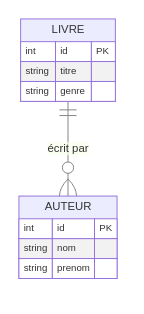
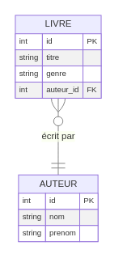
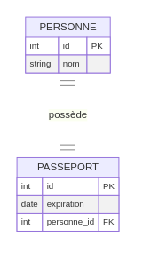
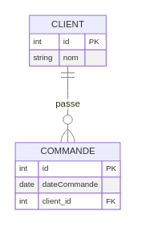
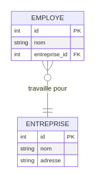
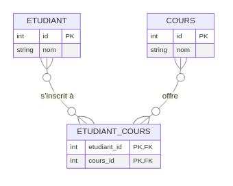

:titre: Introduction aux Diagrammes Entité-Relation (ERD)
:module: Base de Données - Diagrammes Entité-Relation (ERD)
:duree: 90
:description: Apprendre à concevoir un modèle de base de données avec un diagramme Entité-Relation (ERD) en comprenant les entités, les attributs, et les relations entre elles.
include::../../../../adoc/libs/header-module.adoc[]

ifeval::["{visible-on-html}" != "yes"]
:docinfo: shared
:docinfodir: /app/adoc/libs
endif::[]

== Objectifs pédagogiques

// tag::objectifs[]
* Comprendre les éléments fondamentaux d'un diagramme Entité-Relation (ERD).
* Savoir représenter des entités, des attributs, des clés primaires et des clés étrangères.
* Apprendre à modéliser les différentes relations (one-to-one, one-to-many, many-to-one, many-to-many).
* Concevoir des modèles de base de données efficaces en appliquant les meilleures pratiques de modélisation ERD.
// end::objectifs[]

[NOTE.speaker]
====
Les diagrammes Entité-Relation (ERD) sont essentiels pour modéliser la structure d'une base de données. Ils permettent de définir les entités (tables), les attributs (colonnes), et les relations entre les entités, ce qui est fondamental pour organiser les données de manière logique et efficace. Ce module explique chaque élément d’un ERD, en détaillant les différents types de relations et en fournissant des exemples pratiques.
====

// tag::deroulement[]

== Qu'est-ce qu'un Diagramme Entité-Relation (ERD) ?

Un diagramme Entité-Relation (ERD) est un schéma visuel qui représente les entités dans une base de données, leurs attributs, et les relations entre elles. Les ERD sont utilisés pour concevoir et organiser la structure de la base de données avant sa mise en œuvre.

Les éléments de base d’un ERD sont :
- **Entités** : Les objets ou concepts importants, représentés sous forme de rectangles.
- **Attributs** : Les informations propres à chaque entité, listées à l'intérieur de chaque rectangle.
- **Clés primaires** : Les identifiants uniques pour chaque enregistrement d'une entité.
- **Relations** : Les liens entre les entités, représentés par des lignes, avec des symboles indiquant le type de relation.

[NOTE.speaker]
====
Les ERD sont souvent le premier pas dans la conception d'une base de données. En structurant les informations en entités, attributs, et relations, on clarifie la façon dont les données seront organisées et accessibles, ce qui simplifie grandement la construction de la base de données.
====

== Structure d'un ERD

Dans un ERD, chaque entité est représentée sous forme de rectangle contenant :
1. **Nom de l'entité** : Habituellement en haut du rectangle.
2. **Attributs** : Les propriétés de l'entité, avec la clé primaire en haut et soulignée.
3. **Relations** : Les lignes reliant les entités pour indiquer les associations.

Exemple simple d'un ERD pour une base de données de bibliothèque, avec les entités `Livre` et `Auteur` :

[NOTE.speaker]
====
Dans cet exemple, `LIVRE` et `AUTEUR` sont les deux entités de la base de données, avec une relation `one-to-many` indiquée par les symboles `||--o{`, signifiant qu’un auteur peut écrire plusieurs livres, mais chaque livre est écrit par un seul auteur.
====

== Clés Primaires et Clés Étrangères

Les clés primaires (PK) et clés étrangères (FK) sont des concepts clés pour assurer l'unicité et la connexion des données :
- **Clé primaire (PK)** : Identifiant unique pour chaque enregistrement d’une entité. Dans un ERD, elle est soulignée.
- **Clé étrangère (FK)** : Référence vers la clé primaire d’une autre entité, utilisée pour établir les relations.

Exemple avec une clé étrangère : ajout de la clé étrangère `auteur_id` dans `LIVRE` pour référencer `AUTEUR` :

[NOTE.speaker]
====
La clé étrangère `auteur_id` dans `LIVRE` fait référence à `id` dans `AUTEUR`. Cela permet de relier chaque livre à un auteur spécifique, assurant que les données entre ces entités restent cohérentes.
====

== Types de Relations dans un ERD

Les ERD incluent différents types de relations entre les entités. Voici les principaux types de relations, avec des exemples illustrant chaque cas.

=== Relation One-to-One (Un-à-Un)

Une relation `one-to-one` signifie qu’une instance d’une entité est associée à une seule instance d’une autre entité.

Exemple : Une `Personne` possède un `Passeport`.

[NOTE.speaker]
====
Dans cette relation `one-to-one`, chaque `PERSONNE` possède un seul `PASSEPORT`, et chaque `PASSEPORT` appartient à une seule `PERSONNE`. Une relation `one-to-one` est souvent utilisée pour des informations très spécifiques.
====

=== Relation One-to-Many (Un-à-Plusieurs)

Une relation `one-to-many` signifie qu'une instance d'une entité est associée à plusieurs instances d'une autre entité.

Exemple : Un `Client` peut avoir plusieurs `Commandes`.

[NOTE.speaker]
====
Ici, chaque `CLIENT` peut passer plusieurs `COMMANDES`, mais chaque `COMMANDE` est associée à un seul `CLIENT`. Ce type de relation `one-to-many` est courant pour modéliser des enregistrements historiques, comme des commandes ou des transactions.
====

=== Relation Many-to-One (Plusieurs-à-Un)

Une relation `many-to-one` est similaire à `one-to-many`, mais vue de l'autre côté. Plusieurs instances d'une entité peuvent être associées à une seule instance d'une autre entité.

Exemple : Plusieurs `Employes` travaillent pour une seule `Entreprise`.

[NOTE.speaker]
====
Dans cet exemple, chaque `ENTREPRISE` peut avoir plusieurs `EMPLOYES`, mais chaque `EMPLOYE` est associé à une seule `ENTREPRISE`. La relation est représentée en tant que `many-to-one` car chaque employé dépend d’une entreprise spécifique.
====

=== Relation Many-to-Many (Plusieurs-à-Plusieurs)

Une relation `many-to-many` signifie que plusieurs instances d'une entité peuvent être associées à plusieurs instances d'une autre entité. Cette relation nécessite généralement une table intermédiaire.

Exemple : Des `Etudiants` peuvent s'inscrire à plusieurs `Cours`, et chaque `Cours` peut avoir plusieurs `Etudiants`.

[NOTE.speaker]
====
La table intermédiaire `ETUDIANT_COURS` est nécessaire pour modéliser une relation `many-to-many`. Cette table contient des clés étrangères vers `ETUDIANT` et `COURS`, permettant de suivre les inscriptions des étudiants à chaque cours.
====

== Démonstration

// tag::demo[]
Création d'un ERD.

[NOTE.speaker]
====
Refaites exactement cet ERD en live.

link:./assets/erDemonstration.mmd.png[ERD]

Explications de la base de données :

Cette base de données est utilisée pour gérer un système de location de vélos. Elle contient différentes tables, chacune ayant un rôle spécifique dans le système. Les tables permettent de stocker des informations sur les clients, les vélos, les tarifs, les paniers, et bien d'autres choses. Ces informations sont connectées entre elles grâce à des relations (les clés primaires et étrangères).

Le modèle ERD montre comment ces tables sont liées les unes aux autres, ce qui est essentiel pour comprendre la structure de la base de données et la logique des données.

Les tables

*Clients :*

Cette table contient les informations des personnes qui louent des vélos.
Chaque client a un identifiant unique (id) et des informations comme le prénom, le nom, l'email, l'adresse, etc.

*Vélos :*

Ici, on trouve des informations sur les vélos disponibles pour la location.
Chaque vélo a un nom, une taille, une catégorie (par exemple, VTT ou vélo de ville), et une marque.
Catégories :

Cette table classe les vélos en différents types ou usages (par exemple, vélos pour enfants, vélos électriques, etc.).
Chaque catégorie a un nom et une description.

*Tailles :*

Les vélos sont aussi classés par taille. Par exemple, petite, moyenne, grande.

*Tarifications :*

Cette table indique combien coûte la location d'un vélo selon sa taille et sa catégorie.
Par exemple, un vélo électrique de grande taille peut coûter plus cher qu'un vélo standard de petite taille.

*Paniers :*

Les paniers représentent les commandes des clients.
Un client peut créer un panier lorsqu’il veut louer des vélos. Chaque panier contient une date de création et, éventuellement, une date de paiement.

*Lignes :*

Une commande (ou panier) peut contenir plusieurs lignes.
Chaque ligne correspond à un vélo loué, avec des informations comme la date de retour prévue.

*Groupes et Groupes_clients :*

Les groupes sont des ensembles de clients qui bénéficient d'une réduction spéciale (par exemple, un groupe d’étudiants ou une entreprise).
La table groupes_clients relie les clients aux groupes.

*Tarifs :*

Cette table contient les noms et prix des différentes offres ou réductions spéciales.

*Comment ça fonctionne ?*

Ajout d’un client :

Lorsqu’un nouveau client s’inscrit, ses informations (nom, prénom, email, etc.) sont ajoutées dans la table clients.

Ajout d’un vélo :

Lorsqu’un nouveau vélo est ajouté dans le magasin, ses informations (taille, catégorie, marque, etc.) sont enregistrées dans la table velos.

Création d’un panier :

Lorsqu’un client décide de louer un vélo, un panier est créé pour lui dans la table paniers.

Ajout de vélos dans le panier :

Chaque vélo loué est ajouté comme une ligne dans la table lignes. On y trouve les informations sur quel vélo a été choisi et quand il doit être rendu.

Calcul du tarif :

Le prix de la location est déterminé en consultant la table tarifications, en fonction de la taille et de la catégorie du vélo.

Réductions pour les groupes :

Si un client appartient à un groupe (par exemple, un groupe d’amis avec une réduction), cela est enregistré dans la table groupes_clients, et une réduction est appliquée automatiquement.

*Relations entre les tables*

Chaque table est liée à une ou plusieurs autres tables pour rendre le système cohérent.

Un panier est toujours lié à un client.

Chaque ligne d’un panier est liée à un vélo.

Chaque vélo est lié à une taille et une catégorie.

*Exemple concret*

Martin (client) s’inscrit. Ses informations sont ajoutées dans clients.

Il décide de louer un vélo électrique de taille moyenne.

Le système consulte la table tarifications pour savoir combien cela coûte.

Martin crée un panier (table paniers).

Le vélo choisi est ajouté dans une ligne (table lignes) liée à ce panier.

Martin paie sa commande, et la date de paiement est ajoutée dans le panier.

*Objectif de la base de données*

Cette base de données permet de gérer facilement toutes les informations d’un système de location de vélos. Elle est organisée de manière à éviter les erreurs et les doublons, tout en rendant les recherches rapides et simples (par exemple, retrouver tous les vélos loués par un client ou calculer les revenus générés par les locations).
====
// end::demo[]

== Exercice Pratique : Création d'un ERD Complexe
// tag::exercice[]
*Objectif de l'exercice* : Concevoir un ERD pour un système de gestion de bibliothèque en utilisant les types de relations appris
// end::exercice[]

== Conclusion

// tag::conclusion[]
* Les diagrammes Entité-Relation (ERD) sont essentiels pour concevoir des bases de données efficaces.
* Les entités, attributs, clés primaires, et clés étrangères sont les éléments clés d'un ERD.
* Les relations `one-to-one`, `one-to-many`, `many-to-one`, et `many-to-many` permettent de modéliser les interactions entre les entités.
// end::conclusion[]

// end::deroulement[]