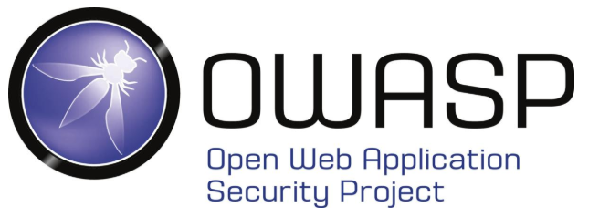
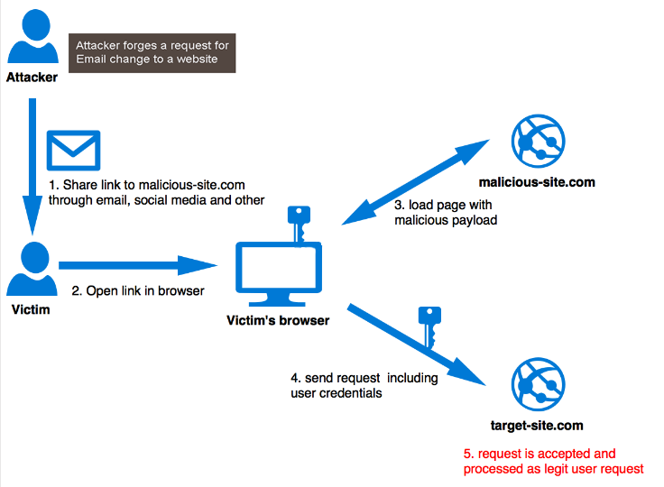

:titre: Approfondissement des failles TOP 10 OWASP avec un focus sur la faille CSRF
:module: CSRF
:duree: 45
:description: Comprendre et analyser la faille CSRF, son fonctionnement, et sa criticité au sein des failles principales du TOP 10 OWASP.
include::../../../../adoc/libs/header-module.adoc[]

ifeval::["{visible-on-html}" != "yes"]
:docinfo: shared
:docinfodir: ../../../adoc/libs
endif::[]

== Objectifs pédagogiques

// tag::objectifs[]
* Comprendre le contexte des failles OWASP TOP 10
* Différencier les principales failles
* Évaluer la criticité des failles CSRF par rapport aux autres vulnérabilités
* Comprendre en détail le fonctionnement et l’impact d’une faille CSRF
// end::objectifs[]

// tag::deroulement[]

== Qu'est-ce que l'OWASP TOP 10 ?

L'OWASP TOP 10 est une liste des vulnérabilités de sécurité les plus critiques dans les applications web, établie par la communauté de sécurité OWASP.

[NOTE.speaker]
====
L’OWASP (Open Web Application Security Project) publie le TOP 10 des failles web, une liste de référence utilisée pour identifier et comprendre les principales vulnérabilités de sécurité qui affectent les applications web.
Les failles incluent des vulnérabilités comme les injections SQL, les failles XSS, et les failles CSRF.
====

== Présentation de la faille CSRF

La faille CSRF (Cross-Site Request Forgery) permet à un attaquant de faire réaliser des actions non désirées par un utilisateur authentifié sur une application.

[NOTE.speaker]
====
La faille CSRF, également connue sous le nom de "attaque par falsification de requête intersites", consiste à tromper l’utilisateur pour qu’il envoie une requête non souhaitée vers un site sur lequel il est authentifié.
Cela peut permettre à l'attaquant d'effectuer des actions en utilisant les permissions de l'utilisateur victime.
====

== Fonctionnement de la faille CSRF

La faille CSRF fonctionne en exploitant la session de l'utilisateur authentifié. Si l'utilisateur clique sur un lien ou visite une page malveillante, une requête indésirable peut être envoyée au serveur sans son consentement.

[NOTE.speaker]
====
En simplifiant, le mécanisme de CSRF utilise la session valide de l’utilisateur pour envoyer des requêtes HTTP frauduleuses. 
Typiquement, l'attaque implique trois étapes principales : 
1. Un utilisateur est authentifié sur une application web.
2. Un attaquant le redirige vers une URL qui exécute une action en son nom.
3. L'action est exécutée car l’utilisateur est déjà authentifié.
====

== Exemples d'attaques CSRF

.Exemple 1 : Changement de mot de passe non désiré
Un attaquant envoie un lien caché dans un email. Si l'utilisateur authentifié sur son compte de banque clique sur ce lien, son mot de passe peut être modifié sans son consentement.

.Exemple 2 : Transaction frauduleuse
Un site malveillant contient un formulaire caché qui déclenche une transaction bancaire lorsque l'utilisateur authentifié le visite.

[NOTE.speaker]
====
Pour rendre cette faille plus concrète, imaginez que vous êtes connecté à votre banque en ligne.
Si un attaquant vous redirige vers une page avec une requête de transfert d’argent, celle-ci pourrait être exécutée sans votre consentement si la banque ne dispose pas de protections CSRF suffisantes.
====

== Criticité de la faille CSRF

La criticité de la faille CSRF dépend de plusieurs facteurs, notamment :
- Le niveau d'accès de l'utilisateur compromis
- La nature des actions qui peuvent être réalisées
- La présence d'autres protections, telles que les jetons CSRF

[NOTE.speaker]
====
La faille CSRF est particulièrement critique car elle cible des actions que seuls des utilisateurs authentifiés peuvent effectuer. Plus les actions sont sensibles, plus la faille CSRF devient dangereuse.
====

== Méthodes de protection contre les attaques CSRF

1. Utilisation de jetons CSRF pour vérifier l'authenticité des requêtes
2. Validation des référents HTTP pour confirmer l'origine de la requête
3. Exiger une authentification forte pour les actions sensibles

[NOTE.speaker]
====
Pour se protéger contre les attaques CSRF, les développeurs peuvent intégrer des jetons CSRF qui accompagnent chaque requête utilisateur.
Ces jetons, générés de façon unique et vérifiés côté serveur, permettent d’authentifier la légitimité de la requête.
D’autres méthodes incluent la validation des entêtes de référents ou l’utilisation de CAPTCHAs pour confirmer l’intention de l’utilisateur.
====

== Conclusion

La faille CSRF est une des vulnérabilités critiques des applications web, avec des conséquences potentiellement graves si elle n'est pas correctement protégée.

// tag::conclusion[]
* Le CSRF exploite l’authentification de l’utilisateur pour faire exécuter des actions non désirées
* La faille CSRF fait partie des vulnérabilités OWASP TOP 10
* La protection contre les attaques CSRF repose sur des jetons de vérification et une bonne gestion de l'authentification
// end::conclusion[]
