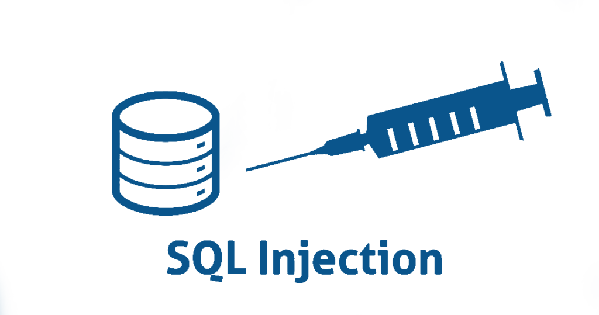

:titre: Introduction à la faille SQLi en cybersécurité
:module: SQLi
:duree: 45
:description: Comprendre la faille SQLi, comment elle est exploitée et comment s'en protéger dans les applications web.
include::../../../../adoc/libs/header-module.adoc[]

ifeval::["{visible-on-html}" != "yes"]
:docinfo: shared
:docinfodir: ../../../adoc/libs
endif::[]

== Objectifs pédagogiques

// tag::objectifs[]
* Comprendre ce qu'est une faille SQLi
* Apprendre à identifier et exploiter une faille SQLi
* Découvrir les bonnes pratiques pour éviter les failles SQLi dans le code
// end::objectifs[]

// tag::deroulement[]

== Qu'est-ce qu'une faille SQLi ?

La faille SQLi (SQL Injection) est une vulnérabilité qui permet d'injecter du code SQL malveillant dans les requêtes d'une application, en exploitant un point d'entrée non sécurisé.

[NOTE.speaker]
====
Une injection SQL (SQL Injection, ou SQLi) survient lorsqu'un attaquant est capable de manipuler des requêtes SQL envoyées à une base de données via un champ utilisateur, comme un champ de formulaire.
En exploitant cette faille, un attaquant peut accéder à des informations sensibles, manipuler des données, voire compromettre totalement l’application.
====

== Fonctionnement de la faille SQLi

La faille SQLi fonctionne en modifiant des requêtes SQL initialement conçues pour interagir avec la base de données, permettant ainsi à l'attaquant d'exécuter des commandes arbitraires.

.Exemple de requête SQL vulnérable
[source,sql]
----
SELECT * FROM utilisateurs WHERE nom_utilisateur = '$username';
----

[NOTE.speaker]
====
Prenons une requête SQL simple, utilisée pour récupérer des informations utilisateur en fonction de leur nom :

[source,sql]
----
SELECT * FROM utilisateurs WHERE nom_utilisateur = '$username';
----

Si le paramètre `$username` est modifié par un utilisateur malveillant, cette requête peut être manipulée pour faire bien plus que prévu, par exemple pour afficher des informations d’autres utilisateurs ou supprimer des données.
====

== Exemples d'attaques SQLi

1. **Obtention de données sensibles**  
   Un attaquant modifie un champ de formulaire pour obtenir des informations confidentielles.

2. **Effacement de données**  
   Dans certains cas, un attaquant peut injecter une commande SQL de suppression, compromettant potentiellement toute une table de la base de données.

3. **Escalade de privilèges**  
   En exploitant la faille SQLi, un attaquant pourrait augmenter ses privilèges pour exécuter des actions non autorisées.

[NOTE.speaker]
====
En fonction de l'objectif de l'attaquant, la faille SQLi peut être exploitée pour voler des données, modifier des enregistrements existants, ou même exécuter des commandes plus complexes au niveau de la base de données.
====

== Techniques d'exploitation de la faille SQLi

1. **Injection de commande UNION**  
   Permet à l'attaquant de combiner le résultat d'une requête légitime avec les résultats d'autres requêtes malveillantes.

2. **Blind SQL Injection**  
   Utilisée quand les messages d'erreur ne sont pas affichés, cette technique repose sur les réponses "vrai" ou "faux" pour inférer des informations.

3. **Time-Based Blind SQL Injection**  
   Exploite des fonctions SQL pour mesurer le temps de réponse de la base de données et en tirer des conclusions.

[NOTE.speaker]
====
Les méthodes d'exploitation SQLi sont diverses et adaptées aux différentes protections en place dans les systèmes. La technique UNION permet d'obtenir des données supplémentaires en combinant les résultats de différentes requêtes. La Blind SQL Injection est utile lorsque les retours de la base sont masqués, et Time-Based SQLi utilise les délais dans les réponses pour récupérer des informations.
====

== Criticité de la faille SQLi

La faille SQLi est l'une des plus dangereuses en cybersécurité. Elle permet souvent un accès direct à des informations sensibles et, dans certains cas, un contrôle complet de l'application ou de la base de données.

[NOTE.speaker]
====
La faille SQLi est extrêmement critique car elle permet à un attaquant d'interagir directement avec la base de données, souvent sans restriction. Si cette vulnérabilité est exploitée, elle peut conduire à la compromission complète de l'application et de ses données.
====

== Bonnes pratiques pour éviter les failles SQLi

1. **Utilisation de requêtes préparées et paramètres**  
   Les requêtes préparées bloquent les injections SQL en séparant le code SQL des données d'entrée utilisateur.

2. **Échappement des caractères spéciaux**  
   Utiliser des fonctions d’échappement pour les caractères spéciaux dans les entrées utilisateur.

3. **Limitation des droits d'accès**  
   Utiliser des comptes à privilèges limités pour les requêtes de base de données, afin de minimiser l'impact potentiel.

4. **Validations côté serveur**  
   Toujours vérifier et valider les données entrées par l’utilisateur avant de les inclure dans une requête.

[NOTE.speaker]
====
Pour se protéger des failles SQLi, les développeurs doivent appliquer des pratiques de codage sécurisées. Les requêtes préparées, par exemple, permettent de séparer les données utilisateurs du code SQL, rendant ainsi les injections bien plus difficiles. La limitation des droits d'accès réduit également les dommages potentiels en cas d'attaque.
====

== Conclusion

La faille SQLi est l'une des plus courantes et des plus dangereuses dans les applications web. La protection contre cette faille repose sur de bonnes pratiques de développement et un contrôle strict des entrées utilisateur.

// tag::conclusion[]
* SQLi est une faille critique qui peut donner accès à des données sensibles
* Elle est évitable en adoptant des pratiques de codage sécurisées, telles que les requêtes préparées
* Une bonne gestion des droits d’accès et une validation stricte des entrées utilisateur permettent de renforcer la sécurité contre les attaques SQLi
// end::conclusion[]
