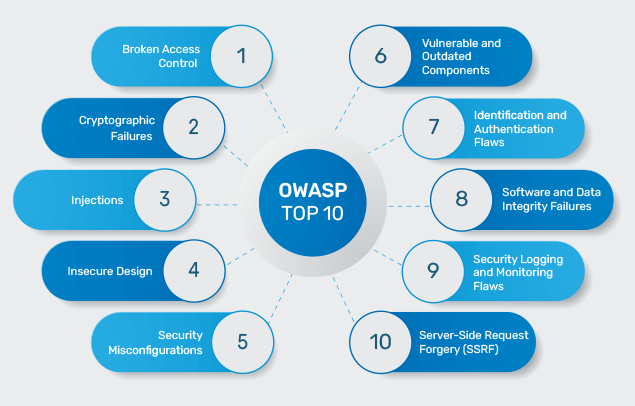

:titre: Présentation des failles principales du TOP 10 OWASP
:module: OWASP_Top_10
:duree: 60
:description: Introduction aux vulnérabilités critiques du TOP 10 OWASP, avec un focus sur les failles principales, leur fonctionnement, et comment s'en protéger.
include::../../../../adoc/libs/header-module.adoc[]

ifeval::["{visible-on-html}" != "yes"]
:docinfo: shared
:docinfodir: ../../../adoc/libs
endif::[]

== Objectifs pédagogiques

// tag::objectifs[]
* Comprendre les principales failles de sécurité listées dans le TOP 10 OWASP
* Découvrir les mécanismes d'exploitation de ces failles
* Connaître les bonnes pratiques de protection contre ces vulnérabilités
// end::objectifs[]

// tag::deroulement[]

== Présentation générale du TOP 10 OWASP

Le TOP 10 OWASP est une liste des vulnérabilités les plus critiques affectant les applications web, établie par la fondation OWASP (Open Web Application Security Project). Cette liste est largement adoptée comme référence pour sécuriser les applications web.

[NOTE.speaker]
====
Le TOP 10 OWASP recense les vulnérabilités les plus critiques et les plus courantes dans les applications web. C’est une référence essentielle pour comprendre les failles de sécurité et les mesures à mettre en place pour s'en protéger.
====

== 1. Contrôle d'accès défaillant (Broken Access Control)

Le contrôle d'accès consiste à limiter l'accès aux informations et aux actions en fonction des droits de l'utilisateur. Une défaillance de ce contrôle peut permettre à un utilisateur non autorisé d'accéder à des ressources protégées.

.Exemples de problèmes de contrôle d'accès :
* Accès à des données sensibles sans être authentifié.
* Escalade de privilèges : un utilisateur normal peut accéder à des fonctionnalités réservées aux administrateurs.

[NOTE.speaker]
====
Les failles de contrôle d'accès se produisent souvent à cause de règles mal configurées ou d'erreurs dans la gestion des autorisations. Par exemple, un utilisateur peut accéder à des informations ou effectuer des actions non autorisées.
====

== 2. Fuite de données sensibles (Cryptographic Failures)

Les applications stockent souvent des informations sensibles comme les mots de passe, numéros de carte de crédit, etc. Si ces informations ne sont pas correctement chiffrées ou protégées, elles peuvent être exposées aux attaquants.

.Exemples de mauvaises pratiques :
* Stocker des mots de passe en clair sans chiffrement.
* Transmettre des données sensibles via HTTP sans utiliser HTTPS.

[NOTE.speaker]
====
La protection des données sensibles est essentielle. Les données sensibles doivent être chiffrées en transit et au repos, et l'utilisation de protocoles comme HTTPS est obligatoire pour éviter les interceptions.
====

== 3. Injection de code à des fins malveillantes (Injection)

Les failles d'injection permettent à un attaquant d'exécuter du code arbitraire en injectant des commandes dans un champ utilisateur non sécurisé. SQLi est l'une des injections les plus connues, mais il existe d'autres types d'injection (LDAP, commande système, etc.).

.Exemples :
* Injection LDAP permettant l'accès à des données du répertoire utilisateur.
* Injection de commandes système pour exécuter des commandes non autorisées sur le serveur.

[NOTE.speaker]
====
Les injections surviennent quand les entrées utilisateur ne sont pas correctement traitées. Il est important d’utiliser des requêtes paramétrées et de valider les entrées pour prévenir ce type de faille.
====

== 4. Conception non sécurisée (Insecure Design)

Les erreurs de conception se produisent lorsque la sécurité n'est pas prise en compte dès le départ dans la conception de l'application. Cela peut inclure des erreurs dans les processus d'authentification, de gestion des sessions, ou de protection contre les abus.

.Exemple :
* Une application qui n’inclut pas de vérification d’accès avant certaines actions critiques.

[NOTE.speaker]
====
Un design sécurisé implique la prise en compte des menaces dès le début de la conception. Par exemple, un formulaire de connexion doit prévoir des mesures contre les attaques par force brute.
====

== 5. Mauvaise configuration de sécurité (Security Misconfiguration)

Une mauvaise configuration peut exposer des failles non prévues dans l'application. Cela peut inclure des serveurs mal configurés, des bases de données accessibles publiquement, ou des services inutiles qui restent activés.

.Exemples :
* Utiliser les identifiants par défaut d’un logiciel (admin/admin).
* Ne pas désactiver les messages d'erreur détaillés en production.

[NOTE.speaker]
====
Les erreurs de configuration sont souvent des erreurs humaines ou des oublis. Les serveurs doivent être configurés de manière sécurisée, en désactivant les fonctionnalités non utilisées et en appliquant des règles de contrôle d'accès strictes.
====

== 6. Erreur de validation de l’authenticité des demandes (Insecure Authentication)

Les problèmes d'authentification surviennent lorsque les mécanismes de connexion et de gestion des utilisateurs ne sont pas sécurisés, ce qui peut permettre à des attaquants d'usurper l'identité d'autres utilisateurs.

.Exemples :
* Stocker des mots de passe de manière non sécurisée.
* Utiliser des mots de passe faibles ou non sécurisés.

[NOTE.speaker]
====
La gestion de l'authentification est critique pour la sécurité. Utiliser des mots de passe forts, des politiques de renouvellement de mot de passe, et une authentification multi-facteurs (MFA) améliore la sécurité des utilisateurs.
====

== 7. Échec de la journalisation et de la surveillance (Logging and Monitoring Failures)

Si une application n'a pas de système de journalisation et de surveillance efficace, il devient difficile d’identifier et de réagir aux incidents de sécurité.

.Exemple :
* Une intrusion n'est pas détectée parce qu'il n'y a pas de journalisation des tentatives de connexion.

[NOTE.speaker]
====
Sans surveillance active, les incidents de sécurité peuvent passer inaperçus. La journalisation des événements critiques et l’alerte en cas d’activité suspecte sont essentielles pour réagir rapidement à une menace.
====

== 8. Désérialisation non sécurisée (Insecure Deserialization)

La désérialisation est le processus de conversion de données en un objet utilisable par le programme. Une désérialisation non sécurisée peut permettre à un attaquant d'exécuter du code arbitraire en manipulant les données avant leur conversion.

.Exemple :
* Un attaquant modifie les données avant la désérialisation pour exécuter une action non autorisée dans l’application.

[NOTE.speaker]
====
Les failles de désérialisation surviennent souvent lorsque l'application fait confiance aux données d'entrée sans vérification. Utiliser des formats sécurisés et limiter les actions autorisées lors de la désérialisation est recommandé.
====

== 9. Utilisation de composants vulnérables ou obsolètes (Using Components with Known Vulnerabilities)

L’utilisation de bibliothèques, frameworks, ou modules contenant des failles de sécurité connues expose l’application à des attaques potentielles.

.Exemple :
* Une application utilise une version obsolète d’une bibliothèque avec des vulnérabilités connues.

[NOTE.speaker]
====
Les dépendances doivent être régulièrement mises à jour pour s’assurer qu'elles ne contiennent pas de failles de sécurité connues. L’utilisation de versions obsolètes expose l'application à des risques élevés.
====

== Conclusion

Le TOP 10 OWASP répertorie les vulnérabilités les plus courantes et les plus critiques affectant les applications web. Ces failles doivent être prises en compte dès la phase de développement pour assurer la sécurité des applications.

// tag::conclusion[]
* Le TOP 10 OWASP est une référence essentielle pour sécuriser les applications web
* La prévention de ces failles repose sur des pratiques de codage sécurisées et une gestion rigoureuse des configurations
* Des tests réguliers de sécurité et une mise à jour des composants réduisent le risque de vulnérabilités
// end::conclusion[]
