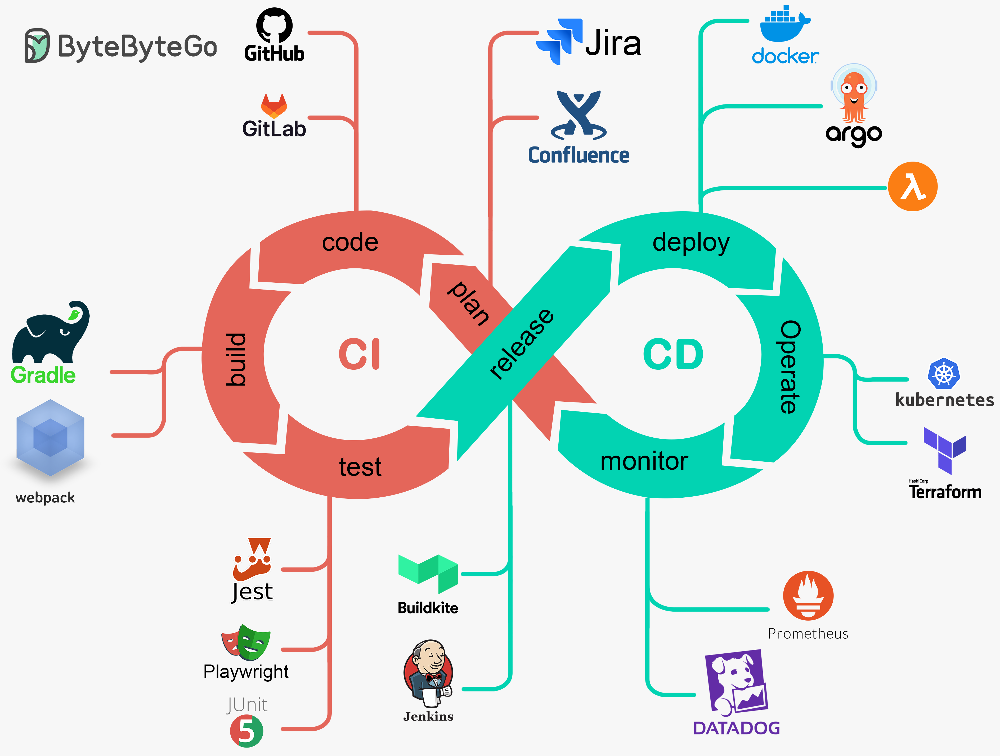

:titre: CI/CD
:module: Devops
:duree: 30
:description: Introduction à la CI/CD avec les outils, les avantages et les cas d'utilisation. Cours purement théorique pour comprendre les concepts.
include::../../../../adoc/libs/header-module.adoc[]

ifeval::["{visible-on-html}" !=  "yes"]
:docinfo: shared
:docinfodir: ../../../../../adoc/libs
endif::[]

== Objectifs pédagogiques

// tag::objectifs[]
* **Se rappeler** des étapes d'une CI/CD
* **Comprendre** le concept CI/CD
// end::objectifs[]

// tag::deroulement[]
== Introduction

* Définition : CI/CD est l'intégration continue et le déploiement continu.
* Objectifs : Automatiser et améliorer le processus de livraison de logiciels.
* Avantages : Réduire les erreurs humaines, accélérer le cycle de développement.

[NOTE.speaker]
====
La CI/CD est une pratique essentielle dans le développement logiciel moderne. Elle permet d'automatiser l'intégration du code et le déploiement des applications, réduisant ainsi le risque d'erreurs humaines.
====

== Concepts de l'intégration continue (CI)

=== Étapes principales

* Récupération du code source
* Compilation et construction
* Tests automatisés
* Rapport et feedback

[NOTE.speaker]
====
L'intégration continue consiste à intégrer fréquemment les modifications de code dans un dépôt partagé. Chaque intégration est vérifiée par une build automatique pour détecter les erreurs précocement.
====

=== Outils

* Jenkins
* GitLab CI
* Travis CI
* GitHub Actions

[NOTE.speaker]
====
Des outils comme Jenkins, GitLab CI et Travis CI sont utilisés pour automatiser les processus d'intégration continue. Ils permettent d'exécuter des builds et des tests automatiquement à chaque modification du code.
====

== Concepts du déploiement continu (CD)

=== Étapes principales

* Livraison du build
* Tests supplémentaires en environnement de pré-production
* Déploiement en production

[NOTE.speaker]
====
Le déploiement continu est la pratique qui consiste à déployer automatiquement le code validé en production. Il garantit que chaque modification passe par une série de tests avant d'être mise en ligne.
====

=== Outils

* Docker
* Docker Swarm
* Kubernetes

[NOTE.speaker]
====
Docker et Kubernetes facilitent le déploiement d'applications en conteneur.
====

== Avantages

* Réduction des erreurs humaines
* Accélération du cycle de développement
* Détection rapide des bugs
* Meilleure collaboration entre équipes de développement et opérations

[NOTE.speaker]
====
La CI/CD permet une livraison plus rapide et plus fiable des logiciels. Elle améliore la collaboration entre les équipes et assure une détection rapide des problèmes.
====

== Cas d'utilisation

* Scénario d'un projet open-source : facilite la gestion des contributions externes
* Scénario d'une entreprise SaaS : mises à jour continues et stables
* Scénario d'une application mobile : déploiements fréquents et rapides

// end::deroulement[]

== Conclusion

// tag::conclusion[]
* La CI/CD est essentielle pour le développement logiciel moderne.
* Elle automatise et sécurise le processus de livraison des applications.
* L'adoption de la CI/CD améliore la qualité et la vitesse des livraisons logicielles.
// end::conclusion[]