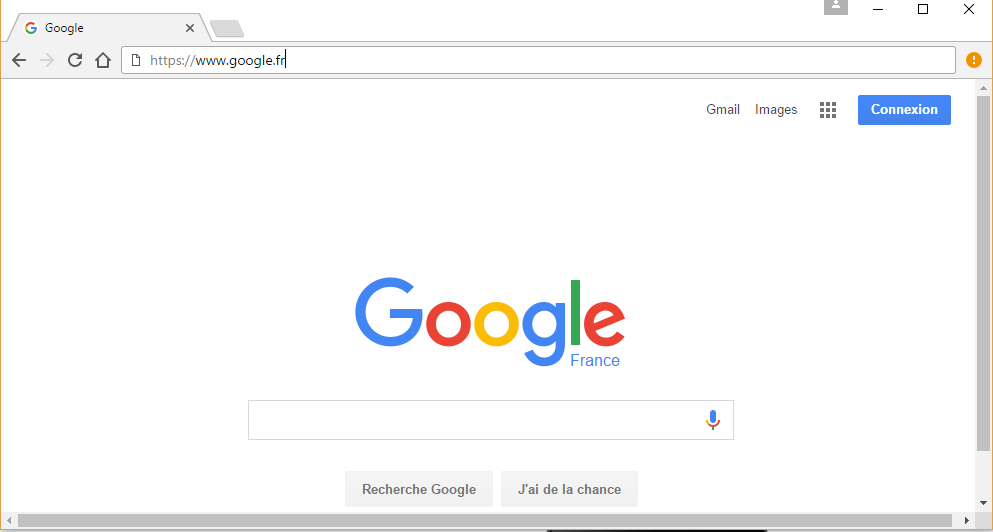
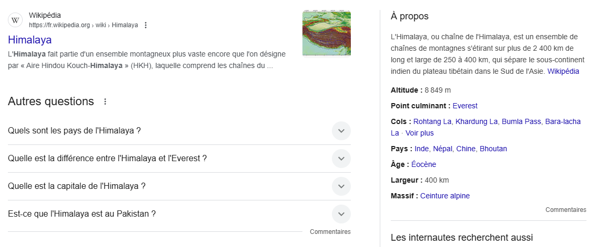
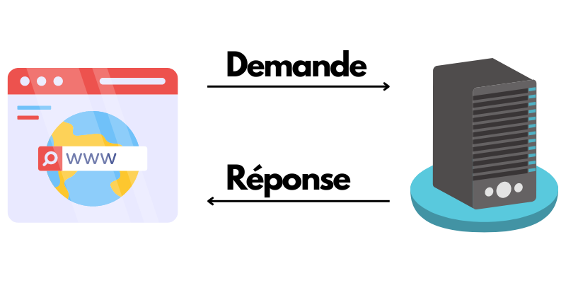
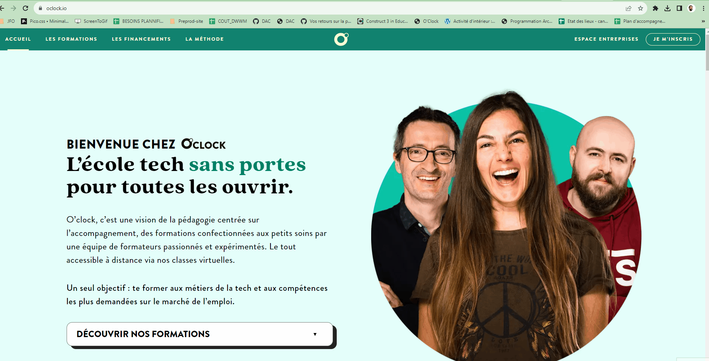
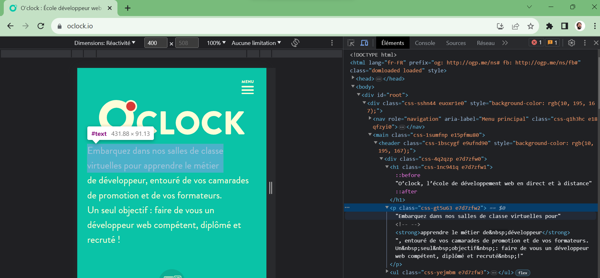
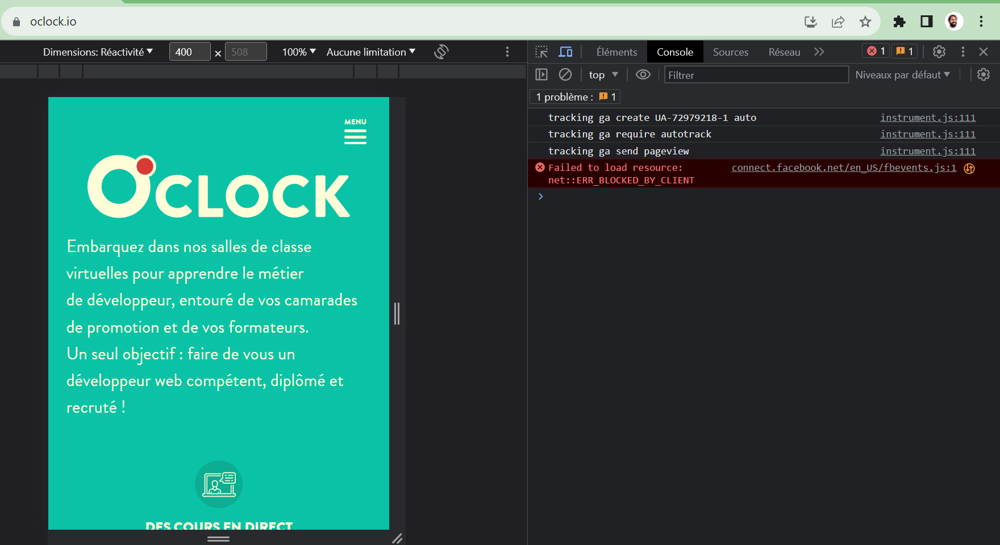
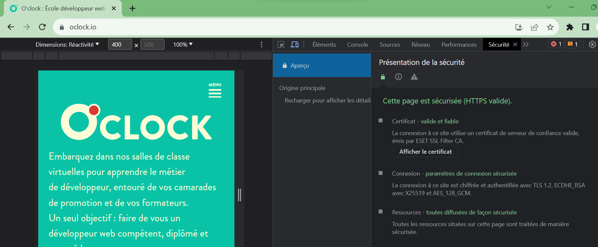

:titre: Introduction au Web
:module: Bases web
:duree: 20
:description: Découvrir les bases du développement web
include::../../../../adoc/libs/header-module.adoc[]

ifeval::["{visible-on-html}" !=  "yes"]
:docinfo: shared
:docinfodir: ../../../../adoc/libs
endif::[]

== Objectifs

// tag::objectifs[]
* Définir ce qu'est Internet et ses principaux usages.
* Expliquer le fonctionnement du Web.
* Identifier certains outils essentiels pour le développement front-end.
* Explorer les navigateurs et leurs fonctionnalités pour les développeurs.
// end::objectifs[]

[NOTE.speaker]
====
Ce module a pour objectif de vous initier aux bases du développement web en abordant les concepts fondamentaux d'Internet, du Web et des outils indispensables pour les développeurs front-end.  
====

// tag::deroulement[]
== Internet

Internet est un réseau mondial interconnecté qui permet de partager des informations en utilisant divers protocoles. Parmi les plus connus :

* **SMTP, POP** : Pour l’envoi et la réception d’emails.
* **FTP** : Pour le transfert de fichiers.
* **HTTP** : Pour naviguer sur le Web.

[NOTE.speaker]
====
Internet repose sur une infrastructure mondiale qui connecte des milliards d’appareils, permettant ainsi la communication, la recherche et le partage d’informations.
====

== Internet : Histoire

Internet a été créé dans les années 60 comme un projet de recherche appelé ARPANET.

* **Années 1960** : Création d’ARPANET, le prédécesseur d’Internet, par le département de la Défense américain.
* **Années 1980** : Introduction des premiers protocoles TCP/IP, qui structurent les échanges de données.
* **Années 1990** : Popularisation avec l’avènement du **World Wide Web** (WWW).

[NOTE.speaker]
====
L'histoire d'Internet est une aventure technologique et sociale marquante, qui commence dans les années 1960 et transforme profondément la société. Voici un résumé des étapes clés :

*Les débuts : les années 1960-1970*

* Contexte de la Guerre froide : Les États-Unis cherchent à créer un système de communication décentralisé capable de résister à des attaques nucléaires.
* ARPANET (1969) : Créé par l'ARPA (Advanced Research Projects Agency), c'est le précurseur d'Internet. Il connecte les universités et les centres de recherche pour partager des ressources informatiques.
* Naissance des protocoles : Les protocoles comme le TCP/IP, développés dans les années 1970 par Vint Cerf et Bob Kahn, permettent aux ordinateurs de communiquer entre eux sur un réseau.

*Émergence des réseaux mondiaux : les années 1980*

* Élargissement : ARPANET s'ouvre à des utilisateurs hors militaires, notamment des chercheurs.
* Création de l’email (1971) : L’un des premiers usages pratiques d’ARPANET.
* Transition vers Internet : En 1983, ARPANET adopte le protocole TCP/IP, établissant les bases de l'Internet moderne.
* NSFNET (1986) : Un réseau financé par la National Science Foundation, qui relie les universités et remplace ARPANET.

*Explosion du Web : les années 1990*

====

== World Wide Web (www)

* World Wide Web abrégé par WWW : C'est ce que l'on appelle le web

[NOTE.speaker]
====
Le Web est une immense toile mondiale qui permet d’accéder à des informations à travers des pages web reliées par des hyperliens.
====

== Web : Histoire

* Inventé au CERN par Tim Berners-Lee

[NOTE.speaker]
====
Le CERN est le l'Organisation Européenne pour la Recherche Nucléaire, institué en 1952.
Entre 1989 et 1990, Tim Berners-Lee, rejoint par Robert Cailliau, conçoivent et développent un système d'information hypertexte, le World Wide Web. 

*Les 20 ans d’un web libre et gratuit*

Le 30 avril 1993, le CERN publiait une déclaration autorisant l’utilisation gratuite de la technologie du World Wide Web

Le 30 avril 1993, le CERN publiait une déclaration autorisant l’utilisation gratuite de la technologie du World Wide Web (« W3 », ou plus simplement « le web »). Le fait d’avoir rendu accessible gratuitement le logiciel nécessaire au fonctionnement d’un serveur web, ainsi que le navigateur et la bibliothèque de codes associés, a permis à la Toile de se tisser.

Le physicien britannique Tim Berners-Lee inventa le web au CERN en 1989. Le projet, baptisé « World Wide Web », a été initialement conçu et développé pour que les physiciens et les physiciennes travaillant dans les universités et les instituts du monde entier puissent s'échanger les informations dont ils avaient besoin.

D’autres systèmes de recherche documentaire utilisant l’internet, tels que WAIS et Gopher, existaient à l’époque, mais la simplicité du web et le fait que sa technologie soit accessible gratuitement ont permis à l’outil d’être adopté et développé rapidement.

« L’invention, dans un laboratoire de physique, du web a révolutionné tous les secteurs de la société, a déclaré Rolf Heuer, directeur général du CERN.  Du monde de la recherche au secteur privé, en passant par l’enseignement, le web a transformé notre façon de communiquer, de travailler, d'innover et de vivre. Le web est un exemple éclatant de la manière dont la société récolte les fruits de la recherche fondamentale. » 

Le premier site web au CERN – et dans le monde – a été consacré au projet World Wide Web lui-même et a été hébergé sur l’ordinateur NeXT de Tim Berners-Lee. Le site web décrivait les principales caractéristiques du web, la manière d’accéder aux documents d’autres personnes et la manière de configurer son propre serveur. Si la machine NeXT – le serveur web d’origine – se trouve toujours au CERN, le premier site web du monde n'est malheureusement plus accessible en ligne à son adresse d'origine.

Pour marquer l’anniversaire de la publication du document qui permit la libre utilisation de la technologie du web, le CERN a lancé un projet visant à rétablir le premier site web et à préserver les « biens numériques » associés à la naissance du web. Pour en savoir plus sur le projet et sur le premier site web, consultez la page http://first-website.web.cern.ch (en anglais).
====

== Navigateur web

* Pour accéder au web on utilise un navigateur web.

[NOTE.speaker]
====
Le navigateur est un logiciel installé sur l'ordinateur qui permet de lire et de consulter du contenu sur le Web (des pages WEB). 
On donne quelques exemples dans la slide suivante.
====

== Navigateurs

image::./assets/Navigateurs.png[Les différents navigateurs web]

[NOTE.speaker]
====
Ici on retrouve les logos des navigateurs les plus connus. Dont celui que vous utilisez le plus, à savoir Google Chrome. On retrouve également celui de Mozilla, Firefox et le navigateur de Microsoft, Edge.
====

== Lien hypertexte

Elément interactif dans une page web qui redirige vers une autre ressource en ligne.

== Démonstration

Le premier site de l'histoire

[NOTE.speaker]
====
**Description :**

Le but de cette démonstration est de montrer le premier site au monde

**Déroulement :**

*Etape 1 : Allez sur le site*

http://info.cern.ch/hypertext/WWW/TheProject.html

*Etape 2 : Comprendre le but*

On voit bien ici que le seul but est de délivrer de l'information/contenue. C'est ça internet à la base: Un réseau de communication sur lequel on peut s'échanger de l'information ! ✨

*Etape 3 : Les liens Hypertext*

Les liens hypertext sont les fondations de ce qu'on appèle aujourd'hui le web. 
Le web c'est une immense toile avec plein de noeuds reliés entre eux.
Le noeuds sont les listes
Et le fils qui les relient sont les liens hypertext 🕸

*Etape 4 : Visualiser*

Essayez de vous représenter cette toile au niveau mondiale !
ça donne le vertige non ? Et bien aujourd'hui le web est encore bien plus proéminant que ce qu'on arrive à percevoir 😍
====

== Web : Fonctionnement

Le web fonctionne en permettant aux utilisateurs d'accéder à des informations et de communiquer en utilisant des protocoles de communication standardisés et en reliant les ressources par des liens hypertexte.

[NOTE.speaker]
====
Les informations affichées aux utilisateurs sont les pages web consultées.
Nous voyons dans les slides suivantes les protocoles utilisées.
====

== Protocole HTTP

Fondement de la communication sur le web, permettant le transfert de données entre les clients et les serveurs.

[NOTE.speaker]
====
Le HTTP (HyperText Transfer Protocol) est le protocole standard d'échange sur le Web. Il permet à votre navigateur (client) et les serveurs web de communiquer pour afficher les sites Internet.

*Comment ça fonctionne ?*

1. Requête du client : Lorsque vous tapez une URL dans votre navigateur, celui-ci envoie une requête HTTP au serveur associé à cette URL. Par exemple : "Donne-moi la page d'accueil de ce site".

2. Réponse du serveur : Le serveur reçoit la requête et répond avec le contenu demandé (comme une page HTML, des images, etc.) ou un code d'état HTTP (ex. : 404 si la page est introuvable).

*Pourquoi est-ce important ?*

HTTP est la *colonne vertébrale du web* : il permet d'afficher les sites, de récupérer des ressources et d'interagir avec des services en ligne.
====

== Protocole HTTP

[NOTE.speaker]
====
Le navigateur (lors d'un click sur un lien ou lorsque l'on tape une adresse de site internet dans la barre d'url) envoi une requête sur le serveur pour lui adressé sa demande.
Le serveur répond ensuite au client et toutes les données sont transmises au navigateur.
Le navigateur affiche ensuite ces données à l'utilisateur.
Il est à noter que le message de requête et celui de réponse sont transmises en clair à travers le réseau.
====

== Protocole HTTPS

Version sécurisée du protocole HTTP, utilise le chiffrement pour protéger les données échangées entre les clients et les serveurs sur le web.

[NOTE.speaker]
====
Le HTTPS (HyperText Transfer Protocol Secure) est une version sécurisée du protocole HTTP. Il assure que les échanges entre votre navigateur (client) et le serveur web sont cryptés, authentiques et protégés contre les interceptions.

1. Requête sécurisée : Quand vous accédez à un site en HTTPS, votre navigateur commence par vérifier l’identité du site grâce à un certificat de sécurité fourni par le serveur. Ce certificat est délivré par une autorité de confiance (comme Let's Encrypt).

2. Chiffrement des données : Une fois l'identité confirmée, le navigateur et le serveur établissent une connexion chiffrée via le protocole TLS (Transport Layer Security). Toutes les données échangées sont cryptées et ne peuvent pas être lues par un tiers.

3. Échange des informations : Une fois la connexion sécurisée, le reste des échanges (texte, images, vidéos, etc.) se fait comme en HTTP, mais avec une protection contre les attaques.

*Pourquoi est-ce important ?*

HTTPS protège vos mots de passe, informations bancaires, et autres données personnelles.
Il est devenu un standard obligatoire pour les sites modernes, car les navigateurs comme Chrome affichent un avertissement pour les sites non sécurisés (HTTP simple).
En bref, HTTPS = HTTP + sécurité, et c’est indispensable pour un web sûr !
====

== Protocole HTTPS

image::./assets/ProtocoleHttps.png[Légende de l'image]

[NOTE.speaker]
====
Le cheminement est le même que pour le protocole HTTP. La seule différence ici est que les données sont cryptées à travers le réseau.
====

== Démonstration

// tag::demo[]
Protocole HTTP & HTTPS

[NOTE.speaker]
====
**Description**

Le but de cette démonstration est d'illustrer le fonctionnement des protocoles HTTP & HTTPS. D'illustrer la différence entre les 2

**Déroulement**

*Etape 1 : Faire un schéma*

Faire un schéma avec eux sur tldraw, excalidraw ou autre afin d'illustrer client / serveur.
Montrer que le client peut être un site web, une application desktop/mobile, un software, etc : Tout ce qui est capable d'envoyer un requête HTTP.

*Etape 2 : Leur montrer qu'ils le font tous les jours*

* Les faire participer
Leur dire qu'ils déclenchent des requêtes HTTP tous les jours.
Leur demander si ils savent comment et avec quoi ? 

* Démo avec eux
Ouvrir un Google Chrome et aller sur un site au hasard
Ouvrir Firefox et aller sur un site au hasard
Ouvrir une application et leur expliquer que la communication entre l'appli et les serveurs se font via le protocole HTTP

*Etape 3 : Voir d'autres clients HTTP*

Ouvrir un client HTTP (postman, insomnia) et envoyer une requête HTTP sur un site au hasard
Faire une requête HTTP avec curl dans le terminal
Leur expliquer que tout le code c'est la réponse du serveur et que cette réponse est traduit par les navigateurs pour afficher des trucs jolies !🌺

*Etape 4 : HTTPS c'est pareil mais en Sécurisé*

Revenir sur le schéma fait plus haut.
Leur expliquer que tout le monde peut intercepter les communication entre un client et un serveur !
Des fois, il y a des informations sensibles (email, mdp, id, info perso, info industrielles, etc).
Pour solutionner ça il existe HTTPS ! ✨
On chiffre les communication comme ça même si quelqu'un les lit, il ne comprendra pas !
Rajouter l'info sur le schéma
====
// end::demo[]

== Outils pour les dévs

Etre dév c'est savoir utiliser les outils mis à sa disposition

* Sur le navigateur
* Sur son IDE
* Sur le terminal

[NOTE.speaker]
====
On découvrira l'IDE VS-CODE lorsqu'on commencera à coder nos premières pages HTML.
Le navigateur (Google Chrome) servira à tester le rendu de nos pages web.
====

== Outils sur le navigateur

Outils pour les dév : F12

[NOTE.speaker]
====
On peut ouvrir l'inspecteur du navigateur en appuyant sur la touche F12 du clavier, ou en faisant un clic droit sur une page, suivi d'un clic gauche sur Inspecter.
On voit la démonstration dans la slide suivante.
====

== Outils sur le navigateur

[NOTE.speaker]
====
La démonstration montre l'ouverture de l'outil inspecteur dans le navigateur Google Chrome.
====

== Démonstration

// tag::demo[]
F12

[NOTE.speaker]
====
**Description**

Le but de cette démonstration est de montrer les dev tools du navigateur

**Prérequis**

* Un navigateur

**Déroulement**

*Etape 1 : Aller sur un site*

Ouvrir Chrome et aller sur un site (celui d'O'clock ?)

*Etape 2 : Dev Tools*

Ouvrir les dev tools avec F12.
Montrer les différentes façon d'ouvrir les dev tools : F12, clic droit et inspecter, Ctrl + Maj + I
Montrer qu'il est possible de déplacer les dev tools (Dock side)
====
// end::demo[]

== Elements

[NOTE.speaker]
====
On montre ici qu'en sélectionnant un élément dans la page, et lorsqu'on clique droit et qu'on clique sur inspecter, l'inspecteur s'ouvre directement sur l'élement sélectionné dans la page.
====

== Démonstration

// tag::demo[]
Elements

[NOTE.speaker]
====
**Description**

Le but de cette démonstration est de se familiariser avec l'inspecteur d'élément du navigateur

**Prérequis**

* Un site ouvert sur le navigateur

**Déroulement**

*Etape 1 : ouvrir les dev tools*

* F12
* Ctrl + Maj + I
* Clic droit et inspecter

*Etape 2 : Explication interface inspecteur d'éléments*

* Partie gauche prermet d'inspecter le code HTML des éléments visibles sur la page et d'en selectionner 1
* Parti droite permet de voir le code CSS mit en place pour l'élément selectionné 

On utilisera l'outil dès qu'on attaquera HTML & CSS

*Etape 3 : Selectionner un élément*

* On selectionne un élément HTML depuis les dev tools. On remarque que sur le panneau gauche on voit le CSS de cet élément.
* On selectionne un élément depuis le rendu de la page  vec l'outil de selection ou le raccourcis Ctrl + Maj + C

*Etape 4 : Changer 2, 3 trucs*

Utiliser l'inspecteur pour changer des petites choses sur le rendu (du texte, des couleurs, etc)
Leur expliquer que ça ne modifie pas vraiment le site (ça serait catastrophique), mais que ça modifie uniquement dans leur navigateur ! 
Top pour tester des trucs rapidement ! ✨
====
// end::demo[]

== Console

[NOTE.speaker]
====
On découvre ici l'onglet console de l'inspecteur.
====

== Démonstration

// tag::demo[]
Console

[NOTE.speaker]
====
**Description**

Le but de cette démonstration est de se familiariser avec la console JS du navigateur

**Prérequis**

* Un site ouvert sur le navigateur

**Déroulement**

*Etape 1 : ouvrir les dev tools*

* F12
* Ctrl + Maj + I
* Clic droit et inspecter

*Etape 2 : Explication interface console JS*

* Un panel a gauche pour filtrer les messages par type
* Des settings pour personnaliser le comportement de la console
* Des messages en dessous

On utilisera l'outil dès qu'on attaquera JS

*Etape 3 : Explication de l'outil*

* On peut visualiser des messages en console (msg d'erreur, de warning, de fonctionnement, du monitoring, des messages de dev, etc)
* Outil très utilisé lors des phases de dev en JS
* On peut écrire des trucs dedans 😁

*Etape 4 : Utiliser la console*

* Ecrire des trucs dans la console pour montrer l'interractivité
* Expliquer c'est ça va agir comme l'inspecteur d'éléments mais pour le JS : On va pouvoir modifier et tester des trucs mais ça aura un impact uniquement sur votre navigateur
* Faire un petit coup de `alert()`, `textContent`, `style.backgroundColor`, `window.location` pour l'effet waouw 😍
Top pour tester des trucs rapidement  ! ✨
====
// end::demo[]

== Sources

image::./assets/sources.png[Outils Console]

[NOTE.speaker]
====
On découvre ici l'onglet Sources de l'inspecteur.
====

== Démonstration

// tag::demo[]
Sources

[NOTE.speaker]
====
**Description**

Le but de cette démonstration est de se familiariser avec l'onglet source du navigateur

**Prérequis**

* Un site ouvert sur le navigateur

**Déroulement**

*Etape 1 : ouvrir les dev tools*

* F12
* Ctrl + Maj + I
* Clic droit et inspecter

*Etape 2 : Explication interface Sources*

* A gauche : un panel pour visualiser et naviger entre les différents fichiers sources (site, extensions et autres scripts)
* Au milieur : le code source du fichier selectionner
* A droite : l'outils de debugger

On utilisera l'outil dès qu'on attaquera JS

*Etape 3 : Explication de l'outil*

* Naviguer dans l'arborescence de dossiers/fichiers et ouvrir un ou deux fichiers sources (html, css, js, assets, etc)
* Pas fait pour modifier du code
* A utiliser pour debugger
====
// end::demo[]

== Sécurité

[NOTE.speaker]
====
L'onglet Sécurité des outils de développement dans Google Chrome est une fonctionnalité qui permet d'inspecter et d'analyser les aspects liés à la sécurité des sites web que vous visitez. Cet onglet est particulièrement utile pour les développeurs et les administrateurs de sites web qui souhaitent vérifier que leur site respecte les normes de sécurité et identifier d’éventuels problèmes.
====

== Démonstration

// tag::demo[]
Sécurité

[NOTE.speaker]
====
**Description**

Le but de cette démonstration est de se familiariser avec l'onglet sécurité du navigateur

**Prérequis**

* Un site ouvert sur le navigateur

**Déroulement**

*Etape 1 : ouvrir les dev tools*

* F12
* Ctrl + Maj + I
* Clic droit et inspecter

*Etape 2 : Explication interface Sécurité*

* Une overview permettant de voir si le site a un certificat HTTPS
* On peut visualiser ce certificat 

*Etape 3 : Explication d'un certificat HTTPS*

* Il faut faire la demande auprès d'une Autorité de Certification (AC)
* Une fois la demande validée par l'AC, celle-ci délivre un certificat HTTPS
* Vous devez le récupérer et l'installer sur vos serveurs, puis lier à votre site web
* L'identité du site est maintenant validé, garantit la confidentialité des données, sécurise les échanges de données entre un serveur et un client et ça rassure les internautes
====
// end::demo[]

== Lighthouse

image::./assets/lighthouse.png[Outils Lighthouse]

[NOTE.speaker]
====
Lighthouse est un outil intégré dans les outils de développement de Google Chrome, conçu pour analyser et auditer les performances, l'accessibilité, les meilleures pratiques, le référencement (SEO) et la conformité des applications web ou des sites web modernes.
====

== Démonstration

// tag::demo[]
Lighthouse

[NOTE.speaker]
====
**Description**

Le but de cette démonstration est de se familiariser avec l'onglet lighthouse du navigateur

**Prérequis**

* Un site ouvert sur le navigateur

**Déroulement**

*Etape 1 : ouvrir les dev tools*

* F12
* Ctrl + Maj + I
* Clic droit et inspecter

*Etape 2 : Explication interface Lighthouse*

* Un onglet pour générer un rapport sur les perf, le seo, les bonnes pratiques et l'accessibilté du site consulté
* On test l'outils et on explique ce qu'on a sous les yeux
====
// end::demo[]

== Exercice

// tag::exercice[]
Allez sur le site de http://www.google.fr et trouvez la taille (heigth) de l'image du logo de Google.

*Etape 1 :* Utilisez la touche F12 sur Google Chrome pour visualiser le code de la page.

*Etape 2 :* Utilisez l'option *inspector* pour trouver la taille du logo.

== Correction

Vous devriez trouver que la taille du logo est de 92px.
// end::exercice[]

// end::deroulement[]

== Conclusion
// tag::conclusion[]
* Vous savez ce qu'est Internet
* Vous savez ce qu'est le web
* Vous savez ce qu'est le protocole HTTP & HTTPS
* Vous savez qu'il existe des outils de dev sur le navigateur
// end::conclusion[]
