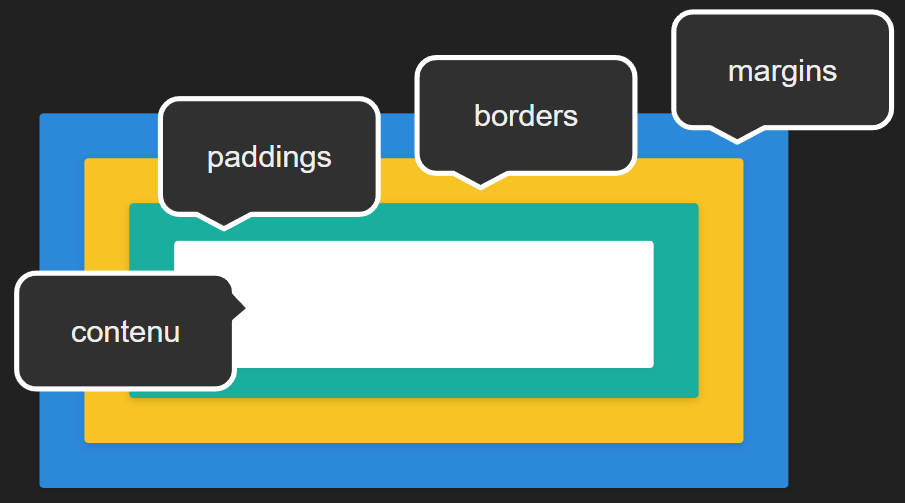

:titre: Box Model
:module: Bases web
:duree: 60
:description: Comprendre comment fonctionne le dimensionnement des éléments HTML en CSS.
include::../../../../adoc/libs/header-module.adoc[]

ifeval::["{visible-on-html}" !=  "yes"]
:docinfo: shared
:docinfodir: ../../../../adoc/libs
endif::[]

== Objectifs pédagogiques

// tag::objectifs[]
* *Comprendre* ce qu'est le box model
* *Appliquer* les propriétés CSS pour dimensionner les éléments
// end::objectifs[]

// tag::deroulement[]
== Box model c'est quoi ?

* AKA : Modèle de boîte
* Chaque élément visuel d'une page est entouré par une boite invisible
* Box model permet de définir comment se comporte ces boites

[NOTE.speaker]
--
Le modèle de boîte (box model en anglais) est un concept important en CSS (Cascading Style Sheets) qui définit comment les éléments HTML sont affichés sur une page web. 
Imaginez que chaque élément HTML, comme un paragraphe ou une image, est entouré par une "boîte" invisible qui contrôle sa taille et ses marges.
--

=== Grandes composantes

Le modèle de boîte est composé de cinq parties principales :

. Le contenu (Content) 
. La bordure (Border)
. Le rembourrage (Padding) 
. La marge (Margin)
. Le type 

[NOTE.speaker]
--
. C'est le contenu réel de l'élément, comme le texte d'un paragraphe ou l'image d'une image.
. C'est la ligne qui entoure le contenu. Elle peut être visible et stylisée avec des couleurs, des épaisseurs et des styles différents.
. C'est l'espace entre le contenu et la bordure. Il peut être utilisé pour ajouter de l'espace autour du contenu sans affecter la bordure.
. C'est l'espace entre la bordure de l'élément et les éléments voisins. Les marges sont utilisées pour créer de l'espace entre différents éléments sur la page.
. En CSS, il existe deux type de boîtes : les boîtes en bloc ("block boxes" en anglais) et les boîtes en ligne ("inline boxes" en anglais ou également « boîtes en incise » en rançais). 
--

=== Visualisation



La boîte complète est composée des 3 couleurs et du blanc.

=== Balises concernées

Une balise `<div>` est une box

Une balise `<main>` est une box

Une balise `<h1>` est une box

Une balise `<body>` est une box

> Bref : chaque balise est une box !

[NOTE.speaker]
--
Tout ce qui est sur une page est une box.

Il est à noter que chaque balise, qu'elle soit de type inline, ou de type block, est une box. Il existe néammoins une petite subtilité pour les balises de type inline. La principale différence entre les deux types se situent au niveau du margin qui n'est pas géré sur le type inline (mais qui peut être résolu en redéfinissant le display en type inline-block).
--

// tag::demo[]
=== Démonstration

ifeval::["{visible-on-html}" !=  "yes"]

[.tips]
--
💡 Appuyer sur la touche "*s*" pour le mode speaker
--

endif::[]

Création d'une box de 300 x 300 et ajout de padding et de border.

.html
```html
<div>Contenu</div>
```

.css
```css
div {
  width: 300px;
  height: 300px;
}
```

[NOTE.speaker]
--
*Etapes :*

[start=1]
. Ajouter un padding de 100px sur tous les côtés

```css
div {
  width: 300px;
  height: 300px;
  padding: 100px;
}
```

[start=2]
. Inspecter l'élément avec la console développeur
. Constater que la taille de la box a augmenté à 500 x 500

Avec les paddings, les dimensions de la box sont impactées.

[start=4]
. Ajouter une bordure de 10px solide

```css
div {
  width: 300px;
  height: 300px;
  padding: 100px;
  border: 10px solid;
}
```

[start=5]
. Inspecter l'élément avec la console développeur
. Constater que la taille de la box a augmenté à 520 x 520

Avec les bordures, les dimensions de la box sont impactées.

[start=7]
. Ajouter une margin de 50px de tous les côtés

```css
div {
  width: 300px;
  height: 300px;
  padding: 100px;
  border: 10px solid;
  margin: 50px;
}
```

[start=8]
. Inspecter l'élément avec la console développeur
. Constater que la taille de la box n'a pas changée
--
// end::demo[]

=== Récapitulatif

* Les paddings augmentent les dimensions de la box
* Les borders augmentent aussi les dimensions de la box
* Les margins n'augmentent pas les dimensions de la box

Mais alors comment conserver les dimensions initiales ?

== `box-sizing`

La propriété CSS `box-sizing: border-box;` permet de :

* préserver les dimensions d'un élément
* contenir l'épaisseur des paddings et borders, dans l'élément
* (sauver votre intégration CSS)

=== Avec VS sans

.Sans `box-sizing`
```css
div {
  width: 300px;
  height: 300px;
  padding: 100px;
  border: 10px solid;
  /* Ouch ! ma div fait 520 x 520 */
}
```

.Avec `box-sizing`
```css
div {
  width: 300px;
  height: 300px;
  padding: 100px;
  border: 10px solid;
  box-sizing: border-box;
  /* Ah, ma div fait toujours 300 x 300 */
}
```

[NOTE.speaker]
--
Le box-sizing permet ici de faire en sorte que toutes les dimensions (padding, border et zone de contenu) rentrent dans les dimensions données par la propriété width. Du coup, la boxe possèdera un padding de 100px sur les côtés, 10px sur les bordures. Du coup, la zone de contenu fera : 300-(100*2)-(10*2) = 300-220 = 80px.
--

=== Astuce

Pour appliquer le `box-sizing` à toutes les balises de votre document, vous pouvez utiliser la règle suivante :

```css
* {
  box-sizing: border-box;
}
```

[NOTE.speaker]
--
`*` est un sélecteur universel qui cible toutes les balises HTML, aussi appelé "wildcard" en anglais.
--


// tag::demo[]
=== Démonstration

ifeval::["{visible-on-html}" !=  "yes"]

[.tips]
--
💡 Appuyer sur la touche "*s*" pour le mode speaker
--

endif::[]

Ajouter la propriété `box-sizing: border-box;` à la box.

[NOTE.speaker]
--
. D'abord en ajoutant la propriété à la div avec le selecteur `div`
. Puis en ajoutant la propriété à toutes les balises avec le selecteur universel `*`
--
// end::demo[]

// end::deroulement[]

== Conclusion

// tag::conclusion[]
https://tom-roche-oclock.github.io/boxmodel/[Visualisation en direct,window=_blank]

* Chaque élément HTML est une box
* Box model est composé de 5 parties
** `content`
** `border`
** `padding`
** `margin`
** `type`
* `box-sizing` permet de conserver les dimensions
// end::conclusion[]