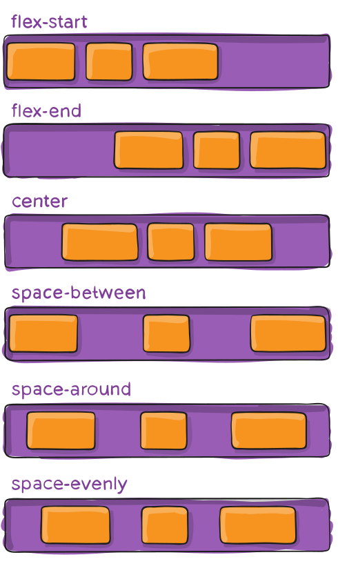
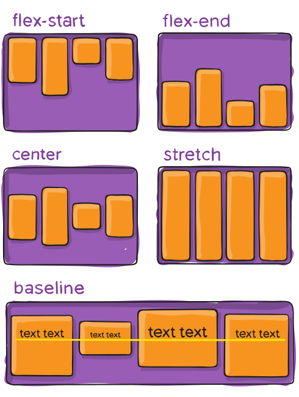
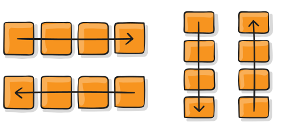
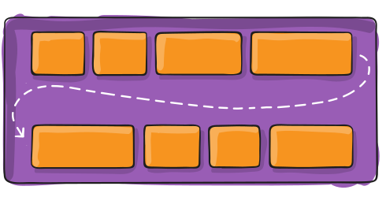

:titre: Flexbox
:module: HTML / CSS
:duree: 90
:description: Découvrir la propriété CSS `flex` pour créer des mises en page flexibles.
include::../../../../adoc/libs/header-module.adoc[]

ifeval::["{visible-on-html}" !=  "yes"]
:docinfo: shared
:docinfodir: ../../../../adoc/libs
endif::[]

== Objectifs pédagogiques

// tag::objectifs[]
* *Comprendre* le fonctionnement de flexbox
* *Utiliser* les propriétés flexbox pour organiser ses éléments
* *Utiliser* les propriétés flexbox pour aligner ses éléments
// end::objectifs[]

// tag::deroulement[]

== Introduction à flex

* https://developer.mozilla.org/fr/docs/Learn/CSS/CSS_layout/Flexbox[Documentation MDN,window=_blank]
* le parent contrôle les enfants à l'intérieur de sa boîte grâce à `display: flex;`
* https://css-tricks.com/snippets/css/a-guide-to-flexbox/[Documentation CSS Tricks,window=_blank]

[NOTE.speaker]
--
Reprendre la https://github.com/O-clock-FS-JS/Hero-corp-fan-page/tree/correction[Correction Hero Corps,window=_blank]

On attaque le dernier bonus avec les vignettes

On pose le html et le css rapidement pour avoir les petite boites l'une en dessous des autres On veut les mettre cote à cote, comment on fait ? On peut faire en `display: inline-block` et on met des contenus de taille différentes pour bien voir que c'est moche (par exemple avec `width:150px` et rallonger un texte "La fine équipe Hero Corp du début de l'aventure. John au centre, les habitants principaux du village derrière." les hauteurs sont différentes).

On voudrait quelque chose de plus flexible, la solution ultime :

On regarde la https://developer.mozilla.org/fr/docs/Learn/CSS/CSS_layout/Flexbox[documentation MDN,window=_blank]

C'est le parent qui va contrôler les enfants à l'intérieur de sa boîte, on rajoute une classe au parent si pas déjà fait et on met display: flex sur le parent et on constate, puis on va voir plus en détail :

On va sur la doc de csstrix et on essai de la lire, les apprenants propose leur vision par rapport à la doc.
--

== C'est quoi les flexbox ?

* Une manière d'organiser ses éléments
* On définit un / des container qui vont contenir et organiser ses éléments enfants en définissant un alignement une taille ainsi qu'un espacement
* Les éléments enfants (items) possèdent eux aussi des propriétés pour définir leur ordre, taille et positionnement et espacement

[NOTE.speaker]
--
Le module des boîtes flexibles, aussi appelé « flexbox », a été conçu comme un modèle de disposition unidimensionnel et comme une méthode permettant de distribuer l'espace entre des objets d'une interface ainsi que de les aligner (définition CDN).
--

=== Comment on s'en sert ?

On commence par définir un container en donnant à une balise une propriété : 

[source, html]
----
<div class="container">
    <div class="item1">item 1</div>
    <div class="item2">item 2</div>
    <div class="item3">item 3</div>
</div>
----

[source, css]
----
.container {
    display: flex; 
}
----

[NOTE.speaker]
--
C'est toujours sur l'élément parent qu'on positionne le display flex (jamais sur les enfants). Ce sont les enfants qui s'adaptent avec le principe d'héritage à l'élement parent (container).
--

== justify-content



[NOTE.speaker]
--
Permet de spécifier l'espacement entre les éléments 

* flex-start: les items se tassent vers le début de la direction donnée par le container
* flex-end: même chose mais les items sont tassés vers la fin de la direction donnée
* start: les items sont tassés vers le début du writing-mode (la direction de l'écriture(horitontale/verticale, gauche/droite))
* end: même chose mais les items sont tassés vers la fin
* left: les items sont tassés vers la gauche sauf si ça ne coincide pas avec flex-direction, dans lequel cas la propriété aura le même effet que start
* right: même chose mais vers la droite
* center: les items sont alignés au centre
* space-between: on espace les éléments, le premier item est collé au début, le dernier à la fin, l'espace entre les autres éléments est égal
* space-around: on donne le même espace aux éléments sans les coller aux bords, qui pourront laisser un écart différent de celui entre les éléments
* space-evenly: on donne un espacement égal aux éléments (que ça soit par rapport au bord ou entre les éléments)
--

=== justify-content : syntaxe

[source, css]
----
.container {
    display:flex;
    justify-content: flex-start | flex-end | center | space-between | space-around | space-evenly | start | end | left | right ... + safe | unsafe;
}
----

// tag::demo[]

=== Démonstration

ifeval::["{visible-on-html}" !=  "yes"]

[.tips]
--
💡 Appuyer sur la touche "*s*" pour le mode speaker
--

endif::[]

justify-content

[NOTE.speaker]
--
*Description*

Le but de cette démonstration est de montrer comment utiliser le sélecteur de classe (.) dans un fichier CSS.

*Prérequis*

* Un editeur de code
* Un dossier `decouverte-css` avec le contenu des démonstrations précédentes

*Déroulement*

*Etape 1 : Setup*

* Créer un nouveau sous-dossier `04-classes` 
* Copier-coller le contenu des fichiers du premier dossier (html+css) dans `04-classes`
* On va écrire les règles dans le fichier **`04-classes/style.css`**

*Etape 2 : Modifier le contenu du fichier `index.html`*

```html
<!DOCTYPE html>
<html>
  <head>
    <meta charset="UTF-8" />
    <meta name="description" content="Une fiche de lecture sur le HTML et CSS">
    <title>Fiche de lecture HTML & CSS</title>
    <link href="style.css" rel="stylesheet">
  </head>
  <body>
    <header>
      <h1>Fiche de lecture HTML & CSS</h1>
      <nav>
        <a href="https://developer.mozilla.org/fr/">MDN</a> - <a href="https://htmlreference.io/">HTML Reference</a> - <a
          href="https://www.oclock.io">Le site d'O'clock</a>
      </nav>
    </header>
    <main>
      <section>
        <h2>HTML : Le fond</h2>
        <!- - On ajoute ici l'attribut class, suivi de la valeur (c'est à dire du nom qu'on souhaite donner à la classe) - ->
        <article class="mesarticles">
          <h3>Définition</h3>
          <p>
            <strong>HTML</strong> signifie "<em>HyperText Markup Language</em>" qu'on peut traduire par "langage de
            balises pour l'hypertexte". Il est utilisé afin de créer et de représenter le contenu d'une page web et sa
            structure.
          </p>
          <aside>
            D'autres technologies sont utilisées avec HTML pour décrire la présentation d'une page (CSS) et/ou ses
            fonctionnalités interactives (JavaScript).
          </aside>
        </article>
        <!- - On peut appeler une même classe plusieurs fois dans le document - ->
        <article class="mesarticles">
          <h3>Les textes</h3>
          <p>
            Avec les balises <strong>h1-h6</strong> il est possible de définir des titres en respectant une logique de
            profondeur
          </p>
        </article>
        <article>
          <ul>
            <li>
              h1 : 1. : Titre principal
              <ul>
                <li>
                  h2 : 1.1 : sous-titre
                  <ul>
                    <li>h3 : 1.1.1 ...</li>
                    <li>h3 : 1.1.2 ...</li>
                    <li>h3 : 1.1.3 ...</li>
                  </ul>
                </li>
                <li>h2 : 1.2 : sous-titre</li>
                <li>h2 : 1.3 : sous-titre</li>
              </ul>
            </li>
          </ul>
        </article>
        <article>
          <p>
            Pour représenter un paragraphe de texte courant la balise <strong>p</strong> est parfaite
          </p>
        </article>
        <article>
          <p>
            <strong>strong</strong> et <strong>em</strong> sont des balises permettant de définir des mots ou expressions
            <em>signifiants</em> dans un texte courant
          </p>
        </article>
      </section>
    </main>
    <footer>
      <p>copyright</p>
    </footer>
  </body>
</html>
```

*Etape 3 : Modifier style.css*

```CSS
h1,
h2 {
  text-align: center;
  font-weight: 700;
}

h1 {
  color: red;
}

h2 {
  color: green;
}

h3 {
  color: darkorchid;
  font-style: italic;
}

/* ici je mets tous les articles en couleur sable */
article {
  background-color: lightgoldenrodyellow;
}

/* ici je décide de mettre les articles qui ont la classe mesarticles en bleu clair */
/* en fin de compte, je sélectionne parmi mes articles ceux que je souhaite personnaliser dans une couleur différente (par exemple) */
.mesarticles {
  background-color: lightcyan;
}
```
--

// end::demo[]

== align-items



[NOTE.speaker]
--
On définit ici à quel point les items vont s'étirer :

* si les items sont alignés horizontalement, à quel point ils vont s'étirer verticalement
* si les items sont alignés verticalement, à quel point ils vont s'étirer horizontalement
--

=== align-items

[source, css]
----
.container {
    display: flex;
    align-items: stretch | flex-start | flex-end | center | baseline | first baseline | last baseline | start | end | self-start | self-end + ... safe | unsafe;
}
----

// tag::demo[]

=== Démonstration

ifeval::["{visible-on-html}" !=  "yes"]

[.tips]
--
💡 Appuyer sur la touche "*s*" pour le mode speaker
--

endif::[]

align-items

// end::demo[]

== flex-direction




Permet de définir si on veut que les items du container s'alignent (flex-direction) comme les éléments inline(row) ou block(column),

[source, css]
----
.container {
    display: flex;
    flex-direction: row;
    /* ou */
    flex-direction: column;
}
----

[NOTE.speaker]
--
Dans un premier temps, on indique dans quel sens on veut que les éléments se positionnent (en ligne ou en colonne).
--

=== flex-direction reverse

On peut aussi choisir de commencer à disposer les éléments en commencant par le bas (column-reverse) ou la droite (row-reverse)

[source, css]
----
.container {
    display:flex;
    flex-direction: row-reverse;
    /* ou */
    flex-direction: column-reverse;
}
----

[NOTE.speaker]
--
Avec le reverse, on est en mesure d'inverser les éléments enfants (en ligne ou colonne). Ainsi, le dernier élément enfant viendra se positionner en premier sur la page, même si dans le document HTML, il est mis en dernier.
--

// tag::demo[]

=== Démonstration

ifeval::["{visible-on-html}" !=  "yes"]

[.tips]
--
💡 Appuyer sur la touche "*s*" pour le mode speaker
--

endif::[]

flex-direction

flex-direction reverse

[NOTE.speaker]
--
*Description*

Le but de cette démonstration est de montrer les != valeurs de flex-direction sur un container

*Prérequis*

* un container avec un 'display: flex;'

*Déroulement*

Créer une balise container et ajouter des éléments à l'intérieur

```html
<div class="container">
    <div>item 1</div>
    <div>item 2</div>
    <div>item 3</div>
</div>
```

Puis ajouter les propriétés CSS pour le container

```css
.container {
    display: flex;
    flex-direction: row
}
```
puis montrer row-reverse column et column-reverse
--

// end::demo[]

== flex-wrap



[source, css]
----
.container {
    display: flex;
    flex-wrap: nowrap | wrap | wrap-reverse
}
----

[NOTE.speaker]
--
Par défaut les éléments vont essayer de se mettre sur la même ligne, cependant on peut leur demander de se disposer autrement : 

* nowrap: est la propriété par défaut (donc où on essaye de tout mettre sur la même ligne)
* wrap: permet de disposer les items sur plusieurs lignes de haut en bas
* wrap-reverse: fait la même chose mais de bas en haut

Il est important, lorqu'on défini un élément wrap, de bien définir la taille que doit prendre les éléments enfants, en s'aidant de la propriété CSS width. Si je veux par exemple deux éléments sur une ligne, on peut définir le bloc avec width 50%. Et un flex-wrap sur l'élement parent.
--

// tag::demo[]

=== Démonstration

ifeval::["{visible-on-html}" !=  "yes"]

[.tips]
--
💡 Appuyer sur la touche "*s*" pour le mode speaker
--

endif::[]

flex-wrap

[NOTE.speaker]
--

--

// end::demo[]

== Ressources supplémentaires

* https://flexbox.help/[Flexbox help,window=_blank] : permet de visualiser les propriétés flexbox
* https://www.joshwcomeau.com/css/interactive-guide-to-flexbox/[An interactive guide to flexbox,window=_blank] : un guide interactif pour apprendre flexbox

// tag::exercice[]

== Exercices

* Centrer les tags en bas de la page
* Mettre les boîtes de la section "Acteurs" sur 3 colonnes

[NOTE.speaker]
--

**Centrer les tags en bas de la page**

* Dans un premier temps ne garder que les 3 premiers tags. (justify-content)
* Puis rajouter tous les autres tags : ils sont déformés ! On continue avec align-items. Super mais ils sont sur plusieurs ligne.
* flex-wrap et tout doit être bon.

**Mettre les boîtes de la section "Acteurs" sur 3 colonnes**

Effectuez le même travail sur les acteurs : les liens sont trop gros, il serait préférable d'avoir trois colonnes (`width: 30%`).

Essayez d'avoir assez de lien d'acteur pour "casser" l'affichage lors de l'ajout de `display: flex` de façon à montrer que cela n'est pas grave et qu'il faut aller jusqu'au bout. Appliquez ensuite `flex-direction`, `flex-wrap` pour montrer que le container ne peut pas faire wrap s'il n'a pas de taille prédéfinie. Mettez par exemple `200px`.

Appliquez `align-items` : en effet il gère l'alignement par rapport à l'axe, on est vertical donc pour centrer c'est bien lui. 
Notez que stretch n'a plus d'effet car on leur a donné une taille.

Si vous avez le temps, mettez une classe sur le li de simon astier, placez le n'importe où dans la liste puis montrez les différentes propriétés pour les éléments dans les flexbox (order, align-self).
--

// end::exercice[]

// end::deroulement[]

== Conclusion
// tag::conclusion[]
* Flexbox est un outil puissant pour organiser ses éléments
* Il permet de créer des mises en page flexibles
* Il est important de bien comprendre les différentes propriétés pour les utiliser correctement
// end::conclusion[]