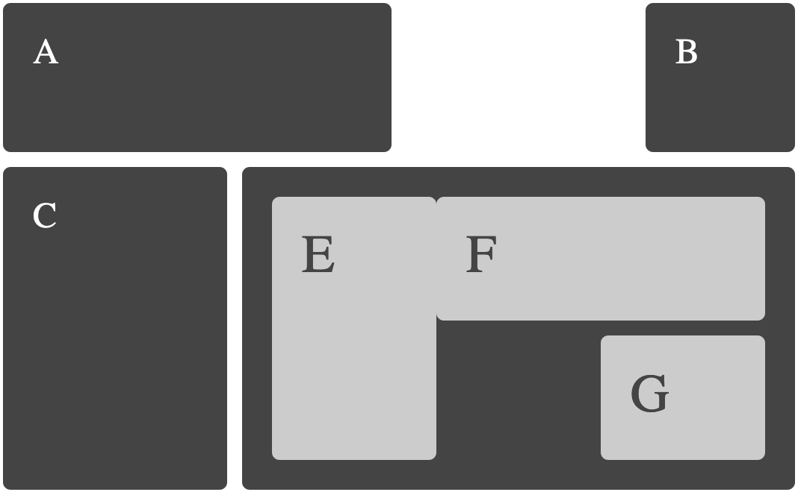

:titre: Grid Layout en CSS
:module: grid-layout
:duree: 45
:description: Maîtriser le système de mise en page CSS Grid Layout pour créer des designs web modernes.
include::../../../../adoc/libs/header-module.adoc[]

ifeval::["{visible-on-html}" !=  "yes"]
:docinfo: shared
:docinfodir: ../../../../adoc/libs
endif::[]

== Objectifs pédagogiques

// tag::objectifs[]
* Comprendre les bases de CSS Grid Layout.
* Apprendre à créer des mises en page complexes et responsives.
* Manipuler les propriétés CSS associées au Grid Layout.
// end::objectifs[]

// tag::deroulement[]

== Introduction au Grid Layout

CSS Grid Layout est un système de mise en page bidimensionnel qui permet de concevoir des interfaces complexes avec une grande flexibilité.

IMAGE

[NOTE.speaker]
--
Le Grid Layout est devenu incontournable pour organiser les éléments sur une page web. Contrairement à Flexbox, qui se concentre sur une dimension (ligne ou colonne), Grid permet de travailler en deux dimensions.
--

== Concepts clés du Grid Layout

=== La grille

Une grille se compose de lignes et de colonnes, formant des cellules où placer vos éléments.

```css
.container {
  display: grid;
  grid-template-rows: 100px 200px;
  grid-template-columns: 1fr 2fr;
}
```


[NOTE.speaker]
--
Dans cet exemple, la propriété `grid-template-rows` définit deux lignes de 100px et 200px, tandis que `grid-template-columns` définit deux colonnes dont la première occupe une fraction (`1fr`) et la seconde deux fractions (`2fr`) de l'espace disponible.
--

=== Placement des éléments

Avec Grid Layout, vous pouvez positionner les éléments précisément dans une grille en utilisant les propriétés comme `grid-row` et `grid-column`.

```css
.item {
  grid-row: 1 / 2;
  grid-column: 2 / 4;
}
```

[NOTE.speaker]
--
L'exemple ci-dessus place un élément dans la première ligne et l'étend de la deuxième à la quatrième colonne.
--

== Propriétés essentielles de Grid Layout

Voici les propriétés clés pour maîtriser le Grid Layout :

- `display: grid;` : Active le mode Grid.
- `grid-template-rows` et `grid-template-columns` : Définissent les lignes et colonnes.
- `gap` : Définit l'espacement entre les cellules.
- `grid-area` : Permet de nommer des zones de grille.

```css
.container {
  display: grid;
  grid-template-areas:
    "header header"
    "sidebar main"
    "footer footer";
}
```

IMAGE

[NOTE.speaker]
--
L'utilisation de `grid-template-areas` permet de nommer des zones dans une grille, ce qui facilite l'organisation et la lisibilité du code.
--

== Exemple pratique : Mise en page complète

=== Code HTML

```html
<div class="grid-container">
  <header>Header</header>
  <aside>Sidebar</aside>
  <main>Main content</main>
  <footer>Footer</footer>
</div>
```

=== Code CSS

```css
.grid-container {
  display: grid;
  grid-template-areas:
    "header header"
    "sidebar main"
    "footer footer";
  grid-template-rows: 80px 1fr 50px;
  grid-template-columns: 200px 1fr;
  gap: 10px;
}

header { grid-area: header; }
aside { grid-area: sidebar; }
main { grid-area: main; }
footer { grid-area: footer; }
```



[NOTE.speaker]
--
Cet exemple montre comment utiliser Grid Layout pour créer une mise en page typique comprenant un en-tête, une barre latérale, un contenu principal et un pied de page.
--

== Pourquoi utiliser Grid Layout ?

=== Avantages

- **Flexibilité** : Permet de créer des designs responsives sans effort supplémentaire.
- **Lisibilité** : Le code est structuré et facile à maintenir.
- **Puissance** : Autorise des mises en page complexes que d'autres méthodes ne peuvent pas gérer.

=== Comparaison avec Flexbox

| Caractéristique    | Grid Layout                | Flexbox                     |
|--------------------|----------------------------|-----------------------------|
| **Dimension**      | Bidimensionnel             | Unidimensionnel             |
| **Complexité**     | Convient aux grandes mises en page | Idéal pour les éléments en ligne |
| **Facilité d'apprentissage** | Plus complexe à apprendre | Plus simple pour commencer |

[NOTE.speaker]
--
Grid Layout et Flexbox ne sont pas concurrents mais complémentaires. Utilisez Grid pour la structure globale et Flexbox pour ajuster des éléments internes.
--

== Conclusion

// tag::conclusion[]
* Le Grid Layout est essentiel pour construire des interfaces web modernes.
* Il permet de travailler en deux dimensions avec une grande précision.
* Combinez Grid avec d'autres outils CSS pour un design optimal.
// end::conclusion[]

// end::deroulement[]
