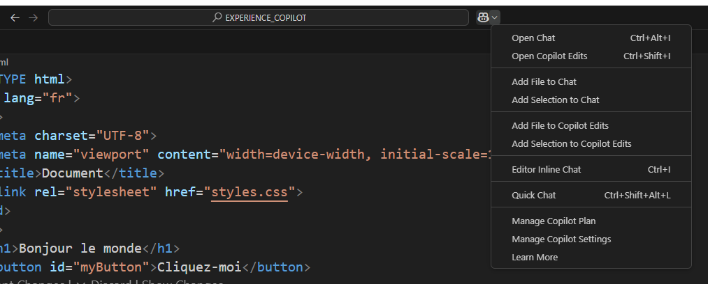
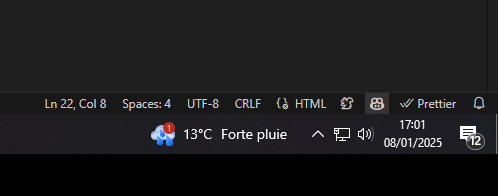
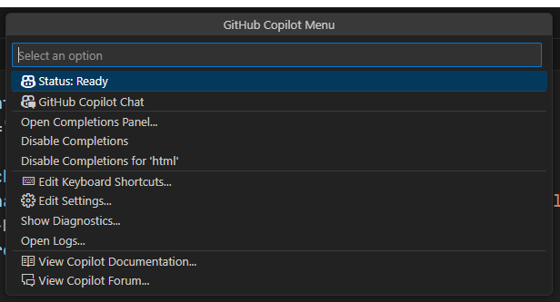

:titre: Les fonctionnalités de GitHub Copilot
:module: GitHub Copilot
:duree: 45
:description: Découvrir et comprendre toutes les fonctionnalités de GitHub Copilot dans Visual Studio Code
include::../../../../adoc/libs/header-module.adoc[]

ifeval::["{visible-on-html}" != "yes"]
:docinfo: shared
:docinfodir: ../../../adoc/libs
endif::[]

== Objectifs pédagogiques

// tag::objectifs[]
* Comprendre le rôle de GitHub Copilot dans l'écriture de code.
* Découvrir toutes les fonctionnalités et les cas d'usage dans VS Code.
* Apprendre à utiliser efficacement Copilot pour accélérer le développement.
// end::objectifs[]

// tag::deroulement[]

== Introduction à GitHub Copilot

GitHub Copilot est un outil d’intelligence artificielle qui aide les développeurs à écrire du code plus rapidement en générant des suggestions contextuelles directement dans l’éditeur de code. 

[NOTE.speaker]
====
Copilot utilise un modèle d’IA développé par OpenAI et formé sur une immense base de code open source. L’objectif est de fournir des suggestions adaptées au contexte pour faciliter le développement.
====

== Fonctionnalités principales de Copilot

=== 1. Complétion de code intelligent

Copilot prédit et génère du code en fonction de votre saisie.

[NOTE.speaker]
====
Copilot peut compléter des morceaux de code en cours d’écriture. Par exemple :

* Suggérer des blocs de code entiers comme des boucles ou des conditions.
* Anticiper les paramètres nécessaires à une fonction que vous commencez à écrire.
====

=== 2. Génération de fonctions complètes

À partir d’un simple commentaire ou d’une signature de fonction, Copilot peut générer une implémentation entière.

.Exemple d’utilisation
[source,html]
----
<!--ajouter une ligne horizontal-->
    <hr>  
----

[NOTE.speaker]
====
Dans cet exemple, Copilot peut générer automatiquement le code pour parcourir la liste, additionner les éléments, et calculer la moyenne.
====

=== 3. Suggestions en temps réel

Copilot propose des suggestions contextuelles pendant que vous tapez.

* Il peut s’intégrer à des langages comme Python, JavaScript, TypeScript, Go, Ruby, etc.
* Propose des snippets pour des frameworks populaires.

=== 4. Génération multiligne

Copilot peut proposer des solutions pour plusieurs lignes de code, comme des algorithmes ou des structures complexes.

[NOTE.speaker]
====
La génération multiligne est idéale pour des tâches répétitives ou des algorithmes classiques comme le tri ou la recherche dans une liste.
====

=== 5. Traduction de code entre langages

Copilot peut aider à traduire un code existant d’un langage à un autre.

.Exemple
[source,python]
----
# Code Python
def addition(a, b):
    return a + b
----

[source,javascript]
----
# Traduction en JavaScript
function addition(a, b) {
    return a + b;
}
----

=== 6. Génération de tests unitaires

Copilot peut créer des tests pour vos fonctions.

.Exemple avec Jest
[source,javascript]
----
test('calcul de la somme', () => {
  expect(addition(2, 3)).toBe(5);
});
----

=== 7. Assistance pour les commentaires

Copilot peut générer des commentaires descriptifs pour expliquer le code.

[NOTE.speaker]
====
Cette fonctionnalité est utile pour améliorer la documentation du code.
====

=== 8. Débogage assisté

Copilot peut suggérer des corrections ou identifier des erreurs potentielles dans votre code.

== Configuration de GitHub Copilot dans VS Code

=== Étapes d’installation

1. Installez l’extension Copilot depuis le **Visual Studio Code Marketplace**.
2. Connectez-vous avec votre compte GitHub.
3. Configurez les préférences dans les paramètres de VS Code.

=== Personnalisation

* Activer ou désactiver les suggestions automatiques.
* Configurer les raccourcis pour accepter ou rejeter les suggestions.

== Avantages

* Gain de temps dans l’écriture de code.
* Amélioration de la productivité.
* Apprentissage des bonnes pratiques à travers des suggestions.


== Limites de Copilot

* Copilot peut suggérer un code incorrect ou non optimal.
* Nécessite toujours une validation humaine pour éviter des erreurs.


== Menu des options de Copilot dans Visual Studio Code



=== Open Chat (Ctrl + Alt + I)

Ouvre une fenêtre de discussion dédiée avec GitHub Copilot pour interagir directement avec l'IA. Cette option permet de poser des questions contextuelles sur votre code et d'obtenir des suggestions en temps réel.

=== Open Copilot Edits (Ctrl + Shift + I)

Affiche les modifications proposées par Copilot dans une vue dédiée. Cela permet de voir toutes les suggestions de l'IA sur votre code, comme les corrections, optimisations ou ajouts de fonctionnalités.

=== Add File to Chat

Ajoute le fichier actuel (ouvert dans l'éditeur) à la discussion dans le chat Copilot. Cela permet à l'IA de mieux comprendre le contexte global du projet.

=== Add Selection to Chat

Ajoute une section spécifique de code (sélectionnée dans l'éditeur) au chat Copilot pour obtenir des conseils ou des explications sur cette partie précise.

=== Add File to Copilot Edits

Permet d'ajouter le fichier actuel à la vue "Copilot Edits", où vous pouvez voir les propositions de modifications globales que l'IA souhaite apporter au fichier.

=== Add Selection to Copilot Edits

Ajoute une sélection spécifique de code à la section "Copilot Edits", afin de voir les suggestions de l'IA pour cette portion particulière du fichier.

=== Editor Inline Chat (Ctrl + I)

Ouvre une session de chat en ligne directement dans l'éditeur de code. Cela permet d'interagir avec Copilot directement à l'intérieur du fichier, en contextuant chaque suggestion à l'endroit où vous codez.

=== Quick Chat (Ctrl + Shift + Alt + L)

Permet d'ouvrir rapidement un chat avec Copilot à partir de l'éditeur, sans passer par d'autres fenêtres ou menus. C'est une option rapide pour poser une question contextuelle.

=== Manage Copilot Plan

Redirige vers la gestion de votre abonnement Copilot. Cette option permet de vérifier et de modifier votre plan d'abonnement GitHub Copilot.

=== Manage Copilot Settings

Permet d'accéder aux paramètres de Copilot dans Visual Studio Code. Vous pouvez ajuster les préférences comme les suggestions automatiques, les raccourcis, ou les options de confidentialité.

=== Learn More

Ouvre un lien vers la documentation officielle de GitHub Copilot, où vous pouvez en apprendre davantage sur son utilisation, les bonnes pratiques et les mises à jour disponibles.

== Accès au menu d'état de GitHub Copilot



== Menu d'état de GitHub Copilot dans Visual Studio Code



=== Status: Ready

Indique que GitHub Copilot est activé et prêt à fournir des suggestions de code. Si le statut change (par exemple, "Not Ready" ou "Error"), cela signifie que l'IA rencontre un problème ou qu'elle n'est pas disponible.

=== GitHub Copilot Chat

Ouvre une fenêtre de discussion dédiée avec Copilot, permettant une interaction en langage naturel pour obtenir des suggestions, des explications ou de l'aide contextuelle sur votre code.

=== Open Completions Panel...

Affiche le panneau des suggestions de code dans Visual Studio Code. Ce panneau montre les propositions de complétion de Copilot en temps réel.

=== Disable Completions

Désactive temporairement les suggestions automatiques de Copilot. Cela peut être utile si vous souhaitez travailler sans interruptions ou éviter les propositions automatiques.

=== Disable Completions for 'html'

Désactive les suggestions automatiques de Copilot uniquement pour les fichiers HTML. Cela permet de garder les complétions actives pour d'autres langages tout en les désactivant pour le HTML.

=== Edit Keyboard Shortcuts...

Permet d'accéder aux paramètres des raccourcis clavier dans Visual Studio Code. Vous pouvez personnaliser les raccourcis liés à Copilot pour les adapter à vos préférences.

=== Edit Settings...
Accède aux paramètres de configuration de GitHub Copilot dans Visual Studio Code. Cela inclut la gestion des préférences de complétion, la confidentialité et d'autres options de l'IA.

=== Show Diagnostics...

Affiche des informations de diagnostic sur le fonctionnement de GitHub Copilot. Cela peut aider à identifier des problèmes liés aux performances ou aux connexions.

=== Open Logs...

Ouvre les journaux d'activité de GitHub Copilot. Ces journaux contiennent des détails sur les interactions de l'IA avec votre projet, utiles pour le débogage ou le suivi des erreurs.

=== View Copilot Documentation...

Ouvre la documentation officielle de GitHub Copilot. Cette documentation fournit des informations sur les fonctionnalités, les bonnes pratiques et les dernières mises à jour.

=== View Copilot Forum...

Ouvre le forum communautaire GitHub Copilot, où les utilisateurs peuvent poser des questions, partager des expériences et obtenir de l'aide de la part d'autres développeurs.

== Cas pratiques et exercices

=== Cas pratique 1 : Génération du contenu de trois fichiers

Créez une page html de base avec son fichier CSS lié et JavaScript.

[NOTE.speaker]
====
Allez sur l'option *Open Chat*

Saisissez le prompt suivant :

*Peux tu me créer un fichier html de base avec son fichier css lié et son fichier javascript lié stp*
====

=== Cas pratique 2 : Génération d'une section spécifique

Créez une liste ordonnée de 5 éléments en HTML. (Des fruits)

[NOTE.speaker]
====
Tapez la ligne suivante dans la balise <body> de votre fichier HTML : <!--liste ordonnée de 5 fruits-->

```html
<!--liste ordonnée de 5 fruits-->
    <ol>
        <li>Pomme</li>
        <li>Poire</li>
        <li>Banane</li>
        <li>Fraise</li>
        <li>Cerise</li>
    </ol>
```

====

=== Cas pratique 3 : Générez les commentaires d'un fichier html

Utilisez Copilot pour générer les commentaires d'un fichie HTML.

Allez sur l'option *Open Copilot Edits*

Ajoutez le fichier HTML à la vue.

Et saisir le prompt suivant : Peux tu commentez le code stp

Copilot va générer des commentaires pour expliquer le code HTML.

Pour finir acceptez les modifications

== Bon  à savoir #1

Copilot ne peut pas créer de fichiers ou manipuler directement ton système de fichiers. Copilot est un assistant de code intégré dans un éditeur (comme VS Code) qui génère uniquement le contenu à partir de tes instructions. Il te propose des solutions pour remplir un fichier existant ou pour en créer un.

== Conclusion

// tag::conclusion[]
* GitHub Copilot est un outil puissant pour les développeurs.
* Bien qu’il facilite l’écriture de code, il nécessite une validation pour garantir la qualité.
* *Expérimentez* avec Copilot pour maximiser votre productivité et comprendre ses limites.
// end::conclusion[]
