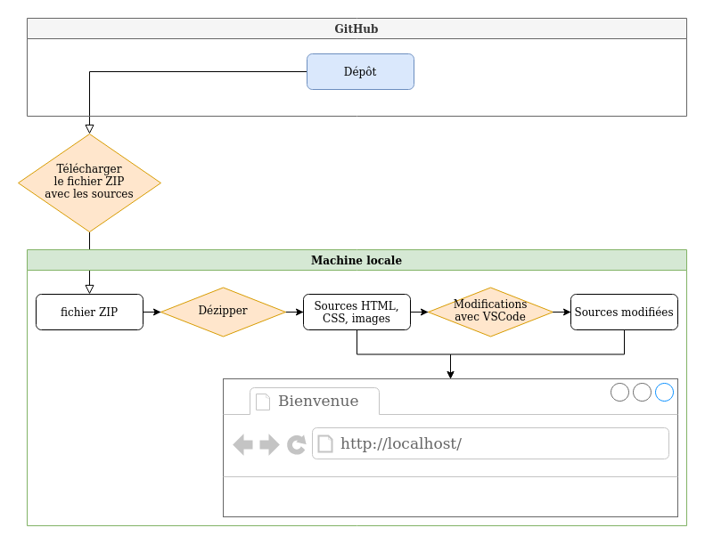
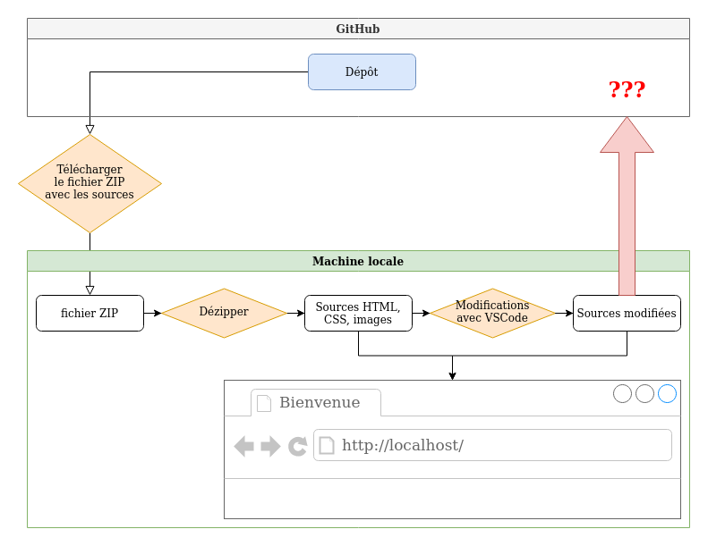
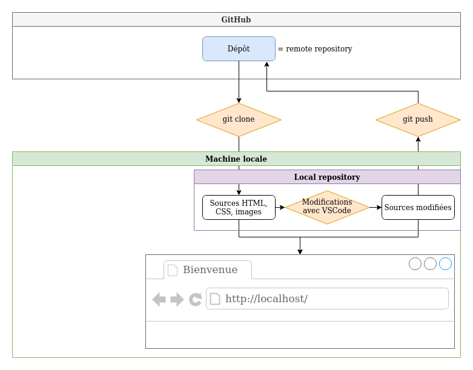
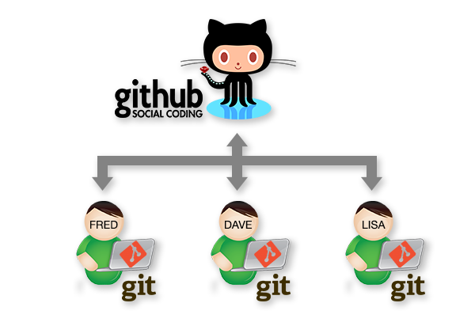
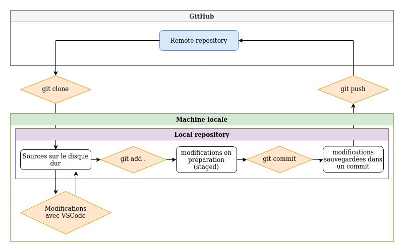
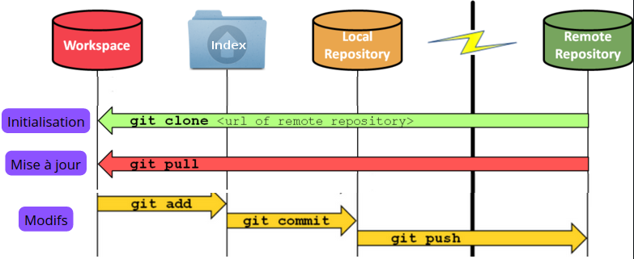

:titre: Git
:module: Git
:duree: 180
:description: Découverte de git, de son fonctionnement et de ses avantages. 
include::../../../../adoc/libs/header-module.adoc[]


== Objectifs  

// tag::objectifs[]  
* Comprendre le fonctionnement de Git  
* Configurer une clé SSH pour GitHub  
* Lister et utiliser les commandes Git de base  
* Distinguer les rôles de Git et GitHub  
// end::objectifs[]  

// tag::deroulement[]
== Process avec le fichier ZIP  

  

[NOTE.speaker]  
====  
Commençons par revoir la procédure classique d'utilisation d'un fichier ZIP :  
1. On télécharge les sources du projet  
2. On les extrait sur notre machine  
3. On modifie les fichiers en local  

Posez-vous ces questions :  
- Est-ce que tout le monde est d'accord avec cette méthode ?  
- Est-ce que vous voyez des limites ?  

Utiliser un sondage rapide pour valider la compréhension des apprenants.  
====

== Limites avec le ZIP  

  

[NOTE.speaker]  
====  
Problème principal avec cette méthode :  
- Une fois les sources téléchargées en local, **impossible d'envoyer les modifications sur GitHub**.  
- Il n'existe pas de lien entre le projet local et le dépôt GitHub.  
====

== Alors qu'avec Git  

  

[NOTE.speaker]  
====
Git est **la solution au problème** : il permet de garder un lien permanent entre le dépôt local et GitHub.  
Cependant, ne vous inquiétez pas si vous ne comprenez pas encore tout, on va détailler cela progressivement.  
====

== Qu'est-ce que Git ?  

  

### Définition de Git  

* **Outil de versioning** : permet de sauvegarder différentes versions du code source.  
* Chaque sauvegarde est appelée un **commit**.  
* Chaque commit peut contenir des ajouts, des suppressions ou des modifications de lignes de code.  

Exemple d'un commit sur le dépôt ExpressJS :  
https://github.com/expressjs/express/commit/74beeac0718c928b4ba249aba3652c52fbe32ca8  

[NOTE.speaker]  
====
Quand vous modifiez des fichiers directement sur GitHub, chaque modification est sauvegardée sous forme d'un **commit**.  
En réalité, un commit peut contenir les modifications de plusieurs fichiers en une seule fois.  
Cela permet de regrouper des changements logiques sous un même commit.  
====

== Pourquoi utiliser Git ?  

### Git permet :  
* **Le travail en équipe** sur le même projet.  
* **Revenir à une ancienne version** en cas de problème.  
* **Garder un historique des modifications** pour suivre l'évolution du projet.  

[NOTE.speaker]  
====
L'historique de Git est très utile pour :  
- Trouver la source d'un bug.  
- Comprendre quand et pourquoi un changement a été fait.  
**L'objectif n'est pas de blâmer quelqu'un, mais d'identifier les causes des bugs pour mieux les corriger.**  
====

== Git pour le travail en équipe  

  

[NOTE.speaker]  
====
Travailler en équipe avec Git suit un processus précis :  
1. **Clone** : La première fois, on récupère le projet avec `git clone`.  
2. **Pull** : Chaque jour, avant de commencer, on met à jour notre copie locale avec `git pull`.  
3. **Push** : Après avoir fait des modifications, on les envoie sur le dépôt distant avec `git push`.  

👉 **Important** :  
- Le `clone` ne se fait qu'une seule fois, lors de la récupération initiale du projet.  
- Ensuite, on utilise `pull` pour récupérer les dernières mises à jour.  
====

== Git : faire des commits  

  

[NOTE.speaker]  
====
Lorsqu'on utilise Git, il y a plusieurs étapes à suivre pour sauvegarder des modifications :  
1. **add** : On sélectionne les fichiers à sauvegarder (les modifications sont placées dans une zone intermédiaire appelée "staged").  
2. **commit** : On crée un point de sauvegarde en ajoutant un message pour expliquer les changements.  
3. **push** : On envoie les sauvegardes vers le dépôt distant.  

👉 Utilisons une analogie :  
- Imaginez que vous préparez une valise pour un voyage en avion.  
- Vous ajoutez ou retirez des vêtements de la valise (c'est l'équivalent du `git add`).  
- Une fois la valise prête, vous la fermez et mettez une étiquette (c'est le `git commit`).  
- Enfin, vous envoyez la valise à l'aéroport (c'est le `git push`).  

**Heureusement, vous n'envoyez pas la valise à chaque fois que vous ajoutez un vêtement !**  
====

== Git : les commandes  

  

### Les différentes zones de Git  

* **Working Copy** : Les fichiers que vous avez sur votre disque dur.  
* **Index (ou Staged)** : Les modifications prêtes à être sauvegardées.  
* **Local Repository** : Une copie locale du dépôt Git.  
* **Remote Repository** : Le dépôt central, souvent hébergé sur GitHub.  

[NOTE.speaker]  
==== 
Explications des zones :  
- **Working Copy** : Les fichiers que vous modifiez directement.  
- **Index** : Une étape intermédiaire où les fichiers sont prêts à être sauvegardés.  
- **Local Repository** : Une copie complète de l’historique du projet sur votre machine.  
- **Remote Repository** : Une sauvegarde distante sur GitHub, permettant le travail en équipe et une sécurisation des données.  

Chaque fois que vous faites un `push`, vous envoyez vos modifications du **Local Repository** vers le **Remote Repository**.  
====  

== Let's Go !  

* Vérifiez si Git est installé avec la commande :  

```bash
 git --version
 ```

* Clonez le dépôt suivant :  

```bash
git clone <url_du_dépôt>
```

👉 **Problème** : Vous obtenez une erreur d'accès car GitHub ne reconnaît pas votre machine. Il faut configurer une clé SSH.  

[NOTE.speaker]  
====
- Faites vérifier aux apprenants que Git est bien installé. Peu importe la version affichée, tant qu'il y a une réponse, c'est bon !  
- Expliquez pourquoi le clone ne fonctionne pas sans configuration SSH.  
- GitHub bloque l'accès car il ne reconnaît pas encore la machine de l'utilisateur.  
====

== Clé SSH pour GitHub  

Demandez à ChatGPT la procédure pour créer une clé SSH et l'ajouter à GitHub.  

[NOTE.speaker]  
====
- Faites la procédure avec les apprenants en temps réel.  
- Après chaque étape, faites un sondage rapide pour vérifier que tout le monde suit.  
====  

== Configuration de Git  

La configuration de Git sert à "signer" vos commits avec vos informations (nom et email).  

Lien utile :  
https://kourou.oclock.io/ressources/fiche-recap/git-et-github/#configuration-locale-de-git  

[NOTE.speaker]  
====
* Guidez les apprenants pour configurer Git avec leur nom et email.  
* Vérifiez que chaque apprenant a bien effectué la configuration avant de passer à la suite.  
====  


== Exercice pratique  

Lien vers l'exercice :  
https://github.com/O-clock-DevFrontendIA-Peda/challenges-saison01/blob/main/Exercices/git01.md[Mission Git : Embarquement immédiat vers GitHub !]  


// end::deroulement[]

== Conclusion  

// tag::conclusion[]  
* On a compris le fonctionnement de Git.  
* On a configuré une clé SSH pour sécuriser nos connexions avec GitHub.  
* On connaît les commandes Git de base (`clone`, `add`, `commit`, `push`, `pull`).  
* On sait comment Git et GitHub interagissent pour permettre le travail collaboratif.  
// end::conclusion[]  
