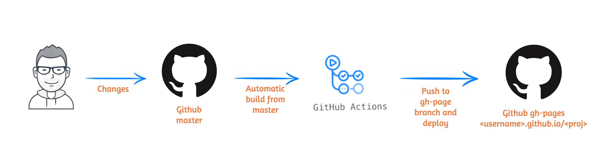

:titre: GitHub Pages
:module: GitHubPages
:duree: 45
:description: Découverte de GitHub Pages, de son fonctionnement et de son déploiement automatique
include::../../../../adoc/libs/header-module.adoc[]

ifeval::["{visible-on-html}" !=  "yes"]
:docinfo: shared
:docinfodir: ../../../adoc/libs
endif::[]

== Objectifs pédagogiques

// tag::objectifs[]
* Comprendre ce qu'est **GitHub Pages** et son utilité
* Savoir déployer un site statique automatiquement avec **GitHub Pages**
* Apprendre à automatiser les déploiements via **GitHub Actions**
// end::objectifs[]

// tag::deroulement[]

== GitHub Pages, c'est quoi ?

`GitHub Pages` est un service gratuit proposé par GitHub permettant d’héberger des sites statiques directement depuis un dépôt GitHub.

[NOTE.speaker]
====
GitHub Pages est souvent utilisé pour déployer des sites de documentation, des portfolios ou des blogs statiques sans avoir besoin d’un serveur.
====

== Fonctionnement de GitHub Pages

1. Le site statique est hébergé à partir d’une branche spécifique du dépôt (souvent `main` ou `gh-pages`).
2. Chaque modification du dépôt peut entraîner un déploiement automatique du site.



// tag::demonstrations[]

== Démonstration 1 : Déployer un site avec GitHub Pages

```bash
# Étape 1 : Créer un dépôt GitHub
$ git init
$ git add .
$ git commit -m "Initial commit"
$ git remote add origin https://github.com/votre-utilisateur/mon-site.git
$ git push -u origin main

# Étape 2 : Activer GitHub Pages
# Depuis l'interface GitHub :
# Aller dans Settings > Pages > Source > Sélectionner 'main' et cliquer sur 'Save'
```

[NOTE.speaker]
====
Cette démonstration montre comment configurer rapidement un déploiement de site statique en utilisant GitHub Pages. Nous verrons également comment vérifier que le site est en ligne.
====

== Démonstration 2 : Automatiser le déploiement avec GitHub Actions

```yaml
# Étape 1 : Créer un workflow GitHub Action
name: Deploy to GitHub Pages
on:
  push:
    branches:
      - main
a# 📚 **Exercice Pratique : Créez et déployez un site Markdown avec GitHub Pages et GitHub Actions (Débutants)**

## 🎯 **Objectif**
Apprendre à créer un site simple en **Markdown**, puis automatiser son déploiement avec **GitHub Actions**.

---

## ✅ **Étape 1 : Créez un dépôt GitHub avec un fichier `README.md`**

1. Rendez-vous sur [GitHub](https://github.com/) et connectez-vous à votre compte.
2. Cliquez sur **New repository** (Nouveau dépôt).
3. Donnez un nom à votre dépôt, par exemple : `mon-site-actions`.
4. Cliquez sur **Create repository** (Créer le dépôt).
5. Une fois le dépôt créé, cliquez sur **Add file** > **Create new file**.
6. Nommez le fichier **`README.md`**.
7. Ajoutez le contenu suivant dans le fichier :

   ```markdown
   # 🎉 Bienvenue sur mon site Markdown déployé avec GitHub Actions

   ## 🌟 Présentation
   Ceci est un site simple créé avec **Markdown** et déployé automatiquement avec **GitHub Actions**.

   ## 🚀 Fonctionnalités
   - Automatisation du déploiement
   - Utilisation de GitHub Pages
   - Contenu écrit en Markdown

   ## 📬 Contact
   Vous pouvez me contacter via [GitHub](https://github.com/).
   ```

8. Cliquez sur **Commit new file** pour enregistrer le fichier.

---

## ✅ **Étape 2 : Ajoutez un workflow GitHub Actions pour automatiser le déploiement**

1. Dans votre dépôt GitHub, cliquez sur l'onglet **Actions**.
2. Recherchez le workflow **"Deploy static content to GitHub Pages"**.
3. Cliquez sur **Configure**.
4. Remplacez le contenu du fichier YAML généré par le contenu suivant :

   ```yaml
   name: Déploiement GitHub Pages

   on:
     push:
       branches:
         - main

   jobs:
     build-and-deploy:
       runs-on: ubuntu-latest
       steps:
         - name: 🛠️ Cloner le dépôt
           uses: actions/checkout@v3

         - name: 📄 Générer la page avec Markdown
           run: |
             echo "# Site déployé automatiquement avec GitHub Actions" > index.md
             echo "Ce site a été déployé depuis le dépôt [GitHub](https://github.com)." >> index.md

         - name: 🚀 Déployer sur GitHub Pages
           uses: peaceiris/actions-gh-pages@v3
           with:
             github_token: ${{ secrets.GITHUB_TOKEN }}
             publish_dir: .
   ```

5. Cliquez sur **Start commit** > **Commit new file** pour enregistrer votre workflow.

---

## ✅ **Étape 3 : Activez GitHub Pages**

1. Retournez dans les **Settings** (Paramètres) de votre dépôt.
2. Cliquez sur **Pages** dans le menu de gauche.
3. Dans **Source**, sélectionnez **GitHub Actions** comme méthode de déploiement.
4. Cliquez sur **Save**.

---

## ✅ **Étape 4 : Vérifiez votre site**

Après quelques minutes, votre site sera accessible à l'adresse suivante :

```
https://<votre-utilisateur>.github.io/mon-site-actions/
```

---

## 🏁 **C'est terminé !**

Votre site **Markdown** est désormais automatiquement déployé avec **GitHub Actions** 🎉.

---

### 🧪 **Bonus : Personnalisez votre workflow !**

Vous pouvez modifier le fichier **`.github/workflows/pages.yml`** pour :

- Ajouter d'autres fichiers Markdown.
- Déployer des pages HTML.
- Envoyer des notifications de déploiement.

---

💡 **Astuce** : Utilisez des fichiers comme `index.md` ou `about.md` pour enrichir le contenu de votre site !

```bash
jobs:
  build-and-deploy:
    runs-on: ubuntu-latest
    steps:
      - name: Checkout code
        uses: actions/checkout@v3

      - name: Build and deploy
        run: |
          echo "Déploiement réussi"
```

[NOTE.speaker]
====
Dans cette démonstration, nous allons voir comment utiliser **GitHub Actions** pour automatiser le déploiement du site à chaque push sur la branche `main`.
====

== Exercice pratique : Créez votre propre site avec GitHub Pages

=== Consigne

1. **Créer un dépôt GitHub** contenant un fichier `index.html` simple.
2. **Activer GitHub Pages** depuis l'onglet *Settings*.
3. **Personnaliser le workflow GitHub Action** pour automatiser le déploiement à chaque modification.

=== Objectifs

* Mettre en pratique les notions vues lors des démonstrations.
* Vérifier que votre site est bien accessible à l'adresse `https://<votre-utilisateur>.github.io/<votre-depot>/`.

// end::deroulement[]

== Conclusion
// tag::conclusion[]
* **GitHub Pages** est une solution simple et gratuite pour déployer des sites statiques.
* L’automatisation avec **GitHub Actions** permet de simplifier le déploiement continu.
* En maîtrisant ces outils, vous êtes capable de publier rapidement des sites de documentation, des portfolios ou des projets personnels.
// end::conclusion[]
