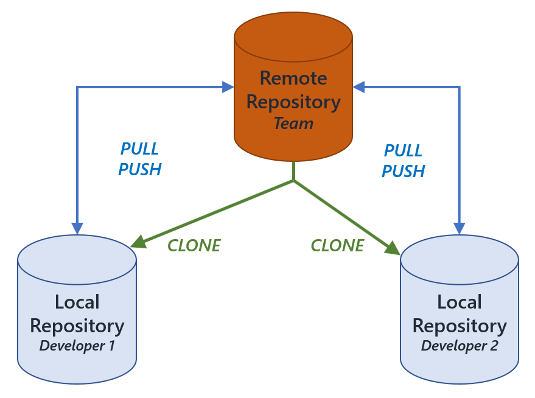

:titre: GitHub
:module: GitHub
:duree: 180
:description: Découverte de GitHub, de son fonctionnement et de ses avantages.
include::../../../../adoc/libs/header-module.adoc[]

== Objectifs  
// tag::objectifs[]  
* *Comprendre* à quoi sert GitHub  
* *Comprendre* le fonctionnement de GitHub  
* *Comprendre* les avantages de GitHub  
* *Comprendre* la différence entre Git et GitHub  
* *Comprendre* l'intérêt de GitHub pour les développeurs  
// end::objectifs[]  

// tag::deroulement[]

== GitHub : Qu'est-ce que c'est ?  

[%step]  
* **Définition Wikipédia**  
> GitHub est un service web d'hébergement et de gestion de développement de logiciels, utilisant le logiciel de gestion de versions Git.  

[NOTE.speaker]  
====
Ce type de définition peut sembler abstrait... En réalité, cela ne nous aide pas beaucoup à comprendre **ce qu'est GitHub** ni pourquoi on l'utilise.  
Prenons le temps de l'expliquer plus simplement.  
====

== GitHub en quelques mots  

* Le code des applications est stocké dans des fichiers qu'on appelle les **sources**.  
* Il est important de conserver ces sources dans un **point central** pour éviter de les perdre.  
* On veut aussi garder un **historique des modifications**.  
* Cela permet de travailler en équipe en envoyant nos modifications vers ce point central.  

[NOTE.speaker]  
====

➡️ Le **point central**, c'est **GitHub**.  
➡️ La gestion de l'historique et des envois, c'est le rôle de **Git**.  

⚠️ **Pour l'instant, nous allons nous concentrer uniquement sur GitHub** avant de plonger plus profondément dans Git.  

====

== Schéma explicatif  

  

[NOTE.speaker]  
====  

Voici quelques concepts essentiels à comprendre :  

* **Remote repository** = Dépôt distant sur GitHub.  
* **Pull** = Récupérer les dernières modifications sauvegardées sur le dépôt distant pour les avoir en local.  
* **Push** = Envoyer les modifications locales vers le dépôt distant.  

🔄 **Push** et **Pull** sont les actions principales pour travailler en équipe.  

⚠️ La difficulté principale survient lors de la **fusion des modifications** (merge), mais pas de panique ! Ce sera le rôle de Git, que nous aborderons plus tard.  

====
  
== Exemples de dépôts publics  

* Dépôt de WordPress : https://github.com/WordPress/WordPress  
* Historique des modifications : link:https://github.com/WordPress/WordPress/commits/master[]  
* Dépôt de TypeScript : https://github.com/microsoft/TypeScript  
* Historique des modifications : link:https://github.com/microsoft/TypeScript/commits/main[]  

[NOTE.speaker]  
====  

✅ Montrez ces dépôts aux apprenants pour qu'ils voient des exemples concrets.  
➡️ **Accédez à l'historique d'un dépôt** et sélectionnez un commit pour montrer les différences (diff) sauvegardées :  
* Les lignes en rouge (-) indiquent les suppressions.  
* Les lignes en vert (+) indiquent les ajouts.  

Insistez sur le fait que **GitHub ne sauvegarde que les modifications** et non les fichiers en entier à chaque fois.  

====

  
== Un dépôt GitHub, c'est quoi ?  

Un dépôt (repository) contient :  
* Les **sources d'une application**.  
* **Son historique de modifications**.  
* D'autres fonctionnalités comme les **Pull Requests** et les **Issues**.  

[NOTE.speaker]  
====  

⚠️ Ne vous étalez pas trop sur les **Pull Requests** et les **Issues** à ce stade. Ce sont des fonctionnalités utiles, mais elles seront vues plus tard.  

====

  
== Public vs Privé  

* Certains dépôts, comme ceux de **WordPress** ou **TypeScript**, sont **publics**.  
* En tant que développeur, vous pouvez aussi créer des dépôts **privés** et **gérer les droits d'accès** aux personnes qui peuvent voir ou modifier le code.  

  
== Le GitHub de la promo  

* Chaque promo a accès à une **organisation GitHub**.  
* Une organisation GitHub permet de regrouper plusieurs dépôts (comme une entreprise qui regroupe ses projets).  
* Tous les dépôts dans cette organisation doivent être **privés**.  
* Ces dépôts contiendront les **sources des cours**, **exercices** et **ateliers**.  

[NOTE.speaker]  
====  

📎 Fournir le lien de l'organisation GitHub de la promo :  
https://github.com/o-clock-XXXXX (remplacez **XXXXX** par le nom de la promo).  

✅ Vérifiez que chaque apprenant a bien été ajouté à l'organisation. Si ce n'est pas le cas, demandez au tuteur de promo de les ajouter.  

====

// end::deroulement[]

== Conclusion  
// tag::conclusion[]
* Vous avez maintenant un **compte GitHub** personnel.  
* Vous avez accès à l'organisation **GitHub de la promo**.  
* Nous allons continuer à explorer Git et GitHub dans les prochaines sessions pour approfondir votre compréhension et vos compétences.  
// end::conclusion[]