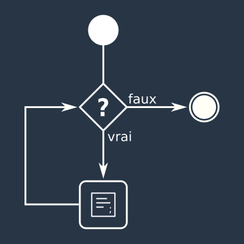

:titre: Boucles
:module: JavaScript
:duree: 60
:description: Ce module est consacré à la manipulation des boucles en JavaScript. Les boucles permettent de répéter une opération un certain nombre de fois. Nous verrons comment utiliser les boucles `while` et `for` pour parcourir un tableau.
include::../../../../adoc/libs/header-module.adoc[]

ifeval::["{visible-on-html}" != "yes"]
:docinfo: shared
:docinfodir: ../../../adoc/libs
endif::[]

== Objectifs pédagogiques

// tag::objectifs[]
* Comprendre la syntaxe des boucles en JavaScript
* Savoir utiliser les boucles pour répéter une opération
* Savoir utiliser les boucles pour parcourir un tableau
// end::objectifs[]

// tag::deroulement[]

== Principe



include::../../../../adoc/libs/slide-notitle.adoc[]

Le principe de boucle est assez parlant mais loin d'être simple à cerner.

Partons d'un exemple simple

```js
const fruits = ["cerise", "pomme", "fraise"];
```

Comment faire pour afficher en console chaque entrée du tableau ?
  
```js
console.log(fruits[0]);
console.log(fruits[1]);
console.log(fruits[2]);
```

Oui ça fonctionne, mais... s'il y avait 200 fruits ?

include::../../../../adoc/libs/slide-notitle.adoc[]

Il faudrait pouvoir recommencer l'opération **TANT QU**'il y a des fruits dans le tableau.

ou bien

**POUR** chaque entrée du tableau, l'afficher.

## TANT QUE ou `while`

`while` est une structure de boucle permettant de répéter une opération tant qu'une condition est vraie.

Essayons de traduire l'exemple proposé

```js
const fruits = ["cerise", "pomme", "fraise"];

// Point de départ. On part de 0 (index du tableau)
let compteur = 0;

// 3 : taille du tableau
while (compteur < 3) {
  // On affiche le fruit courant (compteur)
  console.log(fruits[compteur]);
  // On augmente le compteur à chaque tour
  compteur++;
}
```

Attention : si le compteur n'augmente pas... boucle infiniiiii...e

== POUR ou `for`

`for` permet de définir un point de départ qui évoluera à chaque itération.

```js
const fruits = ["cerise", "pomme", "fraise"];

for (let index = 0; index < 3; index++) {
  // On affiche le fruit courant (index)
  console.log(fruits[index]);
}
```

// tag::exercice[]

## Exercice

* Reprendre l'exercice sur les tableaux et le compléter avec une boucle `for` puis une boucle `while`.

* https://stackblitz.com/edit/vitejs-vite-drlbe8?file=src%2Fmain.js[Exercice 2]

// end::deroulement[]

== Conclusion

// tag::conclusion[]
* Les boucles permettent de répéter une opération un certain nombre de fois
* `while` répète une opération tant qu'une condition est vraie
* `for` répète une opération un certain nombre de fois
// end::conclusion[]