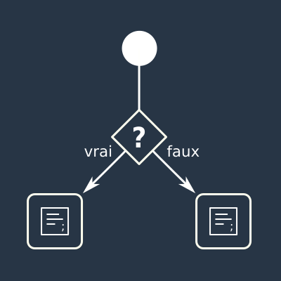

:titre: Conditions
:module: JavaScript
:duree: 90
:description: Ce module permet de voir les conditions en JavaScript, les comparaisons et les combinaisons de conditions.
include::../../../../adoc/libs/header-module.adoc[]

ifeval::["{visible-on-html}" != "yes"]
:docinfo: shared
:docinfodir: ../../../adoc/libs
endif::[]

== Objectifs pédagogiques

// tag::objectifs[]
* Comprendre ce qu'est une condition
* Découvrir les bases de la condition en JavaScript
* Manipuler les conditions en JavaScript
// end::objectifs[]

// tag::deroulement[]

== Principe



include::../../../../adoc/libs/slide-notitle.adoc[]

Généralement, on exprime une condition sous la forme d'une éventualité, hypothèse ou probabilité :

- **SI** j'ai internet ...
- **SI** j'ai plus de 17 ans ...

suivi par 

- _ALORS_ je peux accéder à pleins de sites
- _ALORS_ je peux voter

== Conditionnellement vôtre

L'expression du choix en fonction d'un ou de plusieurs critères (la condition).

**SI** ceci est vrai _ALORS_ je fais ça 

Par exemple :

**J'ai faim**

**SI** j'ai assez d'argent _ALORS_ j'achète un truc à manger

=== Avec des SI on refait le monde !

Supposons le contexte suivant :

Jeu de quizz, un participant obtient un score.

Objectif : un message selon le score obtenu.

```
SI le joueur obtient plus de 2 points ALORS
  le message est : Bien joué !
SINON
  le message est : On révise encore un coup ?
```

**SI** ceci est vrai _ALORS_ je fais ça **SINON** je fais autre chose

include::../../../../adoc/libs/slide-notitle.adoc[]

Le principe de la condition c'est donc de vérifier SI _"ceci" est vrai ?_

Un truc simple, tourner la condition en question : 

*SI (le montant est supérieur à 10 euros) _ALORS_ ...*

**Est-ce que le montant est supérieur à 10 euros ?**

```
SI ceci est vrai ALORS 
  Les frais de ports sont offerts
SINON (c'est faux)
  Il faut payer les frais de ports
```

include::../../../../adoc/libs/slide-notitle.adoc[]

On peut même corser un peu l'histoire

```
SI le joueur obtient plus de 2 points ALORS 
  le message est : Bien joué !
SINON SI le joueur obtient exactement 2 points ALORS 
  le message est : Pas mal
SINON 
  le message est : On révise encore un coup ?
```

=== C'est bien joli mais...

> ... on était pas censé parler programmation ?

En fait avec ces petits mots : **SI** et **SINON** on peut commencer à faire de l'algo.

Un algorithme étant une suite d'instructions (d'opérations) pour arriver à un résultat.

== Place au code

=== SI

En effet, si on reprend les exemples précédents exprimés avec **SI**, _ALORS_ et **SINON**

**SI** j'ai plus de 17 ans _ALORS_ je peux voter

```
SI j'ai plus de 17 ans ALORS 
  je peux voter
```

```
SI (mon age est superieur à 17) ALORS 
  je peux voter
```

```js
if (age > 17) {
  // Je peux voter
}
```

=== SI (ceci est vrai) _ALORS_

```js
if (age > 17) {
  // Je peux voter
}
```

Plusieurs choses importantes ici
- `if` : **SI**
- `(age > 17)` : condition => **"est-ce que ceci est VRAI ?"**
- `{ ... }` : _ALORS_

=== SINON

Repartons du jeu de quizz

```
SI le joueur obtient plus de 2 points ALORS
  { le message est : Bien joué ! }
SINON
  { le message est : On révise encore un coup ? }
```

include::../../../../adoc/libs/slide-notitle.adoc[]

```
Le message est : ""

SI (le score du joueur est supérieur à 2) ALORS
  le message est : Bien joué !
SINON
  le message est : On révise encore un coup ?
```

```js
let message = '';

if (scoreJoueur > 2) {
  message = 'Bien joué !';
} 
else {
  message = 'On révise encore un coup ?';
}
```

=== SINON SI

```
SI le joueur obtient plus de 2 points ALORS 
  le message est : Bien joué !
SINON SI le joueur obtient exactement 2 points ALORS 
  le message est : Pas mal
SINON 
  le message est : On révise encore un coup ?
```

```js
let message = '';

if (scoreJoueur > 2) {
  message = 'Bien joué !';
} 
else if (scoreJoueur === 2) { // Oula... y'a 3 = ?!
  message = 'Pas mal';
}
else {
  message = 'On révise encore un coup ?';
}
```

// tag::demo[]

== Démonstration

Les conditions

[NOTE.speaker]
====

* **Condition if** :

```js
let age = 30;

if (age > 17) {
  console.log("Je peux voter");
}
```

* **Condition if...else** :

```js
let scoreJoueur = 3;

let message = '';

if (scoreJoueur > 2) {
  message = 'Bien joué !';
} 
else {
  message = 'On révise encore un coup ?';
}

console.log(message);
```

* **Condition if...else if...else** :

```js
let scoreJoueur = 2;

let message = '';

if (scoreJoueur > 2) {
  message = 'Bien joué !';
} 
else if (scoreJoueur === 2) {
  message = 'Pas mal';
}
else {
  message = 'On révise encore un coup ?';
}

console.log(message);
```

====

// end::demo[]

== Les comparaisons

La mécanique de comparaison c'est justement ce qui permet de définir si c'est VRAI ou FAUX.

On a plein de signes de comparaison à notre disposition.

- `<` : strictement inférieur
- `>` : strictement supérieur
- `===` : strictement égal
- `!==` : strictement inégal
- `<=` : inférieur ou égal
- `>=` : supérieur ou égal

=== Égalité et égalité stricte

> les égalités ne sont pas ... égales ?

Vérifie le type de donnée.

```js
// égalité
1 == 1; // true
1 == "1"; // true

// égalité stricte
1 === 1; // true
1 === "1"; // false
```

On utilisera **toujours** l'égalité stricte.

=== Combinaisons

On peut même combiner des comparaisons.

Les opérateurs `&&` (ET) et `||` (OU).

```js
if (age >= 18 && age =< 24) {
  // L'age est entre 18 et 24 ans
}

if (surname === "Marc" || surname === "Julie") {
  // Le prénom est Marc ou Julie
}
```

> Oulala... ça se corse !

// tag::demo[]

== Démonstration

Les comparaisons

[NOTE.speaker]
====
```js
let age = 30;

if (age >= 18 && age <= 24) {
  console.log("L'age est entre 18 et 24 ans");
}

let surname = "Marc";

if (surname === "Marc" || surname === "Julie") {
  console.log("Le prénom est Marc ou Julie");
}
```
====

// end::demo[]

== Ça devient abstrait...

...passons à la pratique :)

// end::deroulement[]

// tag::exercice[]

== Exercice

Créez un programme en JavaScript qui aide un utilisateur à déterminer s'il peut bénéficier d'une réduction dans un magasin en fonction du montant de ses achats. Vous devrez :

* Demander à l'utilisateur d'entrer le montant total de ses achats.
* Utiliser une condition pour vérifier si le montant dépasse 50 euros.
* Afficher un message indiquant s'il obtient une réduction ou non.

// end::exercice[]

== Conclusion

// tag::conclusion[]
* Les conditions permettent de faire des choix
* On peut combiner plusieurs conditions
* Les comparaisons permettent de vérifier des valeurs
// end::conclusion[]
