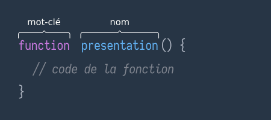
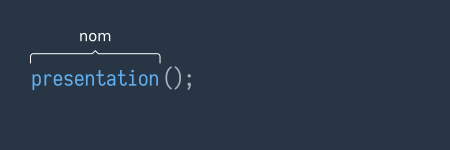
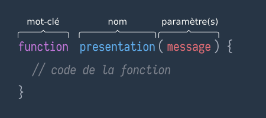
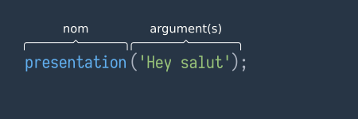

:titre: Introduction aux fonctions
:module: JavaScript
:duree: 120
:description: Ce module a pour objectif de découvrir le concept de fonction en JavaScript.
include::../../../../adoc/libs/header-module.adoc[]

ifeval::["{visible-on-html}" != "yes"]
:docinfo: shared
:docinfodir: ../../../adoc/libs
endif::[]

== Objectifs pédagogiques

// tag::objectifs[]
* Découvrir le concept de fonction
* Savoir définir une fonction
* Savoir appeler une fonction
// end::objectifs[]

// tag::deroulement[]

== Point de départ

Supposons que vous ayez le programme suivant

```js
let message = "Bonjour";

const prenom = prompt("Votre prénom ?");
message += ", " + prenom;

const nom = prompt("Votre nom ?");
message += " " + nom;

const age = prompt("Votre age ?");
message += ". Vous avez " + age + " ans.";

alert(message);
```

Ce programme structure une chaîne de caractères du style `Bonjour, John Delcours. Vous avez 31 ans.`

include::../../../../adoc/libs/slide-notitle.adoc[]

Supposons maintenant que le programme à besoin d'être lancé plusieurs fois. Comment faire ?

> Euh... copier/coller ?

L'option la plus simple est de copier/coller tout ce code. Seul problème, c'est lourd (et vite bloquant).

- Comment facilement modifier le comportement ?
- Comment s'y retrouver facilement ?
- ...

include::../../../../adoc/libs/slide-notitle.adoc[]

Il faudrait pouvoir "stocker" ces différentes instructions.

_Un peu_ sur le même principe que les variables.

mais ça

```js
const presentation =
  let message = 'Bonjour';
  const prenom = prompt( .... )
```

Bon, nous on n'écrit pas notre liste de course mais du code...

== Bonjour les fonctions

Les fonctions remplissent justement ce rôle.

=== Déclaration d'une fonction ?

Déclaration de fonction "classique"

```js
function presentation() {
  // code de la fonction
}
```

include::../../../../adoc/libs/slide-notitle.adoc[]

Si on décortique un peu la déclaration d'une fonction



=== Exécution d'une fonction

Une fois la fonction déclarée

```js
function presentation() {
  // code de la fonction
}
```

Il faut pouvoir l'appeler. On dit aussi l'**exécuter**

```js
// Exécution via le nom de la fonction + ()
presentation();
```

include::../../../../adoc/libs/slide-notitle.adoc[]




Exécuter une fonction signifie "Exécuter tout le code qu'elle contient"

Les `()` sont ce qui permet d'appeler la fonction et donc exécuter les instructions à l'intérieur.

include::../../../../adoc/libs/slide-notitle.adoc[]

On pourrait donc envisager notre programme autrement

```js
function presentation() {
  let message = "Bonjour";

  const prenom = prompt("Votre prénom ?");
  message += ", " + prenom;

  const nom = prompt("Votre nom ?");
  message += " " + nom;

  const age = prompt("Votre age ?");
  message += ". Vous avez " + age + " ans.";

  alert(message);
}
```

include::../../../../adoc/libs/slide-notitle.adoc[]

Ensuite en exécutant `presentation`

```js
presentation();
```

Cette fois, moins de bazar, on le veut 2 fois ?

```js
presentation();
presentation();
```

On l'exécute 2 fois :)

include::../../../../adoc/libs/slide-notitle.adoc[]

> Ok, c'est plus simple mais... c'est tout ?

Bien-sûr que non :)

== Paramétrer une fonction

On simplifie en mutualisant (on empaquette du code).

Mais les fonctions offrent également la possibilité de "configurer" le comportement du code qu'elles contiennent.

=== Exemple

Prenons un exemple de fonction plus simple.

```js
function presentation() {
  const message = "Bonjour";
  alert(message + "!!");
}
```

Cette fonction définie une variable message et lance un `alert` en ajoutant `!!` à la fin de la chaîne.

Comment faire pour choisir le message à afficher ? par exemple 'Hello' ou 'Coucou' au lieu de 'Bonjour'.

=== Etape 1 : Paramètre

On définit un paramètre à la fonction

avant

```js
function presentation() {
  // message a une valeur fixe
  const message = "Bonjour";
  alert(message + "!!");
}
```

après

```js
function presentation(message) {
  alert(message + "!!");
}
```

=== Etape 2 : Argument

Pour alimenter notre fonction

```js
function presentation(message) {
  alert(message + "!!");
}
```

On passe la valeur souhaitée, en argument, lors de l'exécution

```js
presentation("Hello");
```

Lors de l'exécution la valeur du paramètre `message` sera égale à la valeur de l'argument passé, ici `'Hello'`

include::../../../../adoc/libs/slide-notitle.adoc[]

Déclaration



Exécution



include::../../../../adoc/libs/slide-notitle.adoc[]

Le code final sera donc

```js
// Déclaration
function presentation(message) {
  alert(message + "!!");
}

// Exécution
presentation("Hello"); // alert de 'Hello!!'
presentation("Coucou"); // alert de 'Coucou!!'
presentation("Bonjour"); // alert de 'Bonjour!!'
```

== Point de détail

On a vu que pour déclarer une fonction on écrit

```js
function presentation() {
  // code de la fonction
}
```

Il existe une alternative très pratique.

Déclaration d'une fonction anonyme

```js
const presentation = function () {
  // code de la fonction
};
```

Les 2 approches sont __presque__ équivalentes. Quelques subtilités existent mais on en reparlera plus tard.

// tag::demo[]

== Démonstration

Mise en place de fonctions

[NOTE.speaker]
====

* Fonction écrite manuellement

```js
// Fonction manuelle pour calculer la somme de deux nombres
function sommeManuelle(a, b) {
  return a + b;
}
```

* Fonction générée par une IA

Prompt suggéré : crée une fonction pour calculer la somme de deux nombres

* Comparer les deux fonctions.

====

// end::demo[]

== C'est parti

On a vu plein de nouveautés, en avant pour la mise en pratique.

// tag::exercice[]

== Exercice

Créez une fonction en JavaScript qui prend en entrée un nom d'utilisateur et retourne un message de salutation personnalisé. Vous devrez :

* Définir une fonction appelée saluer.
* La fonction doit accepter un argument : le nom de l'utilisateur.
* La fonction doit retourner une chaîne de caractères sous la forme : "Bonjour, [nom] !".
* Appelez la fonction avec différents noms pour tester son fonctionnement.

// end::exercice[]

== Exemples d'utilisation de fonctions

=== Longueur d'une chaîne de caractères

* En JS, on peut obtenir la longueur d'une chaîne de caractères avec la propriété `length`

```js
function longueurChaine(chaine) {
  return chaine.length;
}

const longueur = longueurChaine("Hello");
console.log(longueur); // 5
```

=== Conversion de nombre

* `parseInt` permet de convertir une chaîne de caractères en nombre entier

```js
function convertirEnNombre(chaine) {
  return parseInt(chaine);
}

const nombre = convertirEnNombre("42");
console.log(nombre); // 42
```

include::../../../../adoc/libs/slide-notitle.adoc[]

* `parseFloat` permet de convertir une chaîne de caractères en nombre à virgule

```js
function convertirEnNombreDecimal(chaine) {
  return parseFloat(chaine);
}

const nombreDecimal = convertirEnNombreDecimal("3.14");
console.log(nombreDecimal); // 3.14
```

// tag::exercice[]

== Exercice

https://stackblitz.com/edit/vitejs-vite-ske5kq?file=src%2Fmain.js[🔗 Lien de l'exercice]

* Penser à comparer avec les solutions proposées par l'IA

// end::exercice[]

// end::deroulement[]

== Conclusion

// tag::conclusion[]
* Les fonctions permettent de regrouper des instructions pour les exécuter plus simplement
* Les fonctions peuvent être paramétrées pour adapter leur comportement
* Les fonctions peuvent retourner une valeur
// end::conclusion[]