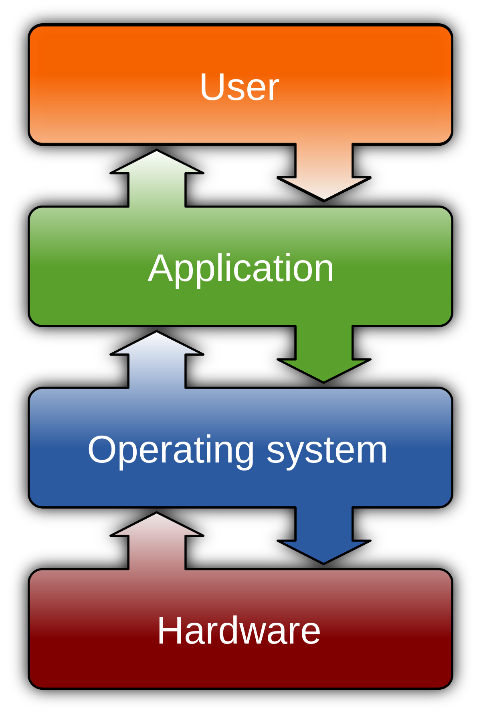
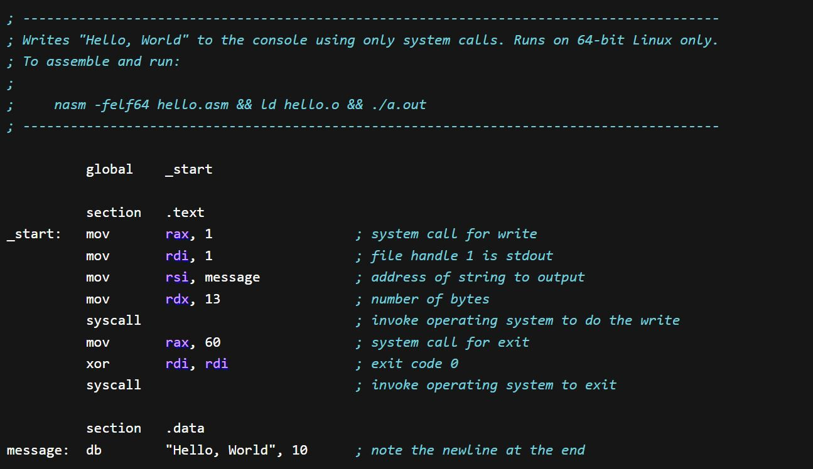
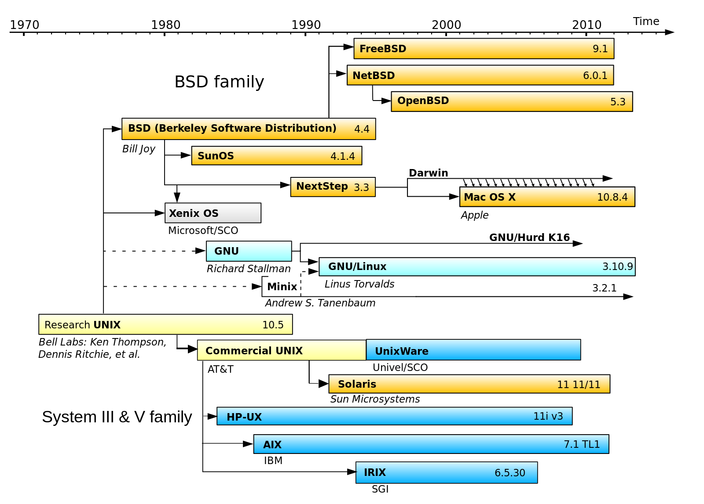

:titre: Linux
:module: Linux
:duree: 180
:description: Découverte de Linux, de son histoire et de ses avantages.
include::../../../../adoc/libs/header-module.adoc[]

ifeval::["{visible-on-html}" != "yes"]
:docinfo: shared
:docinfodir: ../../../adoc/libs
endif::[]

== Objectifs pédagogiques

// tag::objectifs[]
* Comprendre ce qu'est un système d'exploitation
* Connaître Linux, son histoire et ses avantages
// end::objectifs[]

// tag::deroulement[]

== Qu'est-ce qu'un système d'exploitation ?

=== Définition

Un **système d'exploitation (Operating System - OS)** est une surcouche logicielle qui permet à un ordinateur d’interagir avec son matériel.

Exemples d'OS :

* Windows
* MacOS
* Linux
* Android

=== Définition

Chaque système d'exploitation offre une interface entre le matériel et les applications, facilitant ainsi le développement de logiciels.

[NOTE.speaker]
====
Le système d'exploitation agit comme un traducteur entre le matériel (processeur, mémoire) et les applications que vous utilisez. Sans système d'exploitation, il serait très difficile de programmer des logiciels directement en langage machine.
====

=== Bas niveau et haut niveau

Un **langage bas niveau** permet de parler directement au matériel, mais il est difficile à lire et à écrire. Un langage de **plus haut niveau** simplifie la programmation.

=== Bas niveau et haut niveau

_Langage assembleur - très bas niveau_

=== Bas niveau et haut niveau

_C - plus accessible, mais toujours assez proche du matériel_

[NOTE.speaker]
====
Historiquement, les systèmes d'exploitation étaient codés en langages bas niveau comme l'assembleur. Aujourd'hui, on utilise surtout le langage C, qui est la base de nombreux systèmes comme Windows et Linux.
====

== Pourquoi Linux ?

Linux est un système d'exploitation **Open Source** créé en 1991 par **Linus Torvalds**.

Ses avantages :

* ✅ **Plus performant** : Optimisé pour gérer efficacement les ressources.
* ✅ **Plus stable** : Moins de plantages.
* ✅ **Plus sécurisé** : Moins de vulnérabilités, surtout sur les serveurs.
* ✅ **Open Source** : Tout le monde peut voir, modifier et améliorer le code.

[NOTE.speaker]
====
Contrairement à Windows ou MacOS, Linux est un système **Open Source**, ce qui signifie que son code est accessible à tous. Cela favorise la transparence, l'innovation, et rend Linux plus adaptable.
====

=== Utilisation de Linux

Linux est très utilisé pour les **serveurs** car il est :
* Léger (versions sans interface graphique)
* Stable
* Sécurisé

Exemples :

* Les sites comme Google, Facebook ou Amazon tournent sur Linux.
* La plupart des **supercalculateurs** et **serveurs web** utilisent Linux.

[NOTE.speaker]
====
Sur les postes de travail, Windows et MacOS sont majoritaires, mais dans le monde des serveurs, **Linux est le leader**. Il est aussi utilisé dans les smartphones (via Android), les objets connectés, et même dans les voitures.
====

== Distributions Linux

Une **distribution Linux** est une version de Linux adaptée à différents usages.

Quelques distributions populaires :

* 🐧 **Ubuntu** (utilisateurs débutants)
* 🧩 **Debian** (utilisateurs avancés, base d’Ubuntu)
* 📦 **Fedora** (développeurs)
* 🔧 **Arch Linux** (personnalisation extrême)

Voici une **frise chronologique** des principales distributions Linux :

link:https://upload.wikimedia.org/wikipedia/commons/1/1b/Linux_Distribution_Timeline.svg[SVG timeline des distributions Linux]

[NOTE.speaker]
====
Les distributions Linux sont nombreuses car chacun peut en créer une à partir du noyau Linux. Certaines distributions comme Ubuntu ou Debian sont très populaires, mais il existe des milliers de variantes !
====

== Unix ≠ Linux

[NOTE.speaker]
====
Bien que Linux soit souvent associé à Unix, ce sont deux systèmes différents.

**Unix** a été développé dans les années 1970 par AT&T.  
**Linux** est une réécriture libre d’Unix, créée en 1991 par **Linus Torvalds**.

📌 **MacOS** est basé sur une version d’Unix appelée **BSD**.

Unix a été créé bien avant Linux. Linux est une alternative libre, conçue pour être accessible à tous. Aujourd’hui, Unix est peu utilisé en dehors de MacOS.
====

== Le vaste monde de Linux

Le sujet de Linux est vaste :

* 📚 Il existe de nombreux concepts à explorer : noyau, shell, permissions, etc.
* 🛠️ Dans cette formation, on se concentre sur le **développement**.
* 🔧 Une formation spécifique en **administration système** serait nécessaire pour approfondir.

[NOTE.speaker]
====
Nous allons nous concentrer sur les concepts qui intéressent les développeurs. Si vous souhaitez vous spécialiser en **Administration Système**, vous pourrez suivre une formation dédiée plus tard.
====

[NOTE.speaker]
====
Linux est partout autour de vous, même si vous ne le voyez pas. Il équipe les serveurs web, les smartphones, les objets connectés, et bien plus encore. Comprendre Linux est essentiel pour tout développeur !
====

// end::deroulement[]

// tag::conclusion[]
== Conclusion
* Vous savez pourquoi un système d'exploitation est indispensable.
* Vous connaissez **Linux** et son histoire.
* Vous comprenez pourquoi **Linux** est important dans le monde des serveurs et du développement.
* Un système d'exploitation agit comme un intermédiaire entre le matériel et les applications.
* Linux est un système d'exploitation Open Source créé en 1991.
* Il est utilisé partout, notamment sur les serveurs.
// end::conclusion[]
