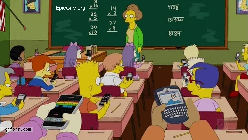
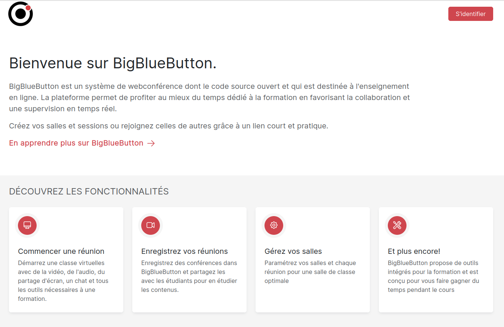
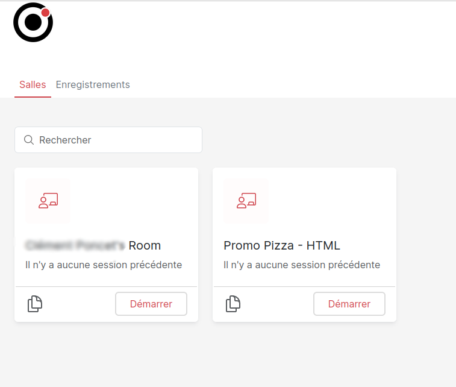

:titre: BBB - Notre salle de classe
:module: Outils
:duree: 30
:description: Découverte et prise en main de Big Blue Button, notre outil de visioconférence pour les cours.
include::../../../../adoc/libs/header-module.adoc[]

ifeval::["{visible-on-html}" !=  "yes"]
:docinfo: shared
:docinfodir: ../../../adoc/libs
endif::[]

== Objectifs
// tag::objectifs[]
* **Comprendre** le fonctionnement de BBB comme salle de classe virtuelle
* **Appliquer** les bonnes pratiques de communication dans BBB
* **Utiliser** les différents outils de BBB pour interagir pendant les cours
// end::objectifs[]

// tag::deroulement[]
== Introduction à BBB

Big Blue Button (BBB) est notre salle de classe virtuelle

[NOTE.speaker]
====
BBB est une plateforme de visioconférence spécialement conçue pour l'enseignement à distance.
Elle permet d'interagir en temps réel avec les formateurs et les autres apprenants.
====

== Connexion à BBB

* URL : https://bbb.oclock.school/
* À mettre en favoris !
* Identification requise

[NOTE.speaker]
====
Insister sur l'importance de mettre le lien en favoris pour un accès rapide.
L'identification est obligatoire pour accéder aux cours.
====

=== Liste des cours

Une fois connecté, vous accédez à la liste des cours disponibles

[NOTE.speaker]
====
Les cours sont organisés par promotion et par date.
Il suffit de cliquer sur le cours correspondant pour le rejoindre.
====

== Interface principale

Vue d'ensemble de l'interface BBB

image::assets/bbb-3.png[cours bbb,400]

[NOTE.speaker]
====
Présenter les différentes zones :
- Zone de présentation centrale
- Liste des participants
- Chat
- Options audio/vidéo
====

== Outils de communication

* Chat général : principal outil de communication
* Messages privés : pour les échanges individuels
* Sondages : pour l'interaction formateur/apprenants

[NOTE.speaker]
====
Le chat général doit rester professionnel :
- Pas de hors-sujet pendant les cours
- Questions bienvenues et encouragées
- Respect et courtoisie attendus
====

=== Messages Privés

Pour contacter un participant ou le formateur en privé :

* Cliquer sur le nom dans la liste des participants
* Idéal pour signaler un problème technique
* À utiliser avec modération

[NOTE.speaker]
====
Les MP sont particulièrement utiles pour :
- Signaler un problème technique
- Poser une question personnelle
- Ne pas interrompre le cours
====

// tag::demo[]
== Démonstration

Prise en main des outils BBB

[NOTE.speaker]
====
1. Se connecter à BBB
2. Rejoindre un cours
3. Tester le chat général
4. Envoyer un message privé
5. Participer à un sondage test
6. Activer/désactiver micro et caméra
7. Lever la main
====
// end::demo[]

// end::deroulement[]

== Conclusion

// tag::conclusion[]
* BBB est notre salle de classe virtuelle principale
* Les outils de communication permettent une interaction efficace
* Le respect des bonnes pratiques assure un cours fluide
* N'hésitez pas à utiliser les fonctionnalités pour participer activement
// end::conclusion[]
