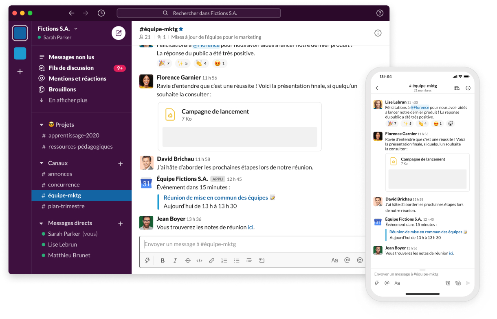
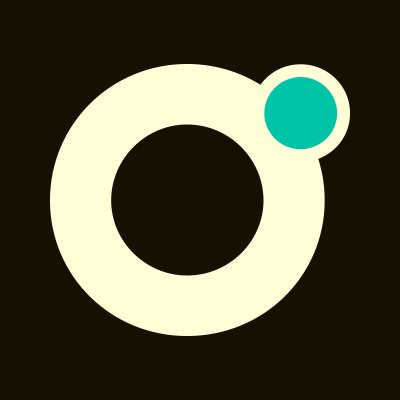

:titre: Slack - Notre outil de communication
:module: Outils
:duree: 30
:description: Découverte de Slack, notre plateforme de communication collaborative pour la formation.
include::../../../../adoc/libs/header-module.adoc[]

ifeval::["{visible-on-html}" !=  "yes"]
:docinfo: shared
:docinfodir: ../../../adoc/libs
endif::[]

== Objectifs
// tag::objectifs[]
* **Comprendre** les fonctionnalités essentielles de Slack
* **Appliquer** les bonnes pratiques de communication sur Slack
* **Utiliser** efficacement les canaux et fils de discussion
// end::objectifs[]

// tag::deroulement[]
== Introduction à Slack

Une plateforme de communication collaborative et de gestion de projets

[NOTE.speaker]
====
Slack est l'outil principal de communication en dehors des cours.
Il permet des échanges structurés et une collaboration efficace entre tous les participants.
====

== Le Slack de promotion

Organisation des communications par canaux thématiques

[NOTE.speaker]
====
Le Slack de promotion est votre espace d'échange principal hors des cours.
Chaque canal a un objectif précis pour organiser efficacement les communications.
====

=== Les canaux principaux

* `#général` : annonces officielles pour la promo
* `#classe-virtuelle` : messages liés aux cours
* `#entraide` : questions et réponses entre apprenants
* `#sav` : demandes de support technique

[NOTE.speaker]
====
Expliquer l'importance de poster dans le bon canal pour maintenir une organisation claire.
Le canal #général est réservé aux annonces importantes.
====

== Le SAV

Processus de demande de support technique

[NOTE.speaker]
====
Le formulaire SAV est accessible depuis le canal #sav.
Il permet de structurer les demandes de support pour un traitement efficace.
====

== Communication efficace

* Messages principaux pour les nouveaux sujets
* Fils de discussion pour les réponses
* Conservation des messages limitée à 30 jours
* Importance des threads pour la lisibilité

[NOTE.speaker]
====
Insister sur l'utilisation des fils de discussion pour garder les conversations organisées.
Rappeler la limite de 30 jours pour la conservation des messages.
====

== Règles de vie

* Courtoisie et respect mutuel
* Hors-sujets autorisés dans les canaux dédiés
* Entraide encouragée
* Demande d'aide bienvenue

[NOTE.speaker]
====
Ces règles assurent une ambiance de travail agréable et productive.
L'entraide est un pilier important de la formation.
====

== Application Slack

* Installation de l'application bureau recommandée
* Configuration des notifications importante
* Principal moyen de contact pendant la formation

[NOTE.speaker]
====
L'application bureau offre une meilleure expérience que la version web.
Les notifications permettent de rester informé des messages importants.
====

== Le Slack Pro

* Communauté des alumni O'clock
* Inscription avec l'adresse @oclock.school
* Ressources pour l'après-formation
* Offres d'emploi et événements

[NOTE.speaker]
====
Le Slack Pro est une ressource précieuse pour l'après-formation.
Il permet de rester en contact avec la communauté O'clock.
L'inscription se fait via https://join.slack.com/t/oclock-pro/signup
====

// tag::demo[]
== Démonstration

Prise en main de Slack

[NOTE.speaker]
====
1. Connexion à Slack
2. Navigation entre les canaux
3. Création d'un message
4. Création d'un fil de discussion
5. Configuration des notifications
6. Utilisation des mentions (@)
7. Partage de fichiers
====
// end::demo[]

// end::deroulement[]

== Conclusion

// tag::conclusion[]
* Slack est l'outil central de communication hors cours
* L'organisation en canaux permet une communication structurée
* Les bonnes pratiques assurent une utilisation efficace
* Slack est un outil professionnel utilisé dans de nombreuses entreprises

// end::conclusion[]
