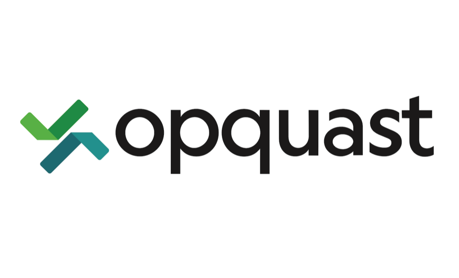

:titre: Introduction à la formation Opquast
:module: Opquast
:duree: 30
:description: Présentation de la certification Opquast et organisation hebdomadaire.

include::../../../../adoc/libs/header-module.adoc[]

ifeval::["{visible-on-html}" !=  "yes"]
:docinfo: shared
:docinfodir: ../../../adoc/libs
endif::[]

== Objectifs pédagogiques

// tag::objectifs[]
* Découvrir la certification Opquast.
* Comprendre son utilité pour les professionnels du web.
* Prendre connaissance de l'organisation des sessions hebdomadaires.
// end::objectifs[]

// tag::deroulement[]

== Qu'est-ce qu'Opquast ?

Opquast est une certification qui évalue les bonnes pratiques professionnelles sur le web.

[NOTE.speaker]
--
Opquast est une certification reconnue internationalement qui vise à améliorer la qualité des services web. Elle repose sur un référentiel de bonnes pratiques permettant aux professionnels du web d'adopter des standards pour optimiser leurs projets.
--

== Pourquoi suivre cette formation ?

Participer à la formation Opquast permet de :

- Renforcer vos compétences en matière de bonnes pratiques du web.
- Mieux collaborer avec les autres métiers du numérique.
- Obtenir une certification reconnue dans le secteur.

[NOTE.speaker]
--
Que vous soyez développeur, designer ou chef de projet, la certification Opquast vous apporte une base solide pour améliorer la qualité de vos projets et mieux travailler en équipe.
--

== Organisation des sessions Opquast

Vous êtes déjà inscrits à la formation Opquast.

Voici comment elle sera intégrée à votre planning :

- **Tous les vendredis** : session dédiée à Opquast.
- Temps alloué : 2 heures.
- Travail à réaliser : lecture, exercices et préparation à l'examen final.

[NOTE.speaker]
--
À partir de cette semaine, chaque vendredi, vous aurez une session de deux heures pour travailler sur Opquast. Les activités incluent des exercices pratiques, la lecture du référentiel et des tests d'entraînement. L'objectif est de progresser régulièrement vers la certification.
--

== Déroulement de la formation

Voici un aperçu du programme hebdomadaire :

. Lecture des bonnes pratiques.
. Réalisation des exercices.
. Simulation d'examens pour se préparer à la certification.

[NOTE.speaker]
--
La formation sera progressive : vous apprendrez les bases dans les premières semaines, avant de vous entraîner sur des cas pratiques et de vous préparer à l'examen officiel.
--

== Certification et validation des acquis

À la fin de la formation :

- Passage de l'examen Opquast.
- Obtention de la certification si le score requis est atteint.

[NOTE.speaker]
--
L'examen final est l'occasion de valider vos connaissances et de prouver vos compétences en matière de bonnes pratiques du web. C'est une certification précieuse pour votre CV !
--

// end::deroulement[]

== Conclusion

// tag::conclusion[]
* Opquast est un atout pour votre carrière dans le web.
* Vous êtes déjà inscrits : travaillez-y tous les vendredis !
* Préparez-vous régulièrement pour réussir l'examen.
// end::conclusion[]
